# 2.1 线性表的概念及其抽象数据类型定义

## 2.1.1 线性表的逻辑结构

**线性表(Linear List) 描述**：线性表是 n 个类型相同数据元素的有限序列，对 n>O，除第一元素无直接前驱、最后一个元素无直接后继外，其余的每个数据元素只有一个直接前驱和一个直接后继

在一般的线性表中，一个**数据元素(Data Elements)** 可由若干数据项组成，如表 1. 1 所示的学籍表中，每个学生相关信息由学号、姓名、性别、籍，贯等数据项组成，表 1. 1 中的一行称为一个**记录（或称数据元素）**，含有大量类型相同记录的线性表称为**文件（或称数据对象）**

综上所述，线性表是由 n(n~O)个类型相同数据元素组成的有限序列，记作 $(a_{1},a_{2},\dots,a_{i-1}, a_{i},,a_{i+1} \dots,a_{n})$
线性表的特点：
1. 同一性：线性表由同类数据元素组成，每一个 $a_{i}$ 必须属于同一数据类型
2. 有穷性： 线性表由有限个数据元素组成，表长度就是表中数据元素的个数
3. 有序性： 线性表中相邻数据元素之间存在着序偶关系
线性表既是一种**最简单的数据结构**（因为数据元素之间是由前驱、后继直观、有序的关系确定的），又是一种**最常见的数据结构**（因为矩阵、数组、字符串、堆栈、队列等都符合线性条件）

## 2.1.2 线性表的抽象数据类型定义
下面给出线性表的抽象数据类型定义。

ADT LinearList{
数据元素:  
 $D = \{aᵢ | aᵢ ∈ D₀, i = 1, 2, …, n, n ≥ 0\}, D₀$ 为某一数据类型  

结构关系:  
 $R = \{< aᵢ, aᵢ₊₁>; | aᵢ, aᵢ₊₁ ∈ D₀, i = 1, 2, …, n-1\}$  

基本操作：  

1. InitList (L)  
 操作前提：L 为未初始化线性表。  
 操作结果：将 L 初始化为空表。  

2. ListLength (L)  
 操作前提：线性表 L 已存在。  
 操作结果：如果 L 为空表则返回 0，否则返回表中的元素个数。  

3. GetData (L, i)  
 操作前提：表 L 存在，且 1 ≤ i ≤ ListLength (L)。  
 操作结果：返回线性表 L 中第 i 个数据元素的值。  

4. InsList (L, i, e)  
 操作前提：表 L 已存在，e 为合法元素值且 1 ≤ i ≤ ListLength (L)+1。  
 操作结果：在 L 中第 i 个位置之前插入新的数据元素 e，L 的长度加 1。  

5. DelList (L, i, e)  
 操作前提：表 L 已存在且非空，1 ≤ i ≤ ListLength (L)。  
 操作结果：删除 L 的第 i 个数据元素，并用 e 返回其值，L 的长度减 1。  

6. Locate (L, e)  
 操作前提：表 L 已存在，e 为合法数据元素值。  
 操作结果：如果 L 中存在数据元素 e，则将当前指针指向数据元素 e 所在位置并返回 TRUE，否则返回 FALSE。  

7. DestroyList (L)  
 操作前提：线性表 L 已存在。  
 操作结果：将 L 销毁。  

8. ClearList (L)  
 操作前提：线性表 L 已存在。  
 操作结果：将 L 置为空表。  

9. EmptyList (L)  
 操作前提：线性表 L 已存在。  
 操作结果：如果 L 为空表则返回 TRUE，否则返回 FALSE。  

}ADT LinearList;
# 2.2 线性表的顺序存储
## 2.2.1 线性表的顺序存储结构
采用顺序存储结构存储的线性表通常简称为**顺序表**。 可将顺序表归纳为：**关系线性化**，**结点顺序存**
在顺序表中，每个结点 $a_{i}$ 的存储地址是该结点在表中的逻辑位置 i 的**线性函数**，只要知道**线性表中第一个元素的存储地址**（基地址）和**表中每个元素所占存储单元的多少**，就可以计算出线性表中任意一个数据元素的存储地址，从而实现对顺序表中数据元素的**随机存取**

### 1. 地址的计算
假设线性表中有 $n$ 个元素，每个元素占 $k$ 个单元，第一个元素的地址为 $\mathrm{Loc}(a_1)$，则可通过如下公式计算出第 $i$ 个元素的地址 $\mathrm{Loc}(a_i)$：

$$
\mathrm{Loc}(a_i) = \mathrm{Loc}(a_1) + (i-1) \times k
$$

其中，$\mathrm{Loc}(a_1)$ 称为基地址。
### 2. 线性表顺序存储的表示
线性表的顺序存储结构可借助于高级程序设计语言中的一维数组来表示，一维数组的下标与元素在线性表中的序号相对应
用 C 语言定义线性表的顺序存储结构如下：
```c
#define MAXSIZE 100         //此处的宏定义常昼表示线性表的最大长度
typedef struct {
    ElemType elem[MAXSIZE]; //线性表占用的数组空间
    int last;              	//记录线性表中最后一个元素在数组 elem[] 中的位置（下标值），空表置为－1
} SeqList;
```
说明：
1. 结点类型定义中ElemType 数据类型是为了描述的统一而自定的，在实际应用中，用户可以根据自己实际需要来具体定义顺序表中元素的数据类型，如int、char、float 或是一种 struct 结构类型
2. 从数组中起始下标为 0 处开始存放线性表中第一个元素。因此需注意区分元素的序号和该元素在数组中的下标位置之间的对应关系，即数据元素 $a_{1}$ 的序号为 1，而其对应存放在 elem 数组的下标为 0；$a_{i}$ 在线性表中的序号值为 i，而在顺序表对应的数组 elem 中的下标为 i-1
   
变量 L 的定义与使用方法有以下两种：

① 通过变量定义语句  
	SeqList L;  
	将 L 定义为 SeqList 类型的变量，利用 L.elem[i-1] 来访问顺序表中序号为 i 的元素 aᵢ；通过 L.last 可得到顺序表中最后一个元素的下标，而 L.last+1 就是顺序表的长度。  
	
② 通过指针变量定义语句  
	 SeqList L₁, \*L; L = &L₁;  
	将 L 定义为指向 SeqList 类型的指针变量，使用时，可通过 L->elem[i-1] 来访问顺序表中序号为 i 的元素 $a_{i}$，使用 L->last+1 则得到顺序表的长度。
## 2.2.2 线性表顺序存储结构上的基本运算
### 1. 查找操作
1. 按序号查找 GetData (L, i)：查找顺序表 L 中第 i 个数据元素。  
   根据顺序表 L 的存储特性，表中元素在 L 的 elem 数组中顺序存放，故 GetData (L, i) 的核心语句为 L.elem[i-1]。  
2.  按内容查找 Locate (L, e)：要求查找顺序表 L 中与给定值 e 相等的数据元素。  
   在顺序表 L 中找到与 e 相等的元素，则返回该元素在表中的序号；若找不到，则返回一个“空序号”标识，如 -1。
   
算法思想：查找运算可采用顺序查找，即从第一个元素开始，依次将表中元素与 e 相比较，若相等，则查找成功，返回该元素在表中的序号；若 e 与表中的所有元素都不相等，则查找失败返回－1
算法 2.1：顺序表的按内容查找运算
```c
int Locate(SeqList L, ElemType e) {
    int i = 0;
    while (i <= L.last && L.elem[i] != e) {
        i++;
    }
    if (i <= L.last) {
        return i + 1; // 返回元素的序号
    } else {
        return -1; // 查找失败
    }
}
```
算法2. 1 的时间复杂度为 O(n)
### 2. 插入操作
线性表的插入运算是指在表的第$i（1 ≤ i ≤ n+1）$个位置前插入一个新元素 e，使长度为 n 的线性表  
$(e₁, …, e_{i-1}, e_i, …, e_n)$
变成长度为 n+1 的线性表  
$(e₁, …, e_{i-1}, e, e_i, …, e_n)$  
（其中 n 为 L 的表长度）。
算法思想：用顺序表作为线性表的存储结构时，由于结点的物理顺序必须和结点的逻辑顺序保持一致，因此必须将原表中位置 n, n-1, …, i 上的结点，依次后移到位置 n+1, n, …, i+1 上，空出第 i 个位置，然后在该位置上插入新结点 e。  当 i = n+1 时，是指在线性表的末尾插入结点，所以无须移动结点，直接将 e 插入表的末尾即可。
算法2.2 ：顺序表的插入运算
```c
#define OK 1
#define ERROR 0
int initList(SeqList *L,int i,ElemType e) {
    int j;
    
    if (i < 1 || i > L->last + 2) { // 插入位置不合法
        print("位置不合法\n");
        return ERROR;
    }

    if (L->last == MAXSIZE - 1) { // 表满
        print("表满，无法插入\n");
        return ERROR;
    }

    for (j = L->last; j >= i - 1; j--) { // 元素后移
        L->elem[j + 1] = L->elem[j];
    }
    L->elem[i - 1] = e; // 插入新元素
    L->last++; // 表长加 1
    return OK;
}
```
算法分析：
当在表尾（i = L->last + 2）插入元素时，因为循环的终值大于初值，此时不需要移动元素，可直接在表尾插入 e。  
当在表头（i = 1）插入时，移动元素的语句 L->elem[k+1] = L->elem[k] 需执行 n 次，即将表中已存在的 n 个元素依次后移一个位置才能将 e 插入。  
因此，语句 L->elem[k+1] = L->elem[k] 的执行频度与插入位置 i 有关。  

设 $E_{\text{ins}}$ 为在长度为 n 的表中插入一元素所需移动元素的平均次数，假设 $P_i$ 为在第 i 个元素之前插入元素的概率，并假设在任何位置上插入的概率相等，即 $P_i = \dfrac{1}{n+1},\ i=1,2,\dots,n+1$，则有  

$$
E_{\text{ins}} = \sum_{i=1}^{n+1} P_i \cdot (n - i + 1)
            = \frac{1}{n+1} \sum_{i=1}^{n+1} (n - i + 1)
            = \frac{1}{n+1} \cdot \frac{n(n+1)}{2}
            = \frac{n}{2}
$$
### 3. 删除操作
线性表的删除运算是指将表的第 $i（1 ≤ i ≤ n）$个元素删去，使长度为 n 的线性表  
$(e₁, …, e_{i-1}, e_i, e_{i+1}, …, e_n)$  
变成长度为 n-1 的线性表  
$(e₁, …, e_{i-1}, e_{i+1}, …, e_n)$  

算法思想：用顺序表作为线性表的存储结构时，由于结点的物理顺序必须和结点的逻辑顺序保持一致，因此当需要删除第 i 个元素时，必须将原表中位置在 i+1, i+2, …, n-1, n 上的结点，依次前移到位置 i, i+1, …, n-1（其中 n 为 L 的表长度）。
算法2.3 ：顺序表的删除运算
```c
int DelList(SeqList *L, int i, ElemType *e) {
    int j;

    if (i < 1 || i > L->last + 1) { // 删除位置不合法
        print("位置不合法\n");
        return ERROR;
    }

    *e = L->elem[i - 1]; // 保存被删除元素的值，存放到 e所指向的变批中

    for (j = i; j <= L->last; j++) { // 元素前移
        L->elem[j - 1] = L->elem[j];
    }
    L->last--; // 表长减 1
    return OK;
}
```
### 4. 合并操作
算法2.4：线性表的合并运算
```c
void mergeList(SeqList La, SeqList Lb, SeqList *Lc) {
    int i, j，k,l;
    i = 0; j = 0; k = 0;
    while (i <= La.last && j <= Lb.last) {
        if (La.elem[i] <= Lb.elem[j]) {
            Lc->elem[k++] = La.elem[i++];
        } else {
            Lc->elem[k++] = Lb.elem[j++];
        }
    }
    while (i <= La.last) {  //当表La有剩余元素时
        Lc->elem[k] = La.elem[i];   
        i++; k++;
    }
    while (j <= Lb.last) {
        Lc->elem[k] = Lb.elem[j];   
        j++; k++;
    }
    Lc->last = La->last + Lb->last + 1;
}
```

#### 算法分析
由于两个待归并的表 LA、LB 本身是值有序表，且表 LC 的建立采用的是尾插法建表，插入时不需要移动元素，所以算法的时间复杂度 O（LA-&gt; last+LB-&gt; last）。

### 线性表顺序表示的优点
① 无须为表示结点间的逻辑关系而增加额外的存储空间（因为逻辑上相邻的元素其存储的物理位置也是相邻的）。  
② 可方便地随机存取表中的任一元素，如 GetData（L，i）操作。

### 线性表顺序表示的缺点
① 插入或删除运算不方便，除表尾的位置外，在表的其他位置上进行插入或删除操作都必须移动大量的结点，其效率较低。  
② 由于顺序表要求占用连续的存储空间，存储分配只能预先进行静态分配。因此当表长变化较大时，难以确定合适的存储规模。若按可能达到的最大长度预先分配表空间，则可能造成一部分空间长期闲置而得不到充分利用；若事先对表长估计不足，则插入操作可能使表长超过预先分配的空间而造成溢出。
# 2.3 线性表的链式存储
>  通常将采用链式存储结构的线性表称为**线性链表**
## 2.3.1 单链表
结点包括两个域：**数据域**用来存储结点的值，**指针域**用来存储数据元素的直接后继的地址 （或位置）。由于此线性链表的每个结点只有一个 next指针域，故将这种链表称为**单链表**
1. 基本概念
- 顺序表：用一组地址连续的存储单元依次存放线性表结点，逻辑顺序与物理顺序一致。  
- 单链表：用一组**任意的**存储单元存放结点，可连续、可非连续、可零散分布。  
  → 逻辑顺序与物理顺序**不一定相同**。

2. 结点结构
- **数据域**：存储结点值  
- **指针域**：存储直接后继的地址（或位置）  
  图2.5 单链表的结点结构：data | next

3. 单链表定义
- 每个结点仅含一个 next 指针域，故称**单链表**。  
- 通过指针域将结点按逻辑顺序链接。  
- 第一个结点无前驱，设**头指针 H**指向它。  
- 最后一个结点无后继，其指针域为**NULL**。

4. 示例
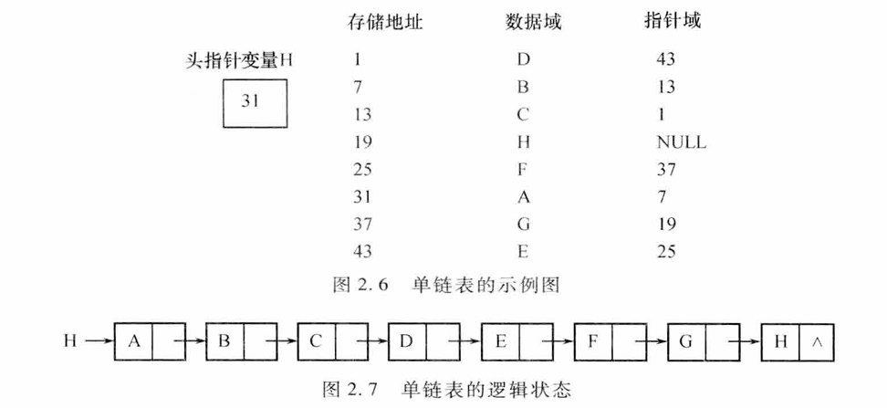

5. 头结点
- 为操作统一、方便，可在第一个结点前附加**头结点**。  
  - 数据域：可存长度等附加信息，也可不存。  
  - 指针域：存指向第一个结点（首元结点）的指针。  
- 空表时，头结点的指针域为**空**（图2.8）。
  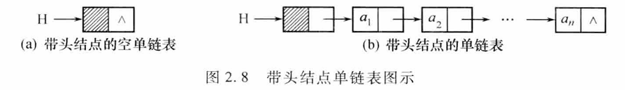

5. 存储结构描述 
```c
typedef struct Node {          // 结点类型定义 
    ElemType data;             // 数据域 
    struct Node *next;         // 指针域 
} Node, *LinkList;             // LinkList 为结构指针类型 
```

7. 命名习惯
- `LinkList L`：强调 L 是**单链表的头指针变量**。  
- `Node *p`：表示 p 是指向链表中任意结点的指针。  
- 空表判定：  
  - 无头结点：`L == NULL`  
  - 带头结点：`L->next == NULL`

8. 访问方式
- 非空表时，通过头指针 L 可顺序访问所有结点。  
- 带头结点时，令 `p = L->next`，则 `p` 指向首元结点，`p->data` 即为第一个元素值。
## 2.3.2 单链表上的基本运算
### 1. 初始化单链表
```c
InitList(LinkList *L) {
    *L = (LinkList)malloc(sizeof(Node)); // 生成头结点
    if (!*L) exit(OVERFLOW);             // 存储分配失败
    (*L)->next = NULL;                   // 指针域置空
}
```
### 2. 建立单链表
1. 头插法建立单链表
```c
void CreateListHead(LinkList *L, int n) {
    LinkList p;
    int i;
    srand(time(0));                      // 初始化随机数种子
    *L = (LinkList)malloc(sizeof(Node)); // 生成头结点
    (*L)->next = NULL;                   // 指针域置空
    for (i = 0; i < n; i++) {            // 建立 n 个结点
        p = (LinkList)malloc(sizeof(Node)); // 生成新结点
        p->data = rand() % 100 + 1;      // 随机生成 1～100 之间的数
        p->next = (*L)->next;         // 插入到表头
        (*L)->next = p;
    }
}
```
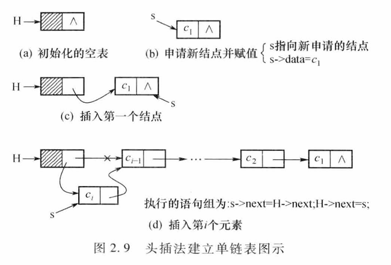
2. 尾插法建立单链表
```c
void CreateListTail(LinkList *L, int n) {
    LinkList p, r;
    int i;
    srand(time(0));                      // 初始化随机数种子
    *L = (LinkList)malloc(sizeof(Node)); // 生成头结点
    r = *L;                              // r 指向尾结点，开始时指向头结点
    for (i = 0; i < n; i++) {            // 建立 n 个结点
        p = (LinkList)malloc(sizeof(Node)); // 生成新结点
        p->data = rand() % 100 + 1;      // 随机生成 1～100 之间的数
        r->next = p;             // 将新结点插入表尾
        r = p;                 // r 指向新的表尾结点
    }
    r->next = NULL;                     // 尾结点指针域置空
}
```
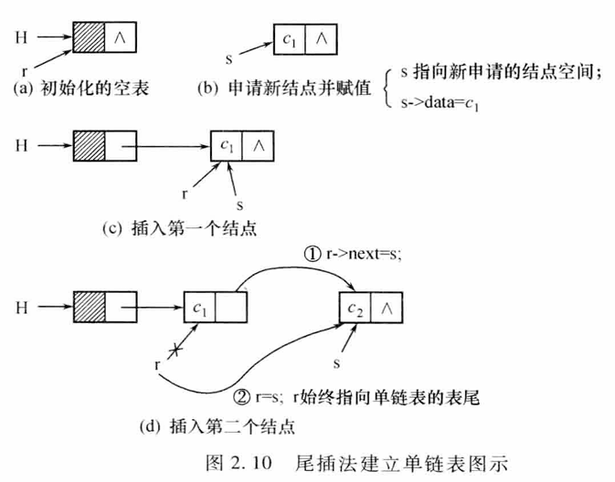
### 3. 查找
1. 按序号查找
```c
Node* GetElem(LinkList L, int i){
    int j;
    LinkList p;
    p = L->next;               // p 指向首元结点
    j = 1;                     // j 为计数器
    while (p && j < i) {       // 顺指针向后查找，直到 p 指向第 i 个结点或 p 为空
        p = p->next;
        j++;
    }
    if (!p || j > i) return NULL; // 第 i 个结点不存在
    return p;
}
``` 
2. 按值查找
```c
Node* LocateElem(LinkList L, ElemType e) {
    LinkList p;
    p = L->next;               // p 指向首元结点
    while (p && p->data != e) { // 顺指针向后查找，直到 p 为空或 p 指向元素值为 e 的结点
        p = p->next;
    }
    return p;                  // 若查找成功，则返回该结点地址，否则返回 NULL
}
```
这两个算法的时间复杂度均为 O(n)
### 4. 求单链表长度操作
```c
int ListLength(LinkList L) {
    int i = 0;
    LinkList p = L->next;      // p 指向首元结点
    while (p) {                // 顺指针向后扫描
        i++;
        p = p->next;
    }
    return i;
}
```
若单链表有 n 个结点，则该算法的时间复杂度为 O(n)
### 5. 单链表插入操作
算法思想：插入过程分为以下三步。 
- 查找：在单链表中找到第 i-1 个结点并由指针 pre 指示 
- 申请：申请新结点 s，将其数据域的值置为 e
- 插入挂链：通过修改指针域将新结点 s 挂入单链表 L
```c
int InsList(LinkList L, int i, ElemType e) {
    int j;
    LinkList p, s;
    p = L;                     // p 指向头结点
    j = 0;                     // j 为计数器
    while (p && j < i - 1) {   // 寻找第 i-1 个结点
        p = p->next;
        j++;
    }
    if (!p || j > i - 1) return ERROR; // 第 i-1 个结点不存在
    s = (LinkList)malloc(sizeof(Node)); // 生成新结点
    s->data = e;
    s->next = p->next;         // 将新结点插入到第 i 个位置
    p->next = s;
    return OK;
}
```
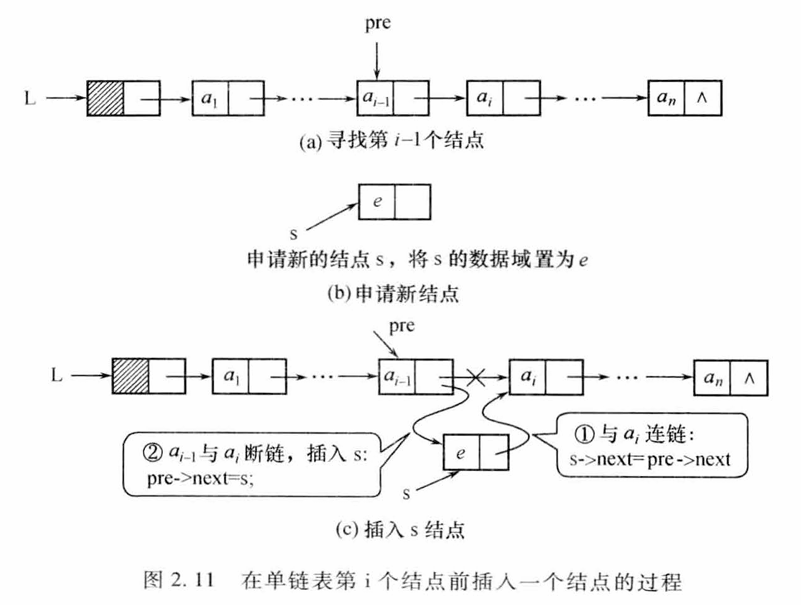
### 6. 单链表删除操作
```c
int DelList(LinkList L, int i, ElemType *e) {
    int j;
    LinkList p, q;        // p 指向头结点
    p = L;
    j = 0;                // j 为计数器
    while (p->next && j < i - 1) { // 寻找第 i-1 个结点
        p = p->next;
        j++;
    }
    if (!(p->next) || j > i - 1) return ERROR; // 第 i-1 个结点不存在
    q = p->next;         // q 指向第 i 个结点
    p->next = q->next;   // 将第 i 个结点从链中删除
    *e = q->data;        // 将被删除结点的值赋给 e
    free(q);             // 释放被删除结点的存储空间
    return OK;
}
```
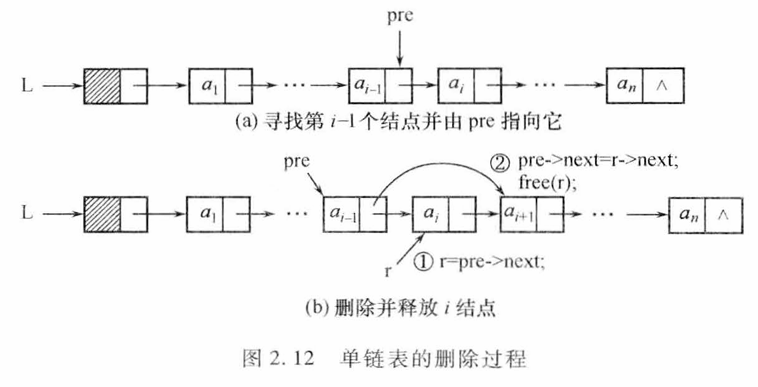
## 2.3.3 循环链表
**循环链表(Circular Linked List)** 是一个首尾相接的链表。将单链表最后一个结点的指针域由 NULL 改为指向表头结点，就得到了单链形式的循环链表，并称为循环单链表。同样还可以有多重链的循环链表
在循环单链表中，表中所有结点都被链在一个环上，为使某些操作实现方便，在循环单链表中也可设置一个头结点
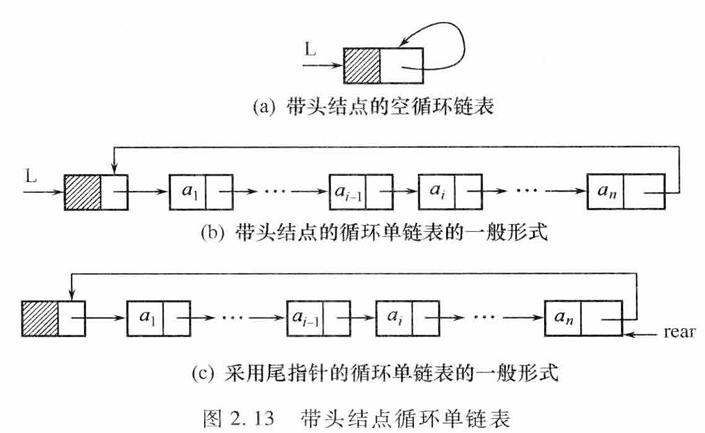
### 1. 初始化循环单链表
```c
Node* InitCLinkList(CLinkList *L) {
    *L = (CLinkList)malloc(sizeof(CNode)); // 生成头结点
    if (!*L) exit(OVERFLOW);               // 存储分配失败
    (*L)->next = *L;                       // 指针域指向头结点本身
    return *L;
}
```
### 2. 建立循环单链表
```c
void CreateCLinkList(CLinkList *L, int n) {
    CLinkList p, r;
    int i;
    srand(time(0));                        // 初始化随机数种子
    *L = (CLinkList)malloc(sizeof(CNode)); // 生成头结点
    r = *L;                                // r 指向尾结点，开始时指向头结点
    for (i = 0; i < n; i++) {          // 建立 n 个结点
        p = (CLinkList)malloc(sizeof(CNode)); // 生成新结点
        p->data = rand() % 100 + 1;        // 随机生成 1～100 之间的数
        r->next = p;             // 将新结点插入表尾
        r = p;                 // r 指向新的表尾结点
    }
    r->next = *L;                       // 尾结点指针域指向头结点
}
```
## 2.3.4 双向链表
**双(向)链表 (Double Linked List )**：在单链表的每个结点里再增加一个指向其前驱的指针域 prior。这样形成的链表中就有两条方向不同的链
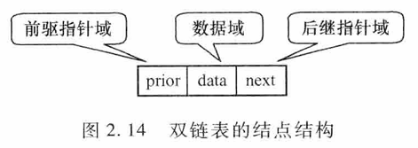
```c
typedef struct DNode {         // 结点类型定义
    ElemType data;             // 数据域
    struct DNode *prior;       // 前驱指针域
    struct DNode *next;        // 后继指针域
} DNode, *DLinkList;          // DLinkList 为结构指针类型
```
与单链表类似，双链表也可增加头结点使双链表的某些运算变得方便。 同时双向链表也可以有循环表，称为双向循环链表
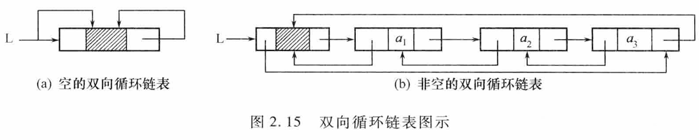
设指针 p指向双链表中某一结点，则有下式成立： 
```c
p->pnor->next == p 
p == p->next->prior
```
### 1. 双向链表的前插操作
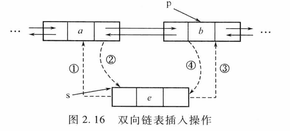
```c
int DLinkListInsert(DLinkList L, int i, ElemType e) {
    int j;
    DLinkList p, s;
    p = L;                     // p 指向头结点
    j = 0;                     // j 为计数器
    while (p && j < i - 1) {   // 寻找第 i-1 个结点
        p = p->next;
        j++;
    }
    if (!p || j > i - 1) return ERROR; // 第 i-1 个结点不存在
    s = (DLinkList)malloc(sizeof(DNode)); // 生成新结点
    s->data = e;
    s->next = p->next;         // 将新结点插入到第 i 个位置
    if (p->next)               // 若插入位置不是表尾
        p->next->prior = s;    // 修改后继结点的 prior 指针
    s->prior = p;
    p->next = s;
    return OK;
}
```
### 2. 双向链表的删除操作
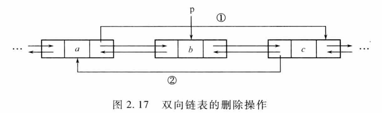
```c
int DLinkDelete(DLinkList L, int i, ElemType *e) {
    int j;
    DLinkList p, q;        // p 指向头结点
    p = L;
    j = 0;                // j 为计数器
    while (p->next && j < i - 1) { // 寻找第 i-1 个结点
        p = p->next;
        j++;
    }
    if (!(p->next) || j > i - 1) return ERROR; // 第 i-1 个结点不存在
    q = p->next;         // q 指向第 i 个结点
    p->next = q->next;   // 将第 i 个结点从链中删除
    if (q->next)         // 若删除位置不是表尾
        q->next->prior = p; // 修改后继结点的 prior 指针
    *e = q->data;        // 将被删除结点的值赋给 e
    free(q);             // 释放被删除结点的存储空间
    return OK;
}
```
## 2.3.5 \*静态链表
**静态链表(Static Linked List)** 是一种特殊的链式存储结构。它利用数组来存储结点，并用数组下标来代替指针域存储结点的直接后继位置，从而实现链式存储结构的功能
静态链表的结点结构定义如下：
```c
#define MAXSIZE 1000          // 静态链表的最大长度
typedef struct {
    ElemType data;             // 数据域
    int next;                  // 指针域，存放下一个结点的数组下标
} SNode;                       // 结点类型定义
```
# 2.4 线性表应用一一一元多项式的表示及相加
## 1. 一元多项式的表示
- 一元多项式按升幂形式：  
  $Pₙ(x) = p₀ + p₁x¹ + p₂x² + … + pₙxⁿ$ 
  其中 pᵢ 为指数 i 的系数。
- 用线性表表示：  
  $P = (p₀, p₁, p₂, …, pₙ)$  
  $Q = (q₀, q₁, q₂, …, qₘ)$  
  若 m < n，则 R = P + Q 对应的线性表：  
  $R = (p₀+q₀, p₁+q₁, …, pₘ+qₘ, pₘ₊₁, …, pₙ)$

## 2. 一元多项式的存储

### (1) 顺序存储
- 方法1：仅存储系数，下标隐含指数  
  适合非零系数较多的多项式；相加时对应下标相加即可。
- 方法2：仅存储非零项，每项存(系数, 指数)  
  适合非零项少、指数高的多项式，避免空间浪费。

### (2) 链式存储
- 结点结构（图2.20）：  
  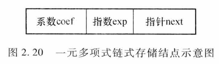
- 类型定义：
  ```c
  typedef struct Polynode {
      int coef;
      int exp;
      struct Polynode *next;
  } Polynode, *Polylist;
  ```
- 建表算法（算法 2.21）：尾插法，按指数升序输入，以系数 0 结束。
  ```c
  Polylist PolyCreate() {
      Polylist head, tail, p;
      int c, e;
      head = (Polylist)malloc(sizeof(Polynode)); // 生成头结点
      head->next = NULL;
      tail = head;                               // tail 指向表尾
      printf("按指数升序输入多项式各项系数和指数(系数为0时结束)：\n");
      scanf("%d", &c);
      while (c != 0) {
          scanf("%d", &e);
          p = (Polylist)malloc(sizeof(Polynode)); // 生成新结点
          p->coef = c;
          p->exp = e;
          tail->next = p;         // 插入到表尾
          tail = p;
          scanf("%d", &c);
      }
      tail->next = NULL;         // 尾结点指针域置空
      return head;
  }
  ```
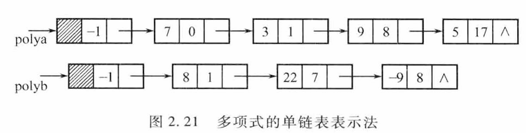
## 3. 一元多项式相加

### (1) 链表表示
- 用单链表分别存储两个多项式，每项为 (系数, 指数) 结点。

### (2) 运算规则
设 p、q 分别指向两链表当前结点，和多项式按升幂生成：
1. p->exp < q->exp：p 结点加入和多项式，p 后移。
2. p->exp == q->exp：系数相加  
   - 和≠0：修改 p 系数，释放 q；p、q 后移。  
   - 和=0：删除 p、q 对应结点并释放；p、q 后移。
3. p->exp > q->exp：q 结点插入和多项式，q 后移。

### (3) 算法描述（算法 2.22）
```c
Polylist PolyAdd(Polylist Pa, Polylist Pb) {
    Polylist p, q, r, tail;
    p = Pa->next;               // p 指向多项式 A 的首元结点
    q = Pb->next;               // q 指向多项式 B 的首元结点
    tail = Pa;                  // tail 指向结果多项式链尾
    while (p && q) {
        if (p->exp < q->exp) {      // A 的指数小于 B 的指数
            tail->next = p;         // 将 A 的结点加入结果
            tail = p;
            p = p->next;
        } else if (p->exp == q->exp) { // 指数相等
            int sum = p->coef + q->coef;
            if (sum != 0) {          // 系数和不为 0
                p->coef = sum;       // 修改 A 的系数
                tail->next = p;     // 将 A 的结点加入结果
                tail = p;
            } else {                 // 系数和为 0
                free(p);            // 释放 A 的结点
            }
            Polylist temp = q;
            q = q->next;           // B 后移
            free(temp);            // 释放 B 的结点
            p = p->next;           // A 后移
        } else {                    // A 的指数大于 B 的指数
            tail->next = q;         // 将 B 的结点加入结果
            tail = q;
            q = q->next;
        }
    }
    if (p) tail->next = p;       // A 有剩余结点
    if (q) tail->next = q;       // B 有剩余结点
    return Pa;                   // 返回结果多项式链头指针
}
```
- 使用尾插法构建和多项式，tail 始终指向当前结果链尾。
- 剩余结点直接链接到结果链。
- 时间复杂度：$O (M+N)，M、N$ 分别为两多项式项数。

## 4. 示例结果
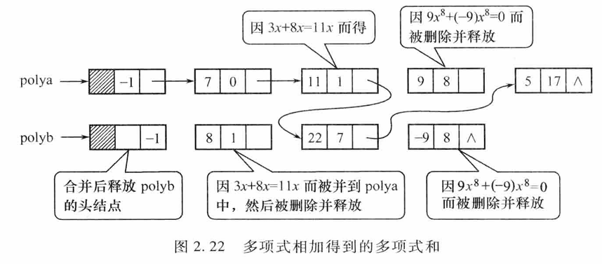
图 2.22 展示多项式 A 与 B 相加后：
- 指数相同且系数和为 0 的项被删除并释放。
- 其余项按升幂合并，得到新的多项式链表。
# 2.5 顺序表与链表的综合比较

## 2.5.1 顺序表和链表的比较

### 1. 存储分配
- 顺序表：一组地址连续的存储单元，静态/一次性动态分配，容量固定。  
- 链表：任意离散单元，动态申请/释放，长度仅受内存限制。

### 2. 访问方式
- 顺序表：支持随机存取，按序号访问 O(1)。  
- 链表：顺序存取，必须从头指针遍历，按序号访问 O(n)。

### 3. 插入、删除
- 顺序表：需移动元素，平均移动 n/2 个，时间 O(n)。  
- 链表：仅修改指针，时间 O(1)（已知前驱）；查找前驱仍需 O(n)。

### 4. 空间开销
- 顺序表：只存数据，无额外指针，存储密度 = 1。  
- 链表：每个结点附加指针域，存储密度 < 1。

### 5. 空间利用率
- 顺序表：预分配最大容量，可能长期闲置或溢出。  
- 链表：按需申请，无闲置，但频繁 malloc/free 产生碎片。

### 6. 适用场景
- 顺序表：表长稳定、查询频繁、插入删除少。  
- 链表：表长变化大、插入删除频繁、查询少。

## 2.5.2 线性表链式存储方式的比较

| 链式结构 | 结点结构 | 指针域数 | 是否环回 | 头指针/尾指针 | 典型特点与用途 |
|---|---|---|---|---|---|
| 单链表 | data + next | 1 | 否 | 头指针 | 实现简单，遍历单向 |
| 循环单链表 | data + next | 1 | 是（尾→头） | 头指针或尾指针 | 可从任一结点遍历全表，常用于轮询 |
| 双向链表 | data + prior + next | 2 | 否 | 头指针 | 支持前驱后继双向遍历，删除给定结点 O(1) |
| 循环双向链表 | data + prior + next | 2 | 是（头尾互指） | 头指针或尾指针 | 兼具双向与循环优点，插入删除最灵活 |

### 共性
- 均采用动态指针链接，长度可任意伸缩。  
- 按序号定位仍需 O(n)，插入删除核心操作为“修改指针”。

