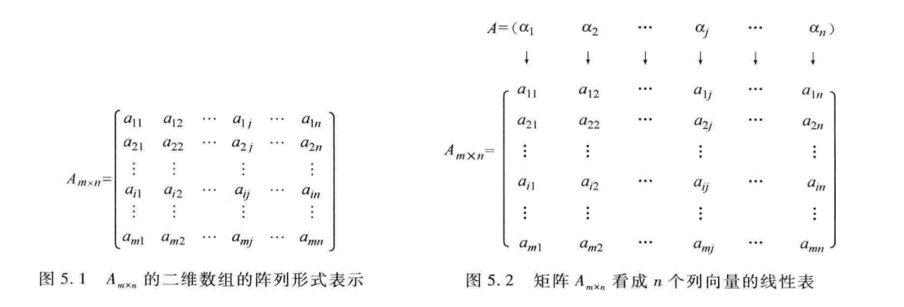
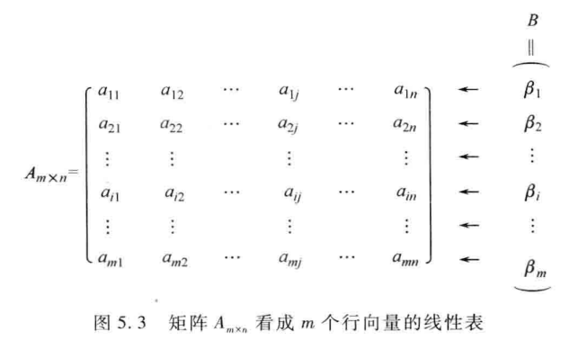
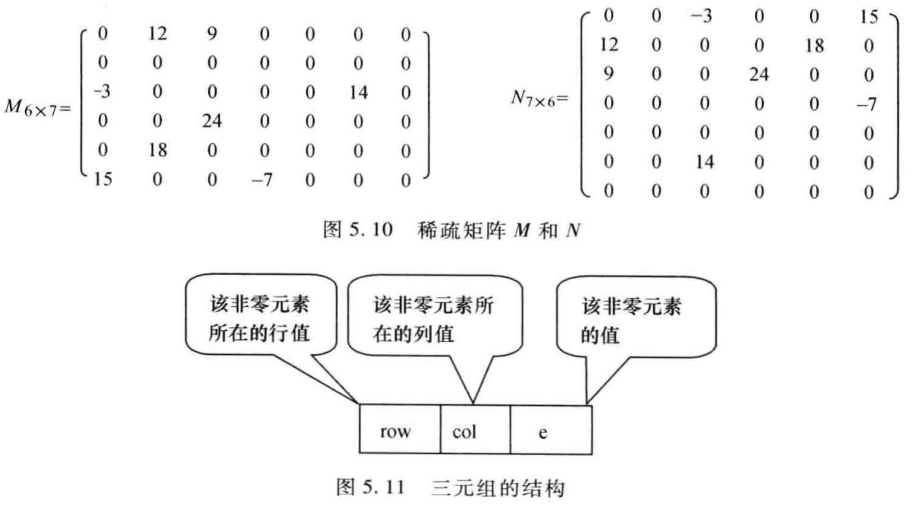
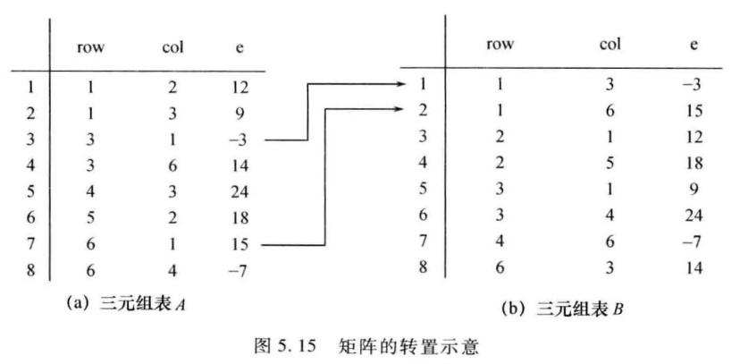
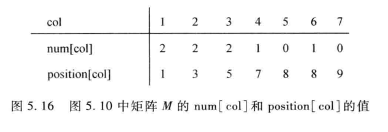
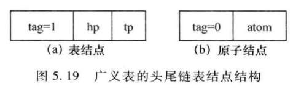
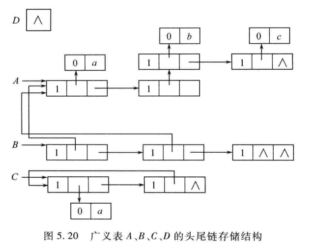
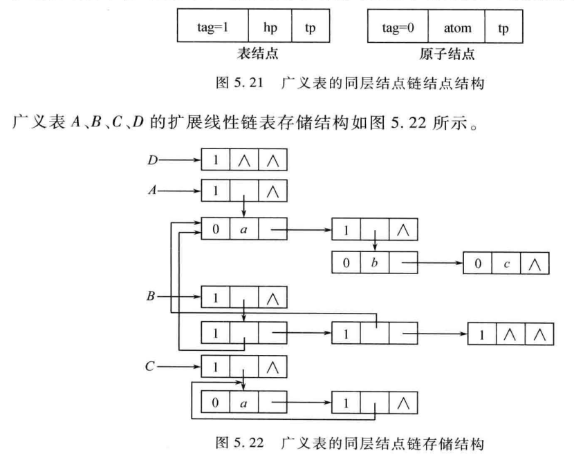

# 5.1 数组的定义与运算
## 1. 数组的定义
从逻辑上看，数组是由相同类型的数据元素按一定顺序排列组成的有限序列。在计算机内存中，数组是一块连续的存储空间，每个数据元素占据相同大小的存储单元。
而二维数组可以看作是数组的数组，即每个元素本身又是一个数组。二维数组在内存中也是连续存储的，按行优先或列优先的方式存储。
可以把二维数组看成是一个线性表：$A=(\alpha_1,\alpha_2,\dots,\alpha_n)$，其中每个$\alpha_i$又是一个线性表：$\alpha_i=(a_{i1},a_{i2},\dots,a_{im})$。这样，二维数组$A$的元素可以表示为$a_{ij}$，其中$i$表示行号，$j$表示列号。

同样，还可以把数组$A_{m \times n}$看成是一个线性表：$B=(b_1,b_2,\dots,b_{m \times n})$，其中$b_k$表示数组中的第$k$个元素。这样，二维数组$A$的元素$a_{ij}$可以通过线性表$B$中的元素$b_k$来表示，其中$k=(i-1) \times n + j$

## 2. 数组的运算
数组的基本运算包括：
- 取值运算：获取数组中某个元素的值。
- 赋值运算：将某个值赋给数组中的某个元素。
- 求数组长度：获取数组中元素的个数。
- 遍历数组：依次访问数组中的每个元素。
## 3. 数组的抽象类型定义
数组的抽象数据类型（ADT）可以定义如下：

```
Array ADT {
    数据对象：
        一个有序元素序列 a1, a2, ..., an
    基本操作：
        CreateArray(n): 创建一个包含 n 个元素的数组
        GetValue(i): 获取数组中第 i 个元素的值
        SetValue(i, value): 将 value 赋给数组中第 i 个元素
        Length(): 返回数组的长度 n
        Traverse(): 依次访问数组中的每个元素
}
```
# 5.2 数组的顺序存储与实现
数组是一种线性表的顺序存储结构，其存储方式是将线性表的元素按顺序存放在一块连续的存储空间中。数组的顺序存储结构具有以下特点：
- 支持随机访问：由于数组的元素在内存中是连续存储的，可以通过计算元素的地址实现对任意位置元素的快速访问。
- 存储空间利用率高：数组的顺序存储结构没有额外的指针域，节省了存储空间。
- 插入和删除操作效率低：由于数组的顺序存储结构需要保持元素的连续性，插入和删除操作可能需要移动大量元素，导致效率较低。
## 1. 一维数组的地址计算
一维数组中的元素只需要一个下标来表示其位置。假设数组A的首地址为Base，元素类型的存储单元大小为w，则数组A中第i个元素A[i]的地址可以通过以下公式计算：
$$Address(A[i]) = Base + (i - 1) * w$$
## 2. 二维数组的地址计算
二维数组中的元素需要两个下标来表示其位置，分别表示行号和列号。假设二维数组A的首地址为Base，元素类型的存储单元大小为w，数组A有m行n列，则二维数组A中第i行第j列元素A[i][j]的地址可以通过以下公式计算：
- 按行优先存储：
$$Address(A[i][j]) = Base + ((i - 1) * n + (j - 1)) * w$$
- 按列优先存储：
$$Address(A[i][j]) = Base + ((j - 1) * m + (i - 1)) * w$$
## 3. 三维数组的地址计算
三维数组中的元素需要三个下标来表示其位置，分别表示层号、行号和列号。假设三维数组A的首地址为Base，元素类型的存储单元大小为w，数组A有p层m行n列，则三维数组A中第i层第j行第k列元素A[i][j][k]的地址可以通过以下公式计算：
- 按层-行-列优先存储：
$$Address(A[i][j][k]) = Base + (((i - 1) * m * n + (j - 1) * n + (k - 1)) * w$$
- 按行-列-层优先存储：
$$Address(A[i][j][k]) = Base + (((j - 1) * n * p + (k - 1) * p + (i - 1)) * w$$
- 按列-层-行优先存储：
$$Address(A[i][j][k]) = Base + (((k - 1) * p * m + (i - 1) * m + (j - 1)) * w$$
## 4. 多维数组的地址计算
对于多维数组，可以将其看作是一个线性表，通过计算元素的线性表下标来实现地址计算。假设多维数组A的维数为d，每个维度的大小分别为n1, n2, ..., nd，元素类型的存储单元大小为w，则多维数组A中元素A[i1][i2]...[id]的地址可以通过以下公式计算：
- 按行优先存储：
$$Address(A[i1][i2]...[id]) = Base + (((i1 - 1) * n2 * n3 * ... * nd + (i2 - 1) * n3 * ... * nd + ... + (id - 1)) * w$$
- 按列优先存储：
$$Address(A[i1][i2]...[id]) = Base + (((id - 1) * n1 * n2 * ... * n(d-1) + (i(d-1) - 1) * n1 * n2 * ... * n(d-2) + ... + (i1 - 1)) * w$$
# 5.3 特殊矩阵的压缩存储
在实际应用中，矩阵中往往存在大量的零元素，这些零元素占用了大量的存储空间。为了节省存储空间，可以采用压缩存储的方法，只存储非零元素及其位置信息。常见的压缩存储方法有以下几种：
## 5.3.1 规律分布的特殊矩阵
元素分布具有一定规律的矩阵，如对称矩阵、上三角矩阵、下三角矩阵等，可以通过只存储非零元素来节省存储空间。
- 对称矩阵：只存储上三角部分或下三角部分的元素。
- 上三角矩阵：只存储主对角线及其上方的元素。
- 下三角矩阵：只存储主对角线及其下方的元素。
### 1. 三角矩阵
对于一个n阶的上三角矩阵或下三角矩阵，只需要存储$\frac{n(n+1)}{2}$个非零元素，而不是存储整个$n \times n$的矩阵，从而节省了大量的存储空间。
### 2. 对称矩阵
对于一个n阶的对称矩阵，只需要存储上三角部分或下三角部分的$\frac{n(n+1)}{2}$个非零元素，而不是存储整个$n \times n$的矩阵，从而节省了大量的存储空间。
### 3. 带状矩阵
带状矩阵是指非零元素集中在主对角线及其附近的一定范围内的矩阵。对于一个n阶的带状矩阵，如果带宽为k，则只需要存储$n \times (2k + 1)$个非零元素，而不是存储整个$n \times n$的矩阵，从而节省了大量的存储空间。
## 5.3.2 稀疏矩阵
**稀疏矩阵**是指矩阵中非零元素较少的矩阵。对于稀疏矩阵，可以采用压缩存储的方法，只存储非零元素及其位置信息
### 1. 稀疏矩阵的三元组表表示法
#### 1. 稀疏矩阵的三元组存储表示
稀疏矩阵的三元组表示法是将矩阵中的非零元素及其行号和列号存储在一个三元组数组中。每个三元组包含三个元素：(行号, 列号, 元素值)。这种表示法适用于非零元素较少且分布较为随机的稀疏矩阵。

#### 2. 稀疏矩阵的三元组表类型定义
稀疏矩阵的三元组表类型定义如下：

```c
#define MAX_SIZE 1000 // 最大非零元素个数
typedef struct {
    int row;    // 行号
    int col;    // 列号
    int value;  // 元素值
} Triple;
typedef struct {
    Triple data[MAX_SIZE]; // 三元组数组
    int rows;              // 矩阵行数
    int cols;              // 矩阵列数
    int nonZeroCount;      // 非零元素个数
} SparseMatrix;
```
#### 3. 三元组表实现稀疏矩阵的转置运算
稀疏矩阵的转置运算是将矩阵的行和列进行交换。对于三元组表示法的稀疏矩阵，可以通过遍历三元组数组，将每个三元组的行号和列号进行交换，得到转置后的稀疏矩阵。
1. 矩阵转置的经典算法实现
```c
void TransMatrix(ElementType A[][N], ElementType B[][M], int m, int n) {
    for (int i = 0; i < m; i++) {
        for (int j = 0; j < n; j++) {
            B[j][i] = A[i][j];
        }
    }
}
```
2. 三元组表实现稀疏矩阵转置的算法实现
假设有一个稀疏矩阵A，其三元组表示为SparseMatrix类型的变量A，转置后的矩阵B也为SparseMatrix类型的变量B。转置算法如下：
    1. 矩阵Source的三元组表A的行、列互换就是矩阵B的三元组表
    2. 转置后矩阵的三元组表B中的三元组不是按行优先顺序存储的，需要重新排序
由此可知，步骤1可以直接完成，步骤2需要额外的排序操作，从而影响效率。下面给出两种不需要额外排序操作的转置算法实现：
方法一：列序递增转置法
思路：按列扫描矩阵A的三元组表，对于每一列，依次将该列中的非零元素添加到矩阵B的三元组表中。

```c
void transposeSparseMatrix(SparseMatrix* A, SparseMatrix* B) {
    B->rows = A->cols;
    B->cols = A->rows;
    B->nonZeroCount = A->nonZeroCount;
    int index = 0;
    for (int col = 0; col < A->cols; col++) {
        for (int i = 0; i < A->nonZeroCount; i++) {
            if (A->data[i].col == col) {    
                B->data[index].row = A->data[i].col;
                B->data[index].col = A->data[i].row;
                B->data[index].value = A->data[i].value;
                index++;
            }
        }
    }
}
```
方法二：一次定位快速转置法
思路：首先统计矩阵A中每一列的非零元素个数，然后计算每一列在矩阵B的三元组表中的起始位置，最后将矩阵A的非零元素直接放置到矩阵B的正确位置。


```c
void fastTransposeSparseMatrix(SparseMatrix* A, SparseMatrix* B) {
    B->rows = A->cols;
    B->cols = A->rows;
    B->nonZeroCount = A->nonZeroCount;  
    int* colCounts = (int*)calloc(A->cols, sizeof(int));
    int* startingPos = (int*)calloc(A->cols, sizeof(int));  
    for (int i = 0; i < A->nonZeroCount; i++) {
        colCounts[A->data[i].col]++;
    }  
    startingPos[0] = 0;
    for (int i = 1; i < A->cols; i++) {
        startingPos[i] = startingPos[i - 1] + colCounts[i - 1];
    }  
    for (int i = 0; i < A->nonZeroCount; i++) {
        int col = A->data[i].col;
        int pos = startingPos[col];
        B->data[pos].row = A->data[i].col;
        B->data[pos].col = A->data[i].row;
        B->data[pos].value = A->data[i].value;
        startingPos[col]++;
    }  
    free(colCounts);
    free(startingPos);
}
```
### 2. 稀疏矩阵的链式存储结构：十字链表
与用二维数组存储稀疏矩阵相比，十字链表存储结构更加节省空间，并且便于进行矩阵的插入和删除操作。十字链表由行链表和列链表组成，每个非零元素节点包含行号、列号、元素值以及指向同一行和同一列下一个非零元素的指针。
#### 1. 十字链表的存储表示
在十字链表中，每个非零元素节点包含以下信息：
- 行号：表示该元素所在的行。
- 列号：表示该元素所在的列。
- 元素值：表示该元素的值。
- 行指针：指向同一行的下一个非零元素节点。
- 列指针：指向同一列的下一个非零元素节点。
此外，还需要一个头节点数组，用于存储每一行和每一列的头节点指针。
#### 2. 十字链表的类型定义
十字链表的类型定义如下：    

```c
typedef struct OLNode {
    int row;                    // 行号
    int col;                    // 列号
    int value;                  // 元素值
    struct OLNode* right;       // 指向同一行的下一个非零元素
    struct OLNode* down;        // 指向同一列的下一个非零元素
} OLNode;
typedef struct {
    OLNode** rowHeads;          // 行头指针数组
    OLNode** colHeads;          // 列头指针数组
    int rows;                   // 矩阵行数
    int cols;                   // 矩阵列数
    int nonZeroCount;           // 非零元素个数
} CrossList;
```
#### 3. 十字链表算法实现
建立十字链表的步骤如下：
1. 读入矩阵的行数、列数和非零元素个数。
2. 动态申请行头指针数组和列头指针数组，并初始化为NULL。
3. 依次读入每个非零元素的行号、列号和元素值，创建非零元素节点，并将其插入到对应的行链表和列链表中。
下面给出建立十字链表的算法实现：
```c
void createCrossList(CrossList* matrix, int rows, int cols, int nonZeroCount, int elements[][3]) {
    matrix->rows = rows;
    matrix->cols = cols;
    matrix->nonZeroCount = nonZeroCount;
    matrix->rowHeads = (OLNode**)calloc(rows, sizeof(OLNode*));
    matrix->colHeads = (OLNode**)calloc(cols, sizeof(OLNode*));
    for (int i = 0; i < nonZeroCount; i++) {
        int r = elements[i][0];
        int c = elements[i][1];
        int val = elements[i][2];
        OLNode* newNode = (OLNode*)malloc(sizeof(OLNode));
        newNode->row = r;
        newNode->col = c;
        newNode->value = val;
        newNode->right = NULL;
        newNode->down = NULL;
        // 插入到行链表
        if (matrix->rowHeads[r] == NULL || matrix->rowHeads[r]->col > c) {
            newNode->right = matrix->rowHeads[r];
            matrix->rowHeads[r] = newNode;
        } else {
            OLNode* p = matrix->rowHeads[r];
            while (p->right != NULL && p->right->col < c) {
                p = p->right;
            }
            newNode->right = p->right;
            p->right = newNode;
        }
        // 插入到列链表
        if (matrix->colHeads[c] == NULL || matrix->colHeads[c]->row > r) {
            newNode->down = matrix->colHeads[c];
            matrix->colHeads[c] = newNode;
        } else {
            OLNode* p = matrix->colHeads[c];
            while (p->down != NULL && p->down->row < r) {
                p = p->down;
            }
            newNode->down = p->down;
            p->down = newNode;
        }
    }
}
```
# 5.4 广义表
广义表是一种递归定义的数据结构，可以包含原子元素和子表。广义表的每个元素要么是一个原子元素，要么是另一个广义表。广义表可以表示复杂的嵌套结构，适用于表示具有层次关系的数据。
## 5.4.1 广义表的概念
广义表是由原子元素和子表组成的有序集合。广义表的定义如下：
- 空表：表示没有任何元素的广义表，记作()。
- 原子元素：表示单个数据元素，可以是数字、字符等基本类型。
- 子表：表示另一个广义表，可以包含原子元素和其他子表。
广义表的表示可以使用括号来表示层次结构，例如：(a, (b, c), d)表示一个包含原子元素a、d和一个子表(b, c)的广义表。

## 5.4.2 广义表的存储结构
1. 广义表的头尾链表存储结构
广义表的头尾链表存储结构是一种常用的存储方式。每个广义表节点包含两个指针：一个指向表头元素，另一个指向表尾元素。表头元素可以是原子元素或子表，表尾元素指向下一个节点。
广义表的头尾链表节点类型定义如下：

```c
typedef struct GListNode {
    int tag;                    // 标志，0表示原子元素，1表示子表
    union { 
        char atom;              // 原子元素
        struct GListNode* sublist; // 子表指针
    } data;
    struct GListNode* next;     // 指向下一个节点的指针
} GListNode;
```

2. 广义表的同层结点链表存储结构
在这种结构中，广义表的每个节点包含一个指向同层下一个节点的指针，以及一个指向子表的指针（如果该节点是子表的话）。这种结构便于在同一层次上遍历节点。
广义表的同层结点链表节点类型定义如下：

```c
typedef struct GListNode {
    int tag;                    // 标志，0表示原子元素，1表示子表
    union { 
        char atom;              // 原子元素
        struct GListNode* sublist; // 子表指针
    } data;
    struct GListNode* next;     // 指向同层下一个节点的指针
} GListNode;
```

## 5.4.3 广义表的操作实现
广义表的几个基本操作包括求表头、表尾、长度、深度以及统计原子数目、复制等。下面给出这些操作的算法实现：
1. 求表头
```c
GListNode* getHead(GListNode* list) {
    if (list == NULL) return NULL;
    return list->data.sublist; // 返回表头元素
}
```
2. 求表尾
```c
GListNode* getTail(GListNode* list) {
    if (list == NULL) return NULL;
    return list->next; // 返回表尾元素
}
```
3. 求长度
```c
int getLength(GListNode* list) {
    int length = 0;
    while (list != NULL) {
        length++;   
        list = list->next;
    }
    return length;
}
```
4. 求深度
```c
int getDepth(GListNode* list) {
    if (list == NULL) return 1;
    int maxDepth = 1;
    while (list != NULL) {
        if (list->tag == 1) { // 如果是子表
            int subDepth = getDepth(list->data.sublist) + 1;
            if (subDepth > maxDepth) {
                maxDepth = subDepth;
            }
        }
        list = list->next;
    }
    return maxDepth;
}
```
5. 统计原子数目
```c
int countAtoms(GListNode* list) {
    if (list == NULL) return 0;
    int count = 0;
    while (list != NULL) {
        if (list->tag == 0) { // 如果是原子元素
            count++;
        } else { // 如果是子表
            count += countAtoms(list->data.sublist);
        }
        list = list->next;
    }
    return count;
}
```
6. 复制广义表
```c
GListNode* copyGList(GListNode* list) {
    if (list == NULL) return NULL;
    GListNode* newList = (GListNode*)malloc(sizeof(GListNode));
    newList->tag = list->tag;
    if (list->tag == 0) { // 如果是原子元素
        newList->data.atom = list->data.atom;
    } else { // 如果是子表
        newList->data.sublist = copyGList(list->data.sublist);
    }
    newList->next = copyGList(list->next);
    return newList;
}
```