> 图是一种重要的数据结构，用于表示对象之间的关系。图由节点（顶点）和连接节点的边组成。图可以用于建模各种实际问题，如社交网络、交通网络、计算机网络等。
# 7.1 图的定义与基本术语
## 7.1.1 图的定义
图（graph）是一种网状数据结构，其形式化定义如下：
$$Graph G = (V, E)$$

$$V={x|x \in DataObject}$$  
$$R={VR}$$
$$VR={<x,y> | P(x,y) \land (x,y \in  V)}$$  
DataObject表示数据对象的集合，P(x,y)表示对象x和y之间的某种关系。图G由节点集合V和边集合E组成，
其中，$V$ 是节点（顶点）的集合，$E$ 是边的集合，表示节点之间的连接关系。每条边连接两个节点，可以是有向的或无向的。
若<x,y> ∈ VR，则<x,y>表示节点x和节点y之间存在一条弧，称为邻接（adjacency），并称x为弧尾，y为弧头。如果图中的边是有方向的，则称为有向图（directed graph）；如果边没有方向，则称为无向图（undirected graph）。
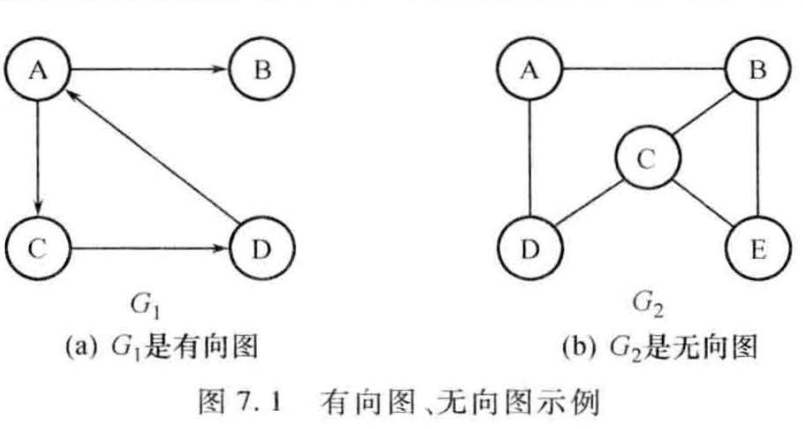
图的抽象数据类型定义：
```plaintext
ADT Graph {
    数据对象V：一个节点集合，该集合中的所有元素具有相同的特性
    数据关系R：R={VR}，VR={<x,y> | P(x,y) ∧ (x,y ∈ V)}，表示节点之间的连接关系
    基本操作集：
    CreateGraph(V, R)：创建一个图G，其中V是节点集合，R是边集合
    DestroyGraph(G)：销毁图G，释放其占用的资源
    LocateVex(G, x)：在图G中查找节点x，返回其位置或索引
    GetVex(G, v)：获取图G中节点v的信息
    FirstAdjVex(G, v)：获取图G中节点v的第一个邻接节点
    NextAdjVex(G, v, w)：获取图G中节点v的下一个邻接节点，w为当前邻接节点
    InsertVex(G, x)：在图G中插入节点x
    DeleteVex(G, v)：删除图G中的节点v
    InsertArc(G, x, y)：在图G中插入一条从节点x到节点y的边
    DeleteArc(G, x, y)：删除图G中从节点x到节点y的边
    TraverseGraph(G, Visit)：遍历图G，Visit为访问节点的操作
}ADT Graph;
```
## 7.1.2 图的基本术语
### 1. 完全图、稀疏图与稠密图
完全图（complete graph）是指图中任意两个不同的节点之间都存在一条边的图。对于一个包含n个节点的完全图，其边的数量为n(n-1)/2（无向图）或n(n-1)（有向图）。完全图通常用于表示所有节点之间都有直接连接的情况。
稀疏图（sparse graph）是指图中的边相对于节点数量较少的图。通常情况下，如果一个图的边数远小于节点数的平方（即边数 << n^2），则该图被认为是稀疏图。稀疏图常见于实际应用中，如社交网络中的好友关系图。
稠密图（dense graph）是指图中的边相对于节点数量较多的图。如果一个图的边数接近节点数的平方（即边数 ≈ n^2），则该图被认为是稠密图。稠密图通常用于表示节点之间关系紧密的情况。
### 2. 子图
子图（subgraph）是指从一个图中选取部分节点和边所构成的图。形式上，如果图G = (V, E)是一个图，那么其子图G' = (V', E')满足V' ⊆ V且E' ⊆ E。子图用于表示原图中的局部结构或特定关系。
### 3. 邻接点
邻接点（adjacent vertices）是指在图中通过一条边直接连接的两个节点。如果存在一条边连接节点x和节点y，则称x和y是邻接点。在有向图中，如果存在一条从节点x指向节点y的边，则称y是x的邻接点。

### 4. 度、入度与出度
节点的度（degree）是指与该节点相连接的边的数量。在无向图中，节点的度等于连接该节点的边的数量。在有向图中，节点的入度（in-degree）是指指向该节点的边的数量，而出度（out-degree）是指从该节点出发的边的数量。
顶点v的度记为TD(v)，入度记为ID(v)，出度记为OD(v)。对于有向图，有以下关系：
$$TD(v) = ID(v) + OD(v)$$
一般地，对于无向图，有以下关系：
$$\sum_{v \in V} TD(v) = 2|E|$$
对于有向图，有以下关系：
$$\sum_{v \in V} ID(v) = \sum_{v \in V} OD(v) = |E|$$
### 5. 权与网
权（weight）是指边上附加的数值，用于表示边的某种属性，如距离、成本或容量。带权图（weighted graph）是指图中的边具有权值的图。网（network）通常指带权图，特别是在表示交通网络或通信网络时使用。
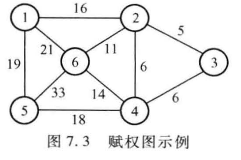
### 6. 路径与回路
路径（path）是指在图中从一个节点到另一个节点经过的一系列边和节点。路径可以是简单路径（simple path），即不经过重复节点的路径，或者是回路（cycle），即起点和终点相同的路径。回路用于表示循环结构。
### 7. 连通图
连通图（connected graph）是指图中任意两个节点之间都存在路径相连的图。在无向图中，如果任意两个节点之间都有路径相连，则该图是连通的。在有向图中，如果从任意节点出发都能到达其他节点，则该图是强连通的。
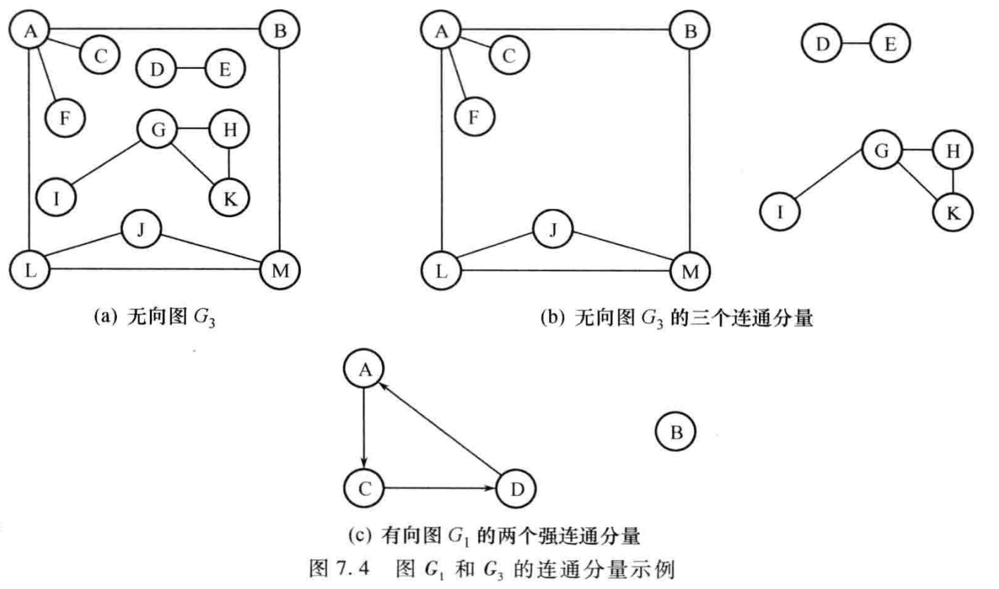
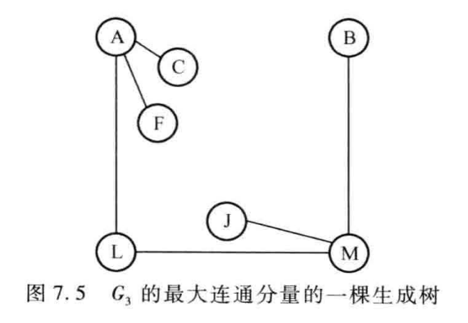
# 7.2 图的存储结构
## 7.2.1 邻接矩阵表示法
邻接矩阵（adjacency matrix）是一种用于表示图的存储结构。对于一个包含n个节点的图，其邻接矩阵是一个n×n的二维数组A，其中A[i][j]表示节点i和节点j之间的边的存在情况。如果存在一条从节点i到节点j的边，则A[i][j] = 1（或权值）；否则，A[i][j] = 0。
邻接矩阵的优点是可以快速判断两个节点之间是否存在边，时间复杂度为O(1)。缺点是对于稀疏图，邻接矩阵会浪费大量空间，空间复杂度为O(n^2)。
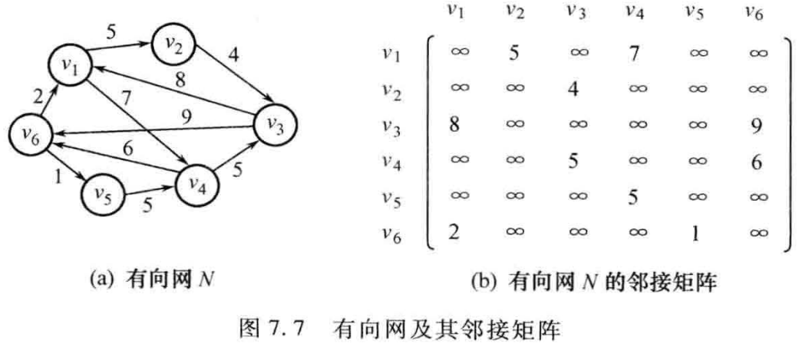
```c
#define MAXVEX 100 // 最大顶点数
#define INFINITY 65535 // 用于表示无穷大

typedef enum {DG, DN, AG, AN} GraphKind; // 有向图、有向网、无向图、无向网
typedef char VertexData; // 顶点类型
typedef struct ArcNode {
    AdjType adj; // 该弧所指向的顶点的位置
    OtherInfo info;
} ArcNode;
typedef struct {
    VertexData vexs[MAXVEX]; // 顶点表
    AdjType arcs[MAXVEX][MAXVEX]; // 邻接矩阵
    int vexnum, arcnum; // 图的当前顶点数和弧数
    GraphKind kind; // 图的种类标志
} MGraph;
```
邻接矩阵法的特点如下：
1. 存储空间：对于无向图，邻接矩阵是对称的；对于有向图，邻接矩阵不一定对称。存储空间为O(n^2)。
2. 便于运算：邻接矩阵便于进行图的运算，如计算路径长度、判断连通性等。
## 7.2.2 邻接表表示法
邻接表（adjacency list）是一种用于表示图的存储结构。对于每个节点，邻接表存储一个链表，链表中的每个节点表示与该节点相邻的节点及其边的信息。邻接表适用于稀疏图，能够节省存储空间。
邻接表的优点是节省空间，适用于稀疏图，空间复杂度为O(V + E)，其中V是节点数，E是边数。缺点是判断两个节点之间是否存在边的时间复杂度为O(V)。
1. 表头结点表：存储图中所有节点的信息，每个节点包含一个指向其邻接表的指针。其中数据域Vexdata存储节点信息，链域FirstArc指向该节点的邻接表。
2. 边结点表：存储与节点相邻的节点信息及边的信息。数据域Adjvex存储邻接节点的位置，NextArc指向下一个邻接节点，Info存储边的信息（如权值）。
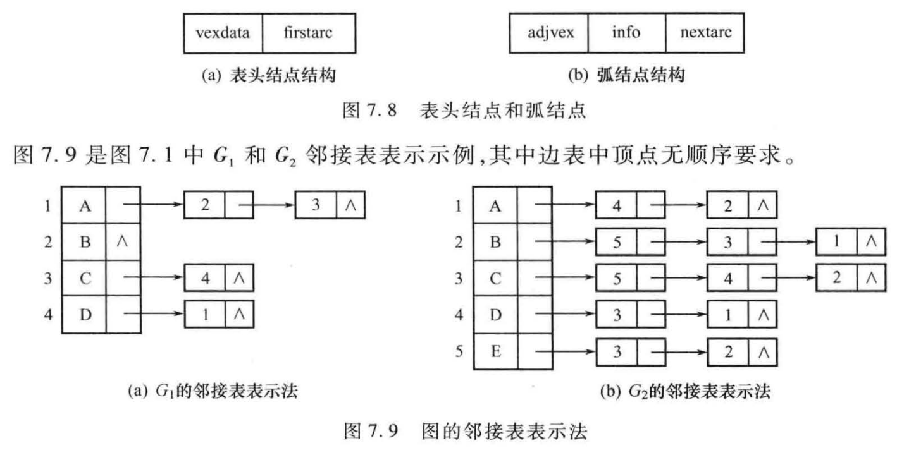
```c
#define MAXVEX 100 // 最大顶点数
typedef enum {DG, DN, AG, AN} GraphKind; // 有向图、有向网、无向图、无向网
typedef struct ArcNode {
    int adjvex; // 该弧所指向的顶点的位置
    struct ArcNode *nextarc; // 指向下一条弧的指针
    OtherInfo info; // 该弧相关信息
} ArcNode;
typedef struct VexNode {
    VertexData vexdata; // 顶点信息
    ArcNode *firstarc; // 指向第一条依附该顶点的弧的指针
} VexNode;
typedef struct {
    VexNode xlist[MAXVEX]; // 顶点表
    int vexnum, arcnum; // 图的当前顶点数和弧数
    GraphKind kind; // 图的种类标志
} ALGraph;
```
1. 存储空间：邻接表的存储空间与图的边数成正比，适用于稀疏图。
2. 无向图的度：在无向图中，每条边会在两个节点的邻接表中各存储一次，因此节点的度等于其邻接表中节点的数量。
3. 有向图的入度和出度：在有向图中，节点的出度等于其邻接表中节点的数量，而入度需要遍历整个图来计算。
## 7.2.3 十字链表表示法
十字链表（orthogonal list）是一种用于表示有向图的存储结构。它结合了邻接表的优点，同时能够高效地表示节点的入度和出度。每个节点包含两个链表，一个用于存储出边，另一个用于存储入边。
十字链表的优点是能够高效地表示有向图的入度和出度，适用于需要频繁查询入度和出度的场景。缺点是实现较为复杂，存储空间相对于邻接表略有增加。
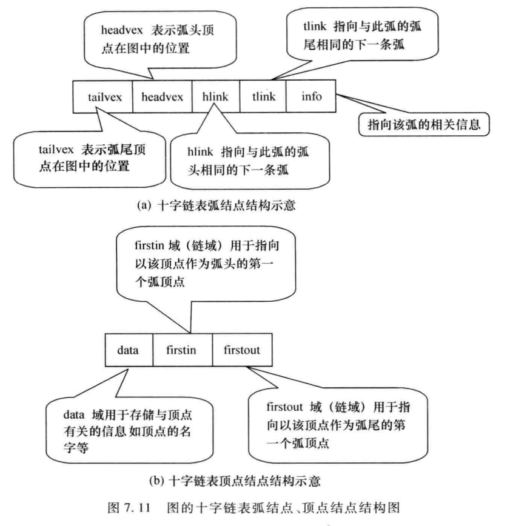
若有向图是稀疏图，则它的邻接矩阵一定是稀疏矩阵，这时可以采用十字链表存储结构来表示有向图。
```c
#define MAXVEX 100 // 最大顶点数
typedef struct ArcBox {
    int tailvex; // 弧尾顶点的位置
    int headvex; // 弧头顶点的位置
    struct ArcBox *hlink; // 指向下一个以该弧头为弧头的弧的指针
    struct ArcBox *tlink; // 指向下一个以该弧尾为弧尾的弧的指针
    OtherInfo info; // 该弧相关信息
} ArcBox;
typedef struct VexNode {
    VertexData vexdata; // 顶点信息
    ArcBox *firstin; // 指向第一条以该顶点为弧  
头的弧的指针
    ArcBox *firstout; // 指向第一条以该顶点为弧尾的弧的指针
} VexNode;
typedef struct {
    VexNode xlist[MAXVEX]; // 顶点表
    int vexnum, arcnum; // 图的当前顶点数和弧数
} OLGraph;
```
# 7.3 图的遍历
图的遍历是指按照某种顺序访问图中的所有节点和边。常见的图遍历算法包括深度优先搜索（Depth-First Search, DFS）和广度优先搜索（Breadth-First Search, BFS）。
## 7.3.1 深度优先搜索（DFS）
深度优先搜索（DFS）是一种用于遍历或搜索图的算法。 它从一个起始节点开始，沿着一条路径不断深入，直到无法继续前进为止，然后回溯到上一个节点，继续探索其他路径。DFS通常使用递归或栈来实现。
基本思想：
1. 从起始节点开始，标记该节点为已访问。
2. 访问该节点的所有邻接节点，对于每个未访问的邻接节点，递归地执行DFS。
3. 重复步骤2，直到所有节点都被访问。
```c
void DFS(ALGraph G, int v, int visited[]) {
    visited[v] = 1; // 标记节点v为已访问
    Visit(G.xlist[v].vexdata); // 访问节点v
    ArcNode *p = G.xlist[v].firstarc; // 获取节点v的邻接表
    while (p != NULL) { 
        int w = p->adjvex; // 获取邻接节点w
        if (!visited[w]) { // 如果节点w未被访问
            DFS(G, w, visited); // 递归访问节点w
        }
        p = p->nextarc; // 继续访问下一个邻接节点
    }
}
void DFSTraverse(ALGraph G) {
    int visited[MAXVEX] = {0}; // 初始化访问标记数组
    for (int v = 0; v < G.vexnum; v++) {
        if (!visited[v]) { // 如果节点v未被访问
            DFS(G, v, visited); // 从节点v开始进行DFS
        }
    }
}
```
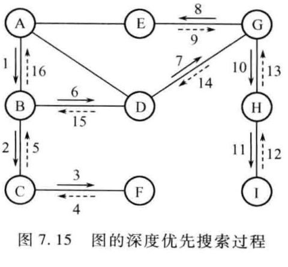
## 7.3.2 广度优先搜索（BFS）
广度优先搜索（BFS）是一种用于遍历或搜索图的算法。它从一个起始节点开始，首先访问该节点的所有邻接节点，然后依次访问这些邻接节点的邻接节点，直到所有节点都被访问。BFS通常使用队列来实现。
基本思想：
1. 从起始节点开始，标记该节点为已访问，并将其入队。
2. 当队列不为空时，取出队首节点，访问该节点的所有邻接节点，对于每个未访问的邻接节点，标记为已访问并入队。
3. 重复步骤2，直到队列为空。
```c
void BFSTraverse(ALGraph G) {
    int visited[MAXVEX] = {0}; // 初始化访问标记数组
    SqQueue Q; // 定义队列
    InitQueue(&Q); // 初始化队列
    for (int v = 0; v < G.vexnum; v++) {
        if (!visited[v]) { // 如果节点v未被访问
            visited[v] = 1; // 标记节点v为已访问
            Visit(G.xlist[v].vexdata); // 访问节点v
            EnQueue(&Q, v); // 将节点v入队
            while (!QueueEmpty(Q)) { // 当队列不为空
                int u;
                DeQueue(&Q, &u); // 取出队首节点u
                ArcNode *p = G.xlist[u].firstarc; // 获取节点u的邻接表
                while (p != NULL) {
                    int w = p->adjvex; // 获取邻接节点w
                    if (!visited[w]) { // 如果节点w未被访问
                        visited[w] = 1; // 标记节点w为已访问
                        Visit(G.xlist[w].vexdata); // 访问节点w
                        EnQueue(&Q, w); // 将节点w入队
                    }
                    p = p->nextarc; // 继续访问下一个邻接节点
                }
            }
        }
    }
}
```
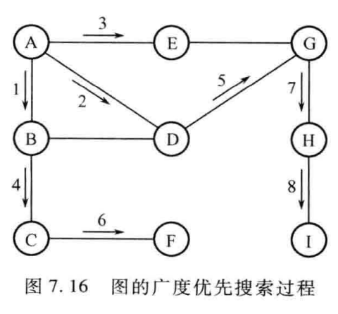
# 7.4 图的应用
图在计算机科学和实际应用中有广泛的应用
## 7.4.1 图的连通性问题
### 1. 无向图的连通分量
无向图的连通分量是指图中所有节点之间通过路径相连的最大子图。可以使用深度优先搜索（DFS）或广度优先搜索（BFS）来找出无向图的连通分量。具体步骤如下：
1. 初始化一个访问标记数组，标记所有节点为未访问。
2. 遍历图中的每个节点，如果节点未被访问，则从该节点开始进行DFS或BFS，标记所有可达节点为已访问，并将这些节点组成一个连通分量。
3. 重复步骤2，直到所有节点都被访问。
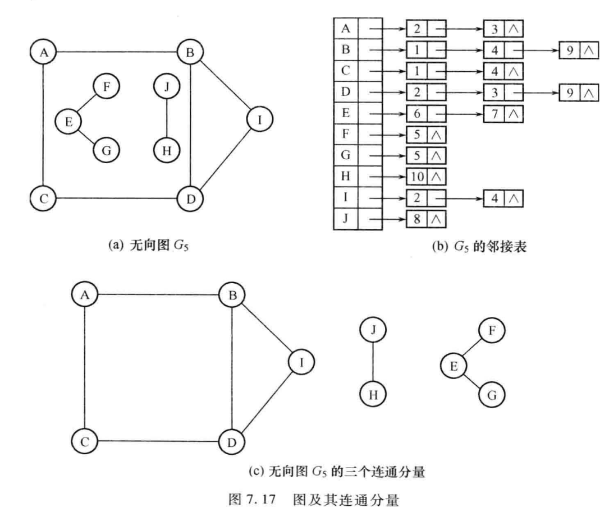
```c
void DFSComponent(ALGraph G, int v, int visited[]) {
    visited[v] = 1; // 标记节点v为已访问
    ArcNode *p = G.xlist[v].firstarc; // 获取节点v的邻接表
    while (p != NULL) {
        int w = p->adjvex; // 获取邻接节点w
        if (!visited[w]) { // 如果节点w未被访问
            DFSComponent(G, w, visited); // 递归访问节点w
        }
        p = p->nextarc; // 继续访问下一个邻接节点
    }
}
void FindConnectedComponents(ALGraph G) {
    int visited[MAXVEX] = {0}; // 初始化访问标记数组
    for (int v = 0; v < G.vexnum; v++) {
        if (!visited[v]) { // 如果节点v未被访问
            printf("Connected Component:\n");
            DFSComponent(G, v, visited); // 从节点v开始进行DFS
            printf("\n");
        }
    }
}
```
### 2. 图中两个顶点之间的简单路径
在图中寻找两个顶点之间的简单路径可以使用深度优先搜索（DFS）或广度优先搜索（BFS）算法。以下是使用DFS算法寻找两个顶点之间的简单路径的步骤：
1. 初始化一个访问标记数组，标记所有节点为未访问。
2. 从起始顶点开始，递归地进行DFS，记录当前路径。
3. 如果到达目标顶点，则输出当前路径。
4. 如果当前路径无法继续前进，则回溯到上一个节点，继续探索其他路径。
5. 重复步骤2-4，直到找到所有简单路径或确认无路径存在。
```c
bool DFSPath(ALGraph G, int v, int target, int visited[], int path[], int pathLen) {
    visited[v] = 1; // 标记节点v为已访问
    path[pathLen] = v; // 将节点v加入当前路径
    pathLen++;
    if (v == target) { // 如果到达目标节点
        PrintPath(path, pathLen); // 输出当前路径
        visited[v] = 0; // 回溯，标记节点v为未访问
        return true; // 找到路径
    }
    ArcNode *p = G.xlist[v].firstarc; // 获取节点v的邻接表
    while (p != NULL) {
        int w = p->adjvex; // 获取邻接节点w
        if (!visited[w]) { // 如果节点w未被访问
            if (DFSPath(G, w, target, visited, path, pathLen)) {
                visited[v] = 0; // 回溯，标记节点v为未访问
                return true; // 找到路径
            }
        }
        p = p->nextarc; // 继续访问下一个邻接节点
    }
    visited[v] = 0; // 回溯，标记节点v为未访问
    return false; // 未找到路径
}
void FindPath(ALGraph G, int start, int target) {
    int visited[MAXVEX] = {0}; // 初始化访问标记数组
    int path[MAXVEX]; // 存储当前路径
    DFSPath(G, start, target, visited, path, 0); // 从起始节点开始寻找路径
}
```
### 3. 图的生成树与最小生成树
生成树（spanning tree）是指包含图中所有节点且没有回路的子图。最小生成树（minimum spanning tree, MST）是指在所有生成树中，边权和最小的生成树。常用的最小生成树算法包括Prim算法和Kruskal算法。
#### Prim算法
Prim算法是一种用于寻找无向连通图的最小生成树的贪心算法。其基本思想是从一个起始节点开始，逐步将未包含在生成树中的节点加入生成树，直到所有节点都被包含在生成树中。具体步骤如下：
1. 初始化一个包含起始节点的生成树。
2. 重复以下步骤，直到生成树包含所有节点：
   a. 在生成树中选择一条权值最小的边，该边连接生成树中的节点和未包含在生成树中的节点。
   b. 将该边和其连接的节点加入生成树。
```c
void PrimMST(MGraph G, int start) {
    int lowcost[MAXVEX]; // 存储每个节点到生成树的最小权值
    int adjvex[MAXVEX]; // 存储每个节点在生成树中的邻接节点
    int visited[MAXVEX] = {0}; // 访问标记数组
    for (int i = 0; i < G.vexnum; i++) {
        lowcost[i] = G.arcs[start][i]; // 初始化权值
        adjvex[i] = start; // 初始化邻接节点
    }
    visited[start] = 1; // 标记起始节点为已访问
    for (int i = 1; i < G.vexnum; i++) {
        int min = INFINITY;
        int k = -1;
        for (int j = 0; j < G.vexnum; j++) {
            if (!visited[j] && lowcost[j] < min) {
                min = lowcost[j];
                k = j;
            }
        }
        if (k != -1) {
            visited[k] = 1; // 标记节点k为已访问
            printf("Edge: (%d, %d) Weight: %d\n", adjvex[k], k, lowcost[k]); // 输出边信息
            for (int j = 0; j < G.vexnum; j++) {
                if (!visited[j] && G.arcs[k][j] < lowcost[j]) {
                    lowcost[j] = G.arcs[k][j]; // 更新权值
                    adjvex[j] = k; // 更新邻接节点
                }
            }
        }
    }
}
```
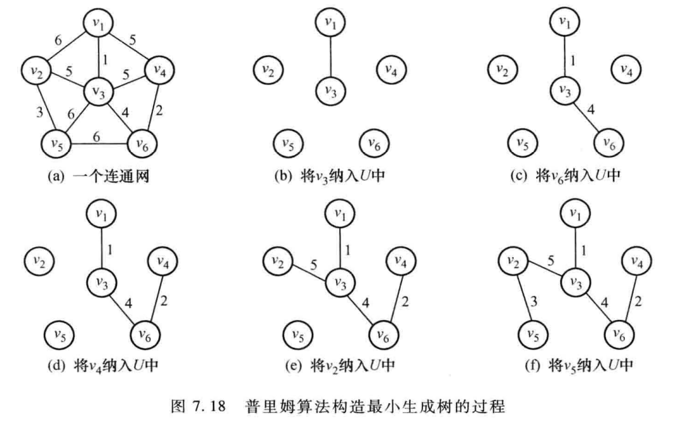
#### Kruskal算法
Kruskal算法是一种用于寻找无向连通图的最小生成树的贪心算法。其基本思想是将图中的所有边按权值从小到大排序，然后依次选择边，确保不会形成回路，直到生成树包含所有节点。具体步骤如下：
1. 将图中的所有边按权值从小到大排序。
2. 初始化一个空的生成树。
3. 重复以下步骤，直到生成树包含所有节点：
   a. 选择权值最小的边。
   b. 如果该边连接的两个节点不在同一个连通分量中，则将该边加入生成树，并合并两个连通分量。
```c
typedef struct {
    int u, v; // 边的两个端点
    int weight; // 边的权值
} Edge;
int compareEdges(const void *a, const void *b) {
    return ((Edge *)a)->weight - ((Edge *)b)->weight;
}
int find(int parent[], int i) {
    if (parent[i] == -1) {
        return i;
    }
    return find(parent, parent[i]);
}
void unionSets(int parent[], int x, int y) {
    int xset = find(parent, x);
    int yset = find(parent, y);
    if (xset != yset) {
        parent[xset] = yset;
    }
}
void KruskalMST(MGraph G) {
    Edge edges[MAXVEX * MAXVEX]; // 存储图中的所有边
    int edgeCount = 0;
    for (int i = 0; i < G.vexnum; i++) {
        for (int j = i + 1; j < G.vexnum; j++) {
            if (G.arcs[i][j] != INFINITY) {
                edges[edgeCount].u = i;
                edges[edgeCount].v = j;
                edges[edgeCount].weight = G.arcs[i][j];
                edgeCount++;
            }
        }
    }
    qsort(edges, edgeCount, sizeof(Edge), compareEdges); // 按权值排序边
    int parent[MAXVEX];
    for (int i = 0; i < G.vexnum; i++) {
        parent[i] = -1; // 初始化并查集 
    }
    for (int i = 0; i < edgeCount; i++) {
        int u = edges[i].u;
        int v = edges[i].v;
        int setU = find(parent, u);
        int setV = find(parent, v);
        if (setU != setV) { // 如果u和v不在同一个连通分量中
            printf("Edge: (%d, %d) Weight: %d\n", u, v, edges[i].weight); // 输出边信息
            unionSets(parent, setU, setV); // 合并连通分量
        }
    }
}
```
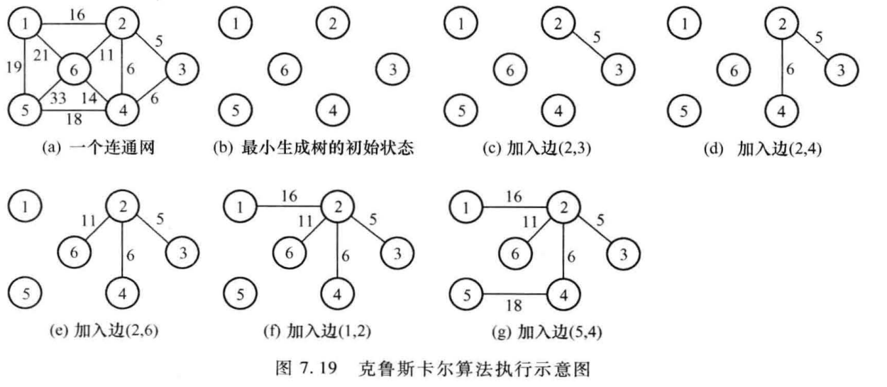
## 7.4.2 有向无环图的应用
有向无环图（Directed Acyclic Graph, DAG）是一种特殊的图结构，广泛应用于任务调度、编译器优化、数据处理等领域。DAG的特点是不存在从一个节点出发经过若干边后又回到该节点的路径。
### 1. 拓扑排序
拓扑排序（topological sorting）是指对有向无环图中的节点进行线性排序，使得对于每一条有向边<u, v>，节点u在排序中出现在节点v之前。拓扑排序常用于任务调度和依赖关系管理。
用顶点表示活动，用弧表示活动之间的先后关系的有向无环图，称为顶点表示活动的网（Activity on Vertex, AOV）网。AOV网的一个重要应用是进行项目的计划与管理。
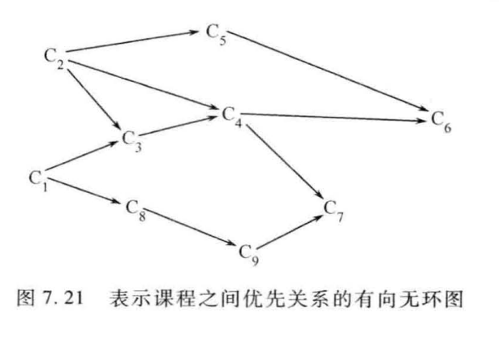
AOV-网的特性：
1. 有向无环图：AOV网必须是有向无环图，以确保活动之间的先后关系没有循环依赖。
2. 节点表示活动：AOV网中的每个节点表示一个具体的活动或任务。
3. 边表示依赖关系：AOV网中的每条边表示活动之间的先后关系，即一个活动必须在另一个活动之前完成。
4. 拓扑排序：AOV网可以进行拓扑排序，以确定活动的执行顺序。
5. 关键路径分析：AOV网可以用于关键路径分析，帮助识别项目中最重要的活动和时间节点。
如何进行拓扑排序：
1. 计算每个节点的入度。
2. 将所有入度为0的节点加入队列。
3. 当队列不为空时，取出队首节点，输出该节点，并将其所有邻接节点的入度减1。如果某个邻接节点的入度变为0，则将其加入队列。
4. 重复步骤3，直到队列为空。
```c
void TopologicalSort(ALGraph G) {
    int inDegree[MAXVEX] = {0}; // 存储每个节点的入度
    SqQueue Q; // 定义队列
    InitQueue(&Q); // 初始化队列
    for (int v = 0; v < G.vexnum; v++) {
        ArcNode *p = G.xlist[v].firstarc; // 获取节点v的邻接表
        while (p != NULL) {
            inDegree[p->adjvex]++; // 计算入度
            p = p->nextarc; // 继续访问下一个邻接节点
        }
    }
    for (int v = 0; v < G.vexnum; v++) {    
        if (inDegree[v] == 0) { // 如果节点v的入度为0
            EnQueue(&Q, v); // 将节点v入队
        }
    }
    int count = 0; // 计数已输出的节点数
    while (!QueueEmpty(Q)) { // 当队列不为空
        int v;
        DeQueue(&Q, &v); // 取出队首节点v
        printf("%c ", G.xlist[v].vexdata); // 输出节点v
        count++;
        ArcNode *p = G.xlist[v].firstarc; // 获取节点v的邻接表
        while (p != NULL) {
            int w = p->adjvex; // 获取邻接节点w
            inDegree[w]--; // 入度减1
            if (inDegree[w] == 0) { // 如果节点w的入度为0
                EnQueue(&Q, w); // 将节点w入队
            }
            p = p->nextarc; // 继续访问下一个邻接节点
        }
    }
    if (count < G.vexnum) { // 如果未输出所有节点，说明图中有环
        printf("The graph has a cycle.\n");
    }
}
```
### 2. 关键路径分析
关键路径（critical path）是指在项目管理中，决定项目总工期的最长路径。关键路径上的活动称为关键活动，任何关键活动的延误都会直接影响项目的完成时间。关键路径分析有助于识别项目中的关键任务，优化资源分配。
关键路径的重要定义：
1. 最早开始时间（Earliest Start Time, EST）：活动可以开始的最早时间。
2. 最早完成时间（Earliest Finish Time, EFT）：活动可以完成的最早时间。
3. 最晚开始时间（Latest Start Time, LST）：活动可以开始的最晚时间而不延误项目完成时间。
4. 最晚完成时间（Latest Finish Time, LFT）：活动可以完成的最晚时间而不延误项目完成时间。
5. 总时差（Total Float, TF）：活动的最晚开始时间与最早开始时间之差，表示活动可以延迟的时间而不影响项目完成时间。
6. 关键路径：EST和LST相等的活动路径，表示项目中最重要的活动序列。
关键路径分析的步骤如下：
1. 构建AOV网，表示项目中的活动及其依赖关系。
2. 进行拓扑排序，确定活动的执行顺序。
3. 计算每个活动的最早开始时间（Earliest Start Time, EST）和最早完成时间（Earliest Finish Time, EFT）。
4. 计算每个活动的最晚开始时间（Latest Start Time, LST）和最晚完成时间（Latest Finish Time, LFT）。
5. 识别关键路径，即EST和LST相等的活动路径。
```c
void CriticalPath(ALGraph G, int duration[]) {
    int est[MAXVEX] = {0}; // 最早开始时间
    int eft[MAXVEX] = {0}; // 最早完成时间
    int lst[MAXVEX]; // 最晚开始时间
    int lft[MAXVEX]; // 最晚完成时间
    SqQueue Q; // 定义队列
    InitQueue(&Q); // 初始化队列
    int inDegree[MAXVEX] = {0}; // 存储每个节点的入度
    for (int v = 0; v < G.vexnum; v++) {
        ArcNode *p = G.xlist[v].firstarc; // 获取节点v的邻接表
        while (p != NULL) {
            inDegree[p->adjvex]++; // 计算入度
            p = p->nextarc; // 继续访问下一个邻接节点
        }
    }
    for (int v = 0; v < G.vexnum; v++) {    
        if (inDegree[v] == 0) { // 如果节点v的入度为0
            EnQueue(&Q, v); // 将节点v入队
        }
    }
    while (!QueueEmpty(Q)) { // 当队列不为空
        int v;
        DeQueue(&Q, &v); // 取出队首节点v
        eft[v] = est[v] + duration[v]; // 计算最早完成时间
        ArcNode *p = G.xlist[v].firstarc; // 获取节点v的邻接表
        while (p != NULL) {
            int w = p->adjvex; // 获取邻接节点w
            if (est[w] < eft[v]) {
                est[w] = eft[v]; // 更新最早开始时间
            }
            inDegree[w]--; // 入度减1
            if (inDegree[w] == 0) { // 如果节点w的入度为0
                EnQueue(&Q, w); // 将节点w入队
            }
            p = p->nextarc; // 继续访问下一个邻接节点
        }
    }
    int maxEFT = 0;
    for (int v = 0; v < G.vexnum; v++) {
        if (eft[v] > maxEFT) {
            maxEFT = eft[v]; // 计算项目总工期
        }
    }
    for (int v = 0; v < G.vexnum; v++) {    
        lft[v] = maxEFT; // 初始化最晚完成时间
    }
    for (int i = G.vexnum - 1; i >= 0; i--) {
        int v = /* 获取拓扑排序中的第i个节点 */;
        ArcNode *p = G.xlist[v].firstarc; // 获取节点v的邻接表
        while (p != NULL) {
            int w = p->adjvex; // 获取邻接节点w
            if (lft[v] > lft[w] - duration[v]) {
                lft[v] = lft[w] - duration[v]; // 更新最晚完成时间
            }
            p = p->nextarc; // 继续访问下一个邻接节点
        }
    }
    for (int v = 0; v < G.vexnum; v++) {
        lst[v] = lft[v] - duration[v]; // 计算最晚开始时间
        if (est[v] == lst[v]) {
            printf("Activity %c is on the critical path.\n", G.xlist[v].vexdata); // 输出关键活动
        }
    }
}
```
## 7.4.3 最短路径问题
最短路径问题是指在图中寻找两个节点之间路径长度最短的路径。常用的最短路径算法包括Dijkstra算法和Floyd-Warshall算法。
### 1. 求某一顶点到其他顶点的最短路径——Dijkstra算法
Dijkstra算法是一种用于寻找单源最短路径的贪心算法。其基本思想是从起始节点开始，逐步扩展已知最短路径的节点集合，直到所有节点的最短路径都被确定。具体步骤如下：
1. 初始化起始节点的最短路径为0，其他节点的最短路径为无穷大。
2. 将起始节点加入已知最短路径的节点集合。
3. 重复以下步骤，直到所有节点的最短路径都被确定：
   a. 在未确定最短路径的节点中选择一个具有最小最短路径的节点。
   b. 更新该节点的邻接节点的最短路径。
```c
void Dijkstra(MGraph G, int start) {
    int dist[MAXVEX]; // 存储起始节点到每个节点的最短路径长度
    int visited[MAXVEX] = {0}; // 访问标记数组
    for (int i = 0; i < G.vexnum; i++) {
        dist[i] = G.arcs[start][i]; // 初始化最短路径
    }
    visited[start] = 1; // 标记起始节点为已访问
    for (int i = 1; i < G.vexnum; i++) {
        int min = INFINITY;
        int k = -1;
        for (int j = 0; j < G.vexnum; j++) {
            if (!visited[j] && dist[j] < min) {
                min = dist[j];
                k = j;
            }
        }
        if (k != -1) {
            visited[k] = 1; // 标记节点k为已访问
            for (int j = 0; j < G.vexnum; j++) {
                if (!visited[j] && G.arcs[k][j] + dist[k] < dist[j]) {
                    dist[j] = G.arcs[k][j] + dist[k]; // 更新最短路径
                }
            }
        }
    }
    for (int i = 0; i < G.vexnum; i++) {
        printf("Shortest path from %d to %d is %d\n", start, i, dist[i]); // 输出最短路径
    }
}
```
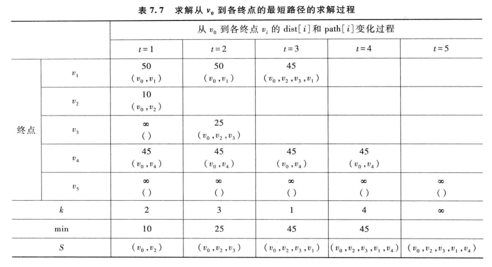
### 2. 求任意两顶点间的最短路径——Floyd-Warshall算法
Floyd-Warshall算法是一种用于寻找任意两节点之间最短路径的动态规划算法。其基本思想是通过逐步引入中间节点，更新任意两节点之间的最短路径。具体步骤如下：
1. 初始化一个二维数组dist，其中dist[i][j]表示节点i到节点j的直接路径长度，如果不存在直接路径则设为无穷大。
2. 对于每个中间节点k，更新任意两节点i和j之间的最短路径：
   a. 如果通过中间节点k的路径长度小于当前已知的路径长度，则更新dist[i][j]。
```c
void FloydWarshall(MGraph G) {
    int dist[MAXVEX][MAXVEX]; // 存储任意两节点之间的最短路径长度
    for (int i = 0; i < G.vexnum; i++) {
        for (int j = 0; j < G.vexnum; j++) {
            dist[i][j] = G.arcs[i][j]; // 初始化最短路径
        }
    }
    for (int k = 0; k < G.vexnum; k++) {
        for (int i = 0; i < G.vexnum; i++) {
            for (int j = 0; j < G.vexnum; j++) {
                if (dist[i][k] + dist[k][j] < dist[i][j]) {
                    dist[i][j] = dist[i][k] + dist[k][j]; // 更新最短路径
                }
            }
        }
    }
    for (int i = 0; i < G.vexnum; i++) {
        for (int j = 0; j < G.vexnum; j++) {
            printf("Shortest path from %d to %d is %d\n", i, j, dist[i][j]); // 输出最短路径
        }
    }
}
```
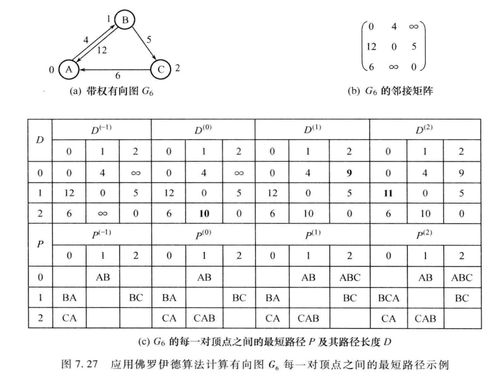