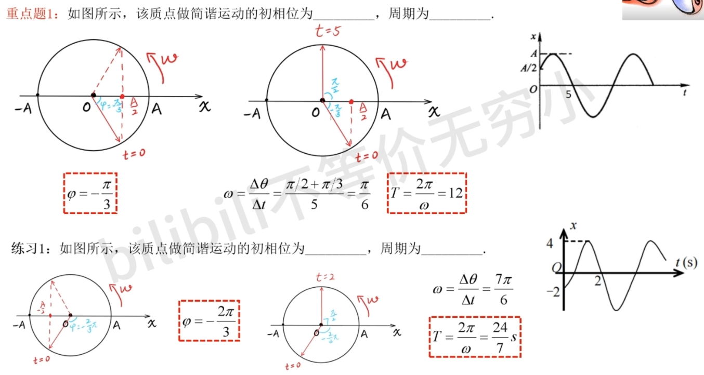
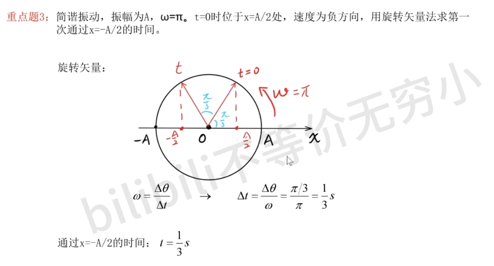
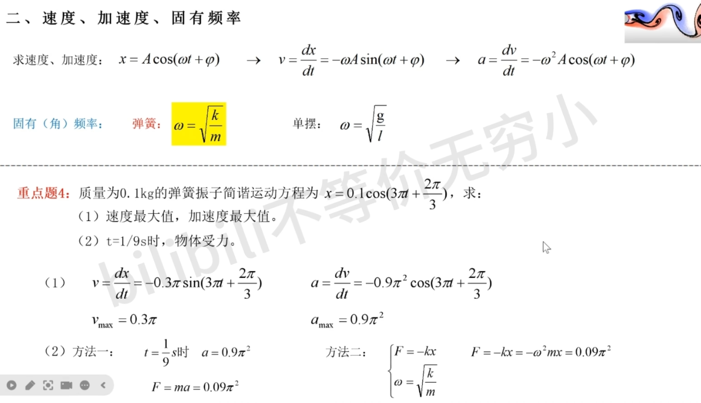

# 1. 质点运动学

## 1.1. 运动的基本描述 (直角坐标系)

### 1.1.1. 基本概念：质点、参考系、坐标系
- **质点**: 具有质量但可忽略其大小和形状的物体。
- **参考系**: 用来描述物体运动时所选作参考的、相对静止的物体或物体系。
- **坐标系**: 为定量描述物体的位置和位置变化，在参考系上建立的坐标系统。常见的有直角坐标系、极坐标系、自然坐标系、球坐标系。

### 1.1.2. 位置矢量、运动方程与轨道方程
- **位置矢量 (位矢)**
    - 定义：从坐标原点指向质点所在位置的有向线段 $\vec{r}$。
    - 分量式: $\vec{r} = x\vec{i} + y\vec{j} + z\vec{k}$
    - 大小: $r = \sqrt{x^2 + y^2 + z^2}$
    - 方向: $\cos \alpha = \frac{x}{r}$, $\cos \beta = \frac{y}{r}$, $\cos \gamma = \frac{z}{r}$
- **运动方程**
    - 定义：描述质点位置坐标随时间变化的函数关系。
    - 矢量形式: $\vec{r} = \vec{r}(t)$
    - 参数形式: $x = x(t)$, $y = y(t)$, $z = z(t)$
- **轨道方程**
    - 定义：由运动方程消去时间参数 $t$ 后得到的，描述质点运动轨迹的方程 $\xi(x, y, z) = 0$。

### 1.1.3. 位移与路程
- **位移 (Displacement)**
    - 定义：在 $\Delta t$ 时间内，质点位置矢量的变化量 $\Delta\vec{r}$。位移是矢量。
    - 表达式: $\Delta\vec{r} = \vec{r}_B - \vec{r}_A$
    - 直角坐标系中: $\Delta\vec{r} = \Delta x\vec{i} + \Delta y\vec{j} + \Delta z\vec{k}$
    - 大小: $|\Delta\vec{r}| = \sqrt{\Delta x^2 + \Delta y^2 + \Delta z^2}$
- **路程 (Path)**
    - 定义：在 $\Delta t$ 时间内，质点运动轨迹的长度 $\Delta s$。路程是标量。
- **关系与区别**: 一般情况下，位移的大小不等于路程 ($|\Delta\vec{r}| \neq \Delta s$)。只有在单向直线运动中二者才相等。

### 1.1.4. 速度与速率
- **平均速度**: $\bar{v} = \frac{\Delta\vec{r}}{\Delta t}$ (矢量)
- **瞬时速度**: $\vec{v} = \lim_{\Delta t \to 0} \frac{\Delta\vec{r}}{\Delta t} = \frac{d\vec{r}}{dt}$ (矢量, 方向为轨道切线方向)
    - 分量式: $\vec{v} = v_x\vec{i} + v_y\vec{j} + v_z\vec{k}$，其中 $v_x = \frac{dx}{dt}$, $v_y = \frac{dy}{dt}$, $v_z = \frac{dz}{dt}$
- **平均速率**: $\bar{v} = \frac{\Delta s}{\Delta t}$ (标量)
- **瞬时速率**: $v = \lim_{\Delta t \to 0} \frac{\Delta s}{\Delta t} = \frac{ds}{dt}$ (标量)
- **关系**: 瞬时速度的大小等于瞬时速率, 即 $|\vec{v}| = v$。

### 1.1.5. 加速度
- **平均加速度**: $\bar{a} = \frac{\Delta\vec{v}}{\Delta t}$ (矢量)
- **瞬时加速度**: $\vec{a} = \lim_{\Delta t \to 0} \frac{\Delta\vec{v}}{\Delta t} = \frac{d\vec{v}}{dt} = \frac{d^2\vec{r}}{dt^2}$ (矢量)
    - 分量式: $\vec{a} = a_x\vec{i} + a_y\vec{j} + a_z\vec{k}$，其中 $a_x = \frac{dv_x}{dt}$, $a_y = \frac{dv_y}{dt}$, $a_z = \frac{dv_z}{dt}$
    - 大小: $|\vec{a}| = \sqrt{a_x^2 + a_y^2 + a_z^2}$
    - 方向: 在曲线运动中，加速度的方向总是指向曲线轨迹凹的一侧。

## 1.2. 质点运动学的两类基本问题

### 1.2.1. 微分问题：由运动方程求速度和加速度
- **方法**: 已知运动方程 $\vec{r}(t)$，通过对时间求导得到速度 $\vec{v}(t)$ 和加速度 $\vec{a}(t)$。
- **实例**:
    - **例1**: 质点运动方程 $\vec{r} = 4t^2\vec{i} + (2t+3)\vec{j}$ (SI)。
        - 轨迹方程: $x = (y-3)^2$
        - 速度: $\vec{v} = 8t\vec{i} + 2\vec{j}$ (m/s)
        - 加速度: $\vec{a} = 8\vec{i}$ (m/s²)
    - **例2**: 质点运动方程 $\vec{r} = 2t\vec{i} + (19-2t^2)\vec{j}$ (SI)。
        - 轨道方程: $y=19-\frac{1}{2}x^2$
        - 速度: $\vec{v} = 2\vec{i} - 4t\vec{j}$ (m/s)
        - 加速度: $\vec{a} = -4\vec{j}$ (m/s²)
        - 位矢与速度矢垂直的时刻: $\vec{r} \cdot \vec{v} = 0 \Rightarrow t=0$s 或 $t=3$s。

### 1.2.2. 积分问题：由加速度和初始条件求运动方程
- **方法**: 已知加速度函数及初始条件，通过对时间积分得到速度和位置。
    - **类型一: a = a(t) 或 a = 常量**: $v = v_0 + \int_{t_0}^{t} a(t)dt$, $x = x_0 + \int_{t_0}^{t} v(t)dt$
    - **类型二: a = a(x)**: 利用 $a = v\frac{dv}{dx}$，积分 $\int_{v_0}^{v} vdv = \int_{x_0}^{x} a(x)dx$。
    - **类型三: a = a(v)**: 利用 $a = v\frac{dv}{dx}$ 或 $a = \frac{dv}{dt}$，积分 $\int_{x_0}^{x} dx = \int_{v_0}^{v} \frac{v}{a(v)}dv$ 或 $\int_{t_0}^{t} dt = \int_{v_0}^{v} \frac{dv}{a(v)}$。
- **实例**:
    - **例3 (a=常量)**: $v = v_0 + at$, $x = x_0 + v_0t + \frac{1}{2}at^2$。
    - **例4 (a=a(x))**: $a = 2 + 6x^2$，从原点静止出发，则 $v = 2\sqrt{x+x^3}$ m/s。
    - **例5 (a=a(v))**: $a = -kv^2$，初速为 $v_0$，则 $v = v_0e^{-kx}$。

## 1.3. 运动的分解描述：自然坐标系

### 1.3.1. 自然坐标系定义
- **定义**: 以轨迹上任一点为坐标原点，以该点的切线方向和法线方向为坐标轴建立的坐标系。
- **单位矢量**:
    - **切向单位矢量 $\vec{\tau}$**: 沿质点前进方向的切向为正。
    - **法向单位矢量 $\vec{n}$**: 沿轨迹的法向凹侧为正。
- **特点**: 自然坐标系的单位矢量方向随时间（位置）变化。

### 1.3.2. 速度与加速度的分解
- **速度**: 速度方向始终沿切线方向，因此只有切向分量。
    - $\vec{v} = v\vec{\tau}$，其中速率 $v=\frac{ds}{dt}$。
- **加速度**: 加速度可分解为切向和法向两个分量。
    - $\vec{a} = \frac{d\vec{v}}{dt} = \frac{d}{dt}(v\vec{\tau}) = \frac{dv}{dt}\vec{\tau} + v\frac{d\vec{\tau}}{dt}$
    - **切向加速度 $\vec{a}_{\tau}$**:
        - 表达式: $\vec{a}_{\tau} = \frac{dv}{dt}\vec{\tau}$
        - 物理意义: 描述速度大小（速率）变化的快慢。
        - 大小: $a_{\tau} = \frac{dv}{dt}$
    - **法向加速度 $\vec{a}_{n}$**:
        - 表达式: $\vec{a}_{n} = \frac{v^2}{\rho}\vec{n}$ (其中 $\rho$ 为轨道的曲率半径)
        - 物理意义: 描述速度方向变化的快慢。
        - 大小: $a_{n} = \frac{v^2}{\rho}$
        - 方向: 始终指向轨道的曲率中心（凹侧）。

### 1.3.3. 总加速度
- **表达式**: $\vec{a} = \vec{a}_n + \vec{a}_{\tau}$
- **大小**: $a = \sqrt{a_n^2 + a_{\tau}^2}$
- **方向**: 与切线方向的夹角 $\theta = \arctan\frac{a_n}{a_{\tau}}$

### 1.3.4. 应用实例：斜抛运动
- **问题**: 物体作斜抛运动，在A点速度为 $\vec{v}$，与水平方向夹角为 $30^\circ$。求该点的切向加速度和曲率半径。

- **解**: 将重力加速度 $g$ 分解到切向和法向。
    - 切向加速度: $a_{\tau} = -g\sin 30^\circ = -\frac{g}{2}$
    - 法向加速度: $a_n = g\cos 30^\circ = \frac{\sqrt{3}}{2}g$
    - 曲率半径: $\rho = \frac{v^2}{a_n} = \frac{2\sqrt{3}}{3}\frac{v^2}{g}$

## 1.4. 曲线运动的特例：圆周运动

### 1.4.1. 角量描述
- **角位置 $\theta$**: 质点位矢与参考轴的夹角 (rad)。
- **角位移 $\Delta\theta$**: 位矢转过的角度 (rad)。
- **角速度 $\omega$**: $\omega = \frac{d\theta}{dt}$ ($\text{rad} \cdot s^{-1}$)
- **角加速度 $\alpha$**: $\alpha = \frac{d\omega}{dt}$ ($\text{rad} \cdot s^{-2}$)

### 1.4.2. 线量与角量的关系
对于半径为 R 的圆周运动：
- **路程与角位移**: $s = R\theta$
- **线速度与角速度**: $v = R\omega$
- **切向加速度与角加速度**: $a_{\tau} = R\alpha$
- **法向加速度**: $a_n = \frac{v^2}{R} = R\omega^2$

### 1.4.3. 匀速与变速圆周运动
- **匀速圆周运动**:
    - 特点: $\omega$=恒量, $\alpha = 0$, $a_{\tau} = 0$。
    - 加速度: $\vec{a} = \vec{a}_n$，大小为 $a = a_n = \frac{v^2}{R} = \omega^2 R$。
- **变速圆周运动**:
    - 特点: $\alpha \neq 0$, $a_{\tau} = R\alpha \neq 0$。
    - 总加速度: $\vec{a} = \vec{a}_n + \vec{a}_{\tau}$，大小为 $a = \sqrt{a_n^2 + a_{\tau}^2}$。
- **匀变速圆周运动公式**:
    - $\omega = \omega_0 + \alpha t$
    - $\theta = \theta_0 + \omega_0 t + \frac{1}{2}\alpha t^2$
    - $\omega^2 = \omega_0^2 + 2\alpha(\theta - \theta_0)$

### 1.4.4. 应用实例
- **例7**: 飞轮半径 r = 0.2m, 轮缘上一点的角位置 $\phi = -t^2 + 4t$。求 t=1s 时的速度和加速度。

    - 解: $\omega = -2t+4$, $\alpha = -2$。在 t=1s 时, $\omega=2$, $v=0.4$ m/s, $a_{\tau}=-0.4$ m/s², $a_n=0.8$ m/s², 总加速度大小 $a=0.89$ m/s²。
- **例8**: 质点沿半径为 R  的圆周运动, 路程 $s = bt - (1/2) \cdot ct^2$。
    - 解: $v = b-ct$, $a_{\tau} = -c$, $a_n = \frac{(b-ct)^2}{R}$。当 $a_{\tau}=a_n$ 时, $t = \frac{b}{c} \pm \sqrt{\frac{R}{c}}$ (需满足 $b^2 > Rc$ 条件)。

## 1.5. 运动的相对性：伽利略变换

### 1.5.1. 速度合成法则
- **基本关系**: 设S为静止系，S'为运动系，$\vec{r}$ 为质点对S系的位矢，$\vec{r'}$ 为质点对S'系的位矢，$\vec{r_0}$ 为S'原点对S系的位矢。则有 $\vec{r} = \vec{r_0} + \vec{r'}$。

- **速度变换**: 对时间求导得 $\vec{v} = \vec{u} + \vec{v'}$ (伽利略速度变换式)。
    - **绝对速度 $\vec{v}$**: 质点相对静止系的速度。
    - **相对速度 $\vec{v'}$**: 质点相对运动系的速度。
    - **牵连速度 $\vec{u}$**: 运动系相对静止系的速度。

### 1.5.2. 加速度合成法则
- **加速度变换**: 对速度变换式再求导，得 $\vec{a} = \vec{a_0} + \vec{a'}$。
    - $\vec{a}$ 为绝对加速度，$\vec{a'}$ 为相对加速度，$\vec{a_0}$ 为牵连加速度。
- **惯性系**: 若两参考系相互作匀速直线运动，则牵连速度 $\vec{u}$=常矢，$\vec{a_0}=0$，此时 $\vec{a} = \vec{a'}$。即质点在两个惯性系中的加速度相同。

### 1.5.3. 求解方法与实例
- **求解方法**: 确定运动质点、静止参考系和运动参考系。利用矢量合成法则 $\vec{v}_{绝对} = \vec{v}_{相对} + \vec{v}_{牵连}$ 或下标轮换关系 $\vec{v}_{31} = \vec{v}_{32} + \vec{v}_{21}$ 进行计算。
- **实例**:
    - **例9**: 人骑车向东，风由北向南，速度大小均为 $v$。问人感觉到的风向？
        - 解: $\vec{v}_{风人} = \vec{v}_{风地} - \vec{v}_{人地}$。作矢量图可知，风从东北方向吹来，速度大小为 $\sqrt{2}v$。
    - **例10**: 车以10 m/s 水平前进，车上的人向后上方60°抛出石块，地面观察者看到石块竖直上抛。求上升高度。
        - 解: $\vec{v}_{石地} = \vec{v}_{石车} + \vec{v}_{车地}$。由矢量图得，石块竖直上抛初速度 $v = v_{车地} \tan 60^\circ = 17.3$ m/s。上升高度 $H = \frac{v^2}{2g} = 15.3$ m。

## 1.6. 综合讨论与思考

### 1.6.1. 问题一：速度大小的计算方法辨析

- **问题**: 计算速度大小时，$\frac{dr}{dt}$ (其中 $r=|\vec{r}|$ ) 和 $|\frac{d\vec{r}}{dt}|$ 是否等价？
- **辨析**:
    - **结论**: 不等价。$v = |\frac{d\vec{r}}{dt}| = \sqrt{v_x^2+v_y^2}$ 是正确的，而 $v = \frac{dr}{dt}$ 是错误的。
    - **原因**: 速度的定义是位矢对时间的变化率 $\vec{v}=\frac{d\vec{r}}{dt}$，其大小为 $v=|\frac{d\vec{r}}{dt}|$。而 $\frac{dr}{dt} = \frac{d|\vec{r}|}{dt}$ 仅仅是位矢大小的变化率，即径向速度。在一般曲线运动中，$d|\vec{r}| \neq |d\vec{r}|$。
    - **反例**: 质点绕原点作匀速圆周运动时，$r=|\vec{r}|=R$ (常量)，所以 $\frac{dr}{dt}=0$，但这显然不等于质点的速度大小。

### 1.6.2. 问题二：拉船靠岸问题分析
- **问题**: 在离水面高h的岸边，以速率 $v_0$ 收绳使船靠岸。求船离岸边距离为s时的速度和加速度。
- **解**:
    - **方法一 (直角坐标系)**: 设绳长为 $l$，船的坐标为 $x$。则 $x=\sqrt{l^2-h^2}$，收绳速率 $v_0 = -\frac{dl}{dt}$。
        - 船速: $v=\frac{dx}{dt}=\frac{l}{\sqrt{l^2-h^2}}\frac{dl}{dt} = -\frac{\sqrt{s^2+h^2}}{s}v_0$。
        - 船的加速度: $a=\frac{dv}{dt}=-\frac{v_0^2h^2}{s^3}$。负号表示方向指向岸边。
    - **方法二 (极坐标分解)**: 船速 $v$ 在绳子方向（径向）的分量即为收绳速率 $v_0$。设绳与水平方向夹角为 $\alpha$。
        - $v_r = v\cos\alpha = v_0$。
        - $\cos\alpha = \frac{s}{\sqrt{h^2+s^2}}$。
        - 船速大小: $v = \frac{v_0}{\cos\alpha} = \frac{\sqrt{h^2+s^2}}{s}v_0$。

