# 2. 质点动力学

## 2.1. 牛顿运动定律

### 2.1.1. 牛顿第一定律 (惯性定律)
- **定律内容**: 任何物体都要保持其静止或匀速直线运动状态, 直到外力迫使它改变运动状态为止。即当合外力 $\vec{F}=0$ 时, 物体的速度 $\vec{v}$ 为恒矢量。
- **定律的引申概念**:
    1.  **力的概念**: 力是物体间的相互作用，其效果是改变物体的运动状态（产生加速度）。
    2.  **惯性的概念**: 物体具有的保持其原有运动状态不变的属性称为惯性。维持物体运动状态的是惯性，改变物体运动状态的是力。
    3.  **惯性参考系的定义**: 牛顿第一定律成立的参考系称为惯性参考系。

### 2.1.2. 牛顿第二定律
- **定律内容**: 物体所受的合外力等于其动量的瞬时变化率。
    - **基本形式**: $\vec{F} = \frac{d\vec{p}}{dt} = \frac{d(m\vec{v})}{dt}$
    - **当质量m为常量时**: $\vec{F} = m\vec{a}$
- **定律要点**:
    1.  是质点动力学的核心方程。
    2.  $\vec{F}$ 是指作用在物体上的所有外力的矢量和（合外力）。
    3.  加速度 $\vec{a}$ 的方向与合外力 $\vec{F}$ 的方向相同。
    4.  力与加速度是瞬时对应关系。
    5.  定律适用于质点，且必须在惯性参考系中使用。
    6.  该定律是矢量方程，在实际应用中通常分解为标量分量式进行计算。

#### 2.1.2.1. 牛顿第二定律的分量形式
- **在直角坐标系中**:
    - $\Sigma F_x = ma_x = m\frac{dv_x}{dt}$
    - $\Sigma F_y = ma_y = m\frac{dv_y}{dt}$
    - $\Sigma F_z = ma_z = m\frac{dv_z}{dt}$
- **在自然坐标系中**: (常用于曲线运动问题)
    - 切向分量: $\Sigma F_{\tau} = ma_{\tau} = m\frac{dv}{dt}$
    - 法向分量: $\Sigma F_n = ma_n = m\frac{v^2}{\rho}$ (其中 $\rho$ 为曲率半径)

### 2.1.3. 牛顿第三定律 (作用力与反作用力定律)
- **定律内容**: 两个物体之间的作用力与反作用力总是大小相等、方向相反，作用在同一条直线上。
    - **表达式**: $\vec{F}_{ab} = -\vec{F}_{ba}$
- **定律要点**:
    1.  作用力与反作用力成对出现，同生同灭。
    2.  它们分别作用在相互作用的两个不同物体上，因此不能相互抵消。
    3.  它们属于同一种性质的力。
    4.  无论物体是静止还是运动，该定律均适用。

## 2.2. 力学中常见的几种力

### 2.2.1. 重力
- **来源**: 物体由于受到地球的万有引力而产生的力。
- **万有引力公式**: $F = G_0 \frac{m_1m_2}{r^2}$ (其中 $G_0 = 6.67 \times 10^{-11} \text{ N} \cdot \text{m}^2 \cdot \text{kg}^{-2}$)
- **重力公式**: $G = m g$，其中重力加速度 $g=G_0\frac{M}{R^2}$ (M为地球质量，R为地球半径)。

### 2.2.2. 弹力
- **产生条件**: 物体间有直接接触，并发生弹性形变。
- **常见形式**: 拉力、张力、正压力、支持力等。忽略质量的绳子，其张力处处相等。
- **胡克定律 (弹簧)**: $f = -kx$ (k为劲度系数，x为形变量)。

### 2.2.3. 摩擦力
- **产生条件**: 物体间有直接接触，有正压力，且有相对运动或相对运动趋势。
- **分类**:
    1.  **静摩擦力**: 大小随引起相对运动趋势的外力而变化，其范围为 $0 < f_{静} \le f_{max}$。
    2.  **最大静摩擦力**: $f_{max} = \mu_s N$ ($\mu_s$为静摩擦系数)。
    3.  **滑动摩擦力**: $f_k = \mu_k N$ ($\mu_k$为滑动摩擦系数)。
- **系数关系**: 通常静摩擦系数大于滑动摩擦系数，即 $\mu_s > \mu_k$。

## 2.3. 牛顿定律的应用 (在惯性系中)

### 2.3.1. 解题基本步骤
1.  **确定研究对象**: 明确分析哪一个物体或物体系，必要时画出隔离体图。
2.  **受力分析**: 画出研究对象所受所有外力的示力图。
3.  **建立坐标系**: 根据问题特点选择合适的坐标系（如直角坐标系或自然坐标系）。
4.  **列写方程**: 根据牛顿第二定律，列出各坐标轴方向的分量方程。
5.  **求解方程**: 联立方程组进行求解。

### 2.3.2. 应用实例

#### 2.3.2.1. 例题：阿特伍德机
**问题**: 滑轮和绳子质量及所有摩擦均不计，且 $m_1 > m_2$。求释放后物体的加速度和绳的张力。

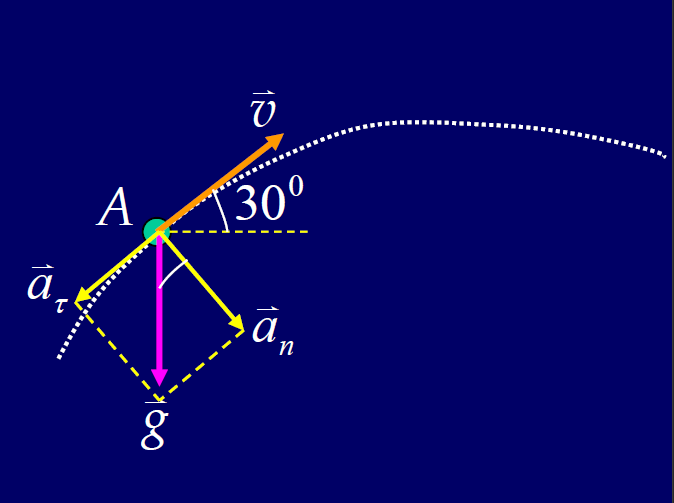

**解**: 以地面为惯性参考系，对两物体分别应用牛顿第二定律：

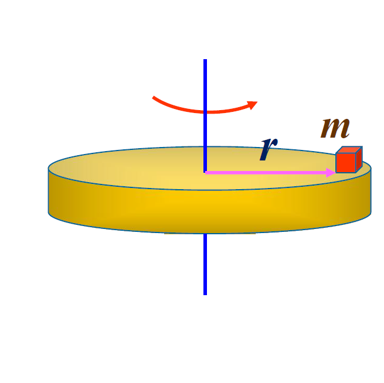

- 对 $m_1$: $m_1g - F_T = m_1a$
- 对 $m_2$: $F_T - m_2g = m_2a$
- 联立解得: $a = \frac{m_1 - m_2}{m_1 + m_2}g$, $F_T = \frac{2m_1m_2}{m_1 + m_2}g$

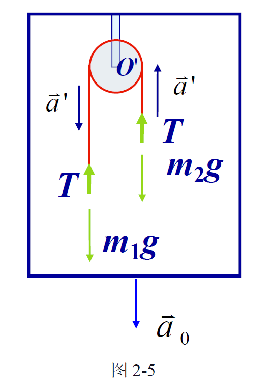

#### 2.3.2.2. 例题：单摆运动
**问题**: 长为 $l$ 的轻绳一端系有质量为 $m$ 的小球，另一端固定。$t=0$ 时小球在最低点具有水平速度 $\vec{v}_0$。求小球在任意位置（与竖直方向夹角为 $\theta$）时的速率 $v$ 及绳的张力 $F_T$。

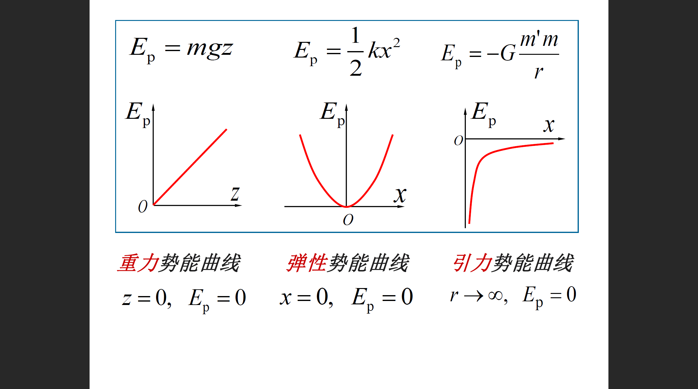

**解**: 建立自然坐标系，进行受力分析：

- 法向: $F_T - mg \cos\theta = ma_n = m\frac{v^2}{l}$
- 切向: $-mg \sin\theta = ma_t = m\frac{dv}{dt}$
- 求解速率 $v$: 利用 $a_t = \frac{v}{l}\frac{dv}{d\theta}$，积分 $\int_{v_0}^{v} vdv = -gl \int_{0}^{\theta} \sin\theta d\theta$，解得 $v^2 = v_0^2 + 2gl(\cos\theta - 1)$。~~也许高中方法更好懂~~
- 求解张力 $F_T$: 将 $v^2$ 代入法向方程，解得 $F_T = m(\frac{v_0^2}{l} - 2g + 3g\cos\theta)$。

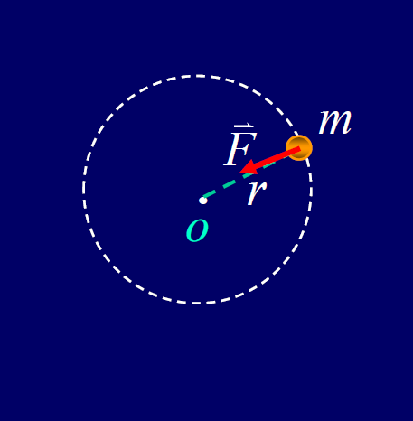

#### 2.3.2.3. 例题：求解运动微分方程
**问题1 (阻力与速度成正比)**: 质量为 $m$ 的子弹以速度 $v_0$ 水平射入沙土，所受阻力大小为 $kv$。求最大深度。

**解**: 列方程 $-kv = m\frac{dv}{dt} = mv\frac{dv}{dx}$，得 $dx = -\frac{m}{k}dv$。积分 $\int_0^{x_{max}} dx = -\int_{v_0}^0 \frac{m}{k}dv$，解得 $x_{max} = \frac{m}{k}v_0$。

**问题2 (阻力与速度平方成正比)**: 质量为 $m$ 的小球以初速 $v_0$ 竖直上抛，受重力和阻力 $amv^2$。求最大高度 $H$。

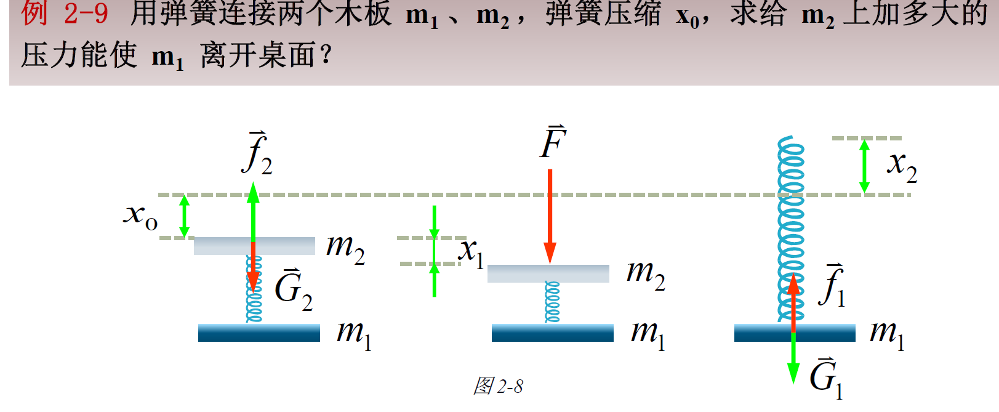

**解**: 列方程 $-mg - amv^2 = m v\frac{dv}{dy}$。分离变量并积分 $\int_{v_0}^{0} \frac{v dv}{g+\alpha v^2} = \int_{0}^{H} -dy$。解得 $H = \frac{1}{2\alpha}\ln(\frac{g+\alpha v_0^2}{g})$。

## 2.4. 非惯性系与惯性力

### 2.4.1. 惯性系与非惯性系的定义与性质
- **惯性系**: 适用牛顿运动定律的参考系。
- **非惯性系**: 不适用牛顿运动定律的参考系。
- **性质**: 相对于一个惯性系作匀速直线运动的参考系也是惯性系。反之，相对于一个惯性系作加速运动的参考系一定是非惯性系。
- **示例**: 在一加速前进的车厢（非惯性系）中，观察者看到一个不受外力的光滑小球会自行向后加速运动，这违背了牛顿定律。

### 2.4.2. 惯性力
- **引入目的**: 为了使牛顿第二定律的形式在非惯性系中也能成立，而引入的一个虚构的力。
- **定义**: $\vec{F_i} = -m\vec{a_0}$，其中 $m$ 是物体质量，$\vec{a_0}$ 是非惯性系相对于惯性系的加速度。惯性力的方向与非惯性系的加速度方向相反。
- **在非惯性系中的牛顿第二定律**: $\vec{F}_{真实} + \vec{F_i} = m\vec{a'}$
    - $\vec{F}_{真实}$ 是物体所受的真实合外力。
    - $\vec{a'}$ 是物体相对于该非惯性系测得的加速度。
- **注意**: 惯性力没有施力物体，也没有反作用力，其实质是物体惯性在非惯性系中的表现。

### 2.4.3. 应用：平动加速参考系
- **问题**: 阿特伍德机置于以加速度 $a_0 = g/2$ 向下加速运动的电梯中，求两物体相对电梯的加速度 $a'$ 和绳中张力 $T$。

    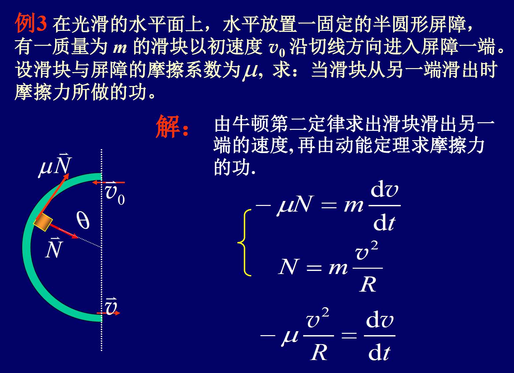

- **解**: 取电梯为非惯性参考系，对两物体分别引入惯性力 $\vec{F_i} = -m(-\vec{a_0}) = m\vec{a_0}$（方向向上）。
    - 对 $m_1$: $m_1g - T - m_1a_0 = m_1a'$ (以向下为正)
    - 对 $m_2$: $m_2g - T - m_2a_0 = -m_2a'$
    
- **联立解得**:
    - $a' = \frac{m_1-m_2}{m_1+m_2}(g-a_0)$
    - $T = \frac{2m_1m_2}{m_1+m_2}(g-a_0)$
    
- **相对于地面的加速度**: $a_1 = a' + a_0$ (向下)，$a_2 = -a' + a_0$ (向上)。

### 2.4.4. 应用：转动参考系 (惯性离心力)
- **概念**: 在一个以角速度 $\omega$ 转动的参考系中，物体会受到一个沿径向向外的惯性力，称为**惯性离心力**。

- **公式**: $\vec{F}_{离心} = -m\vec{a}_n = -m(-\omega^2 r \hat{r}) = m\omega^2 r \hat{r}$ (其中 $\vec{a}_n$ 是向心加速度，$\hat{r}$ 是径向向外的单位矢量)。

- **示例**: 一个木块静止在匀速转动的水平转盘上。

    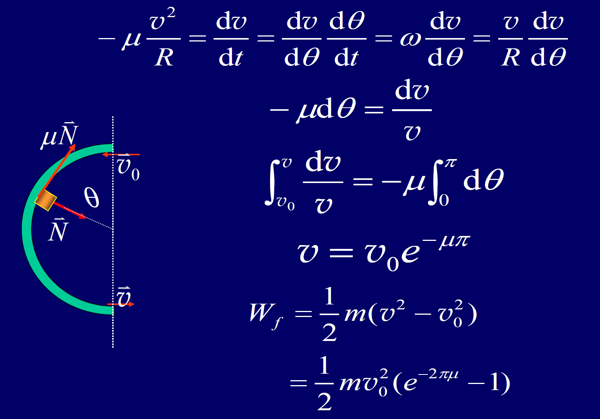

    - **在地面参考系 (惯性系) 中**: 木块做匀速圆周运动，由静摩擦力提供向心力。$f_{静} = m\omega^2 r$ (方向指向圆心)。
    - **在转盘参考系 (非惯性系) 中**: 木块静止($\vec{a'}=0$)，它受到指向圆心的真实静摩擦力 $\vec{f}_{静}$ 和沿径向向外的惯性离心力 $\vec{F}_{离心}$。根据非惯性系中的牛顿定律，$\vec{f}_{静} + \vec{F}_{离心} = 0$，二力平衡。

## 2.5. 功、功率与动能 (力的空间积累效应)

### 2.5.1. 功 (Work)

#### 2.5.1.1. 定义与计算
- **定义**: 功是力对空间积累的效应，是能量转换的量度。单位为焦耳(J)。
- **恒力的功**: 当力 $\vec{F}$ 为恒力，物体位移为 $\Delta\vec{r}$ 时，功为 $W = \vec{F} \cdot \Delta\vec{r} = F |\Delta\vec{r}| \cos\alpha$。
    - $W>0$ (力做正功), $W<0$ (力做负功), $W=0$ (力不做功)。
- **变力的功**: 当力 $\vec{F}$ 是变化的，需将路径分割成无限多个微元位移 $d\vec{r}$，力在每个微元位移上做的元功为 $dW = \vec{F} \cdot d\vec{r}$。总功为元功的路径积分：
    - $W = \int_a^b dW = \int_a^b \vec{F} \cdot d\vec{r}$
- **直角坐标系中的计算**:
    - $\vec{F} = F_x\vec{i} + F_y\vec{j} + F_z\vec{k}$, $d\vec{r} = dx\vec{i} + dy\vec{j} + dz\vec{k}$
    - $W = \int_L (F_x dx + F_y dy + F_z dz)$
- **几何意义**: 功在数值上等于力-位移图线下的面积。

#### 2.5.1.2. 功的性质与叠加
- **性质**: 功是标量，但有正负。它是一个过程量，其值通常与质点运动的具体路径有关。
- **合力的功**: 物体受多个力作用时，合外力所做的功等于各个分力所做功的代数和。
    - $W_{合} = \int_L (\vec{F}_1 + \vec{F}_2 + \cdots) \cdot d\vec{r} = W_1 + W_2 + \cdots$
- **一对相互作用力的功**: 作用力 $\vec{F}_1$ 和反作用力 $\vec{F}_2$ 所做的总功为 $dW = \vec{F}_1 \cdot d\vec{r}_1 + \vec{F}_2 \cdot d\vec{r}_2 = \vec{F}_1 \cdot d(\vec{r}_1 - \vec{r}_2) = \vec{F}_1 \cdot d\vec{r}_{12}$。

#### 2.5.1.3. 特殊力的功计算
- **重力的功**: 质点从高度 $y_1$ 移动到 $y_2$，重力做的功为 $W_G = -mg\int_{y_1}^{y_2} dy = mgy_1 - mgy_2$。重力做功只与始末位置的高度差有关，与路径无关。
- **弹力的功**: 弹簧从伸长量 $x_1$ 变到 $x_2$，弹力做的功为 $W_e = \int_{x_1}^{x_2} (-kx)dx = \frac{1}{2}kx_1^2 - \frac{1}{2}kx_2^2$。弹力做功也只与始末位置有关，与路径无关。

### 2.5.2. 功率 (Power)
- **定义**: 表征做功快慢程度的物理量，单位为瓦特(W)。
- **平均功率**: $\bar{P} = \frac{\Delta W}{\Delta t}$
- **瞬时功率**: $P = \lim_{\Delta t \to 0}\frac{\Delta W}{\Delta t} = \frac{dW}{dt} = \frac{\vec{F} \cdot d\vec{r}}{dt} = \vec{F} \cdot \vec{v}$

### 2.5.3. 动能定理 (Work-Kinetic Energy Theorem)

#### 2.5.3.1. 定理内容与推导
- **质点动能**: $E_k = \frac{1}{2}mv^2$
- **定理推导**:
    - 合外力做的功 $W = \int_a^b \vec{F} \cdot d\vec{r}$
    - 根据牛顿第二定律 $\vec{F} = m\frac{d\vec{v}}{dt}$
    - $W = \int_a^b m\frac{d\vec{v}}{dt} \cdot d\vec{r} = \int_a^b m d\vec{v} \cdot \frac{d\vec{r}}{dt} = \int_{v_a}^{v_b} m \vec{v} \cdot d\vec{v} = \int_{v_a}^{v_b} mvdv = \frac{1}{2}mv_b^2 - \frac{1}{2}mv_a^2$
- **定理内容**: 合外力对质点所做的功，等于质点动能的增量。
    - $W_{合} = E_{kb} - E_{ka} = \Delta E_k$

#### 2.5.3.2. 定理要点
- 功是过程量，动能是状态量。动能定理建立了过程量与状态量变化之间的联系。
- 动能定理由牛顿第二定律导出，因此只适用于惯性参考系。动能的值也与参考系的选择有关。

### 2.5.4. 综合应用实例

#### 2.5.4.1. 变力做功计算
- **问题1**: 一力 $F=F_0(x\vec{i}+y\vec{j})$ 作用于质点，求质点由原点运动至P(0, 2R)过程中力 $\vec{F}$ 做的功。

    

    - **解**: $W = \int \vec{F} \cdot d\vec{r} = \int (F_0xdx + F_0ydy) = \int_0^0 F_0xdx + \int_0^{2R} F_0ydy = 2F_0R^2$

- **问题2**: 用水平力 $F$ 无限缓慢地把质量为 $m$、摆长为 $l$ 的单摆从平衡位置拉到与竖直方向成 $\theta_0$ 角的位置，求力 $F$ 做的功。
  
    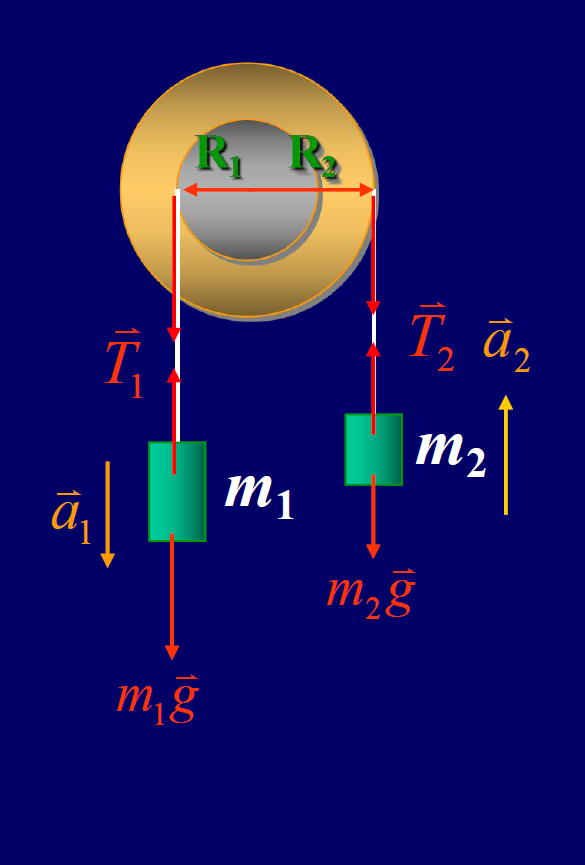
    
    - **解**: 因过程缓慢，任意时刻三力平衡，可得 $F=mg\tan\theta$。元功 $dW = F ds \cos\theta = (mg\tan\theta)(ld\theta)\cos\theta = mgl\sin\theta d\theta$。总功 $W = \int_0^{\theta_0} mgl\sin\theta d\theta = mgl(1-\cos\theta_0)$。~~又是一道用高中方法会不会更舒服的题目~~

#### 2.5.4.2. 动能定理应用
- **问题**: 一条长度为L、总质量为m的柔软链条，初始时有长度为 $a$ 的一端下垂，静止在光滑桌面上。求链条刚离开桌边时的速率。(原题有摩擦，此处按光滑桌面简化以匹配动能定理的直接应用，原题的解法更复杂)。(原题解法如下)

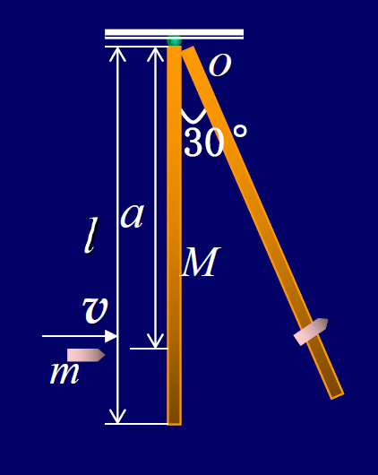

- **原题解法 (有摩擦)**:
    - **受力分析**: 设下垂长度为 $y$ 时，重力 $G = \frac{m}{L}yg$，摩擦力 $f=\mu\frac{m}{L}(L-y)g$。
    - **计算功**（对元功积分）:
        - 重力做功: $W_G = \int_a^L \frac{m}{L}ygdy = \frac{mg}{2L}(L^2-a^2)$
        - 摩擦力做功: $W_f = \int_a^L -\mu\frac{m}{L}(L-y)gdy = -\frac{\mu m g}{2L}(L-a)^2$
    - **应用动能定理**: $W_G + W_f = \frac{1}{2}mv^2 - 0$
    - **求解速率**: $v=\sqrt{\frac{g}{L}[(L^2-a^2) - \mu(L-a)^2]}$

## 2.6. 保守力、势能与机械能守恒

### 2.6.1. 保守力 (Conservative Force)

#### 2.6.1.1. 定义
如果一个力所做的功只与质点的始末位置有关，而与所经过的路径无关，这类力就称为**保守力**。

#### 2.6.1.2. 常见保守力做功的特点
1.  **重力的功**
    -   **计算**: 质点从高度 $y_1$ 移动到 $y_2$，重力做的功为 $W_{重} = -mg\int_{y_1}^{y_2} dy = mgy_1 - mgy_2$。
    -   **特点**:
        -   功值只与始末位置的高度差有关，与路径无关。
        -   质点下降时，重力做正功；质点上升时，重力做负功。

2.  **弹性力的功**
    -   **计算**: 弹簧从形变量 $x_1$ 变到 $x_2$，弹性力做的功为 $W_{弹} = \int_{x_1}^{x_2} (-kx)dx = \frac{1}{2}kx_1^2 - \frac{1}{2}kx_2^2$。
    -   **特点**:
        -   功值只与弹簧的始末形变量有关，与路径无关。
        -   弹簧的形变减小时（恢复原状），弹性力做正功；形变增大时，弹性力做负功。

3.  **万有引力的功**
    -   **计算**: 质点 $m$ 在中心天体 $M$ 的引力作用下从距离 $r_a$ 移动到 $r_b$，万有引力做的功为 $W_{引} = \int_{r_a}^{r_b} (-G_0\frac{Mm}{r^2})dr = G_0\frac{Mm}{r_b} - G_0\frac{Mm}{r_a}$。
    -   **特点**:
        -   功值只与始末位置的距离有关，与路径无关。
        -   两质点相互靠近时，万有引力做正功；相互远离时，万有引力做负功。

### 2.6.2. 势能 (Potential Energy)

#### 2.6.2.1. 定义与关系
- **定义**: 由相互作用物体的相对位置所决定的、与保守力相联系的能量，称为势能 ($E_p$)。
- **保守力的功与势能的关系**: 保守力所做的功，在数值上等于系统势能增量的负值。
    - $W_{保} = -(E_{pb} - E_{pa}) = -\Delta E_p$
    - 微分形式: $dW_{保} = -dE_p$

#### 2.6.2.2. 势能的性质
1.  **系统性**: 势能属于相互作用的物体组成的系统，而非单个物体所独有。
2.  **状态量**: 势能是描述系统状态的物理量，其值由系统内物体的相对位置决定。
3.  **相对性**: 势能的数值是相对的，其大小与势能零点的选择有关。

#### 2.6.2.3. 势能的计算
- **计算公式**: 质点在保守力场中某一点 a 的势能，数值上等于质点从该点沿任意路径移动到势能零点 b 时，保守力所做的功。
    - $E_{Pa} = \int_a^b \vec{F}_{保} \cdot d\vec{r}$
- **常见势能**:
    - **重力势能**: 取地面($h=0$)为零势能点，则在高度 $h$ 处的重力势能为 $E_p = mgh$。
    - **弹性势能**: 取弹簧处于原长($x=0$)时为零势能点，则在形变量为 $x$ 时的弹性势能为 $E_p = \frac{1}{2}kx^2$。
    - **万有引力势能**: 取无限远处($r \to \infty$)为零势能点，则在距离为 $r$ 处的引力势能为 $E_p = -G_0\frac{Mm}{r}$。
    
    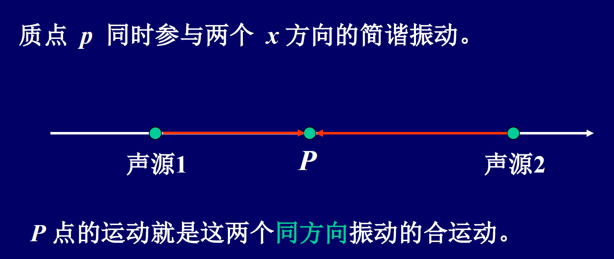

### 2.6.3. 机械能守恒定律

#### 2.6.3.1. 质点系动能定理
- **内力与外力**: 内力是系统内质点间的相互作用力；外力是系统外部物体对系统内质点的作用力。
- **定理内容**: 所有外力对质点系做的功和所有内力对质点系做的功之和，等于质点系总动能的增量。
    - $W_{外} + W_{内} = E_k - E_{k0} = \Delta E_k$
- **结论**: 内力做功可以改变系统的总动能。

#### 2.6.3.2. 功能原理
- **推导**: 将内力所做的功分为保守内力功($W_{保内}$)和非保守内力功($W_{非保内}$)。
    - $W_{外} + W_{保内} + W_{非保内} = \Delta E_k$
    - 将 $W_{保内} = -\Delta E_p$ 代入，得到 $W_{外} + W_{非保内} = \Delta E_k + \Delta E_p$。
- **机械能**: 定义系统的总机械能为动能与势能之和，$E = E_k + E_p$。
- **原理内容**: 外力做的功与非保守内力做的功之和，等于系统总机械能的增量。
    - $W_{外} + W_{非保内} = E - E_0 = \Delta E$

#### 2.6.3.3. 机械能守恒定律
- **守恒条件**: 当一个系统所受的外力不做功 ($W_{外}=0$)，且系统内没有非保守内力做功 ($W_{非保内}=0$) 时，系统的机械能守恒。
- **定律内容**: 在满足守恒条件的系统中，系统的总机械能保持不变。
    - $E = E_k + E_p = \text{常量}$
    - $E_{k1} + E_{p1} = E_{k2} + E_{p2}$

### 2.6.4. 综合应用实例

#### 2.6.4.1. 实例：平方反比引力下的机械能
**问题**: 质量为 $m$ 的质点在指向圆心的平方反比力 $F=-k/r^2$ 作用下，作半径为 $r$ 的圆周运动。求质点的速度 $v$ 和机械能 $E$ (取无限远处为势能零点)。

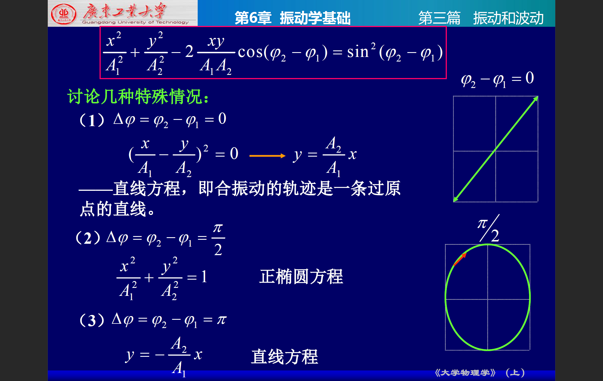

**解**:

1.  **求速度**: 向心力由引力提供，$\frac{k}{r^2} = m\frac{v^2}{r} \Rightarrow v = \sqrt{\frac{k}{mr}}$。
2.  **求机械能**:
    - 动能: $E_k = \frac{1}{2}mv^2 = \frac{k}{2r}$。
    - 势能: $E_p = \int_r^\infty F dr = \int_r^\infty (-\frac{k}{r^2})dr = -\frac{k}{r}$。
    - 总机械能: $E = E_k + E_p = \frac{k}{2r} - \frac{k}{r} = -\frac{k}{2r}$。

#### 2.6.4.2. 实例：应用功能原理解题
**问题**: 轻弹簧一端固定，另一端与质量为m的物体相连置于水平桌面上(摩擦系数为μ)。用水平恒力F将物体自平衡位置向右拉。求物体到达最远点时系统的弹性势能。

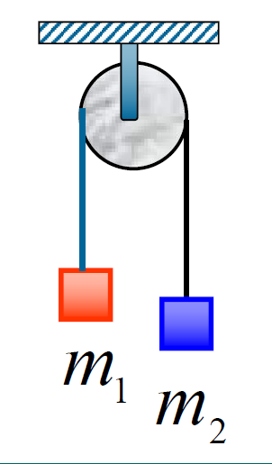

**解**:

- **系统与过程**: 系统为物体和弹簧，过程为从平衡位置(x=0)到最远点(x)。
- **能量分析**:
    - 初态机械能 $E_1 = 0$ (动能和势能均为零)。
    - 末态机械能 $E_2 = \frac{1}{2}kx^2$ (动能为零)。
    - 外力和非保守力做功: 外力F做功 $W_F = Fx$，摩擦力做功 $W_f = -\mu mgx$。
- **应用功能原理**: $W_F + W_f = E_2 - E_1$
    - $Fx - \mu mgx = \frac{1}{2}kx^2$
- **求解**:
    - 在最远点，物体速度为零，但此前物体经历了加速和减速，不能简单地用 $F=kx+\mu mg$ 来求最远点。而功能原理直接关联始末状态，更为简便。
    - （课件中的解法有误，它直接用功能原理求解，但x是未知的。实际上，物体到达最远点时速度为零，而不是合力为零。课件解法先假设求出了x，然后再用功能原理解释势能，逻辑上是倒置的。正确的做法是通过功能原理建立x与F的关系，然后求势能。）
    - 从功能原理 $Fx - \mu mgx = \frac{1}{2}kx^2$ 可知，末态势能 $E_p = \frac{1}{2}kx^2 = Fx - \mu mgx$。要求出具体值，还需知道最远点的位移x。

#### 2.6.4.3. 实例：应用机械能守恒求解飞行时间
**问题**: 一个物体从地球表面以第二宇宙速度 $v_0 = \sqrt{\frac{2GM_e}{R_e}}$ 竖直发射，忽略阻力，求物体飞行到与地心相距 $nR_e$ 处经历的时间。
**解**:
1.  **求速度与位置关系**: 系统只有保守内力（万有引力）做功，机械能守恒。
    - $\frac{1}{2}mv_0^2 - \frac{GM_e m}{R_e} = \frac{1}{2}mv^2 - \frac{GM_e m}{x}$
    - 代入 $v_0$ 可知，初态机械能为0，所以任意位置x处的速度 $v = \sqrt{\frac{2GM_e}{x}}$。
2.  **求时间**:
    - 利用 $v = \frac{dx}{dt}$，得 $dt = \frac{dx}{v} = \frac{\sqrt{x}dx}{\sqrt{2GM_e}}$。
    - 积分: $\int_0^{t_1} dt = \int_{R_e}^{nR_e} \frac{x^{1/2}}{\sqrt{2GM_e}}dx$。
    - 结果: $t_1 = \frac{1}{\sqrt{2GM_e}}[\frac{2}{3}x^{3/2}]_{R_e}^{nR_e} = \frac{2R_e^{3/2}}{3\sqrt{2GM_e}}(n^{3/2}-1)$。

#### 2.6.4.4. 实例：弹簧系统的机械能守恒
**问题**: 如图，用弹簧连接两木块 $m_1, m_2$。先用压力F压缩弹簧，使系统静止，此时 $m_2$ 处在平衡位置上方。求要使撤去F后 $m_1$ 恰好能离开桌面，所加压力 F 至少为多大？

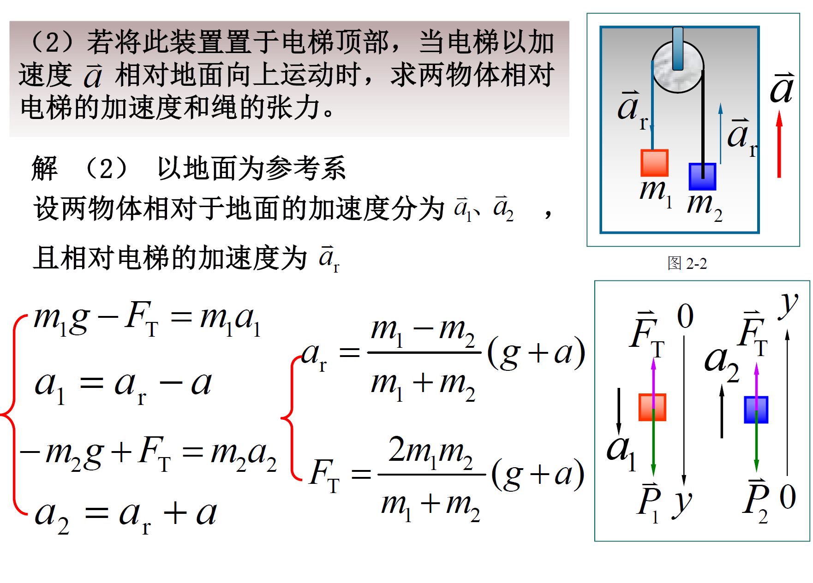

**解**:

- **临界条件**: $m_1$ 恰好离开桌面时，弹簧对 $m_1$ 的拉力等于 $m_1$ 的重力，即 $kx_2 = m_1g$，此时 $m_2$ 运动到最高点，速度为零。
- **过程分析**: 从撤去压力 F 的瞬间（初态）到 $m_2$ 到达最高点（末态），系统（$m_1, m_2$, 弹簧，地球）机械能守恒。
- **能量状态**:
    - **初态**: 弹簧总压缩量为 $x_0+x_1$ (其中 $x_0=\frac{m_2g}{k}$, $x_1=\frac{F}{k}$)。动能为0，弹性势能为 $\frac{1}{2}k(x_0+x_1)^2$。
    - **末态**: $m_2$ 在最高点，动能为0。弹簧伸长量为 $x_2=\frac{m_1g}{k}$。弹性势能为 $\frac{1}{2}kx_2^2$。$m_2$ 的重力势能增加 $m_2g(x_0+x_1+x_2)$。
- **应用机械能守恒**:
    - $\frac{1}{2}k(x_0+x_1)^2 = \frac{1}{2}kx_2^2 + m_2g(x_0+x_1+x_2)$
    - (课件中的解法有误，等式右边应该是 $m_2$ 的重力势能增量加上弹簧的弹性势能)。
    - **正确列式**: 初始总能量 = 末态总能量。选初始位置为重力势能零点。
    - $E_{初} = E_{k,初} + E_{p,弹,初} + E_{p,重,初} = 0 + \frac{1}{2}k(\frac{m_2g+F}{k})^2 + 0$
    - $E_{末} = E_{k,末} + E_{p,弹,末} + E_{p,重,末} = 0 + \frac{1}{2}k(\frac{m_1g}{k})^2 + m_2g(\frac{m_2g+F}{k} + \frac{m_1g}{k})$
    - 令 $E_{初} = E_{末}$，解出 $F$。
    - (课件给出的答案 $F=(m_1+m_2)g$ 是一个常见的结论，但其推导过程省略且公式有误)。

