# 4. 气体动理论

## 4.1. 理想气体模型与统计假设

### 4.1.1. 理想气体分子模型

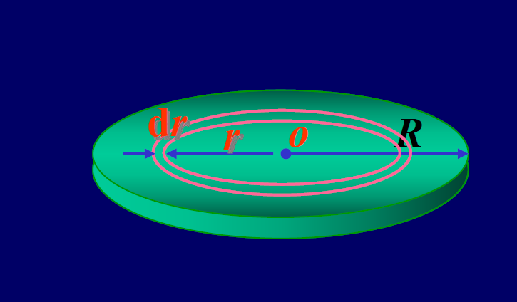

理想气体的微观模型基于以下三点假设：
1.  **分子是质点**: 分子的线度与其平均间距相比小到可以忽略。
2.  **无相互作用力**: 除碰撞瞬间外，分子之间以及分子与容器壁之间的相互作用力可忽略不计。分子可视为自由运动。
3.  **完全弹性碰撞**: 分子与分子之间、分子与容器壁之间的碰撞均为完全弹性碰撞。
总结：理想气体分子可看作是大量自由运动的、永不停息的、完全弹性的质点群。

### 4.1.2. 平衡态的统计假设
对于处于平衡态的大量理想气体分子，其集体行为遵循以下统计规律：
1.  **空间分布均匀**: 在容器中任意位置，单位体积内的分子数（分子数密度）处处相等。
2.  **运动方向机会均等**:
    -   任一时刻，分子向各个方向运动的概率是相同的。
    -   因此，大量分子速度在各个方向分量的平均值相等且为零（因为有正有负）。
    -   分子速度在各个方向分量的**平方的平均值**相等：$\bar{v_x^2} = \bar{v_y^2} = \bar{v_z^2}$。

## 4.2. 理想气体压强公式

### 4.2.1. 公式推导
气体对器壁的压强是大量分子不断碰撞器壁的宏观表现。
- **单个分子对器壁的冲量**: 一个质量为 $m_0$、x方向速度为 $v_{ix}$ 的分子，与垂直于x轴的器壁A（面积为 $l_2l_3$）发生一次弹性碰撞，动量变化为 $2m_0v_{ix}$。该分子施予器壁的冲量也为 $2m_0v_{ix}$。
- **单个分子的碰撞频率**: 该分子两次碰撞同一器壁A所经过的时间为 $\Delta t_i = 2l_1/v_{ix}$，因此在 $\Delta t$ 时间内与A面碰撞的次数为 $\frac{\Delta t}{\Delta t_i} = \frac{v_{ix}}{2l_1}\Delta t$。
- **单个分子在Δt内的总冲量**: $I_i = (2m_0v_{ix}) \cdot (\frac{v_{ix}}{2l_1}\Delta t) = \frac{m_0v_{ix}^2}{l_1}\Delta t$。
- **所有分子对器壁的总冲量与平均冲力**:
    - 总冲量: $I = \sum I_i = \sum \frac{m_0v_{ix}^2}{l_1}\Delta t = \frac{m_0}{l_1}(\sum v_{ix}^2)\Delta t$。
    - 平均冲力: $\bar{F} = \frac{I}{\Delta t} = \frac{m_0}{l_1}\sum v_{ix}^2$。
- **压强**:
    - $p = \frac{\bar{F}}{l_2l_3} = \frac{m_0}{l_1l_2l_3}\sum v_{ix}^2 = \frac{m_0}{V}(v_{1x}^2 + v_{2x}^2 + \cdots + v_{Nx}^2)$
    - 引入分子数N，整理得: $p = \frac{Nm_0}{V} \left( \frac{\sum v_{ix}^2}{N} \right) = nm_0\bar{v_x^2}$ (其中 $n=N/V$ 是分子数密度)。
- **利用统计假设**:
    - 由于分子速度平方在各方向分量的平均值相等，即 $\bar{v_x^2} = \bar{v_y^2} = \bar{v_z^2}$。
    - 且 $\bar{v^2} = \bar{v_x^2} + \bar{v_y^2} + \bar{v_z^2}$，所以 $\bar{v_x^2} = \frac{1}{3}\bar{v^2}$。
    - 将此关系代入压强表达式，得到最终公式。

### 4.2.2. 压强公式及其物理意义
- **基本形式**: $p = \frac{1}{3}nm_0\bar{v^2}$
    - 其中，$n$是分子数密度，$m_0$是单个分子质量，$\bar{v^2}$是分子速率平方的平均值。
    - 也可写为 $p = \frac{1}{3}\rho\bar{v^2}$，其中 $\rho = nm_0$ 是气体的质量密度。
- **与分子平均平动动能的关系**:
    - $p = \frac{2}{3}n(\frac{1}{2}m_0\bar{v^2}) = \frac{2}{3}n\bar{\epsilon_k}$
    - 其中 $\bar{\epsilon_k} = \frac{1}{2}m_0\bar{v^2}$ 是分子的平均平动动能。
- **物理意义**:
    - 该公式建立了宏观量（压强 $p$）与微观量统计平均值（分子平均平动动能 $\bar{\epsilon_k}$）之间的联系。
    - 气体压强是大量分子运动的统计平均结果，它正比于分子数密度 $n$ 和分子的平均平动动能 $\bar{\epsilon_k}$。

## 4.3. 理想气体温度公式与微观本质

### 4.3.1. 温度公式
通过联立理想气体状态方程的微观形式 $p=nkT$ 和气体动理论的压强公式 $p=\frac{2}{3}n\bar{\epsilon_k}$，可得：
- **分子平均平动动能**: $\bar{\epsilon_k} = \frac{3}{2}kT$
- **方均根速率**: $\sqrt{\bar{v^2}} = \sqrt{\frac{3kT}{m_0}} = \sqrt{\frac{3RT}{M}}$
    - $k = R/N_A \approx 1.38 \times 10^{-23} \text{ J/K}$ 是玻尔兹曼常数。（卡西欧计算器自带）
    - $R$ 来自公式 $pV=nRT$
    - $m_0$ 是单个分子质量，M是摩尔质量。

### 4.3.2. 温度的微观本质
- **温度是分子平均平动动能的量度**: 宏观温度T的本质是微观层面大量分子无规则热运动剧烈程度的标志。
- **温度是统计概念**: 温度是大量分子热运动的集体表现，对单个或少数分子谈论温度是没有意义的。
- **绝对零度的意义**: 从微观上看，绝对零度意味着所有分子的热运动（平动）都停止了。根据热力学第三定律，绝对零度不可达到。

### 4.3.3. 应用实例
- **例题1**: 两瓶不同种类的气体，其分子平均平动动能相等，但分子数密度不同。问：它们的温度是否相同？压强是否相同？
    - **解**:
        - 因为 $\bar{\epsilon_k} = \frac{3}{2}kT$，且已知 $\bar{\epsilon_{k1}} = \bar{\epsilon_{k2}}$，所以它们的温度相同，即 $T_1 = T_2$。
        - 因为 $p = nkT$，已知 $n_1 \neq n_2$ 且 $T_1 = T_2$，所以它们的压强不相同，即 $p_1 \neq p_2$。

- **例题2**: 试求氮气($N_2$, M=28 g/mol)分子的平均平动能和方均根速率。设 (1) 在温度 $t=1000$ ℃ 时; (2) $t=0$ ℃ 时; (3) $t=-150$ ℃ 时。
    - **解**:
    - **(1) t = 1000 ℃, T = 1273 K**:
        - $\bar{\epsilon_{k1}} = \frac{3}{2}kT_1 = \frac{3}{2}(1.38 \times 10^{-23})(1273) = 2.63 \times 10^{-20}$ J
        - $\sqrt{\bar{v_1^2}} = \sqrt{\frac{3RT_1}{M}} = \sqrt{\frac{3 \times 8.31 \times 1273}{28 \times 10^{-3}}} \approx 1194 \text{ m/s}$
    - **(2) t = 0 ℃, T = 273 K**:
        - $\bar{\epsilon_{k2}} = \frac{3}{2}kT_2 = \frac{3}{2}(1.38 \times 10^{-23})(273) = 5.65 \times 10^{-21}$ J
        - $\sqrt{\bar{v_2^2}} = \sqrt{\frac{3RT_2}{M}} = \sqrt{\frac{3 \times 8.31 \times 273}{28 \times 10^{-3}}} \approx 493 \text{ m/s}$
    - **(3) t = -150 ℃, T = 123 K**:
        - $\bar{\epsilon_{k3}} = \frac{3}{2}kT_3 = \frac{3}{2}(1.38 \times 10^{-23})(123) = 2.55 \times 10^{-21}$ J
        - $\sqrt{\bar{v_3^2}} = \sqrt{\frac{3RT_3}{M}} = \sqrt{\frac{3 \times 8.31 \times 123}{28 \times 10^{-3}}} \approx 320 \text{ m/s}$

## 4.4. 能量均分定理与理想气体内能

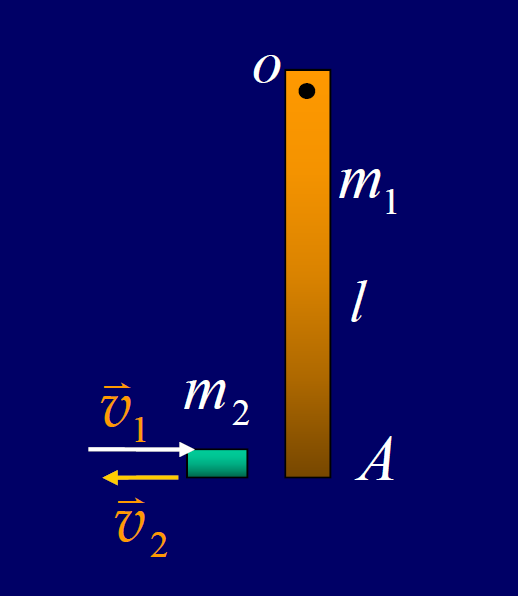

- 记忆：记住常用的总自由度，然后转动自由度=总自由度-平动自由度（3）

### 4.4.1. 自由度 (i)
- **定义**: 确定一个物体在空间的位置所需要的独立坐标的数目。
- **气体分子的自由度**: $i = t + r + s$ (平动+转动+振动)
    - **单原子分子 (如He, Ne)**: $t=3, r=0, s=0 \Rightarrow i=3$
    - **刚性双原子分子 (如O₂, N₂)**: $t=3, r=2, s=0 \Rightarrow i=5$
    - **刚性多原子分子 (如CO₂, H₂O)**: $t=3, r=3, s=0 \Rightarrow i=6$
    (注：振动自由度在高温时才需考虑，此处暂不计)

### 4.4.2. 能量均分定理
- **内容**: 在温度为T的平衡态下，气体分子每一个自由度（平动和转动）上所分配到的平均动能是相等的，其大小都等于 $\frac{1}{2}kT$。
- **分子平均总动能**: 对于有 $i$ 个自由度的分子，其平均总动能为 $\bar{\epsilon} = i \cdot (\frac{1}{2}kT) = \frac{i}{2}kT$。
    - 单原子分子: $\bar{\epsilon} = \frac{3}{2}kT$
    - 刚性双原子分子: $\bar{\epsilon} = \frac{5}{2}kT$
    - 刚性多原子分子: $\bar{\epsilon} = \frac{6}{2}kT = 3kT$
- **注意**: 能量均分定理是统计规律，仅适用于大量分子组成的系统。

### 4.4.3. 理想气体的内能
- **定义**: 理想气体的内能等于其全部分子的动能之和（因忽略分子间作用力，故无势能）。
- **计算公式**: 质量为m、摩尔质量为M的理想气体，其内能为
    - $E = N \cdot \bar{\epsilon} = (\frac{m}{M}N_A) \cdot (\frac{i}{2}kT) = \frac{m}{M} \frac{i}{2}RT$
- **结论**: 理想气体的内能只是温度的单值函数。

### 4.4.4. 应用实例
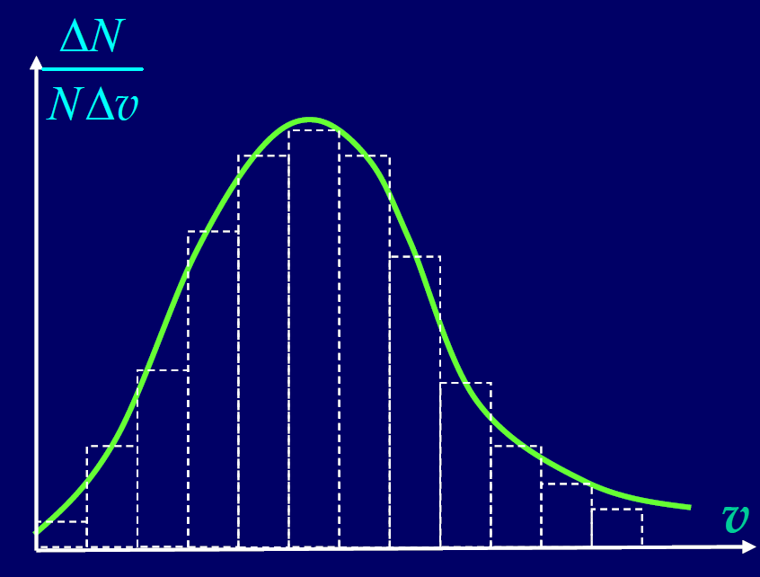
  
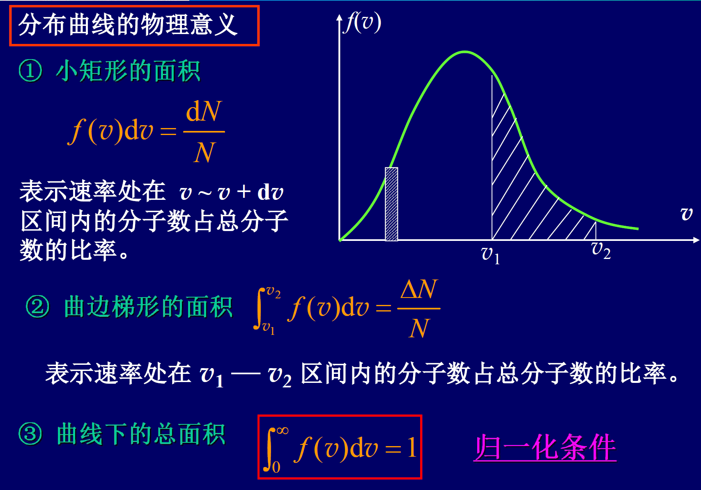
  
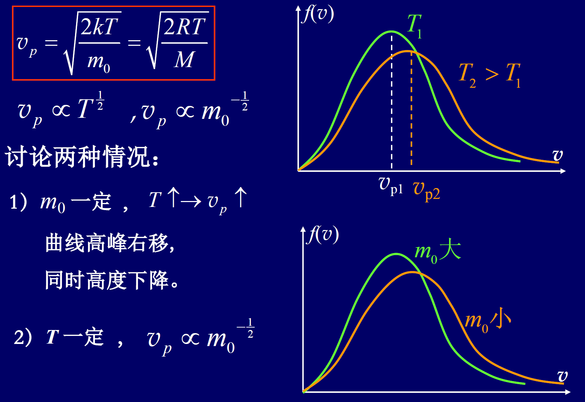
  
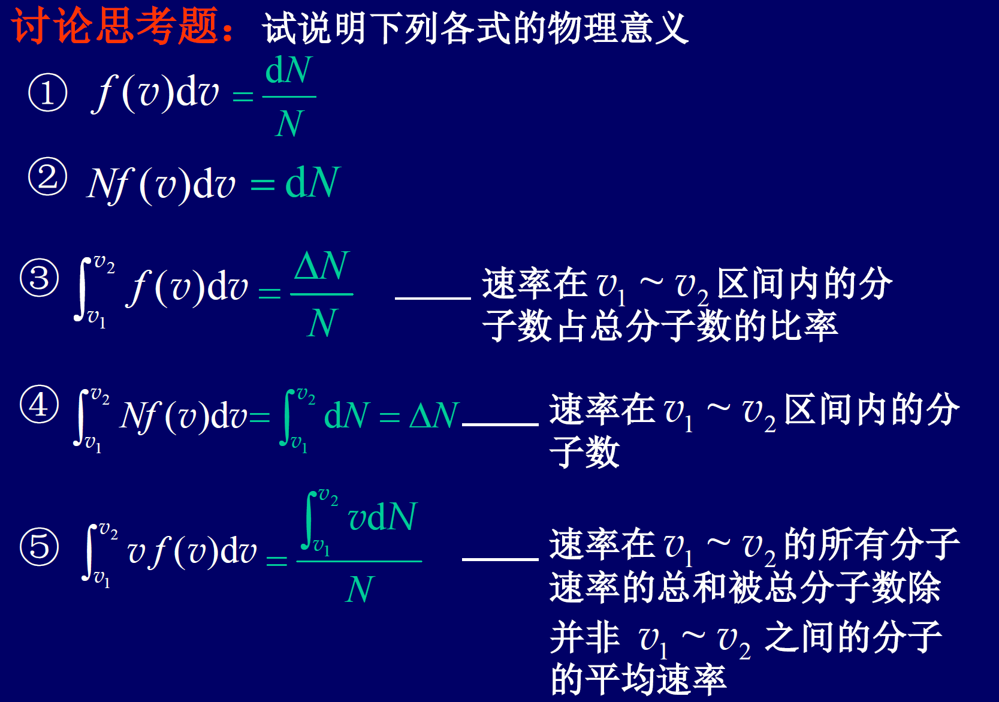
  
- **例题1**: 摩尔数相同的氧气和二氧化碳气体 (视为理想气体), 如果它们的温度相同, 则两气体...
    - **解**: 氧气是双原子分子($i=5, r=2$)，二氧化碳是三原子分子($i=6, r=3$)。
    - A. 内能 $E \propto i$，因自由度i不同，内能不相等。
    - B. 分子的平均（总）动能 $\bar{\epsilon} = \frac{i}{2}kT$，因i不同，不相等。
    - C. **分子的平均平动动能** $\bar{\epsilon_{tk}} = \frac{3}{2}kT$，只与温度T有关，所以**相同**。
    - D. 分子的平均转动动能 $\bar{\epsilon_{rk}} = \frac{r}{2}kT$，因转动自由度r不同，不相等。
    - **正确答案：C**

- **例题2**: 指出下列各式所表示的物理意义。
    - (1) $\frac{1}{2}kT$: 在平衡态下，气体分子每个自由度上对应的平均动能。
    - (2) $\frac{3}{2}kT$: 一个气体分子的平均平动动能。
    - (3) $\frac{i}{2}kT$: 一个具有 $i$ 个自由度的气体分子的平均总动能。
    - (4) $\frac{i}{2}RT$: 1摩尔具有 $i$ 个自由度的理想气体的内能。
    - (5) $\frac{m}{M}\frac{3}{2}RT$: 质量为 $m$ 的理想气体全部分子的平动动能之和。对于单原子气体，这也是其总内能。
    - (6) $\frac{m}{M}\frac{i}{2}RT$: 质量为 $m$ 的、分子自由度为 $i$ 的理想气体的总内能。

## 4.5. 麦克斯韦速率分布律

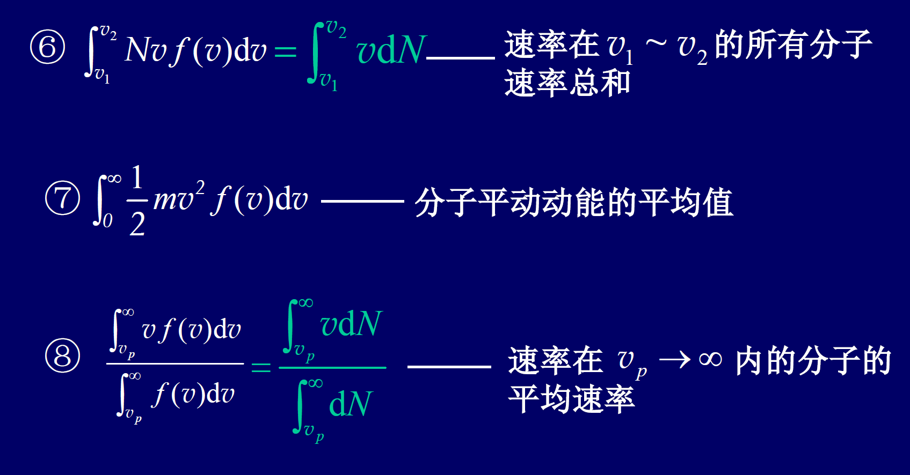

### 4.5.1. 速率分布的概念
- **问题**: 在平衡态下，大量气体分子的速率并非完全相同，而是呈现出一种统计分布规律：“中间多，两头少”。

- **速率分布函数 $f(v)$**:
  
    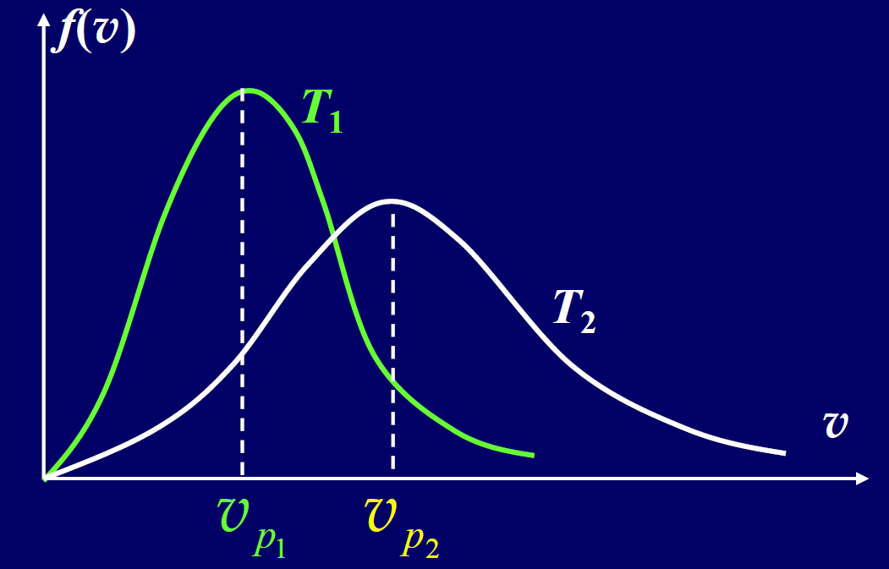
    
    - **定义**: $f(v) = \frac{1}{N}\frac{dN}{dv}$
    - **物理意义**: 表示在速率 $v$ 附近，单位速率区间内的分子数占总分子数的百分比。对单个分子而言，是其速率处于 $v$ 附近单位速率区间的概率。
    
- **关系式**: 速率在 $v \sim v+dv$ 区间内的分子数占总数的百分比为 $f(v)dv = \frac{dN}{N}$。

- **归一化条件**: 曲线下的总面积为1，表示所有分子速率必然在 $0 \sim \infty$ 之间。$\int_0^\infty f(v)dv = 1$。

### 4.5.2. 麦克斯韦速率分布函数
- **表达式**: $f(v) = 4\pi\left(\frac{m_0}{2\pi kT}\right)^{3/2} v^2 e^{-\frac{m_0v^2}{2kT}}$

- **速率分布曲线**: 以 $v$ 为横坐标，$f(v)$ 为纵坐标画出的曲线。
  
    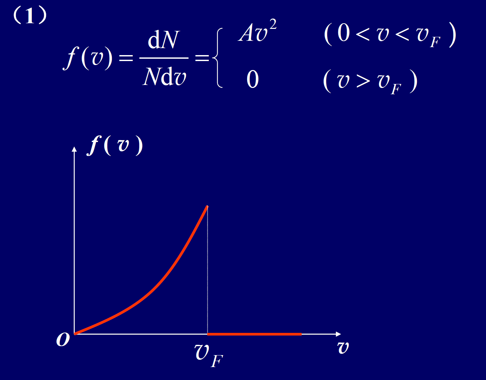
    
    - **曲线下微元面积 $f(v)dv$**: 速率在 $v \sim v+dv$ 区间内的分子数占总分子数的比率。
    - **曲线下区间面积 $\int_{v_1}^{v_2} f(v)dv$**: 速率在 $v_1 \sim v_2$ 区间内的分子数占总分子数的比率。

### 4.5.3. 三种统计速率
1.  **最概然速率 (Most Probable Speed, $v_p$)**:
    - **定义**: 速率分布曲线峰值所对应的速率。
    - **公式**: $v_p = \sqrt{\frac{2kT}{m_0}} = \sqrt{\frac{2RT}{M}}$
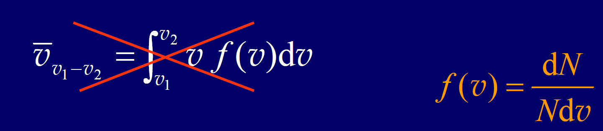
2.  **平均速率 (Average Speed, $\bar{v}$)**:
    - **定义**: 所有分子速率的算术平均值。
    - **公式**: $\bar{v} = \int_0^\infty v f(v)dv = \sqrt{\frac{8kT}{\pi m_0}} = \sqrt{\frac{8RT}{\pi M}}$
3.  **方均根速率 (Root-Mean-Square Speed, $\sqrt{\bar{v^2}}$)**:
    - **定义**: 所有分子速率的平方的平均值的平方根。
    - **公式**: $\sqrt{\bar{v^2}} = \left( \int_0^\infty v^2 f(v)dv \right)^{1/2} = \sqrt{\frac{3kT}{m_0}} = \sqrt{\frac{3RT}{M}}$
- **大小关系**: $v_p < \bar{v} < \sqrt{\bar{v^2}}$
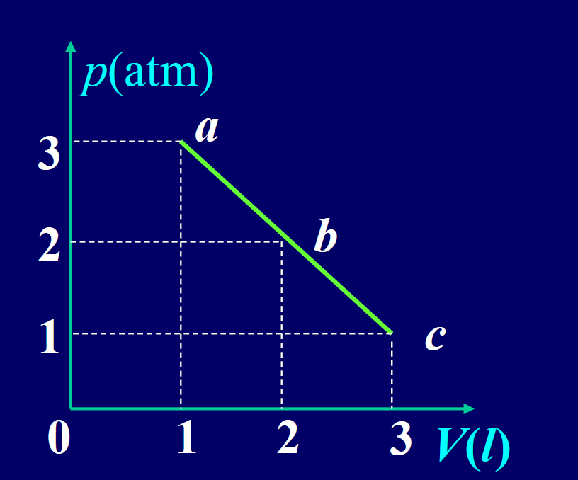

### 4.5.4. 速率分布的应用实例
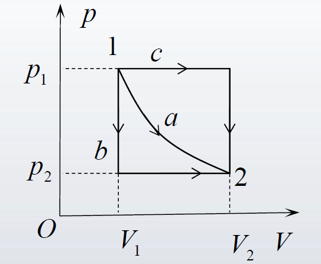
  
- **例1**: 图为同一种气体，处于不同温度下的速率分布曲线，问 (1) 哪一条曲线对应的温度高? (2)如果这两条曲线分别对应的是同一温度下氧气和氢气的分布曲线, 问哪条曲线对应的是氧气, 哪条对应的是氢气?
  
    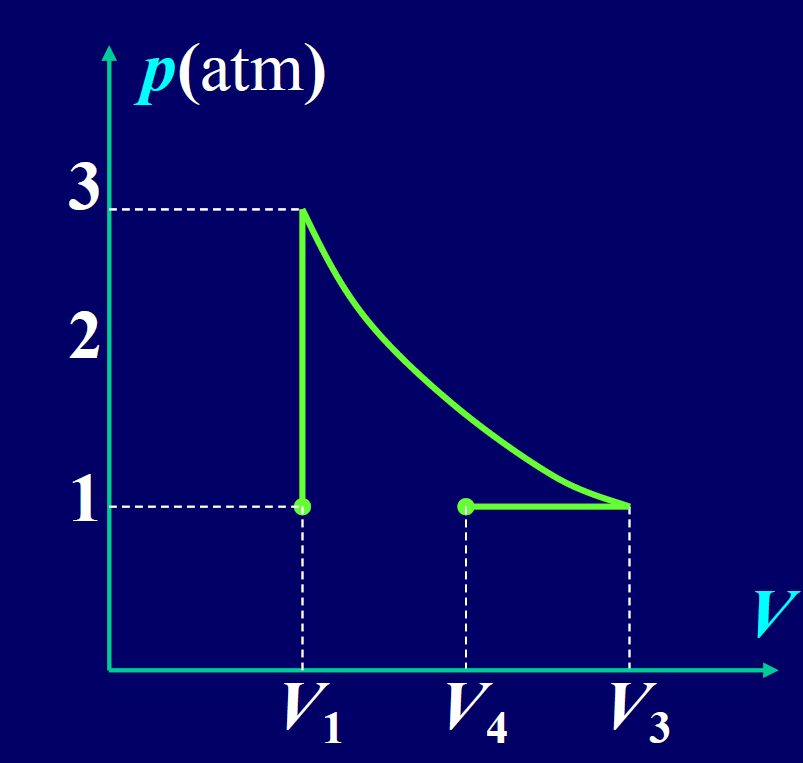
    
    - **解**: 根据 $v_p = \sqrt{\frac{2RT}{M}}$。
        - (1) 曲线峰值越靠右，$v_p$ 越大，温度越高。所以**白色曲线($T_2$)对应的温度高**。
        - (2) 同一温度下，$M$ 越大，$v_p$ 越小。因为氧气(M=32)的摩尔质量大于氢气(M=2)，所以氧气的 $v_p$ 较小。因此，**绿色曲线对应氧气，白色曲线对应氢气**。
    
- **例2**: 设导体中自由电子(“电子气”)的速率分布函数为 $f(v) = \begin{cases} Av^2 & (0 < v < v_F) \\ 0 & (v > v_F) \end{cases}$，其中 $v_F$ 是费米速率。求(1)常数A; (2)$v_p, \bar{v}, \sqrt{\bar{v^2}}$。
  
    - **解**:
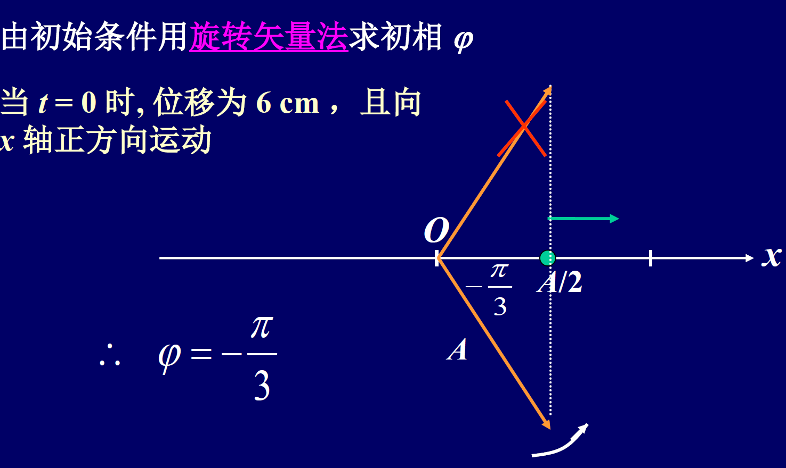
        - (1) **求A**: 利用归一化条件 $\int_0^\infty f(v)dv = 1$。
            - $\int_0^{v_F} Av^2 dv = A[\frac{v^3}{3}]_0^{v_F} = \frac{A}{3}v_F^3 = 1 \Rightarrow A = \frac{3}{v_F^3}$。
        - (2) **求三种速率**:
            - **最概然速率 $v_p$**: $f(v)$ 在 $0 < v < v_F$ 区间内是增函数，在 $v=v_F$ 处取得最大值，所以 $v_p = v_F$。
            - **平均速率 $\bar{v}$**: $\bar{v} = \int_0^\infty v f(v)dv = \int_0^{v_F} v(\frac{3}{v_F^3}v^2)dv = \frac{3}{v_F^3}[\frac{v^4}{4}]_0^{v_F} = \frac{3}{4}v_F = 0.75v_F$。
            - **方均根速率 $\sqrt{\bar{v^2}}$**: 先求 $\bar{v^2} = \int_0^\infty v^2 f(v)dv = \int_0^{v_F} v^2(\frac{3}{v_F^3}v^2)dv = \frac{3}{v_F^3}[\frac{v^5}{5}]_0^{v_F} = \frac{3}{5}v_F^2 = 0.6v_F^2$。
            - 所以 $\sqrt{\bar{v^2}} = \sqrt{0.6}v_F \approx 0.77v_F$。
    
- **例3**: 求速率在 $v_1 \sim v_2$ 区间内的分子的平均速率。
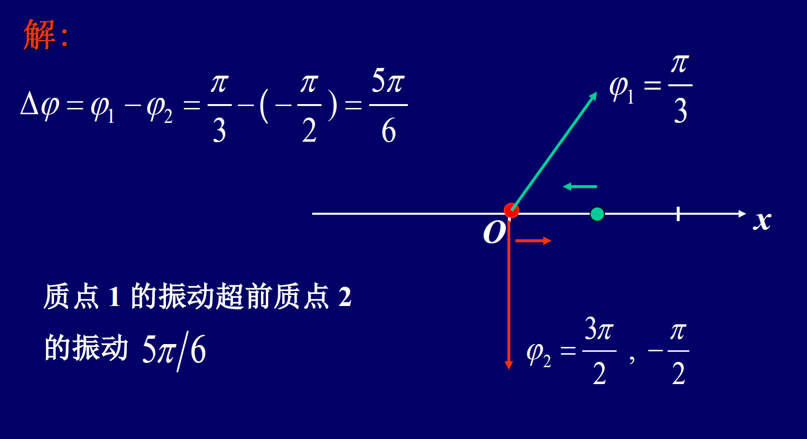
    - **解**: 该区间内分子的平均速率等于该区间内所有分子速率的总和，除以该区间内的分子总数。
    - $\bar{v}_{v_1-v_2} = \frac{\int_{v_1}^{v_2} v dN}{\int_{v_1}^{v_2} dN} = \frac{\int_{v_1}^{v_2} v N f(v) dv}{\int_{v_1}^{v_2} N f(v) dv} = \frac{\int_{v_1}^{v_2} v f(v) dv}{\int_{v_1}^{v_2} f(v) dv}$

## 4.6. 分子平均碰撞频率和平均自由程

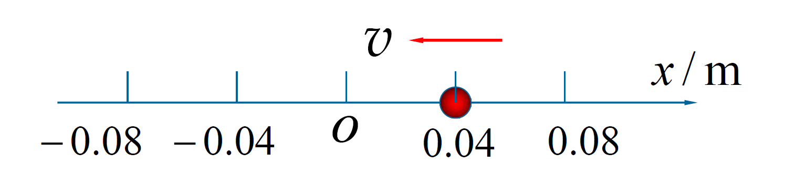

### 4.6.1. 定义
- **平均碰撞频率 ($\bar{Z}$)**: 一个分子在单位时间内与其他分子碰撞的平均次数。
- **平均自由程 ($\bar{\lambda}$)**: 一个分子在连续两次碰撞之间自由运动路程的平均值。
- **关系**: $\bar{\lambda} = \frac{\bar{v}}{\bar{Z}}$

### 4.6.2. 公式表达式
- **推导思路**: 考虑一个分子A以相对平均速率 $\bar{u}$ 运动，在单位时间内扫过的体积为 $\pi d^2 \bar{u}$（d为分子直径），此体积内的分子数即为碰撞次数。经严格统计证明，相对平均速率 $\bar{u} = \sqrt{2}\bar{v}$。
- **平均碰撞频率公式**: $\bar{Z} = \sqrt{2}\pi d^2 n \bar{v}$
- **平均自由程公式**: $\bar{\lambda} = \frac{\bar{v}}{\bar{Z}} = \frac{1}{\sqrt{2}\pi d^2 n}$
- **与宏观量的关系**: 利用 $p = nkT$，可得 $\bar{\lambda} = \frac{kT}{\sqrt{2}\pi d^2 p}$。在温度一定时，平均自由程与压强成反比。

### 4.6.3. 应用实例
- **例题1**: 求氢气在标准状态下的平均碰撞频率和平均自由程。(已知氢分子直径 $d \approx 2 \times 10^{-10} \text{m}$)
    - **解**:
        - 标准状态: $T=273$ K, $p = 1.013 \times 10^5$ Pa。
        - 分子数密度: $n = \frac{p}{kT} = \frac{1.013 \times 10^5}{1.38 \times 10^{-23} \times 273} \approx 2.69 \times 10^{25} \text{ m}^{-3}$
        - 平均速率: $\bar{v} = \sqrt{\frac{8RT}{M\pi}} = \sqrt{\frac{8 \times 8.31 \times 273}{(2 \times 10^{-3}) \pi}} \approx 1.70 \times 10^3 \text{ m/s}$
        - 平均自由程: $\bar{\lambda} = \frac{1}{\sqrt{2}\pi d^2 n} = \frac{1}{\sqrt{2}\pi (2 \times 10^{-10})^2 (2.69 \times 10^{25})} \approx 2.1 \times 10^{-7} \text{ m}$
        - 平均碰撞频率: $\bar{Z} = \frac{\bar{v}}{\bar{\lambda}} = \frac{1.70 \times 10^3}{2.1 \times 10^{-7}} \approx 8.1 \times 10^9 \text{ s}^{-1}$

- **例题2**: 体积恒定时, 一定质量的理想气体的温度升高, 其分子的...
    - **解**: 体积V和分子总数N恒定，所以分子数密度 $n=N/V$ 恒定。
    - 温度T升高，分子的平均速率 $\bar{v} \propto \sqrt{T}$ 将增大。
    - 平均碰撞频率 $\bar{Z} = \sqrt{2}\pi d^2 n \bar{v}$，因为n不变，$\bar{v}$增大，所以 $\bar{Z}$ 将**增大**。
    - 平均自由程 $\bar{\lambda} = \frac{1}{\sqrt{2}\pi d^2 n}$，只与n有关，所以 $\bar{\lambda}$ 将**不变**。
    - **正确答案：A**
    
    

