# 8. 光的干涉

光学题：**光程差=明暗纹公式**

## 8.1. 光的相干性与光源

### 8.1.1. 光的电磁理论要点
- **8.1.1.1. 光速**
    - 真空中：$c = 1/\sqrt{\varepsilon_0\mu_0}$
    - 介质中：$v = c/\sqrt{\varepsilon_r\mu_r}$
    - 折射率：$n = c/v = \sqrt{\varepsilon_r\mu_r}$
- **8.1.1.2. 可见光波长范围**
    - 400 nm — 760 nm ($1 \text{ nm} = 10^{-9} \text{ m}$)
- **8.1.1.3. 光强与光矢量**
    - 光强 $I$：电磁波的能流密度。
    - 光矢量：电场强度 $\vec{E}$ 矢量，对感光物质起主要作用。
    - 相对光强：$\bar{I} \propto E_0^2$ (振幅平方)

### 8.1.2. 光源
- **8.1.2.1. 光源分类**
    - 普通光源
    - 激光光源 (Laser)
- **8.1.2.2. 普通光源的激发方式**
    - 热光源：热能激发。
    - 电致发光：电能直接转换。
    - 光致发光：光激发。
    - 化学发光：化学反应。
- **8.1.2.3. 普通光源的发光特性（以热光源为例）**
    - **间歇性**：单个原子发光持续时间短 (约 $10^{-8}$s)，形成有限波列 ($L=c\Delta t$)。
    - **随机性**：各波列的振动方向、频率、初相位随机，不满足相干条件。
    - **结果**：两独立光源或同一光源不同部分的光通常不相干，不能产生稳定干涉。

### 8.1.3. 获得相干光的方法
- **基本思路**：将来自同一点光源、同一波列的光分成两部分，再使其叠加。
- **8.1.3.1. 分波阵面法 (Wavefront Division)**
    - 原理：从同一波阵面上取两部分作为新的相干光源。
    - 示例：杨氏双缝。
- **8.1.3.2. 分振幅法 (Amplitude Division)**
    - 原理：利用反射和折射将一束光的振幅分为两部分。
    - 示例：薄膜干涉。

## 8.2. 分波阵面干涉

### 8.2.1. 杨氏双缝干涉 (Young's Double-Slit Experiment)
- **8.2.1.1. 实验意义与装置**
    - 意义：1801年托马斯·杨实验证明了光的波动性，并测定了波长。
    - 装置：单色点光源 (或线光源经单缝) 照射双缝 $S_1, S_2$，$S_1, S_2$ 成为相干光源，在屏上形成干涉条纹。
- **8.2.1.2. 干涉理论与条件**
    - 假设：双缝间距 $d \ll$ 缝屏距 $D$，$S_1, S_2$ 为同相波源。
    - 波程差：$\delta = r_2 - r_1$
    - 干涉条件：
        - 明纹 (加强)：$\delta = \pm k\lambda \quad (k = 0, 1, 2, \dots)$
        - 暗纹 (相消)：$\delta = \pm (2k-1)\frac{\lambda}{2} \quad (k=1, 2, 3, \dots)$
        - $k$ 为条纹级次。
- **8.2.1.3. 干涉条纹的位置与间距**
    - 近似波程差：$\delta \approx d \sin\theta \approx d \frac{x}{D}$
    - 明纹位置：$x_k = \pm k\frac{D\lambda}{d}$
    - 暗纹位置：$x_k = \pm (2k-1)\frac{D\lambda}{2d}$
    - 条纹间距：$\Delta x = x_{k+1} - x_k = \frac{D\lambda}{d}$ (等间距)
- **8.2.1.4. 条纹特征**
    - 平行等距、明暗相间，中央为0级明纹。
    - $\Delta x$ 与 $D, \lambda$ 成正比，与 $d$ 成反比。
    - 白光干涉：中央明纹为白色，两侧为彩色光谱条纹（红在外，紫在内），高级次重叠模糊。
- **8.2.1.5. 光强分布**
    - 若两缝光强 $I_1 = I_2$，则合光强 $I = 4I_1 \cos^2(\frac{\Delta\phi}{2})$，其中 $\Delta\phi = \frac{2\pi}{\lambda}\delta$。
    - 明纹中心 $I = 4I_1$，暗纹中心 $I = 0$。

### 8.2.2. 洛埃镜实验 (Lloyd's Mirror Experiment)
- **8.2.2.1. 实验装置与现象**
    - 光源 $S_1$ 发出的光与经平面镜 M 反射的光（等效于虚光源 $S_2$ 发出的光）形成干涉。
    - 在几何光程差为零处（屏与镜面交界处）出现暗纹。
- **8.2.2.2. 半波损失**
    - 结论：光从光疏介质射向光密介质界面反射时，反射光有 $\pi$ 的相位突变，相当于 $\lambda/2$ 的波程损失。

## 8.3. 光程与光程差

### 8.3.1. 光程 (Optical Path)
- **8.3.1.1. 定义**
    - 光在折射率为 $n$ 的介质中传播几何路程 $r$ 时，其光程 $L = nr$。
    - 相位变化：$\Delta\phi = 2\pi \frac{r}{\lambda'} = 2\pi \frac{nr}{\lambda} = 2\pi \frac{L}{\lambda}$ (其中 $\lambda'$ 为介质中波长，$\lambda$ 为真空中波长)。
- **8.3.1.2. 物理意义**
    - 光程是将光在介质中传播的几何路程，按照相位变化或传播时间等效折算到真空中的路程。
- **8.3.1.3. 等光程讨论**
    - 若 $n_1r_1 = n_2r_2$ (光程相等)：
        - 几何路程 $r_1, r_2$ 通常不等。
        - 传播时间相等。
        - 相位变化相等。

### 8.3.2. 光程差 (Optical Path Difference)
- **8.3.2.1. 定义**
    - 两相干光束到达某点P的光程之差，用 $\delta$ 表示。
    - 例：光路1为 $r_1$，光路2中含厚度为 $d$、折射率为 $n$ 的介质片，其余为 $r_2-d$，则光程差 $\delta = [(r_2-d) + nd] - r_1$。
- **8.3.2.2. 与相位差的关系**
    - $\Delta\phi = 2\pi \frac{\delta}{\lambda}$

### 8.3.3. 用光程差表示的干涉条件
- $\delta = n_2r_2 - n_1r_1$
    - 明纹：$\delta = \pm k\lambda \quad (k=0,1,2,\dots)$
    - 暗纹：$\delta = \pm (2k-1)\frac{\lambda}{2} \quad (k=1,2,3,\dots)$
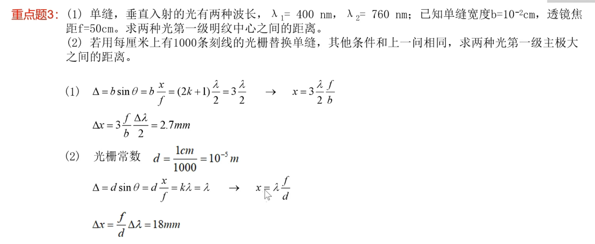
- （上图中的 2k+1 配合暗条纹 k=n-1，但如果是 2k-1 直接带第 k 级暗条纹、图中是为了各干涉公式统一）

### 8.3.4. 光程差应用实例
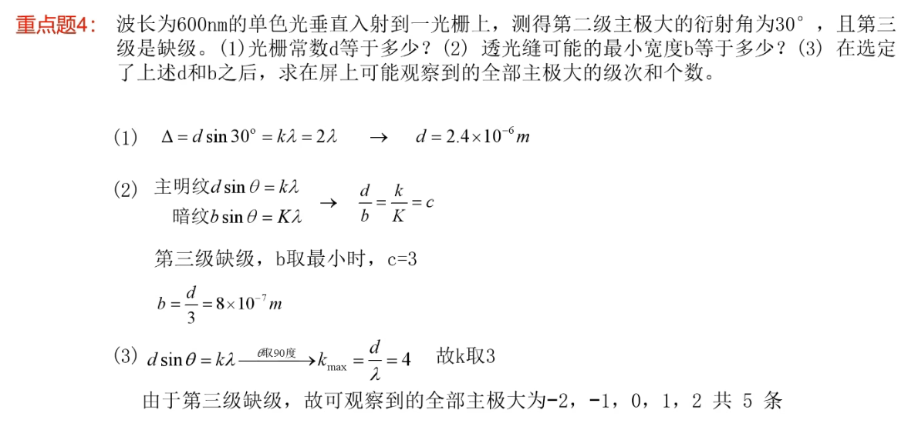
  
- **8.3.4.1. 例1：杨氏双缝干涉波长计算**
  
    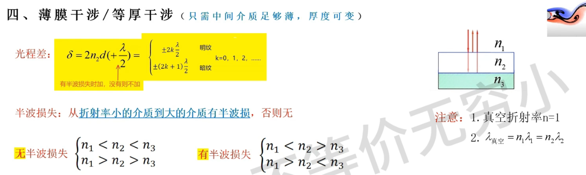
    
    - **问题**：杨氏双缝间距 $d = 0.2 \text{ mm}$，缝屏距 $D = 1 \text{ m}$。第1级明纹到第4级明纹距离为 $7.5 \text{ mm}$，求波长。
    - **解**：3个条纹间距为 $7.5 \text{ mm}$，故 $\Delta x = 7.5/3 = 2.5 \text{ mm}$。$\lambda = \frac{d\Delta x}{D} = \frac{0.2 \times 10^{-3} \times 2.5 \times 10^{-3}}{1} = 500 \text{ nm}$。
    
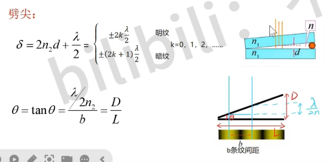
  
- **8.3.4.2. 例2：杨氏双缝干涉中插入介质片**
  
    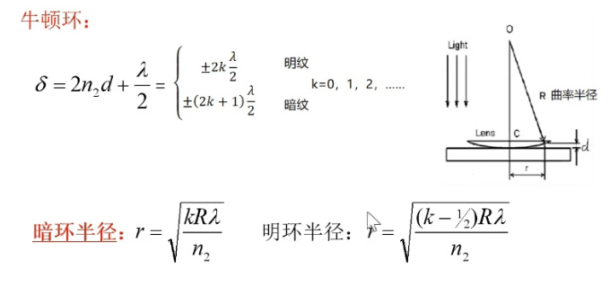
    
    - **问题**：用厚度为 $d_{mica}$、折射率 $n=1.58$ 的云母片覆盖一缝，零级明纹移到原第7级明纹处。光波长 $\lambda = 550 \text{ nm}$，求 $d_{mica}$。
    - **解**：附加光程差 $(n-1)d_{mica}$。原第7级明纹处 $r_2-r_1=7\lambda$。插入后此处为零级明纹，总光程差为 $0$。
    $r_2 - (r_1 - d_{mica} + nd_{mica}) = 0 \implies (r_2-r_1) - (n-1)d_{mica} = 0$
    $7\lambda = (n-1)d_{mica} \implies d_{mica} = \frac{7\lambda}{n-1} = \frac{7 \times 550 \times 10^{-9}}{1.58-1} \approx 6.6 \text{ µm}$。

## 8.4. 分振幅干涉：薄膜干涉

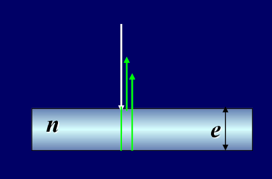

- $ \lambda $ 一定是真空中的 $\lambda$

### 8.4.1. 薄膜干涉概述
- **8.4.1.1. 透镜与附加光程**
    - 薄透镜不引入附加光程差（物点与像点间各光线光程相等）。
- **8.4.1.2. 常见光程差引入**
    - 介质片：厚 $d$，折射率 $n$，引入光程 $nd$，相对于空气中的 $d$ 增加 $(n-1)d$。
    - 半波损失：光从光疏介质到光密介质界面反射时，有 $\lambda/2$ 的附加光程差。

### 8.4.2. 等倾干涉 (Interference of Equal Inclination)
- **8.4.2.1. 原理与光程差**
    - 条件：均匀薄膜，平行光入射（或点光源发出的光经透镜变为平行光），观察反射光或透射光经透镜会聚形成的干涉。
    - 光程差（反射光，考虑一次半波损失情况，如 $n_1 < n_2 > n_3$ 或 $n_1 > n_2 < n_3$）：
        $\delta = 2n_2 e \cos r + \frac{\lambda}{2} = 2e\sqrt{n_2^2 - n_1^2 \sin^2 i} + \frac{\lambda}{2}$
        ($e$: 膜厚, $n_2$: 膜折射率, $r$: 折射角, $i$: 入射角, $n_1$: 入射介质折射率)
- **8.4.2.2. 干涉条件**
    - 明纹 (加强)：$\delta = k\lambda \quad (k=1,2,\dots)$
    - 暗纹 (减弱)：$\delta = (2k+1)\frac{\lambda}{2} \quad (k=0,1,2,\dots)$
    - 注意：若两次反射均有或均无半波损失 (如 $n_1<n_2<n_3$ 或 $n_1>n_2>n_3$)，则 $\delta = 2n_2 e \cos r$，干涉条件相反。透射光干涉条件与反射光互补。
- **8.4.2.3. 等倾干涉条纹**
    - 特点：同一条纹对应相同的入射角 $i$。
    - 形状：通常为一组同心圆环，中心对应 $i=0$ (垂直入射)。

### 8.4.3. 等倾干涉的应用
- **8.4.3.1. 均匀薄膜的垂直入射干涉 ($i=0, \cos r = 1$)**
    - 光程差 (例如，空气-膜-空气，膜折射率n)：$\delta = 2ne + \lambda/2$ (一次半波损失)
    - 现象：若膜厚 $e$ 均匀，整个膜呈现均匀的亮或暗色。
- **8.4.3.2. 增透膜 (Anti-Reflection Coating)**
    - 原理：使特定波长光在薄膜上下表面反射光相消干涉，减少反射，增加透射。
    - 条件 (垂直入射，膜折射率 $n_2$，基底 $n_3$，空气 $n_1=1$；通常 $n_1 < n_2 < n_3$，无净半波损失)：
        - 相消：$2n_2 e = (2k+1)\frac{\lambda}{2}$
        - 最小厚度 ($k=0$)：$e_{min} = \frac{\lambda}{4n_2}$ (光学厚度 $n_2e = \lambda/4$)
    - **例：增透膜厚度计算 (例 8-4)**
        - **问题**：镜头($n_3=1.52$)上镀 MgF$_2$膜($n_2=1.38$)，对 $\lambda=555\text{nm}$ 黄绿光反射最小，求膜最小厚度。
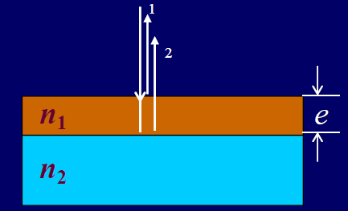
        - **解**：$n_1<n_2<n_3$ (空气-MgF$_2$-玻璃)，两次反射均从光疏到光密，或视作无净相位差。相消条件 $2n_2e=(2k+1)\lambda/2$。最小厚度 ($k=0$) $e = \frac{\lambda}{4n_2} = \frac{555 \times 10^{-9}}{4 \times 1.38} \approx 1.005 \times 10^{-7} \text{ m}$。
- **8.4.3.3. 增反膜 (High-Reflection Coating)**
    - 原理：使特定波长光在薄膜上下表面反射光相长干涉，增加反射。
    - 实现：通常镀光学厚度为 $\lambda/4$ 的高折射率膜 (如 ZnS on 玻璃)，或多层高低折射率交替膜。

### 8.4.4. 等厚干涉 (Interference of Equal Thickness)
- **8.4.4.1. 劈尖干涉 (Wedge Film Interference)**

    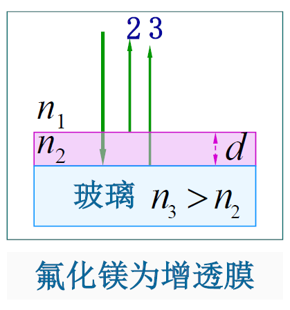

    - 装置：两平面玻璃间形成微小角度 $\theta$ 的空气（或介质）劈尖。单色光垂直入射。
    - 光程差 (空气劈尖，厚度 $e$)：$\delta = 2e + \lambda/2$ (下表面反射有半波损失)
    - 条纹：平行于劈棱的等厚直条纹。棱边 ($e=0$) 处为0级暗纹。
    - 相邻条纹厚度差：$\Delta e = \lambda/(2n)$ (若劈尖介质折射率为n)
    - 条纹间距：$l \approx \lambda/(2n\theta)$
    - 应用：测微小厚度/直径、检验表面平整度 (条纹弯曲指示表面不平，$\Delta e = \frac{\lambda}{2}\Delta k$)
    - **例：劈尖折射率计算 (例5)**
        - **问题**：玻璃劈尖角 $\theta = 8 \times 10^{-5} \text{ rad}$，$\lambda = 589 \text{ nm}$ 垂直照射，条纹间距 $l = 2.4 \text{ mm}$，求玻璃折射率 $n$。
        - **解**：$n = \frac{\lambda}{2\theta l} = \frac{589 \times 10^{-9}}{2 \times 8 \times 10^{-5} \times 2.4 \times 10^{-3}} \approx 1.53$。

- **8.4.4.2. 牛顿环 (Newton's Rings)**
  
    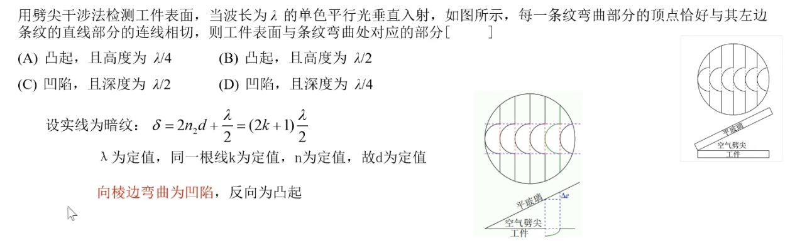
    
    - 装置：平凸透镜置于平板玻璃上，形成空气薄层。单色光垂直入射。
    - 光程差 (空气层厚度 $e$)：$\delta = 2e + \lambda/2$
    - 条纹：中心为0级暗斑的同心圆环。
    - 环半径 ($e = r^2/(2R)$)：
        - 明环：$r_k = \sqrt{(k-1/2)R\lambda} \quad (k=1,2,3,\dots)$
        - 暗环：$r_k = \sqrt{kR\lambda} \quad (k=0,1,2,\dots)$
        - 条纹向外逐渐变密。
    - 应用：测 $\lambda$ 或 $R$ ($\lambda = \frac{r_2^2 - r_1^2}{(k_2-k_1)R}$)
    - **例：有气隙的牛顿环 (例6)**
        - **问题**：透镜与平板间有气隙 $e_0$，求暗环半径。
        - **解**：总厚度为 $e' = e_{geom} + e_0 = r^2/(2R) + e_0$。光程差 $\delta = 2e' + \lambda/2 = (2k+1)\lambda/2 \implies 2(r^2/(2R) + e_0) = k\lambda \implies r_k^2/R + 2e_0 = k\lambda \implies r_k = \sqrt{(k\lambda - 2e_0)R}$ (要求 $k\lambda > 2e_0$)
    - **例：牛顿环测曲率半径 (例7)**
        - **问题**：$\lambda = 589.3 \text{ nm}$，第 $k$ 级暗环半径 $4 \text{ mm}$，第 $k+5$ 级暗环半径 $6 \text{ mm}$，求 $R$。
        - **解**：$R = \frac{r_{k+5}^2 - r_k^2}{5\lambda} = \frac{(6^2 - 4^2) \times 10^{-6}}{5 \times 589.3 \times 10^{-9}} \approx 6.79 \text{ m}$。

### 8.4.5. 薄膜干涉综合实例
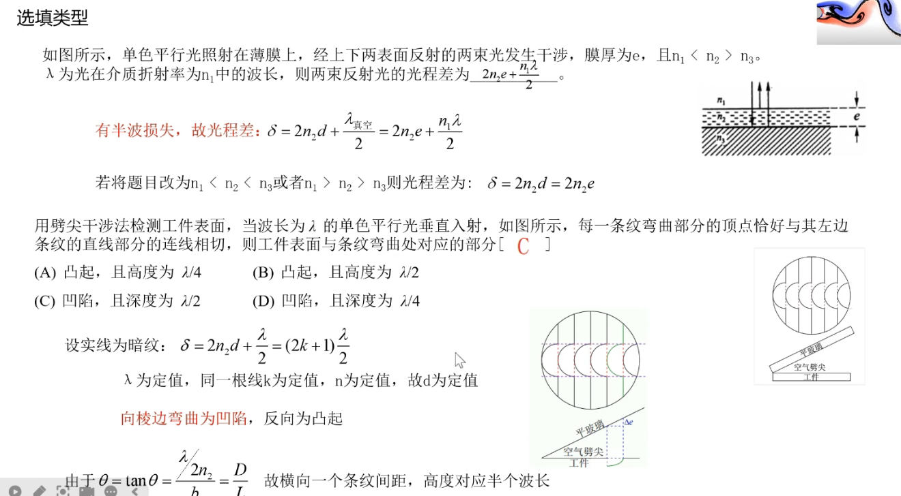
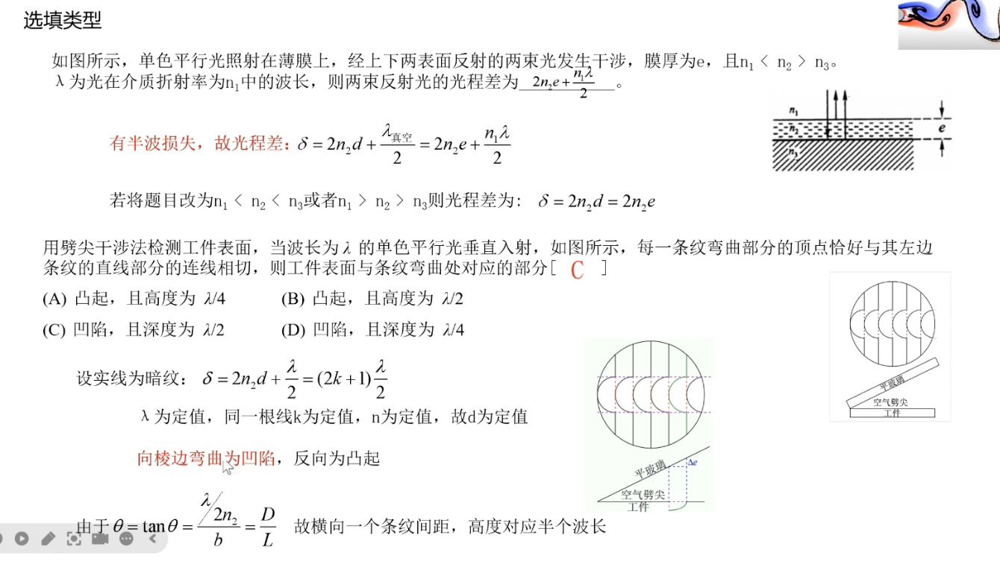
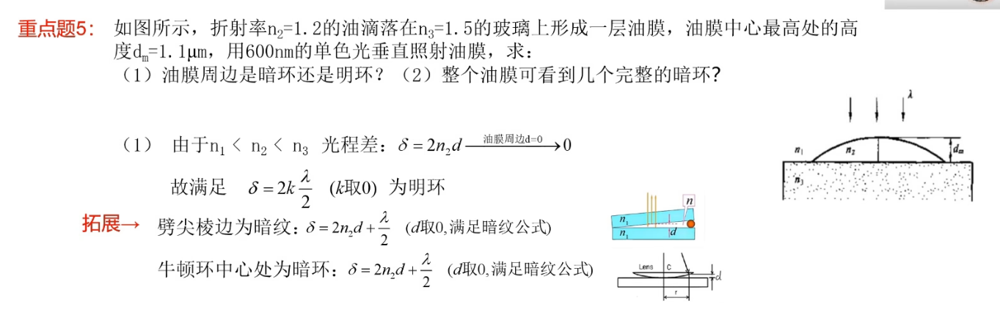
- **8.4.5.1. 例：肥皂膜颜色 (例3)**
    - **问题**：空气中 $0.32 \text{ µm}$ 厚肥皂膜 ($n=1.33$)，白光垂直入射，呈现何色？
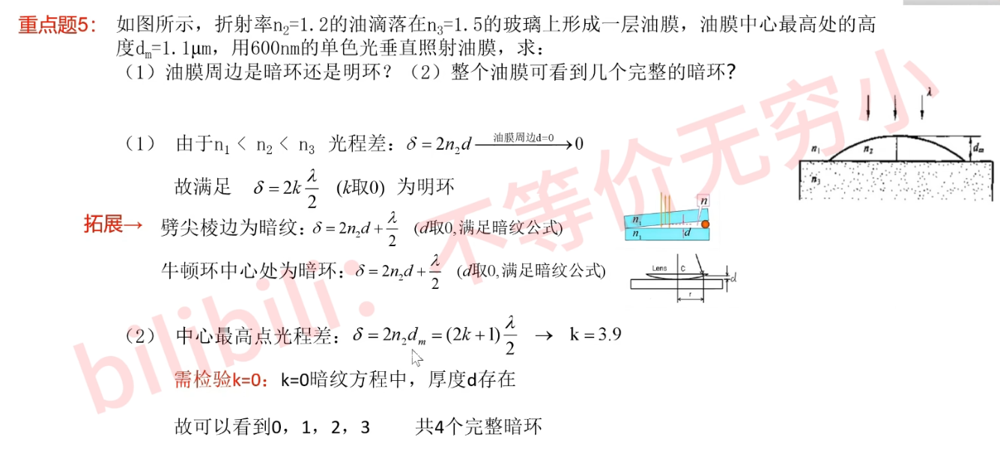
    - **解**：反射光加强条件 (空气-皂膜-空气，一次半波损失)：$2ne + \lambda/2 = k\lambda \implies 2ne = (k-1/2)\lambda$。
        $k=1: \lambda = 4ne = 1702.4 \text{ nm}$ (红外)
        $k=2: \lambda = 4ne/3 = 567.5 \text{ nm}$ (绿色)
        $k=3: \lambda = 4ne/5 = 340.5 \text{ nm}$ (紫外)
        故呈现绿色。
- **8.4.5.2. 例：油膜厚度测定 (例4)**
    - **问题**：油膜($n_{油}=1.30$)在玻璃板($n_G=1.50$)上，垂直入射。500 nm与700 nm光反射消失，求油膜厚度 $e$。
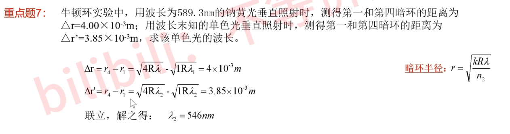
    - **解**：空气-油-玻璃 ($n_{air}<n_{油}<n_G$)，两次反射均有半波损失，净效应为无附加相位差。反射消失条件：$2n_{油}e = (2k+1)\lambda/2$。
        $2n_{油}e = (2k_1+1)\lambda_1/2$ ($\lambda_1=500\text{nm}$)
        $2n_{油}e = (2k_2+1)\lambda_2/2$ ($\lambda_2=700\text{nm}$)
        $k_1 > k_2$，取 $k_1 = k_2+1$ (相邻消失波长)。
        $(2(k_2+1)+1)\lambda_1 = (2k_2+1)\lambda_2 \implies (2k_2+3)500 = (2k_2+1)700 \implies k_2=2, k_1=3$。
        $e = \frac{(2k_2+1)\lambda_2}{4n_{油}} = \frac{5 \times 700 \times 10^{-9}}{4 \times 1.30} \approx 673 \text{ nm}$。

## 8.5. 迈克尔逊干涉仪

### 8.5.1. 装置结构与光路原理
- **8.5.1.1. 主要部件**
    - 光源S，分光板G1 (半透半反)，补偿板G2，固定反射镜M1，可移动反射镜M2，观察屏T。
- **8.5.1.2. 光路原理**
    - G1将光分为两束，分别经M1和M2反射后在G1再次相遇叠加。
    - G2补偿光束2因通过G1玻璃基底而产生的附加光程。
    - 从观察方向看，M2的像M2'与M1形成等效空气膜。
- **8.5.1.3. 光程差**
    - 主要由M1与M2'之间的距离 $d$ 决定：$\delta = 2d$ (若无额外相移)。

### 8.5.2. 主要特性与干涉类型
- **8.5.2.1. 光程差调节**
    - 移动M2可以精确改变光程差。M2移动距离 $\Delta d_{M2}$，光程差改变 $2\Delta d_{M2}$。
- **8.5.2.2. 等倾干涉**
    - 当M1与M2'严格平行时，形成等效平行空气膜，观察到等倾干涉圆环。
    - M2移动时，圆环会“冒出”或“缩进”中心。每移动 $\lambda/2$，一个条纹移过。
- **8.5.2.3. 等厚干涉**
    - 当M1与M2'有微小夹角时，形成等效空气劈尖，观察到等厚干涉直条纹。
    - M2移动时，条纹平移。

### 8.5.3. 应用
- **8.5.3.1. 精密长度测量**：$\Delta d = N \frac{\lambda}{2}$ ($N$为条纹移动数)。
- **8.5.3.2. 光波波长测量**：已知 $\Delta d$ 和 $N$，可求 $\lambda$。
- **8.5.3.3. 透明介质折射率测量**：在一臂中放入介质，观察条纹移动。
- **8.5.3.4. 迈克尔逊-莫雷实验**：验证“以太”存在的著名实验，其否定结果是相对论的实验基础之一。

### 8.5.4. 迈克尔逊干涉仪应用实例
- **8.5.4.1. 例：测量薄膜厚度**
    - **问题**：将折射率 $n=1.40$ 的厚度为 $d$ 的薄膜放入一臂，产生7条条纹移动，$\lambda = 589.3 \text{ nm}$，求 $d$。
    - **解**：放入薄膜后光程变化（双程）：$\Delta\delta = 2(nd - d) = 2(n-1)d$。条纹移动数 $N=7$。
    $2(n-1)d = N\lambda \implies d = \frac{N\lambda}{2(n-1)} = \frac{7 \times 589.3 \times 10^{-9}}{2(1.40-1)} \approx 5.15 \text{ µm}$。
- **8.5.4.2. 例：测量空气折射率 (例 8-6)**
    - **问题**：两臂各插入 $l=10.0 \text{ cm}$ 玻璃管，一真空，一充空气至标准大气压。观察到107.2条条纹移动，$\lambda = 546 \text{ nm}$，求空气折射率 $n$。
    - **解**：光程差变化 $\Delta\delta = 2(nl - l) = 2(n-1)l$。条纹移动数 $N=107.2$。
    $2(n-1)l = N\lambda \implies n-1 = \frac{N\lambda}{2l} \implies n = 1 + \frac{107.2 \times 546 \times 10^{-9}}{2 \times 0.10} \approx 1.000293$。

