# 基于 Gemini 2.5 Pro 的大学物理 I 复习

本资料根据广东工业大学大学物理 I 培养方案整理。

整理资料来源：

- [《大学物理学》上册 课件　128学时2025版-大学物理精品课程网](https://dxwl.gdut.edu.cn/info/1089/1277.htm)
- [《大学物理-光学》0基础1小时突击光学！期末速成](https://www.bilibili.com/video/BV17NkJY8EsG)
- [《大学物理-热学》0基础1小时突击热学！期末速成](https://www.bilibili.com/video/BV1k15VzFEv2)
- [《大学物理-振动波动》0基础1小时突击振动波动](https://www.bilibili.com/video/BV1BvNyexEFx)
- [《大学物理-刚体、力学、质点》刚体！质点运动学！0基础1.5小时速成！](https://www.bilibili.com/video/BV1CrEPz1EuP)

声明：

- 本文档绝大多数内容基于 AI 生成，可能有错漏，如发现问题请发邮箱到 3415368391@qq.com 指正。

# 1. 质点运动学

## 1.1. 运动的基本描述 (直角坐标系)

### 1.1.1. 基本概念：质点、参考系、坐标系
- **质点**: 具有质量但可忽略其大小和形状的物体。
- **参考系**: 用来描述物体运动时所选作参考的、相对静止的物体或物体系。
- **坐标系**: 为定量描述物体的位置和位置变化，在参考系上建立的坐标系统。常见的有直角坐标系、极坐标系、自然坐标系、球坐标系。

### 1.1.2. 位置矢量、运动方程与轨道方程
- **位置矢量 (位矢)**
    - 定义：从坐标原点指向质点所在位置的有向线段 $\vec{r}$。
    - 分量式: $\vec{r} = x\vec{i} + y\vec{j} + z\vec{k}$
    - 大小: $r = \sqrt{x^2 + y^2 + z^2}$
    - 方向: $\cos \alpha = \frac{x}{r}$, $\cos \beta = \frac{y}{r}$, $\cos \gamma = \frac{z}{r}$
- **运动方程**
    - 定义：描述质点位置坐标随时间变化的函数关系。
    - 矢量形式: $\vec{r} = \vec{r}(t)$
    - 参数形式: $x = x(t)$, $y = y(t)$, $z = z(t)$
- **轨道方程**
    - 定义：由运动方程消去时间参数 $t$ 后得到的，描述质点运动轨迹的方程 $\xi(x, y, z) = 0$。

### 1.1.3. 位移与路程
- **位移 (Displacement)**
    - 定义：在 $\Delta t$ 时间内，质点位置矢量的变化量 $\Delta\vec{r}$。位移是矢量。
    - 表达式: $\Delta\vec{r} = \vec{r}_B - \vec{r}_A$
    - 直角坐标系中: $\Delta\vec{r} = \Delta x\vec{i} + \Delta y\vec{j} + \Delta z\vec{k}$
    - 大小: $|\Delta\vec{r}| = \sqrt{\Delta x^2 + \Delta y^2 + \Delta z^2}$
- **路程 (Path)**
    - 定义：在 $\Delta t$ 时间内，质点运动轨迹的长度 $\Delta s$。路程是标量。
- **关系与区别**: 一般情况下，位移的大小不等于路程 ($|\Delta\vec{r}| \neq \Delta s$)。只有在单向直线运动中二者才相等。

### 1.1.4. 速度与速率
- **平均速度**: $\bar{v} = \frac{\Delta\vec{r}}{\Delta t}$ (矢量)
- **瞬时速度**: $\vec{v} = \lim_{\Delta t \to 0} \frac{\Delta\vec{r}}{\Delta t} = \frac{d\vec{r}}{dt}$ (矢量, 方向为轨道切线方向)
    - 分量式: $\vec{v} = v_x\vec{i} + v_y\vec{j} + v_z\vec{k}$，其中 $v_x = \frac{dx}{dt}$, $v_y = \frac{dy}{dt}$, $v_z = \frac{dz}{dt}$
- **平均速率**: $\bar{v} = \frac{\Delta s}{\Delta t}$ (标量)
- **瞬时速率**: $v = \lim_{\Delta t \to 0} \frac{\Delta s}{\Delta t} = \frac{ds}{dt}$ (标量)
- **关系**: 瞬时速度的大小等于瞬时速率, 即 $|\vec{v}| = v$。

### 1.1.5. 加速度
- **平均加速度**: $\bar{a} = \frac{\Delta\vec{v}}{\Delta t}$ (矢量)
- **瞬时加速度**: $\vec{a} = \lim_{\Delta t \to 0} \frac{\Delta\vec{v}}{\Delta t} = \frac{d\vec{v}}{dt} = \frac{d^2\vec{r}}{dt^2}$ (矢量)
    - 分量式: $\vec{a} = a_x\vec{i} + a_y\vec{j} + a_z\vec{k}$，其中 $a_x = \frac{dv_x}{dt}$, $a_y = \frac{dv_y}{dt}$, $a_z = \frac{dv_z}{dt}$
    - 大小: $|\vec{a}| = \sqrt{a_x^2 + a_y^2 + a_z^2}$
    - 方向: 在曲线运动中，加速度的方向总是指向曲线轨迹凹的一侧。

## 1.2. 质点运动学的两类基本问题

### 1.2.1. 微分问题：由运动方程求速度和加速度
- **方法**: 已知运动方程 $\vec{r}(t)$，通过对时间求导得到速度 $\vec{v}(t)$ 和加速度 $\vec{a}(t)$。
- **实例**:
    - **例1**: 质点运动方程 $\vec{r} = 4t^2\vec{i} + (2t+3)\vec{j}$ (SI)。
        - 轨迹方程: $x = (y-3)^2$
        - 速度: $\vec{v} = 8t\vec{i} + 2\vec{j}$ (m/s)
        - 加速度: $\vec{a} = 8\vec{i}$ (m/s²)
    - **例2**: 质点运动方程 $\vec{r} = 2t\vec{i} + (19-2t^2)\vec{j}$ (SI)。
        - 轨道方程: $y=19-\frac{1}{2}x^2$
        - 速度: $\vec{v} = 2\vec{i} - 4t\vec{j}$ (m/s)
        - 加速度: $\vec{a} = -4\vec{j}$ (m/s²)
        - 位矢与速度矢垂直的时刻: $\vec{r} \cdot \vec{v} = 0 \Rightarrow t=0$s 或 $t=3$s。

### 1.2.2. 积分问题：由加速度和初始条件求运动方程
- **方法**: 已知加速度函数及初始条件，通过对时间积分得到速度和位置。
    - **类型一: a = a(t) 或 a = 常量**: $v = v_0 + \int_{t_0}^{t} a(t)dt$, $x = x_0 + \int_{t_0}^{t} v(t)dt$
    - **类型二: a = a(x)**: 利用 $a = v\frac{dv}{dx}$，积分 $\int_{v_0}^{v} vdv = \int_{x_0}^{x} a(x)dx$。
    - **类型三: a = a(v)**: 利用 $a = v\frac{dv}{dx}$ 或 $a = \frac{dv}{dt}$，积分 $\int_{x_0}^{x} dx = \int_{v_0}^{v} \frac{v}{a(v)}dv$ 或 $\int_{t_0}^{t} dt = \int_{v_0}^{v} \frac{dv}{a(v)}$。
- **实例**:
    - **例3 (a=常量)**: $v = v_0 + at$, $x = x_0 + v_0t + \frac{1}{2}at^2$。
    - **例4 (a=a(x))**: $a = 2 + 6x^2$，从原点静止出发，则 $v = 2\sqrt{x+x^3}$ m/s。
    - **例5 (a=a(v))**: $a = -kv^2$，初速为 $v_0$，则 $v = v_0e^{-kx}$。

## 1.3. 运动的分解描述：自然坐标系

### 1.3.1. 自然坐标系定义
- **定义**: 以轨迹上任一点为坐标原点，以该点的切线方向和法线方向为坐标轴建立的坐标系。
- **单位矢量**:
    - **切向单位矢量 $\vec{\tau}$**: 沿质点前进方向的切向为正。
    - **法向单位矢量 $\vec{n}$**: 沿轨迹的法向凹侧为正。
- **特点**: 自然坐标系的单位矢量方向随时间（位置）变化。

### 1.3.2. 速度与加速度的分解
- **速度**: 速度方向始终沿切线方向，因此只有切向分量。
    - $\vec{v} = v\vec{\tau}$，其中速率 $v=\frac{ds}{dt}$。
- **加速度**: 加速度可分解为切向和法向两个分量。
    - $\vec{a} = \frac{d\vec{v}}{dt} = \frac{d}{dt}(v\vec{\tau}) = \frac{dv}{dt}\vec{\tau} + v\frac{d\vec{\tau}}{dt}$
    - **切向加速度 $\vec{a}_{\tau}$**:
        - 表达式: $\vec{a}_{\tau} = \frac{dv}{dt}\vec{\tau}$
        - 物理意义: 描述速度大小（速率）变化的快慢。
        - 大小: $a_{\tau} = \frac{dv}{dt}$
    - **法向加速度 $\vec{a}_{n}$**:
        - 表达式: $\vec{a}_{n} = \frac{v^2}{\rho}\vec{n}$ (其中 $\rho$ 为轨道的曲率半径)
        - 物理意义: 描述速度方向变化的快慢。
        - 大小: $a_{n} = \frac{v^2}{\rho}$
        - 方向: 始终指向轨道的曲率中心（凹侧）。

### 1.3.3. 总加速度
- **表达式**: $\vec{a} = \vec{a}_n + \vec{a}_{\tau}$
- **大小**: $a = \sqrt{a_n^2 + a_{\tau}^2}$
- **方向**: 与切线方向的夹角 $\theta = \arctan\frac{a_n}{a_{\tau}}$

### 1.3.4. 应用实例：斜抛运动
- **问题**: 物体作斜抛运动，在A点速度为 $\vec{v}$，与水平方向夹角为 $30^\circ$。求该点的切向加速度和曲率半径。

- **解**: 将重力加速度 $g$ 分解到切向和法向。
    - 切向加速度: $a_{\tau} = -g\sin 30^\circ = -\frac{g}{2}$
    - 法向加速度: $a_n = g\cos 30^\circ = \frac{\sqrt{3}}{2}g$
    - 曲率半径: $\rho = \frac{v^2}{a_n} = \frac{2\sqrt{3}}{3}\frac{v^2}{g}$

## 1.4. 曲线运动的特例：圆周运动

### 1.4.1. 角量描述
- **角位置 $\theta$**: 质点位矢与参考轴的夹角 (rad)。
- **角位移 $\Delta\theta$**: 位矢转过的角度 (rad)。
- **角速度 $\omega$**: $\omega = \frac{d\theta}{dt}$ ($\text{rad} \cdot s^{-1}$)
- **角加速度 $\alpha$**: $\alpha = \frac{d\omega}{dt}$ ($\text{rad} \cdot s^{-2}$)

### 1.4.2. 线量与角量的关系
对于半径为 R 的圆周运动：
- **路程与角位移**: $s = R\theta$
- **线速度与角速度**: $v = R\omega$
- **切向加速度与角加速度**: $a_{\tau} = R\alpha$
- **法向加速度**: $a_n = \frac{v^2}{R} = R\omega^2$

### 1.4.3. 匀速与变速圆周运动
- **匀速圆周运动**:
    - 特点: $\omega$=恒量, $\alpha = 0$, $a_{\tau} = 0$。
    - 加速度: $\vec{a} = \vec{a}_n$，大小为 $a = a_n = \frac{v^2}{R} = \omega^2 R$。
- **变速圆周运动**:
    - 特点: $\alpha \neq 0$, $a_{\tau} = R\alpha \neq 0$。
    - 总加速度: $\vec{a} = \vec{a}_n + \vec{a}_{\tau}$，大小为 $a = \sqrt{a_n^2 + a_{\tau}^2}$。
- **匀变速圆周运动公式**:
    - $\omega = \omega_0 + \alpha t$
    - $\theta = \theta_0 + \omega_0 t + \frac{1}{2}\alpha t^2$
    - $\omega^2 = \omega_0^2 + 2\alpha(\theta - \theta_0)$

### 1.4.4. 应用实例
- **例7**: 飞轮半径 r = 0.2m, 轮缘上一点的角位置 $\phi = -t^2 + 4t$。求 t=1s 时的速度和加速度。

    - 解: $\omega = -2t+4$, $\alpha = -2$。在 t=1s 时, $\omega=2$, $v=0.4$ m/s, $a_{\tau}=-0.4$ m/s², $a_n=0.8$ m/s², 总加速度大小 $a=0.89$ m/s²。
- **例8**: 质点沿半径为 R  的圆周运动, 路程 $s = bt - (1/2) \cdot ct^2$。
    - 解: $v = b-ct$, $a_{\tau} = -c$, $a_n = \frac{(b-ct)^2}{R}$。当 $a_{\tau}=a_n$ 时, $t = \frac{b}{c} \pm \sqrt{\frac{R}{c}}$ (需满足 $b^2 > Rc$ 条件)。

## 1.5. 运动的相对性：伽利略变换

### 1.5.1. 速度合成法则
- **基本关系**: 设S为静止系，S'为运动系，$\vec{r}$ 为质点对S系的位矢，$\vec{r'}$ 为质点对S'系的位矢，$\vec{r_0}$ 为S'原点对S系的位矢。则有 $\vec{r} = \vec{r_0} + \vec{r'}$。

- **速度变换**: 对时间求导得 $\vec{v} = \vec{u} + \vec{v'}$ (伽利略速度变换式)。
    - **绝对速度 $\vec{v}$**: 质点相对静止系的速度。
    - **相对速度 $\vec{v'}$**: 质点相对运动系的速度。
    - **牵连速度 $\vec{u}$**: 运动系相对静止系的速度。

### 1.5.2. 加速度合成法则
- **加速度变换**: 对速度变换式再求导，得 $\vec{a} = \vec{a_0} + \vec{a'}$。
    - $\vec{a}$ 为绝对加速度，$\vec{a'}$ 为相对加速度，$\vec{a_0}$ 为牵连加速度。
- **惯性系**: 若两参考系相互作匀速直线运动，则牵连速度 $\vec{u}$=常矢，$\vec{a_0}=0$，此时 $\vec{a} = \vec{a'}$。即质点在两个惯性系中的加速度相同。

### 1.5.3. 求解方法与实例
- **求解方法**: 确定运动质点、静止参考系和运动参考系。利用矢量合成法则 $\vec{v}_{绝对} = \vec{v}_{相对} + \vec{v}_{牵连}$ 或下标轮换关系 $\vec{v}_{31} = \vec{v}_{32} + \vec{v}_{21}$ 进行计算。
- **实例**:
    - **例9**: 人骑车向东，风由北向南，速度大小均为 $v$。问人感觉到的风向？
        - 解: $\vec{v}_{风人} = \vec{v}_{风地} - \vec{v}_{人地}$。作矢量图可知，风从东北方向吹来，速度大小为 $\sqrt{2}v$。
    - **例10**: 车以10 m/s 水平前进，车上的人向后上方60°抛出石块，地面观察者看到石块竖直上抛。求上升高度。
        - 解: $\vec{v}_{石地} = \vec{v}_{石车} + \vec{v}_{车地}$。由矢量图得，石块竖直上抛初速度 $v = v_{车地} \tan 60^\circ = 17.3$ m/s。上升高度 $H = \frac{v^2}{2g} = 15.3$ m。

## 1.6. 综合讨论与思考

### 1.6.1. 问题一：速度大小的计算方法辨析

- **问题**: 计算速度大小时，$\frac{dr}{dt}$ (其中 $r=|\vec{r}|$ ) 和 $|\frac{d\vec{r}}{dt}|$ 是否等价？
- **辨析**:
    - **结论**: 不等价。$v = |\frac{d\vec{r}}{dt}| = \sqrt{v_x^2+v_y^2}$ 是正确的，而 $v = \frac{dr}{dt}$ 是错误的。
    - **原因**: 速度的定义是位矢对时间的变化率 $\vec{v}=\frac{d\vec{r}}{dt}$，其大小为 $v=|\frac{d\vec{r}}{dt}|$。而 $\frac{dr}{dt} = \frac{d|\vec{r}|}{dt}$ 仅仅是位矢大小的变化率，即径向速度。在一般曲线运动中，$d|\vec{r}| \neq |d\vec{r}|$。
    - **反例**: 质点绕原点作匀速圆周运动时，$r=|\vec{r}|=R$ (常量)，所以 $\frac{dr}{dt}=0$，但这显然不等于质点的速度大小。

### 1.6.2. 问题二：拉船靠岸问题分析
- **问题**: 在离水面高h的岸边，以速率 $v_0$ 收绳使船靠岸。求船离岸边距离为s时的速度和加速度。
- **解**:
    - **方法一 (直角坐标系)**: 设绳长为 $l$，船的坐标为 $x$。则 $x=\sqrt{l^2-h^2}$，收绳速率 $v_0 = -\frac{dl}{dt}$。
        - 船速: $v=\frac{dx}{dt}=\frac{l}{\sqrt{l^2-h^2}}\frac{dl}{dt} = -\frac{\sqrt{s^2+h^2}}{s}v_0$。
        - 船的加速度: $a=\frac{dv}{dt}=-\frac{v_0^2h^2}{s^3}$。负号表示方向指向岸边。
    - **方法二 (极坐标分解)**: 船速 $v$ 在绳子方向（径向）的分量即为收绳速率 $v_0$。设绳与水平方向夹角为 $\alpha$。
        - $v_r = v\cos\alpha = v_0$。
        - $\cos\alpha = \frac{s}{\sqrt{h^2+s^2}}$。
        - 船速大小: $v = \frac{v_0}{\cos\alpha} = \frac{\sqrt{h^2+s^2}}{s}v_0$。

# 2. 质点动力学

## 2.1. 牛顿运动定律

### 2.1.1. 牛顿第一定律 (惯性定律)
- **定律内容**: 任何物体都要保持其静止或匀速直线运动状态, 直到外力迫使它改变运动状态为止。即当合外力 $\vec{F}=0$ 时, 物体的速度 $\vec{v}$ 为恒矢量。
- **定律的引申概念**:
    1.  **力的概念**: 力是物体间的相互作用，其效果是改变物体的运动状态（产生加速度）。
    2.  **惯性的概念**: 物体具有的保持其原有运动状态不变的属性称为惯性。维持物体运动状态的是惯性，改变物体运动状态的是力。
    3.  **惯性参考系的定义**: 牛顿第一定律成立的参考系称为惯性参考系。

### 2.1.2. 牛顿第二定律
- **定律内容**: 物体所受的合外力等于其动量的瞬时变化率。
    - **基本形式**: $\vec{F} = \frac{d\vec{p}}{dt} = \frac{d(m\vec{v})}{dt}$
    - **当质量m为常量时**: $\vec{F} = m\vec{a}$
- **定律要点**:
    1.  是质点动力学的核心方程。
    2.  $\vec{F}$ 是指作用在物体上的所有外力的矢量和（合外力）。
    3.  加速度 $\vec{a}$ 的方向与合外力 $\vec{F}$ 的方向相同。
    4.  力与加速度是瞬时对应关系。
    5.  定律适用于质点，且必须在惯性参考系中使用。
    6.  该定律是矢量方程，在实际应用中通常分解为标量分量式进行计算。

#### 2.1.2.1. 牛顿第二定律的分量形式
- **在直角坐标系中**:
    - $\Sigma F_x = ma_x = m\frac{dv_x}{dt}$
    - $\Sigma F_y = ma_y = m\frac{dv_y}{dt}$
    - $\Sigma F_z = ma_z = m\frac{dv_z}{dt}$
- **在自然坐标系中**: (常用于曲线运动问题)
    - 切向分量: $\Sigma F_{\tau} = ma_{\tau} = m\frac{dv}{dt}$
    - 法向分量: $\Sigma F_n = ma_n = m\frac{v^2}{\rho}$ (其中 $\rho$ 为曲率半径)

### 2.1.3. 牛顿第三定律 (作用力与反作用力定律)
- **定律内容**: 两个物体之间的作用力与反作用力总是大小相等、方向相反，作用在同一条直线上。
    - **表达式**: $\vec{F}_{ab} = -\vec{F}_{ba}$
- **定律要点**:
    1.  作用力与反作用力成对出现，同生同灭。
    2.  它们分别作用在相互作用的两个不同物体上，因此不能相互抵消。
    3.  它们属于同一种性质的力。
    4.  无论物体是静止还是运动，该定律均适用。

## 2.2. 力学中常见的几种力

### 2.2.1. 重力
- **来源**: 物体由于受到地球的万有引力而产生的力。
- **万有引力公式**: $F = G_0 \frac{m_1m_2}{r^2}$ (其中 $G_0 = 6.67 \times 10^{-11} \text{ N} \cdot \text{m}^2 \cdot \text{kg}^{-2}$)
- **重力公式**: $G = m g$，其中重力加速度 $g=G_0\frac{M}{R^2}$ (M为地球质量，R为地球半径)。

### 2.2.2. 弹力
- **产生条件**: 物体间有直接接触，并发生弹性形变。
- **常见形式**: 拉力、张力、正压力、支持力等。忽略质量的绳子，其张力处处相等。
- **胡克定律 (弹簧)**: $f = -kx$ (k为劲度系数，x为形变量)。

### 2.2.3. 摩擦力
- **产生条件**: 物体间有直接接触，有正压力，且有相对运动或相对运动趋势。
- **分类**:
    1.  **静摩擦力**: 大小随引起相对运动趋势的外力而变化，其范围为 $0 < f_{静} \le f_{max}$。
    2.  **最大静摩擦力**: $f_{max} = \mu_s N$ ($\mu_s$为静摩擦系数)。
    3.  **滑动摩擦力**: $f_k = \mu_k N$ ($\mu_k$为滑动摩擦系数)。
- **系数关系**: 通常静摩擦系数大于滑动摩擦系数，即 $\mu_s > \mu_k$。

## 2.3. 牛顿定律的应用 (在惯性系中)

### 2.3.1. 解题基本步骤
1.  **确定研究对象**: 明确分析哪一个物体或物体系，必要时画出隔离体图。
2.  **受力分析**: 画出研究对象所受所有外力的示力图。
3.  **建立坐标系**: 根据问题特点选择合适的坐标系（如直角坐标系或自然坐标系）。
4.  **列写方程**: 根据牛顿第二定律，列出各坐标轴方向的分量方程。
5.  **求解方程**: 联立方程组进行求解。

### 2.3.2. 应用实例

#### 2.3.2.1. 例题：阿特伍德机
**问题**: 滑轮和绳子质量及所有摩擦均不计，且 $m_1 > m_2$。求释放后物体的加速度和绳的张力。

**解**: 以地面为惯性参考系，对两物体分别应用牛顿第二定律：

- 对 $m_1$: $m_1g - F_T = m_1a$
- 对 $m_2$: $F_T - m_2g = m_2a$
- 联立解得: $a = \frac{m_1 - m_2}{m_1 + m_2}g$, $F_T = \frac{2m_1m_2}{m_1 + m_2}g$

#### 2.3.2.2. 例题：单摆运动
**问题**: 长为 $l$ 的轻绳一端系有质量为 $m$ 的小球，另一端固定。$t=0$ 时小球在最低点具有水平速度 $\vec{v}_0$。求小球在任意位置（与竖直方向夹角为 $\theta$）时的速率 $v$ 及绳的张力 $F_T$。

**解**: 建立自然坐标系，进行受力分析：

- 法向: $F_T - mg \cos\theta = ma_n = m\frac{v^2}{l}$
- 切向: $-mg \sin\theta = ma_t = m\frac{dv}{dt}$
- 求解速率 $v$: 利用 $a_t = \frac{v}{l}\frac{dv}{d\theta}$，积分 $\int_{v_0}^{v} vdv = -gl \int_{0}^{\theta} \sin\theta d\theta$，解得 $v^2 = v_0^2 + 2gl(\cos\theta - 1)$。~~也许高中方法更好懂~~
- 求解张力 $F_T$: 将 $v^2$ 代入法向方程，解得 $F_T = m(\frac{v_0^2}{l} - 2g + 3g\cos\theta)$。

#### 2.3.2.3. 例题：求解运动微分方程
**问题1 (阻力与速度成正比)**: 质量为 $m$ 的子弹以速度 $v_0$ 水平射入沙土，所受阻力大小为 $kv$。求最大深度。

**解**: 列方程 $-kv = m\frac{dv}{dt} = mv\frac{dv}{dx}$，得 $dx = -\frac{m}{k}dv$。积分 $\int_0^{x_{max}} dx = -\int_{v_0}^0 \frac{m}{k}dv$，解得 $x_{max} = \frac{m}{k}v_0$。

**问题2 (阻力与速度平方成正比)**: 质量为 $m$ 的小球以初速 $v_0$ 竖直上抛，受重力和阻力 $amv^2$。求最大高度 $H$。

**解**: 列方程 $-mg - amv^2 = m v\frac{dv}{dy}$。分离变量并积分 $\int_{v_0}^{0} \frac{v dv}{g+\alpha v^2} = \int_{0}^{H} -dy$。解得 $H = \frac{1}{2\alpha}\ln(\frac{g+\alpha v_0^2}{g})$。

## 2.4. 非惯性系与惯性力

### 2.4.1. 惯性系与非惯性系的定义与性质
- **惯性系**: 适用牛顿运动定律的参考系。
- **非惯性系**: 不适用牛顿运动定律的参考系。
- **性质**: 相对于一个惯性系作匀速直线运动的参考系也是惯性系。反之，相对于一个惯性系作加速运动的参考系一定是非惯性系。
- **示例**: 在一加速前进的车厢（非惯性系）中，观察者看到一个不受外力的光滑小球会自行向后加速运动，这违背了牛顿定律。

### 2.4.2. 惯性力
- **引入目的**: 为了使牛顿第二定律的形式在非惯性系中也能成立，而引入的一个虚构的力。
- **定义**: $\vec{F_i} = -m\vec{a_0}$，其中 $m$ 是物体质量，$\vec{a_0}$ 是非惯性系相对于惯性系的加速度。惯性力的方向与非惯性系的加速度方向相反。
- **在非惯性系中的牛顿第二定律**: $\vec{F}_{真实} + \vec{F_i} = m\vec{a'}$
    - $\vec{F}_{真实}$ 是物体所受的真实合外力。
    - $\vec{a'}$ 是物体相对于该非惯性系测得的加速度。
- **注意**: 惯性力没有施力物体，也没有反作用力，其实质是物体惯性在非惯性系中的表现。

### 2.4.3. 应用：平动加速参考系
- **问题**: 阿特伍德机置于以加速度 $a_0 = g/2$ 向下加速运动的电梯中，求两物体相对电梯的加速度 $a'$ 和绳中张力 $T$。

    

- **解**: 取电梯为非惯性参考系，对两物体分别引入惯性力 $\vec{F_i} = -m(-\vec{a_0}) = m\vec{a_0}$（方向向上）。
    - 对 $m_1$: $m_1g - T - m_1a_0 = m_1a'$ (以向下为正)
    - 对 $m_2$: $m_2g - T - m_2a_0 = -m_2a'$
    
- **联立解得**:
    - $a' = \frac{m_1-m_2}{m_1+m_2}(g-a_0)$
    - $T = \frac{2m_1m_2}{m_1+m_2}(g-a_0)$
    
- **相对于地面的加速度**: $a_1 = a' + a_0$ (向下)，$a_2 = -a' + a_0$ (向上)。

### 2.4.4. 应用：转动参考系 (惯性离心力)
- **概念**: 在一个以角速度 $\omega$ 转动的参考系中，物体会受到一个沿径向向外的惯性力，称为**惯性离心力**。

- **公式**: $\vec{F}_{离心} = -m\vec{a}_n = -m(-\omega^2 r \hat{r}) = m\omega^2 r \hat{r}$ (其中 $\vec{a}_n$ 是向心加速度，$\hat{r}$ 是径向向外的单位矢量)。

- **示例**: 一个木块静止在匀速转动的水平转盘上。

    

    - **在地面参考系 (惯性系) 中**: 木块做匀速圆周运动，由静摩擦力提供向心力。$f_{静} = m\omega^2 r$ (方向指向圆心)。
    - **在转盘参考系 (非惯性系) 中**: 木块静止($\vec{a'}=0$)，它受到指向圆心的真实静摩擦力 $\vec{f}_{静}$ 和沿径向向外的惯性离心力 $\vec{F}_{离心}$。根据非惯性系中的牛顿定律，$\vec{f}_{静} + \vec{F}_{离心} = 0$，二力平衡。

## 2.5. 功、功率与动能 (力的空间积累效应)

### 2.5.1. 功 (Work)

#### 2.5.1.1. 定义与计算
- **定义**: 功是力对空间积累的效应，是能量转换的量度。单位为焦耳(J)。
- **恒力的功**: 当力 $\vec{F}$ 为恒力，物体位移为 $\Delta\vec{r}$ 时，功为 $W = \vec{F} \cdot \Delta\vec{r} = F |\Delta\vec{r}| \cos\alpha$。
    - $W>0$ (力做正功), $W<0$ (力做负功), $W=0$ (力不做功)。
- **变力的功**: 当力 $\vec{F}$ 是变化的，需将路径分割成无限多个微元位移 $d\vec{r}$，力在每个微元位移上做的元功为 $dW = \vec{F} \cdot d\vec{r}$。总功为元功的路径积分：
    - $W = \int_a^b dW = \int_a^b \vec{F} \cdot d\vec{r}$
- **直角坐标系中的计算**:
    - $\vec{F} = F_x\vec{i} + F_y\vec{j} + F_z\vec{k}$, $d\vec{r} = dx\vec{i} + dy\vec{j} + dz\vec{k}$
    - $W = \int_L (F_x dx + F_y dy + F_z dz)$
- **几何意义**: 功在数值上等于力-位移图线下的面积。

#### 2.5.1.2. 功的性质与叠加
- **性质**: 功是标量，但有正负。它是一个过程量，其值通常与质点运动的具体路径有关。
- **合力的功**: 物体受多个力作用时，合外力所做的功等于各个分力所做功的代数和。
    - $W_{合} = \int_L (\vec{F}_1 + \vec{F}_2 + \cdots) \cdot d\vec{r} = W_1 + W_2 + \cdots$
- **一对相互作用力的功**: 作用力 $\vec{F}_1$ 和反作用力 $\vec{F}_2$ 所做的总功为 $dW = \vec{F}_1 \cdot d\vec{r}_1 + \vec{F}_2 \cdot d\vec{r}_2 = \vec{F}_1 \cdot d(\vec{r}_1 - \vec{r}_2) = \vec{F}_1 \cdot d\vec{r}_{12}$。

#### 2.5.1.3. 特殊力的功计算
- **重力的功**: 质点从高度 $y_1$ 移动到 $y_2$，重力做的功为 $W_G = -mg\int_{y_1}^{y_2} dy = mgy_1 - mgy_2$。重力做功只与始末位置的高度差有关，与路径无关。
- **弹力的功**: 弹簧从伸长量 $x_1$ 变到 $x_2$，弹力做的功为 $W_e = \int_{x_1}^{x_2} (-kx)dx = \frac{1}{2}kx_1^2 - \frac{1}{2}kx_2^2$。弹力做功也只与始末位置有关，与路径无关。

### 2.5.2. 功率 (Power)
- **定义**: 表征做功快慢程度的物理量，单位为瓦特(W)。
- **平均功率**: $\bar{P} = \frac{\Delta W}{\Delta t}$
- **瞬时功率**: $P = \lim_{\Delta t \to 0}\frac{\Delta W}{\Delta t} = \frac{dW}{dt} = \frac{\vec{F} \cdot d\vec{r}}{dt} = \vec{F} \cdot \vec{v}$

### 2.5.3. 动能定理 (Work-Kinetic Energy Theorem)

#### 2.5.3.1. 定理内容与推导
- **质点动能**: $E_k = \frac{1}{2}mv^2$
- **定理推导**:
    - 合外力做的功 $W = \int_a^b \vec{F} \cdot d\vec{r}$
    - 根据牛顿第二定律 $\vec{F} = m\frac{d\vec{v}}{dt}$
    - $W = \int_a^b m\frac{d\vec{v}}{dt} \cdot d\vec{r} = \int_a^b m d\vec{v} \cdot \frac{d\vec{r}}{dt} = \int_{v_a}^{v_b} m \vec{v} \cdot d\vec{v} = \int_{v_a}^{v_b} mvdv = \frac{1}{2}mv_b^2 - \frac{1}{2}mv_a^2$
- **定理内容**: 合外力对质点所做的功，等于质点动能的增量。
    - $W_{合} = E_{kb} - E_{ka} = \Delta E_k$

#### 2.5.3.2. 定理要点
- 功是过程量，动能是状态量。动能定理建立了过程量与状态量变化之间的联系。
- 动能定理由牛顿第二定律导出，因此只适用于惯性参考系。动能的值也与参考系的选择有关。

### 2.5.4. 综合应用实例

#### 2.5.4.1. 变力做功计算
- **问题1**: 一力 $F=F_0(x\vec{i}+y\vec{j})$ 作用于质点，求质点由原点运动至P(0, 2R)过程中力 $\vec{F}$ 做的功。

    

    - **解**: $W = \int \vec{F} \cdot d\vec{r} = \int (F_0xdx + F_0ydy) = \int_0^0 F_0xdx + \int_0^{2R} F_0ydy = 2F_0R^2$

- **问题2**: 用水平力 $F$ 无限缓慢地把质量为 $m$、摆长为 $l$ 的单摆从平衡位置拉到与竖直方向成 $\theta_0$ 角的位置，求力 $F$ 做的功。
  
    
    
    - **解**: 因过程缓慢，任意时刻三力平衡，可得 $F=mg\tan\theta$。元功 $dW = F ds \cos\theta = (mg\tan\theta)(ld\theta)\cos\theta = mgl\sin\theta d\theta$。总功 $W = \int_0^{\theta_0} mgl\sin\theta d\theta = mgl(1-\cos\theta_0)$。~~又是一道用高中方法会不会更舒服的题目~~

#### 2.5.4.2. 动能定理应用
- **问题**: 一条长度为L、总质量为m的柔软链条，初始时有长度为 $a$ 的一端下垂，静止在光滑桌面上。求链条刚离开桌边时的速率。(原题有摩擦，此处按光滑桌面简化以匹配动能定理的直接应用，原题的解法更复杂)。(原题解法如下)

- **原题解法 (有摩擦)**:
    - **受力分析**: 设下垂长度为 $y$ 时，重力 $G = \frac{m}{L}yg$，摩擦力 $f=\mu\frac{m}{L}(L-y)g$。
    - **计算功**（对元功积分）:
        - 重力做功: $W_G = \int_a^L \frac{m}{L}ygdy = \frac{mg}{2L}(L^2-a^2)$
        - 摩擦力做功: $W_f = \int_a^L -\mu\frac{m}{L}(L-y)gdy = -\frac{\mu m g}{2L}(L-a)^2$
    - **应用动能定理**: $W_G + W_f = \frac{1}{2}mv^2 - 0$
    - **求解速率**: $v=\sqrt{\frac{g}{L}[(L^2-a^2) - \mu(L-a)^2]}$

## 2.6. 保守力、势能与机械能守恒

### 2.6.1. 保守力 (Conservative Force)

#### 2.6.1.1. 定义
如果一个力所做的功只与质点的始末位置有关，而与所经过的路径无关，这类力就称为**保守力**。

#### 2.6.1.2. 常见保守力做功的特点
1.  **重力的功**
    -   **计算**: 质点从高度 $y_1$ 移动到 $y_2$，重力做的功为 $W_{重} = -mg\int_{y_1}^{y_2} dy = mgy_1 - mgy_2$。
    -   **特点**:
        -   功值只与始末位置的高度差有关，与路径无关。
        -   质点下降时，重力做正功；质点上升时，重力做负功。

2.  **弹性力的功**
    -   **计算**: 弹簧从形变量 $x_1$ 变到 $x_2$，弹性力做的功为 $W_{弹} = \int_{x_1}^{x_2} (-kx)dx = \frac{1}{2}kx_1^2 - \frac{1}{2}kx_2^2$。
    -   **特点**:
        -   功值只与弹簧的始末形变量有关，与路径无关。
        -   弹簧的形变减小时（恢复原状），弹性力做正功；形变增大时，弹性力做负功。

3.  **万有引力的功**
    -   **计算**: 质点 $m$ 在中心天体 $M$ 的引力作用下从距离 $r_a$ 移动到 $r_b$，万有引力做的功为 $W_{引} = \int_{r_a}^{r_b} (-G_0\frac{Mm}{r^2})dr = G_0\frac{Mm}{r_b} - G_0\frac{Mm}{r_a}$。
    -   **特点**:
        -   功值只与始末位置的距离有关，与路径无关。
        -   两质点相互靠近时，万有引力做正功；相互远离时，万有引力做负功。

### 2.6.2. 势能 (Potential Energy)

#### 2.6.2.1. 定义与关系
- **定义**: 由相互作用物体的相对位置所决定的、与保守力相联系的能量，称为势能 ($E_p$)。
- **保守力的功与势能的关系**: 保守力所做的功，在数值上等于系统势能增量的负值。
    - $W_{保} = -(E_{pb} - E_{pa}) = -\Delta E_p$
    - 微分形式: $dW_{保} = -dE_p$

#### 2.6.2.2. 势能的性质
1.  **系统性**: 势能属于相互作用的物体组成的系统，而非单个物体所独有。
2.  **状态量**: 势能是描述系统状态的物理量，其值由系统内物体的相对位置决定。
3.  **相对性**: 势能的数值是相对的，其大小与势能零点的选择有关。

#### 2.6.2.3. 势能的计算
- **计算公式**: 质点在保守力场中某一点 a 的势能，数值上等于质点从该点沿任意路径移动到势能零点 b 时，保守力所做的功。
    - $E_{Pa} = \int_a^b \vec{F}_{保} \cdot d\vec{r}$
- **常见势能**:
    - **重力势能**: 取地面($h=0$)为零势能点，则在高度 $h$ 处的重力势能为 $E_p = mgh$。
    - **弹性势能**: 取弹簧处于原长($x=0$)时为零势能点，则在形变量为 $x$ 时的弹性势能为 $E_p = \frac{1}{2}kx^2$。
    - **万有引力势能**: 取无限远处($r \to \infty$)为零势能点，则在距离为 $r$ 处的引力势能为 $E_p = -G_0\frac{Mm}{r}$。
    
    

### 2.6.3. 机械能守恒定律

#### 2.6.3.1. 质点系动能定理
- **内力与外力**: 内力是系统内质点间的相互作用力；外力是系统外部物体对系统内质点的作用力。
- **定理内容**: 所有外力对质点系做的功和所有内力对质点系做的功之和，等于质点系总动能的增量。
    - $W_{外} + W_{内} = E_k - E_{k0} = \Delta E_k$
- **结论**: 内力做功可以改变系统的总动能。

#### 2.6.3.2. 功能原理
- **推导**: 将内力所做的功分为保守内力功($W_{保内}$)和非保守内力功($W_{非保内}$)。
    - $W_{外} + W_{保内} + W_{非保内} = \Delta E_k$
    - 将 $W_{保内} = -\Delta E_p$ 代入，得到 $W_{外} + W_{非保内} = \Delta E_k + \Delta E_p$。
- **机械能**: 定义系统的总机械能为动能与势能之和，$E = E_k + E_p$。
- **原理内容**: 外力做的功与非保守内力做的功之和，等于系统总机械能的增量。
    - $W_{外} + W_{非保内} = E - E_0 = \Delta E$

#### 2.6.3.3. 机械能守恒定律
- **守恒条件**: 当一个系统所受的外力不做功 ($W_{外}=0$)，且系统内没有非保守内力做功 ($W_{非保内}=0$) 时，系统的机械能守恒。
- **定律内容**: 在满足守恒条件的系统中，系统的总机械能保持不变。
    - $E = E_k + E_p = \text{常量}$
    - $E_{k1} + E_{p1} = E_{k2} + E_{p2}$

### 2.6.4. 综合应用实例

#### 2.6.4.1. 实例：平方反比引力下的机械能
**问题**: 质量为 $m$ 的质点在指向圆心的平方反比力 $F=-k/r^2$ 作用下，作半径为 $r$ 的圆周运动。求质点的速度 $v$ 和机械能 $E$ (取无限远处为势能零点)。

**解**:

1.  **求速度**: 向心力由引力提供，$\frac{k}{r^2} = m\frac{v^2}{r} \Rightarrow v = \sqrt{\frac{k}{mr}}$。
2.  **求机械能**:
    - 动能: $E_k = \frac{1}{2}mv^2 = \frac{k}{2r}$。
    - 势能: $E_p = \int_r^\infty F dr = \int_r^\infty (-\frac{k}{r^2})dr = -\frac{k}{r}$。
    - 总机械能: $E = E_k + E_p = \frac{k}{2r} - \frac{k}{r} = -\frac{k}{2r}$。

#### 2.6.4.2. 实例：应用功能原理解题
**问题**: 轻弹簧一端固定，另一端与质量为m的物体相连置于水平桌面上(摩擦系数为μ)。用水平恒力F将物体自平衡位置向右拉。求物体到达最远点时系统的弹性势能。

**解**:

- **系统与过程**: 系统为物体和弹簧，过程为从平衡位置(x=0)到最远点(x)。
- **能量分析**:
    - 初态机械能 $E_1 = 0$ (动能和势能均为零)。
    - 末态机械能 $E_2 = \frac{1}{2}kx^2$ (动能为零)。
    - 外力和非保守力做功: 外力F做功 $W_F = Fx$，摩擦力做功 $W_f = -\mu mgx$。
- **应用功能原理**: $W_F + W_f = E_2 - E_1$
    - $Fx - \mu mgx = \frac{1}{2}kx^2$
- **求解**:
    - 在最远点，物体速度为零，但此前物体经历了加速和减速，不能简单地用 $F=kx+\mu mg$ 来求最远点。而功能原理直接关联始末状态，更为简便。
    - （课件中的解法有误，它直接用功能原理求解，但x是未知的。实际上，物体到达最远点时速度为零，而不是合力为零。课件解法先假设求出了x，然后再用功能原理解释势能，逻辑上是倒置的。正确的做法是通过功能原理建立x与F的关系，然后求势能。）
    - 从功能原理 $Fx - \mu mgx = \frac{1}{2}kx^2$ 可知，末态势能 $E_p = \frac{1}{2}kx^2 = Fx - \mu mgx$。要求出具体值，还需知道最远点的位移x。

#### 2.6.4.3. 实例：应用机械能守恒求解飞行时间
**问题**: 一个物体从地球表面以第二宇宙速度 $v_0 = \sqrt{\frac{2GM_e}{R_e}}$ 竖直发射，忽略阻力，求物体飞行到与地心相距 $nR_e$ 处经历的时间。
**解**:
1.  **求速度与位置关系**: 系统只有保守内力（万有引力）做功，机械能守恒。
    - $\frac{1}{2}mv_0^2 - \frac{GM_e m}{R_e} = \frac{1}{2}mv^2 - \frac{GM_e m}{x}$
    - 代入 $v_0$ 可知，初态机械能为0，所以任意位置x处的速度 $v = \sqrt{\frac{2GM_e}{x}}$。
2.  **求时间**:
    - 利用 $v = \frac{dx}{dt}$，得 $dt = \frac{dx}{v} = \frac{\sqrt{x}dx}{\sqrt{2GM_e}}$。
    - 积分: $\int_0^{t_1} dt = \int_{R_e}^{nR_e} \frac{x^{1/2}}{\sqrt{2GM_e}}dx$。
    - 结果: $t_1 = \frac{1}{\sqrt{2GM_e}}[\frac{2}{3}x^{3/2}]_{R_e}^{nR_e} = \frac{2R_e^{3/2}}{3\sqrt{2GM_e}}(n^{3/2}-1)$。

#### 2.6.4.4. 实例：弹簧系统的机械能守恒
**问题**: 如图，用弹簧连接两木块 $m_1, m_2$。先用压力F压缩弹簧，使系统静止，此时 $m_2$ 处在平衡位置上方。求要使撤去F后 $m_1$ 恰好能离开桌面，所加压力 F 至少为多大？

**解**:

- **临界条件**: $m_1$ 恰好离开桌面时，弹簧对 $m_1$ 的拉力等于 $m_1$ 的重力，即 $kx_2 = m_1g$，此时 $m_2$ 运动到最高点，速度为零。
- **过程分析**: 从撤去压力 F 的瞬间（初态）到 $m_2$ 到达最高点（末态），系统（$m_1, m_2$, 弹簧，地球）机械能守恒。
- **能量状态**:
    - **初态**: 弹簧总压缩量为 $x_0+x_1$ (其中 $x_0=\frac{m_2g}{k}$, $x_1=\frac{F}{k}$)。动能为0，弹性势能为 $\frac{1}{2}k(x_0+x_1)^2$。
    - **末态**: $m_2$ 在最高点，动能为0。弹簧伸长量为 $x_2=\frac{m_1g}{k}$。弹性势能为 $\frac{1}{2}kx_2^2$。$m_2$ 的重力势能增加 $m_2g(x_0+x_1+x_2)$。
- **应用机械能守恒**:
    - $\frac{1}{2}k(x_0+x_1)^2 = \frac{1}{2}kx_2^2 + m_2g(x_0+x_1+x_2)$
    - (课件中的解法有误，等式右边应该是 $m_2$ 的重力势能增量加上弹簧的弹性势能)。
    - **正确列式**: 初始总能量 = 末态总能量。选初始位置为重力势能零点。
    - $E_{初} = E_{k,初} + E_{p,弹,初} + E_{p,重,初} = 0 + \frac{1}{2}k(\frac{m_2g+F}{k})^2 + 0$
    - $E_{末} = E_{k,末} + E_{p,弹,末} + E_{p,重,末} = 0 + \frac{1}{2}k(\frac{m_1g}{k})^2 + m_2g(\frac{m_2g+F}{k} + \frac{m_1g}{k})$
    - 令 $E_{初} = E_{末}$，解出 $F$。
    - (课件给出的答案 $F=(m_1+m_2)g$ 是一个常见的结论，但其推导过程省略且公式有误)。

# 3. 刚体

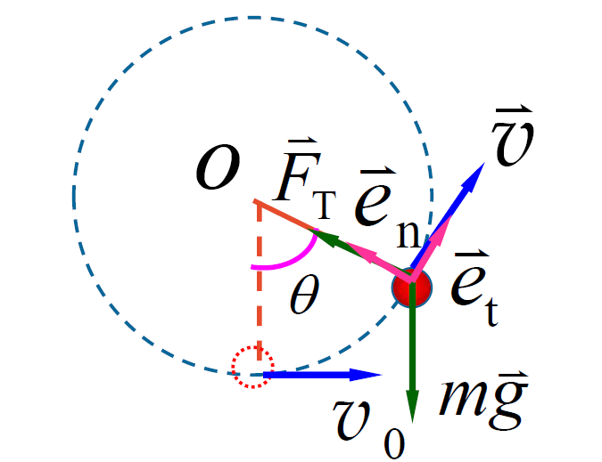

## 3.1. 刚体定轴转动的运动学描述

### 3.1.1. 刚体的定义与基本运动形式
- **刚体 (Rigid Body)**: 在外力作用下，内部任意两点间距离始终保持不变的物体。可视为由无数连续分布的质点组成的特殊质点系。

- **刚体的基本运动形式**:
    1. **平动 (Translation)**: 刚体在运动过程中，其内部任意两点的连线始终保持平行。刚体的平动可简化为质点运动进行处理。
    
       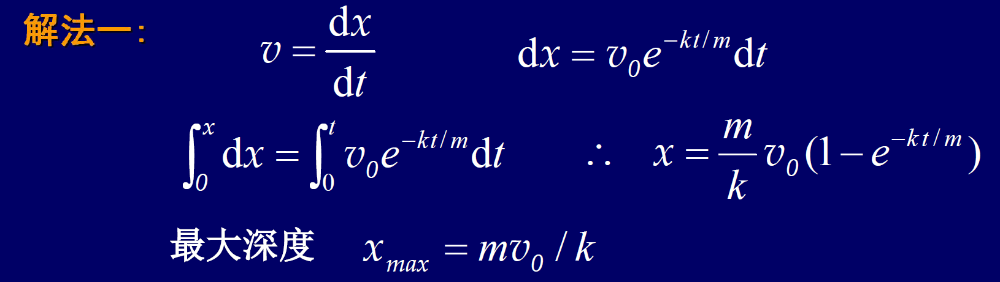
    
       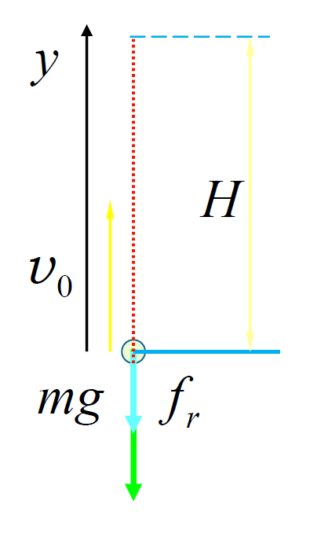
    
    2. **定轴转动 (Fixed-Axis Rotation)**: 刚体上所有质点都围绕同一直线（转轴）作圆周运动。
    
       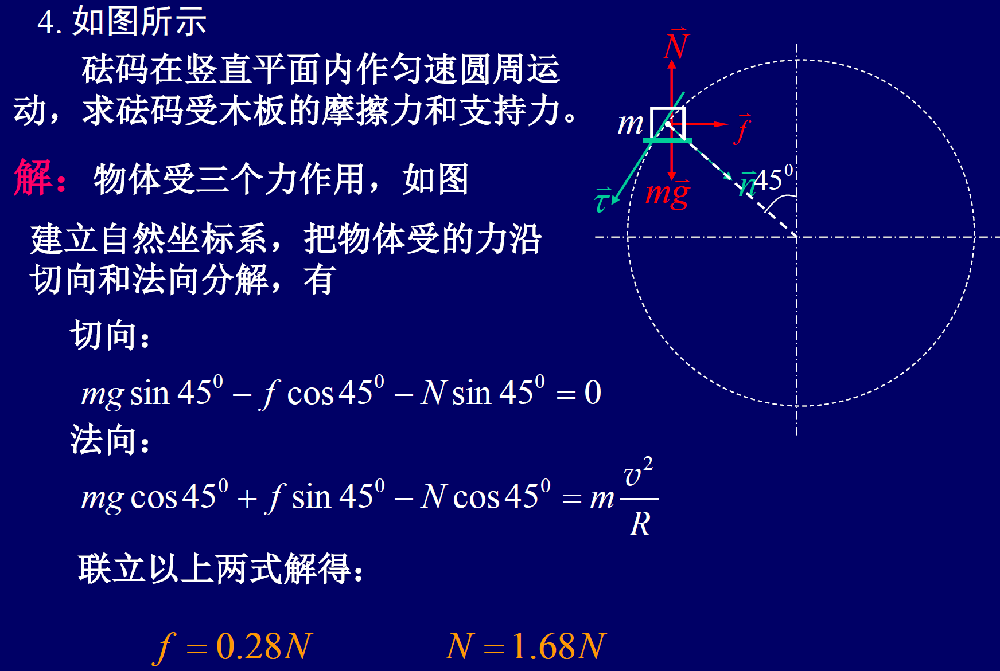
    
    3. **一般运动**: 可分解为平动与定轴转动的叠加。

### 3.1.2. 描述定轴转动的物理量
- **描述方法**: 刚体定轴转动通常用角位移、角速度和角加速度等角量来描述。
- **定轴转动的特点**:
    - 刚体上所有质点都在与转轴垂直的平面上作圆周运动。
    - 在同一时刻，所有质点的角位移、角速度、角加速度都相同。
- **角速度矢量 ($\vec{\omega}$)**:
    - **方向**: 沿转轴方向，通过右手螺旋法则确定（四指沿转动方向，大拇指指向为 $\vec{\omega}$ 的方向）。
    - **与线速度的关系**: $\vec{v} = \vec{\omega} \times \vec{r}$
- **角加速度矢量 ($\vec{\alpha}$)**:
    - **定义**: $\vec{\alpha} = \frac{d\vec{\omega}}{dt}$
    - **方向**: 在定轴转动中，$\vec{\alpha}$ 的方向沿转轴，与 $\vec{\omega}$ 的方向相同（加速）或相反（减速）。

### 3.1.3. 匀变速定轴转动公式
若刚体绕定轴做匀变速转动（角加速度 $\alpha$ 为常量），其运动公式**与匀变速直线运动类似**：
- $\omega = \omega_0 + \alpha t$
- $\theta = \theta_0 + \omega_0 t + \frac{1}{2}\alpha t^2$
- $\omega^2 = \omega_0^2 + 2\alpha(\theta - \theta_0)$

### 3.1.4. 运动学应用实例
- **问题**: 半径为0.2m的飞轮，初转速为150 r/min，经30s均匀减速至停止。求：(1) 角加速度和转过的圈数；(2) 6s时的角速度；(3) 6s时飞轮边缘上一点的线速度与加速度。
- **解**:
    - (1) 初角速度 $\omega_0 = 5\pi$ rad/s。角加速度 $\alpha = \frac{0-5\pi}{30} = -\frac{\pi}{6}$ rad/s²。转过的总角度 $\theta = \frac{0 - (5\pi)^2}{2\alpha} = 75\pi$ rad，即37.5圈（75π除以一个2π）。
    - (2) 6s时的角速度 $\omega = \omega_0 + \alpha t = 5\pi - \frac{\pi}{6} \times 6 = 4\pi$ rad/s。
    - (3) 6s时边缘点的线速度大小 $v = r\omega = 0.2 \times 4\pi = 2.5$ m/s。切向加速度 $a_t = r\alpha = -0.105$ m/s²。法向加速度 $a_n = r\omega^2 = 31.6$ m/s²。

## 3.2. 刚体定轴转动动力学

### 3.2.1. 力矩 (Moment of Force or Torque)
- **定义**: 力 $\vec{F}$ 对某一点（或某一转轴）的矩，是描述力使物体产生转动效应的物理量。
- **计算**: $\vec{M} = \vec{r} \times \vec{F}$，其中 $\vec{r}$ 是从转轴到力的作用点的矢量。
- **大小**: $M = rF \sin\theta = F \cdot d$，其中 $d$ 为力臂。
- **方向**: 垂直于 $\vec{r}$ 和 $\vec{F}$ 构成的平面，即沿转轴方向。
- **注意**: 只有垂直于转轴的力的分量 $\vec{F}_{\perp}$ 才能产生对该轴的力矩。

### 3.2.2. 转动惯量 (Moment of Inertia)

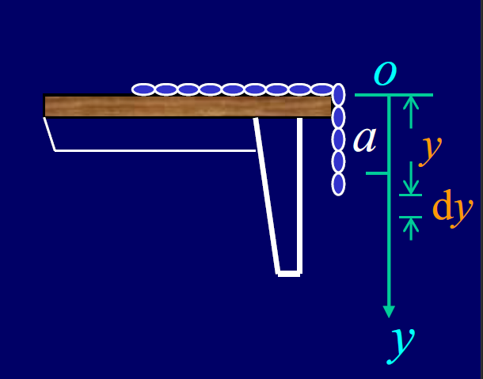

#### 3.2.2.1. 定义与性质
- **定义**: 刚体绕定轴转动的惯性大小的量度，用 $J$ 表示。
    - **分立质点系**: $J = \sum_i m_i r_i^2$
    - **连续质量分布刚体**: $J = \int r^2 dm$
- **性质**:
    - 与刚体的总质量有关。
    - 与刚体的质量分布有关。
    - 与转轴的位置有关。

#### 3.2.2.2. 常见刚体的转动惯量
| 形状 | 转轴位置 | 转动惯量 (J) |
| :--- | :--- | :--- |
| 细棒 (长l) | 通过中心与棒垂直 | $\frac{1}{12}ml^2$ |
| 细棒 (长l) | 通过端点与棒垂直 | $\frac{1}{3}ml^2$ |
| 薄圆环 (半径r) | 通过中心与环面垂直 | $mr^2$ |
| 薄圆环 (半径r) | 沿直径 | $\frac{1}{2}mr^2$ |
| 薄圆盘 (半径r) | 通过中心与盘面垂直 | $\frac{1}{2}mr^2$ |
| 空心圆筒 (内r₁,外r₂) | 沿几何轴 | $\frac{1}{2}m(r_1^2+r_2^2)$ |
| 实心圆柱 (半径r) | 沿几何轴 | $\frac{1}{2}mr^2$ |
| 球体 (半径r) | 沿直径 | $\frac{2}{5}mr^2$ |
| 球壳 (半径r) | 沿直径 | $\frac{2}{3}mr^2$ |

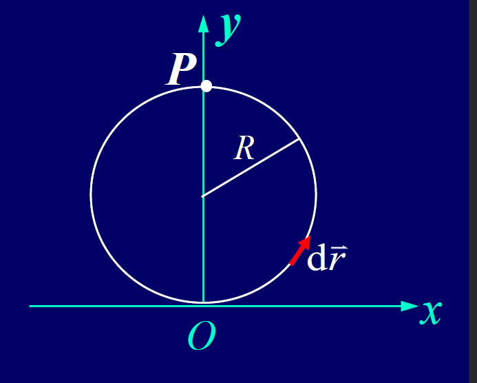

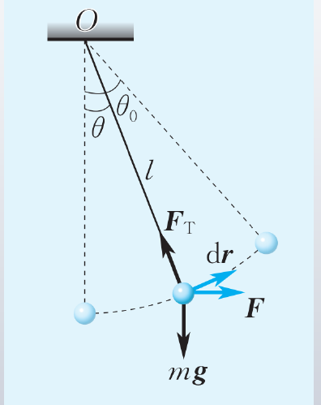

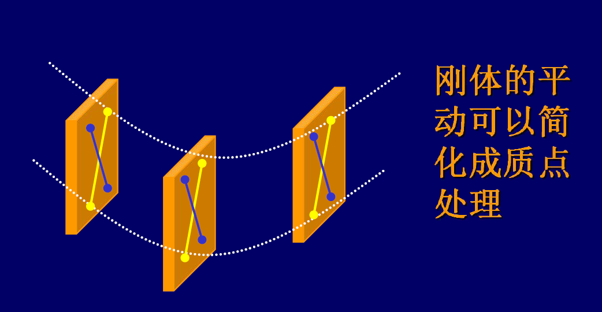

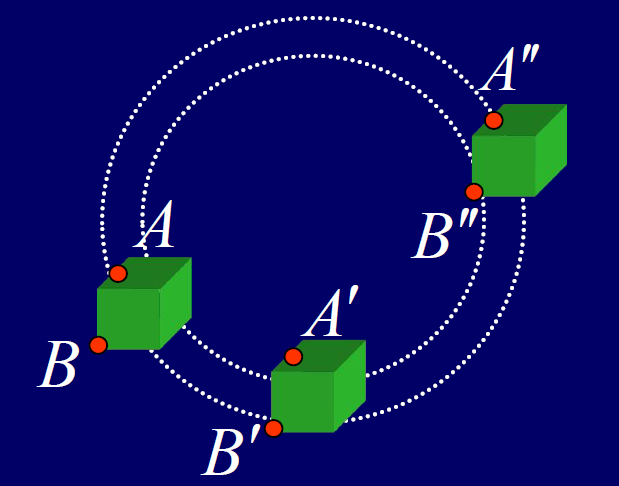

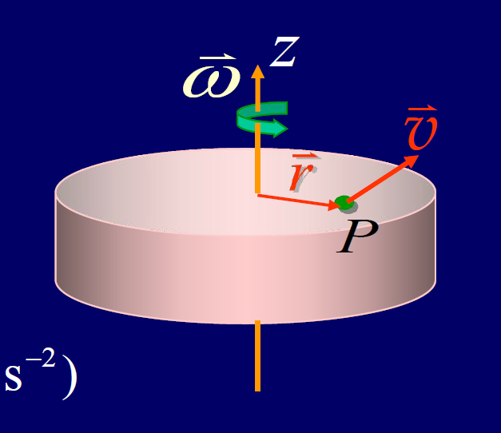

#### 3.2.2.3. 转动惯量的计算实例

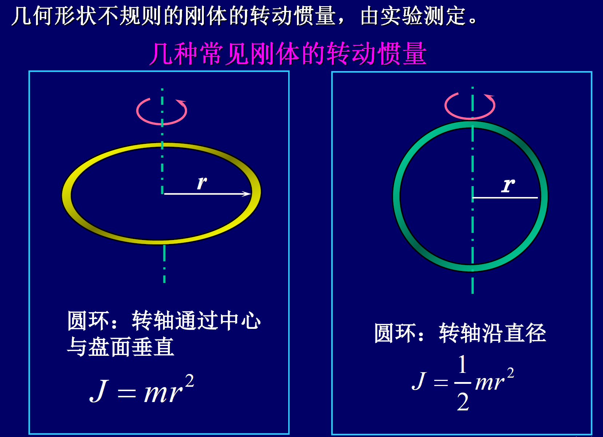

**例1 (分立质点)**: 由长为l的轻杆连接的质点系如图所示，求质点系对过A点且垂直于平面的轴的转动惯量。

    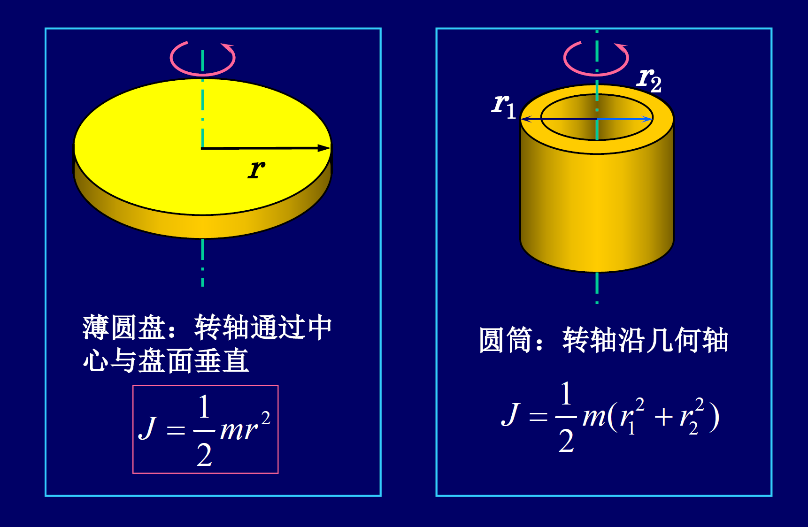

    - **解**: 根据定义式 $J = \sum_i m_i r_i^2$
    - $J = m_A r_A^2 + m_B r_B^2 + m_C r_C^2 = (2m)l^2 + (3m)(2l)^2 + (4m+5m)(\sqrt{l^2+l^2})^2$
    - $J = 2ml^2 + 12ml^2 + 9m(2l^2) = 32ml^2$

- **例2 (连续体-细棒)**: 计算长为L、质量为m的均质细棒的转动惯量。(1) 对通过杆的一端并与棒垂直的轴；(2) 对通过杆的中心并与棒垂直的轴。

    - **解**: 设棒的线密度为 $\lambda = m/L$。在距离轴x处取一质量元 $dm = \lambda dx = \frac{m}{L}dx$。

    - (1) **轴在端点**:

        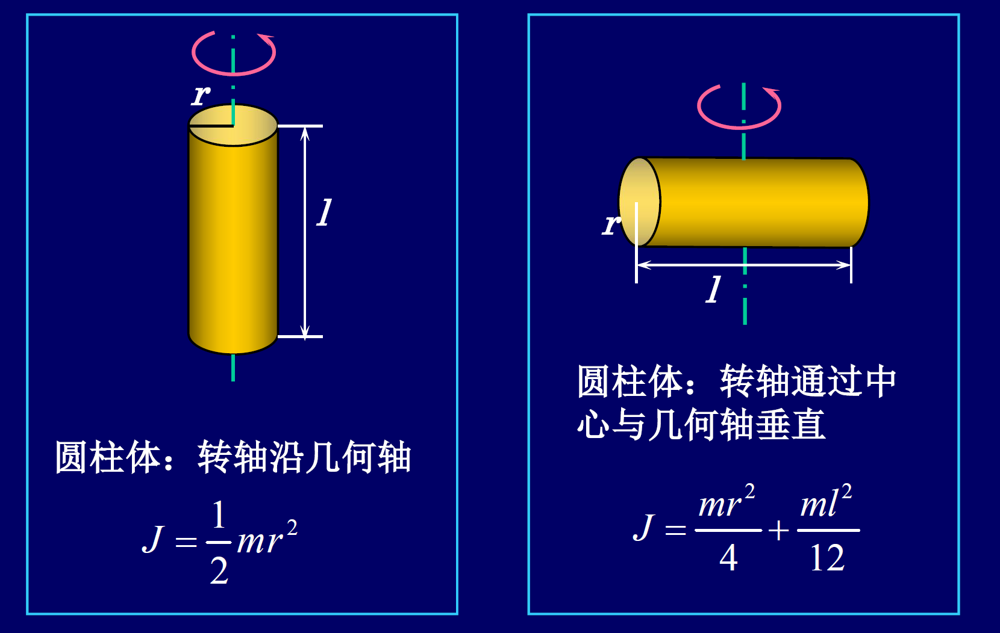

        - $J = \int r^2 dm = \int_0^L x^2 (\frac{m}{L}dx) = \frac{m}{L} [\frac{1}{3}x^3]_0^L = \frac{1}{3}mL^2$

    - (2) **轴在中心**:
      
        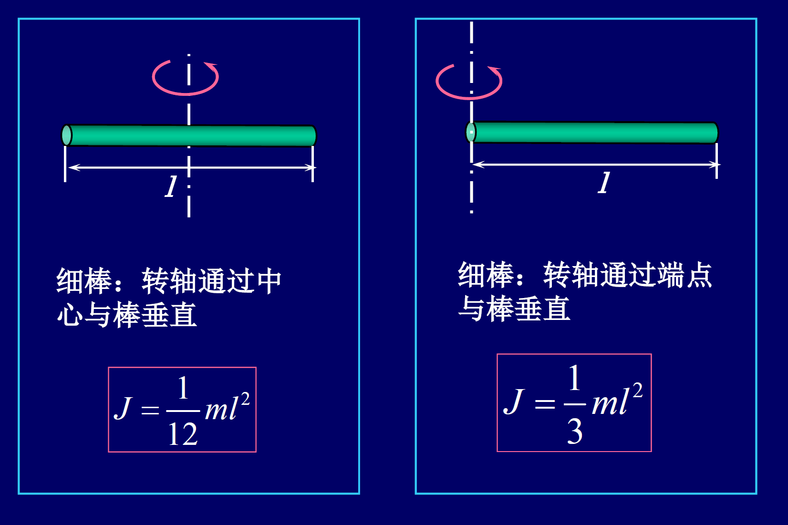
        
        - $J = \int r^2 dm = \int_{-L/2}^{L/2} x^2 (\frac{m}{L}dx) = \frac{m}{L} [\frac{1}{3}x^3]_{-L/2}^{L/2} = \frac{1}{12}mL^2$

    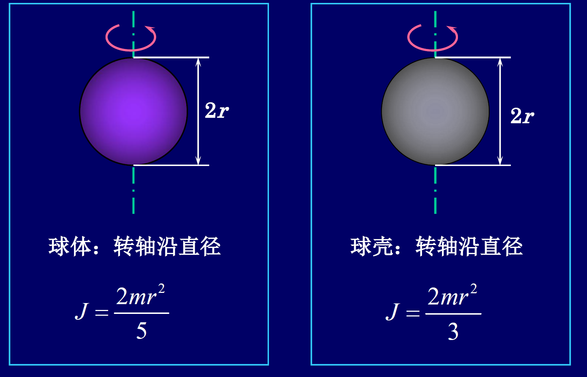
    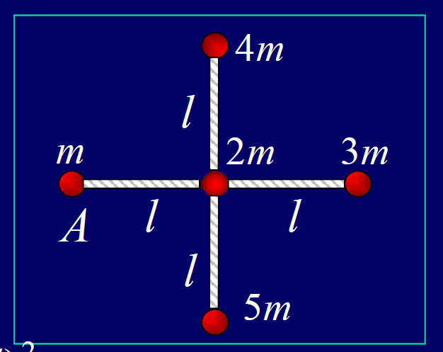

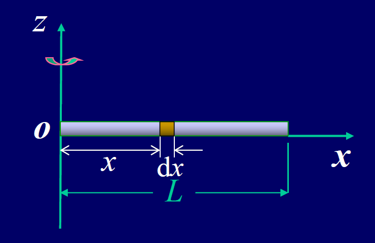

### 3.2.3. 定轴转动定律
- **内容**: 刚体绕定轴转动时，其角加速度与所受的合外力矩成正比，与刚体的转动惯量成反比。
- **公式**: $M = J\alpha = J\frac{d\omega}{dt}$
- **类比**:
| 平动 | 转动 |
| :---: | :---: |
| 力 $\vec{F}$ | 力矩 $\vec{M}$ |
| 质量 $m$ | 转动惯量 $J$ |
| 加速度 $\vec{a}$ | 角加速度 $\vec{\alpha}$ |
| $\vec{F} = m\vec{a}$ | $M = J\alpha$ |

### 3.2.4. 转动定律的应用实例
- **问题1**: 转动惯量为 $J$ 的飞轮，初角速度为 $\omega_0$，受到的阻力矩大小与角速度的平方成正比 ($M = -k\omega^2$)。求：(1) 角速度为 $\omega_0/3$ 时的角加速度；(2) 角速度从 $\omega_0$ 减为 $\omega_0/3$ 所需的时间。

- **解**:
    - (1) 由转动定律 $M=J\alpha$，得 $\alpha = M/J = -k\omega^2/J$。代入 $\omega=\omega_0/3$，得 $\alpha = -k\omega_0^2/(9J)$。
    - (2) 由 $-k\omega^2 = J\frac{d\omega}{dt}$，分离变量并积分 $\int_{\omega_0}^{\omega_0/3} \frac{d\omega}{\omega^2} = -\int_0^t \frac{k}{J}dt$，解得 $t = \frac{2J}{k\omega_0}$。
    
- **问题2**: 质量为 $m_1, m_2$ 的物体通过绳子挂在半径分别为 $R_1, R_2$ 的鼓轮上，鼓轮转动惯量为 $J$。求两物体的加速度。

    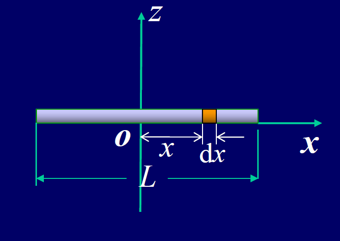

- **解**: 分别对两物体和鼓轮列方程：
    - $m_1g - T_1 = m_1a_1$
    - $T_2 - m_2g = m_2a_2$
    - $T_1R_1 - T_2R_2 = J\alpha$
    - 运动学关系: $a_1 = R_1\alpha, a_2 = R_2\alpha$
    - 联立解得: $a_1 = \frac{m_1R_1 - m_2R_2}{m_1R_1^2 + m_2R_2^2 + J}gR_1$，$a_2 = \frac{m_1R_1 - m_2R_2}{m_1R_1^2 + m_2R_2^2 + J}gR_2$。

## 3.3. 刚体转动中的功和能

### 3.3.1. 力矩的功
- **定义**: 刚体在合外力矩 $M$ 作用下转过角位移 $\theta$ 时，合外力矩所做的功。
- **元功**: $dW = Md\theta$
- **总功**: $W = \int_{\theta_1}^{\theta_2} Md\theta$

### 3.3.2. 转动动能与动能定理
- **转动动能**: 刚体绕定轴转动时具有的动能。$E_k = \sum \frac{1}{2}\Delta m_i v_i^2 = \frac{1}{2}(\sum \Delta m_i r_i^2)\omega^2 = \frac{1}{2}J\omega^2$。
- **刚体定轴转动动能定理**: 合外力矩对刚体所做的功，等于刚体转动动能的增量。
    - $W = \frac{1}{2}J\omega_2^2 - \frac{1}{2}J\omega_1^2 = \Delta E_k$

### 3.3.3. 刚体的重力势能与机械能
- **刚体的重力势能**: 等于将刚体质量全部集中在质心处的质点的重力势能。
    - $E_p = mgh_c$，其中 $h_c$ 为质心的高度。
- **刚体的机械能**: $E = E_{k,转动} + E_p = \frac{1}{2}J\omega^2 + mgh_c$

### 3.3.4. 功能原理与机械能守恒
- **功能原理**: 外力矩（不含重力）对刚体做的功等于系统机械能的增量。
    - $\int_{\theta_1}^{\theta_2} M_{外}d\theta = E_2 - E_1 = (E_{k2}+E_{p2}) - (E_{k1}+E_{p1})$
- **机械能守恒**: 若只有重力（或其他保守力）的力矩做功，则系统机械能守恒。

### 3.3.5. 功和能的应用实例
- **问题1**: 质量为M、半径为R的圆盘，盘上绕有细绳，一端挂有质量为m的物体。求物体由静止下落h高度时的速率。

    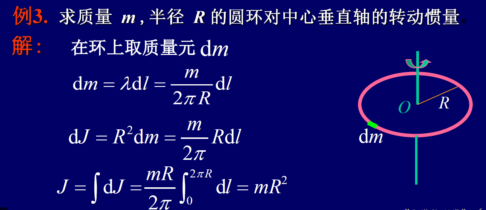

- **解 (系统机械能守恒)**: 系统初态机械能为0。末态物块动能 $\frac{1}{2}mv^2$，圆盘转动动能 $\frac{1}{2}J\omega^2 = \frac{1}{2}(\frac{1}{2}MR^2)(\frac{v}{R})^2 = \frac{1}{4}Mv^2$，物块重力势能减少 $mgh$。
  
    - $0 = (\frac{1}{2}mv^2 + \frac{1}{4}Mv^2) - mgh$
    - 解得 $v = \sqrt{\frac{mgh}{m/2+M/4}}$ (注：原文答案有误，这是正确结果)。
    
- **问题2**: 长为2l、质量为3m的细杆，两端固定质量为2m和m的小球，可绕中心o点转动。求从水平位置静止释放，转到垂直位置时的角速度。

    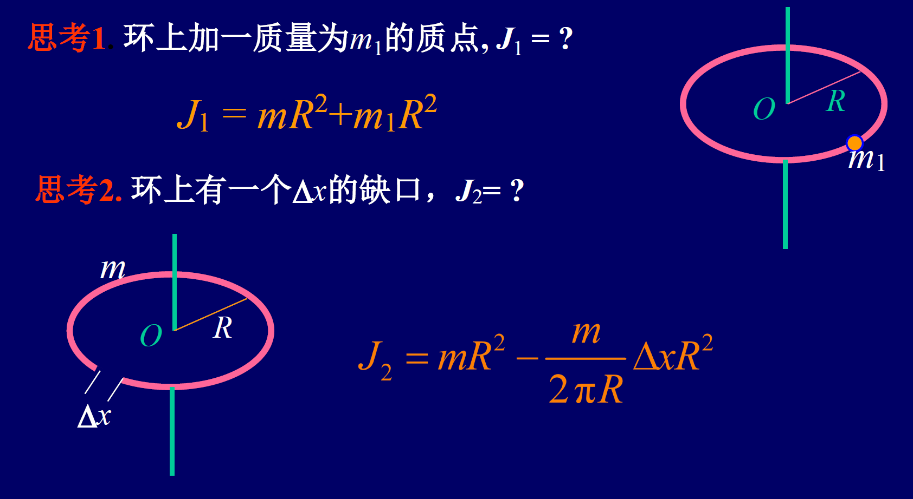

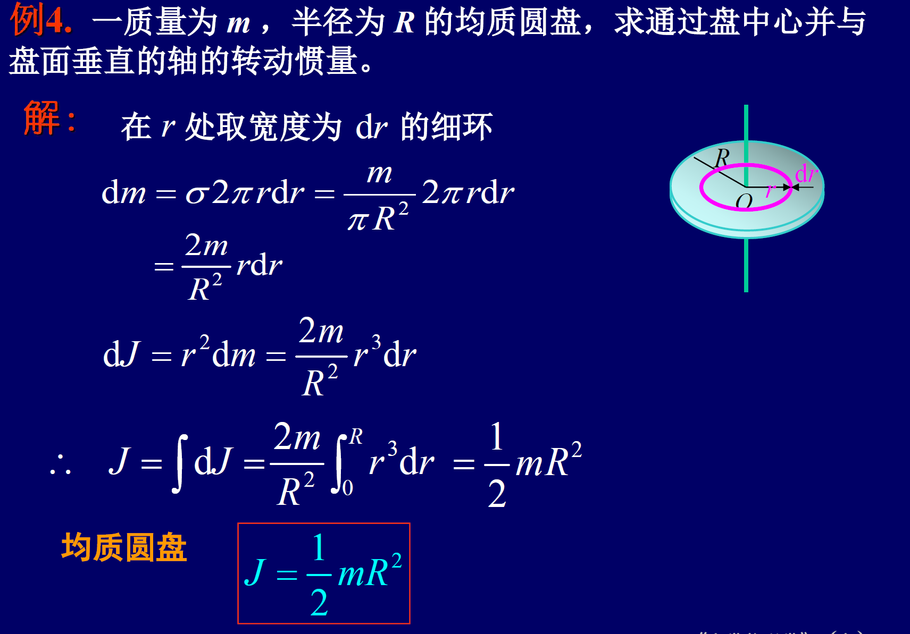
  
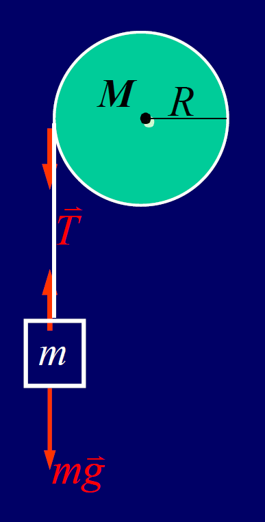
  
- **解 (系统机械能守恒)**: 取最低点为零势能面。
  
    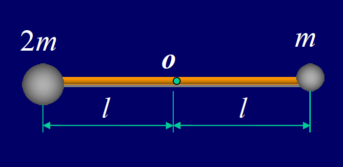
    
    - 初态势能: $E_{p1} = 2mgl + mgl = 3mgl$ (杆的质心在o点，势能为0)。
    - 末态势能: $E_{p2} = mg(2l) = 2mgl$。
    - 末态动能: $E_{k2} = \frac{1}{2}J_o\omega^2$。转动惯量 $J_o = 2m l^2 + m l^2 + \frac{1}{12}(3m)(2l)^2 = 4ml^2$。
    - 由 $E_{p1} = E_{p2} + E_{k2}$，得 $3mgl = 2mgl + \frac{1}{2}(4ml^2)\omega^2$。
    - 解得 $\omega = \sqrt{\frac{g}{2l}}$。

## 3.4. 角动量与角动量守恒

### 3.4.1. 角动量 (Angular Momentum)
- **质点的角动量**: 质点的动量 $\vec{p}$ 对某一点O的矩，也称动量矩。
    - $\vec{L} = \vec{r} \times \vec{p} = \vec{r} \times m\vec{v}$
- **刚体对定轴的角动量**: 刚体绕定轴转动时，其总角动量为所有质元角动量之和。
    - $L_z = (\sum \Delta m_i r_i^2)\omega = J_z\omega$
    - 其方向沿转轴方向。

### 3.4.2. 角动量定理
- **微分形式**: 作用于刚体的合外力矩，等于刚体角动量对时间的变化率。
    - $M = \frac{d(J\omega)}{dt} = \frac{dL}{dt}$
- **积分形式**: 刚体所受合外力矩的冲量矩，等于刚体角动量的增量。
    - $\int_{t_1}^{t_2} Mdt = J\omega_2 - J\omega_1 = \Delta L$

### 3.4.3. 角动量守恒定律
- **内容**: 如果作用于一个系统的合外力矩为零，那么该系统的总角动量保持不变。
- **公式**: 若 $M_{合外}=0$，则 $L = J\omega = \text{常量}$。
- **应用**: 若系统在作用过程中转动惯量发生变化（如人收缩手臂），则角速度会相应改变，以保证角动量守恒 ($J_1\omega_1 = J_2\omega_2$)。

### 3.4.4. 角动量定律的应用实例
- **问题1**: 质量m、半径R的均质圆盘，初角速度 $\omega_0$，与桌面摩擦系数为μ。求圆盘停止转动所需的时间。

    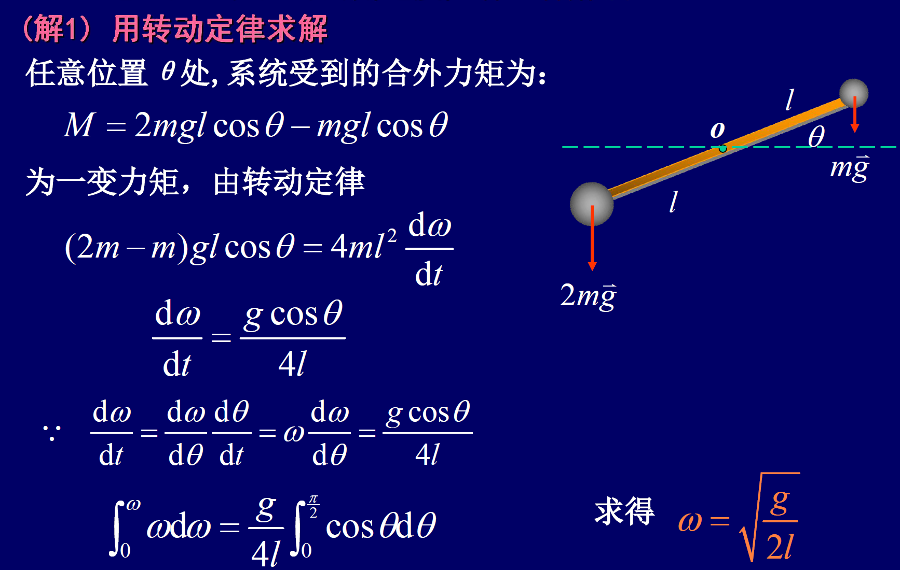

- **解**:
    - 摩擦力矩: $M_f = \int_0^R -r(\mu g dm) = -\frac{2}{3}\mu mgR$ (为恒定力矩)。
    - 应用角动量定理: $\int_0^t M_f dt = L_f - L_i \Rightarrow M_f \cdot t = 0 - J\omega_0$
    - $(-\frac{2}{3}\mu mgR) \cdot t = -(\frac{1}{2}mR^2)\omega_0$
    - 解得 $t = \frac{3R\omega_0}{4\mu g}$。
    
- **问题2**: 质量为 $m_2$ 的小滑块以速度 $v_1$ 垂直碰撞静止细棒（质量 $m_1$，长 $l$）的末端，碰后滑块以速度 $v_2$ 反弹。求棒从开始转动到因摩擦停止所需的时间。

    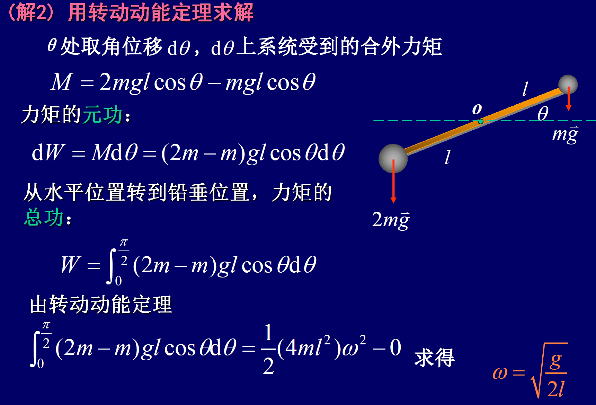

- **解**:
  
    - **第一过程 (碰撞)**: 时间极短，忽略摩擦力矩，系统角动量守恒。
        - $m_2v_1l = -m_2v_2l + J\omega = -m_2v_2l + (\frac{1}{3}m_1l^2)\omega$。可解出碰后瞬间棒的角速度 $\omega$。
    - **第二过程 (减速)**: 棒受到恒定的摩擦力矩 $M_f = -\frac{1}{2}\mu m_1 gl$。
        - 应用角动量定理: $M_f \cdot t = 0 - J\omega$
        - $(-\frac{1}{2}\mu m_1 gl)t = -(\frac{1}{3}m_1l^2)\omega$。
    - 联立两式消去 $\omega$，解得 $t=2m_2\frac{v_1+v_2}{\mu m_1 g}$。
    
- **问题3**: 质量为m、速度为v的子弹射入悬挂杆（质量M，长l）内（射入点距支点a），使杆摆起30°。求子弹初速度v。

    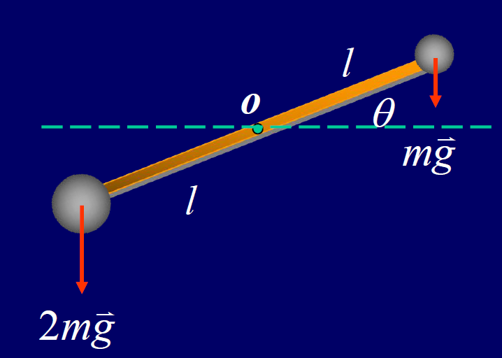

- **解**:
    - **第一过程 (碰撞)**: 子弹与杆系统角动量守恒。
        - $mva = J_{总}\omega = (\frac{1}{3}Ml^2+ma^2)\omega$
    - **第二过程 (上摆)**: 子弹与杆系统机械能守恒。
        - $\frac{1}{2}J_{总}\omega^2 = (m+M)g\Delta h_c = mga(1-\cos 30^\circ) + Mg\frac{l}{2}(1-\cos 30^\circ)$
    - 联立两式即可解出 $v$。

### 3.4.5. 综合讨论题
- **问题1**: 人站在转台上，双臂伸直水平举哑铃。当他把哑铃收缩到胸前时，人、哑铃和平台组成的系统：
- **答案 (C)**: **机械能不守恒，角动量守恒**。因为人做功改变了系统的动能（内力做功），但系统所受合外力矩为零，故角动量守恒。
- **问题2**: 人造地球卫星绕地球作椭圆轨道运动，则卫星的：
- **答案 (C)**: **角动量守恒，动能不守恒**。因为卫星只受地球的万有引力，该力始终指向地心，故对地心的力矩为零，角动量守恒。但引力会做功，导致卫星在近地点和远地点的速度不同，动能不守恒。

# 4. 气体动理论

## 4.1. 理想气体模型与统计假设

### 4.1.1. 理想气体分子模型

理想气体的微观模型基于以下三点假设：
1.  **分子是质点**: 分子的线度与其平均间距相比小到可以忽略。
2.  **无相互作用力**: 除碰撞瞬间外，分子之间以及分子与容器壁之间的相互作用力可忽略不计。分子可视为自由运动。
3.  **完全弹性碰撞**: 分子与分子之间、分子与容器壁之间的碰撞均为完全弹性碰撞。
总结：理想气体分子可看作是大量自由运动的、永不停息的、完全弹性的质点群。

### 4.1.2. 平衡态的统计假设
对于处于平衡态的大量理想气体分子，其集体行为遵循以下统计规律：
1.  **空间分布均匀**: 在容器中任意位置，单位体积内的分子数（分子数密度）处处相等。
2.  **运动方向机会均等**:
    -   任一时刻，分子向各个方向运动的概率是相同的。
    -   因此，大量分子速度在各个方向分量的平均值相等且为零（因为有正有负）。
    -   分子速度在各个方向分量的**平方的平均值**相等：$\bar{v_x^2} = \bar{v_y^2} = \bar{v_z^2}$。

## 4.2. 理想气体压强公式

### 4.2.1. 公式推导
气体对器壁的压强是大量分子不断碰撞器壁的宏观表现。
- **单个分子对器壁的冲量**: 一个质量为 $m_0$、x方向速度为 $v_{ix}$ 的分子，与垂直于x轴的器壁A（面积为 $l_2l_3$）发生一次弹性碰撞，动量变化为 $2m_0v_{ix}$。该分子施予器壁的冲量也为 $2m_0v_{ix}$。
- **单个分子的碰撞频率**: 该分子两次碰撞同一器壁A所经过的时间为 $\Delta t_i = 2l_1/v_{ix}$，因此在 $\Delta t$ 时间内与A面碰撞的次数为 $\frac{\Delta t}{\Delta t_i} = \frac{v_{ix}}{2l_1}\Delta t$。
- **单个分子在Δt内的总冲量**: $I_i = (2m_0v_{ix}) \cdot (\frac{v_{ix}}{2l_1}\Delta t) = \frac{m_0v_{ix}^2}{l_1}\Delta t$。
- **所有分子对器壁的总冲量与平均冲力**:
    - 总冲量: $I = \sum I_i = \sum \frac{m_0v_{ix}^2}{l_1}\Delta t = \frac{m_0}{l_1}(\sum v_{ix}^2)\Delta t$。
    - 平均冲力: $\bar{F} = \frac{I}{\Delta t} = \frac{m_0}{l_1}\sum v_{ix}^2$。
- **压强**:
    - $p = \frac{\bar{F}}{l_2l_3} = \frac{m_0}{l_1l_2l_3}\sum v_{ix}^2 = \frac{m_0}{V}(v_{1x}^2 + v_{2x}^2 + \cdots + v_{Nx}^2)$
    - 引入分子数N，整理得: $p = \frac{Nm_0}{V} \left( \frac{\sum v_{ix}^2}{N} \right) = nm_0\bar{v_x^2}$ (其中 $n=N/V$ 是分子数密度)。
- **利用统计假设**:
    - 由于分子速度平方在各方向分量的平均值相等，即 $\bar{v_x^2} = \bar{v_y^2} = \bar{v_z^2}$。
    - 且 $\bar{v^2} = \bar{v_x^2} + \bar{v_y^2} + \bar{v_z^2}$，所以 $\bar{v_x^2} = \frac{1}{3}\bar{v^2}$。
    - 将此关系代入压强表达式，得到最终公式。

### 4.2.2. 压强公式及其物理意义
- **基本形式**: $p = \frac{1}{3}nm_0\bar{v^2}$
    - 其中，$n$是分子数密度，$m_0$是单个分子质量，$\bar{v^2}$是分子速率平方的平均值。
    - 也可写为 $p = \frac{1}{3}\rho\bar{v^2}$，其中 $\rho = nm_0$ 是气体的质量密度。
- **与分子平均平动动能的关系**:
    - $p = \frac{2}{3}n(\frac{1}{2}m_0\bar{v^2}) = \frac{2}{3}n\bar{\epsilon_k}$
    - 其中 $\bar{\epsilon_k} = \frac{1}{2}m_0\bar{v^2}$ 是分子的平均平动动能。
- **物理意义**:
    - 该公式建立了宏观量（压强 $p$）与微观量统计平均值（分子平均平动动能 $\bar{\epsilon_k}$）之间的联系。
    - 气体压强是大量分子运动的统计平均结果，它正比于分子数密度 $n$ 和分子的平均平动动能 $\bar{\epsilon_k}$。

## 4.3. 理想气体温度公式与微观本质

### 4.3.1. 温度公式
通过联立理想气体状态方程的微观形式 $p=nkT$ 和气体动理论的压强公式 $p=\frac{2}{3}n\bar{\epsilon_k}$，可得：
- **分子平均平动动能**: $\bar{\epsilon_k} = \frac{3}{2}kT$
- **方均根速率**: $\sqrt{\bar{v^2}} = \sqrt{\frac{3kT}{m_0}} = \sqrt{\frac{3RT}{M}}$
    - $k = R/N_A \approx 1.38 \times 10^{-23} \text{ J/K}$ 是玻尔兹曼常数。（卡西欧计算器自带）
    - $R$ 来自公式 $pV=nRT$
    - $m_0$ 是单个分子质量，M是摩尔质量。

### 4.3.2. 温度的微观本质
- **温度是分子平均平动动能的量度**: 宏观温度T的本质是微观层面大量分子无规则热运动剧烈程度的标志。
- **温度是统计概念**: 温度是大量分子热运动的集体表现，对单个或少数分子谈论温度是没有意义的。
- **绝对零度的意义**: 从微观上看，绝对零度意味着所有分子的热运动（平动）都停止了。根据热力学第三定律，绝对零度不可达到。

### 4.3.3. 应用实例
- **例题1**: 两瓶不同种类的气体，其分子平均平动动能相等，但分子数密度不同。问：它们的温度是否相同？压强是否相同？
    - **解**:
        - 因为 $\bar{\epsilon_k} = \frac{3}{2}kT$，且已知 $\bar{\epsilon_{k1}} = \bar{\epsilon_{k2}}$，所以它们的温度相同，即 $T_1 = T_2$。
        - 因为 $p = nkT$，已知 $n_1 \neq n_2$ 且 $T_1 = T_2$，所以它们的压强不相同，即 $p_1 \neq p_2$。

- **例题2**: 试求氮气($N_2$, M=28 g/mol)分子的平均平动能和方均根速率。设 (1) 在温度 $t=1000$ ℃ 时; (2) $t=0$ ℃ 时; (3) $t=-150$ ℃ 时。
    - **解**:
    - **(1) t = 1000 ℃, T = 1273 K**:
        - $\bar{\epsilon_{k1}} = \frac{3}{2}kT_1 = \frac{3}{2}(1.38 \times 10^{-23})(1273) = 2.63 \times 10^{-20}$ J
        - $\sqrt{\bar{v_1^2}} = \sqrt{\frac{3RT_1}{M}} = \sqrt{\frac{3 \times 8.31 \times 1273}{28 \times 10^{-3}}} \approx 1194 \text{ m/s}$
    - **(2) t = 0 ℃, T = 273 K**:
        - $\bar{\epsilon_{k2}} = \frac{3}{2}kT_2 = \frac{3}{2}(1.38 \times 10^{-23})(273) = 5.65 \times 10^{-21}$ J
        - $\sqrt{\bar{v_2^2}} = \sqrt{\frac{3RT_2}{M}} = \sqrt{\frac{3 \times 8.31 \times 273}{28 \times 10^{-3}}} \approx 493 \text{ m/s}$
    - **(3) t = -150 ℃, T = 123 K**:
        - $\bar{\epsilon_{k3}} = \frac{3}{2}kT_3 = \frac{3}{2}(1.38 \times 10^{-23})(123) = 2.55 \times 10^{-21}$ J
        - $\sqrt{\bar{v_3^2}} = \sqrt{\frac{3RT_3}{M}} = \sqrt{\frac{3 \times 8.31 \times 123}{28 \times 10^{-3}}} \approx 320 \text{ m/s}$

## 4.4. 能量均分定理与理想气体内能

- 记忆：记住常用的总自由度，然后转动自由度=总自由度-平动自由度（3）

### 4.4.1. 自由度 (i)
- **定义**: 确定一个物体在空间的位置所需要的独立坐标的数目。
- **气体分子的自由度**: $i = t + r + s$ (平动+转动+振动)
    - **单原子分子 (如He, Ne)**: $t=3, r=0, s=0 \Rightarrow i=3$
    - **刚性双原子分子 (如O₂, N₂)**: $t=3, r=2, s=0 \Rightarrow i=5$
    - **刚性多原子分子 (如CO₂, H₂O)**: $t=3, r=3, s=0 \Rightarrow i=6$
    (注：振动自由度在高温时才需考虑，此处暂不计)

### 4.4.2. 能量均分定理
- **内容**: 在温度为T的平衡态下，气体分子每一个自由度（平动和转动）上所分配到的平均动能是相等的，其大小都等于 $\frac{1}{2}kT$。
- **分子平均总动能**: 对于有 $i$ 个自由度的分子，其平均总动能为 $\bar{\epsilon} = i \cdot (\frac{1}{2}kT) = \frac{i}{2}kT$。
    - 单原子分子: $\bar{\epsilon} = \frac{3}{2}kT$
    - 刚性双原子分子: $\bar{\epsilon} = \frac{5}{2}kT$
    - 刚性多原子分子: $\bar{\epsilon} = \frac{6}{2}kT = 3kT$
- **注意**: 能量均分定理是统计规律，仅适用于大量分子组成的系统。

### 4.4.3. 理想气体的内能
- **定义**: 理想气体的内能等于其全部分子的动能之和（因忽略分子间作用力，故无势能）。
- **计算公式**: 质量为m、摩尔质量为M的理想气体，其内能为
    - $E = N \cdot \bar{\epsilon} = (\frac{m}{M}N_A) \cdot (\frac{i}{2}kT) = \frac{m}{M} \frac{i}{2}RT$
- **结论**: 理想气体的内能只是温度的单值函数。

### 4.4.4. 应用实例

  

  

  

  
- **例题1**: 摩尔数相同的氧气和二氧化碳气体 (视为理想气体), 如果它们的温度相同, 则两气体...
    - **解**: 氧气是双原子分子($i=5, r=2$)，二氧化碳是三原子分子($i=6, r=3$)。
    - A. 内能 $E \propto i$，因自由度i不同，内能不相等。
    - B. 分子的平均（总）动能 $\bar{\epsilon} = \frac{i}{2}kT$，因i不同，不相等。
    - C. **分子的平均平动动能** $\bar{\epsilon_{tk}} = \frac{3}{2}kT$，只与温度T有关，所以**相同**。
    - D. 分子的平均转动动能 $\bar{\epsilon_{rk}} = \frac{r}{2}kT$，因转动自由度r不同，不相等。
    - **正确答案：C**

- **例题2**: 指出下列各式所表示的物理意义。
    - (1) $\frac{1}{2}kT$: 在平衡态下，气体分子每个自由度上对应的平均动能。
    - (2) $\frac{3}{2}kT$: 一个气体分子的平均平动动能。
    - (3) $\frac{i}{2}kT$: 一个具有 $i$ 个自由度的气体分子的平均总动能。
    - (4) $\frac{i}{2}RT$: 1摩尔具有 $i$ 个自由度的理想气体的内能。
    - (5) $\frac{m}{M}\frac{3}{2}RT$: 质量为 $m$ 的理想气体全部分子的平动动能之和。对于单原子气体，这也是其总内能。
    - (6) $\frac{m}{M}\frac{i}{2}RT$: 质量为 $m$ 的、分子自由度为 $i$ 的理想气体的总内能。

## 4.5. 麦克斯韦速率分布律

### 4.5.1. 速率分布的概念
- **问题**: 在平衡态下，大量气体分子的速率并非完全相同，而是呈现出一种统计分布规律：“中间多，两头少”。

- **速率分布函数 $f(v)$**:
  
    
    
    - **定义**: $f(v) = \frac{1}{N}\frac{dN}{dv}$
    - **物理意义**: 表示在速率 $v$ 附近，单位速率区间内的分子数占总分子数的百分比。对单个分子而言，是其速率处于 $v$ 附近单位速率区间的概率。
    
- **关系式**: 速率在 $v \sim v+dv$ 区间内的分子数占总数的百分比为 $f(v)dv = \frac{dN}{N}$。

- **归一化条件**: 曲线下的总面积为1，表示所有分子速率必然在 $0 \sim \infty$ 之间。$\int_0^\infty f(v)dv = 1$。

### 4.5.2. 麦克斯韦速率分布函数
- **表达式**: $f(v) = 4\pi\left(\frac{m_0}{2\pi kT}\right)^{3/2} v^2 e^{-\frac{m_0v^2}{2kT}}$

- **速率分布曲线**: 以 $v$ 为横坐标，$f(v)$ 为纵坐标画出的曲线。
  
    
    
    - **曲线下微元面积 $f(v)dv$**: 速率在 $v \sim v+dv$ 区间内的分子数占总分子数的比率。
    - **曲线下区间面积 $\int_{v_1}^{v_2} f(v)dv$**: 速率在 $v_1 \sim v_2$ 区间内的分子数占总分子数的比率。

### 4.5.3. 三种统计速率
1.  **最概然速率 (Most Probable Speed, $v_p$)**:
    - **定义**: 速率分布曲线峰值所对应的速率。
    - **公式**: $v_p = \sqrt{\frac{2kT}{m_0}} = \sqrt{\frac{2RT}{M}}$

2.  **平均速率 (Average Speed, $\bar{v}$)**:
    - **定义**: 所有分子速率的算术平均值。
    - **公式**: $\bar{v} = \int_0^\infty v f(v)dv = \sqrt{\frac{8kT}{\pi m_0}} = \sqrt{\frac{8RT}{\pi M}}$
3.  **方均根速率 (Root-Mean-Square Speed, $\sqrt{\bar{v^2}}$)**:
    - **定义**: 所有分子速率的平方的平均值的平方根。
    - **公式**: $\sqrt{\bar{v^2}} = \left( \int_0^\infty v^2 f(v)dv \right)^{1/2} = \sqrt{\frac{3kT}{m_0}} = \sqrt{\frac{3RT}{M}}$
- **大小关系**: $v_p < \bar{v} < \sqrt{\bar{v^2}}$

### 4.5.4. 速率分布的应用实例

  
- **例1**: 图为同一种气体，处于不同温度下的速率分布曲线，问 (1) 哪一条曲线对应的温度高? (2)如果这两条曲线分别对应的是同一温度下氧气和氢气的分布曲线, 问哪条曲线对应的是氧气, 哪条对应的是氢气?
  
    
    
    - **解**: 根据 $v_p = \sqrt{\frac{2RT}{M}}$。
        - (1) 曲线峰值越靠右，$v_p$ 越大，温度越高。所以**白色曲线($T_2$)对应的温度高**。
        - (2) 同一温度下，$M$ 越大，$v_p$ 越小。因为氧气(M=32)的摩尔质量大于氢气(M=2)，所以氧气的 $v_p$ 较小。因此，**绿色曲线对应氧气，白色曲线对应氢气**。
    
- **例2**: 设导体中自由电子(“电子气”)的速率分布函数为 $f(v) = \begin{cases} Av^2 & (0 < v < v_F) \\ 0 & (v > v_F) \end{cases}$，其中 $v_F$ 是费米速率。求(1)常数A; (2)$v_p, \bar{v}, \sqrt{\bar{v^2}}$。
  
    - **解**:

        - (1) **求A**: 利用归一化条件 $\int_0^\infty f(v)dv = 1$。
            - $\int_0^{v_F} Av^2 dv = A[\frac{v^3}{3}]_0^{v_F} = \frac{A}{3}v_F^3 = 1 \Rightarrow A = \frac{3}{v_F^3}$。
        - (2) **求三种速率**:
            - **最概然速率 $v_p$**: $f(v)$ 在 $0 < v < v_F$ 区间内是增函数，在 $v=v_F$ 处取得最大值，所以 $v_p = v_F$。
            - **平均速率 $\bar{v}$**: $\bar{v} = \int_0^\infty v f(v)dv = \int_0^{v_F} v(\frac{3}{v_F^3}v^2)dv = \frac{3}{v_F^3}[\frac{v^4}{4}]_0^{v_F} = \frac{3}{4}v_F = 0.75v_F$。
            - **方均根速率 $\sqrt{\bar{v^2}}$**: 先求 $\bar{v^2} = \int_0^\infty v^2 f(v)dv = \int_0^{v_F} v^2(\frac{3}{v_F^3}v^2)dv = \frac{3}{v_F^3}[\frac{v^5}{5}]_0^{v_F} = \frac{3}{5}v_F^2 = 0.6v_F^2$。
            - 所以 $\sqrt{\bar{v^2}} = \sqrt{0.6}v_F \approx 0.77v_F$。
    
- **例3**: 求速率在 $v_1 \sim v_2$ 区间内的分子的平均速率。

    - **解**: 该区间内分子的平均速率等于该区间内所有分子速率的总和，除以该区间内的分子总数。
    - $\bar{v}_{v_1-v_2} = \frac{\int_{v_1}^{v_2} v dN}{\int_{v_1}^{v_2} dN} = \frac{\int_{v_1}^{v_2} v N f(v) dv}{\int_{v_1}^{v_2} N f(v) dv} = \frac{\int_{v_1}^{v_2} v f(v) dv}{\int_{v_1}^{v_2} f(v) dv}$

## 4.6. 分子平均碰撞频率和平均自由程

### 4.6.1. 定义
- **平均碰撞频率 ($\bar{Z}$)**: 一个分子在单位时间内与其他分子碰撞的平均次数。
- **平均自由程 ($\bar{\lambda}$)**: 一个分子在连续两次碰撞之间自由运动路程的平均值。
- **关系**: $\bar{\lambda} = \frac{\bar{v}}{\bar{Z}}$

### 4.6.2. 公式表达式
- **推导思路**: 考虑一个分子A以相对平均速率 $\bar{u}$ 运动，在单位时间内扫过的体积为 $\pi d^2 \bar{u}$（d为分子直径），此体积内的分子数即为碰撞次数。经严格统计证明，相对平均速率 $\bar{u} = \sqrt{2}\bar{v}$。
- **平均碰撞频率公式**: $\bar{Z} = \sqrt{2}\pi d^2 n \bar{v}$
- **平均自由程公式**: $\bar{\lambda} = \frac{\bar{v}}{\bar{Z}} = \frac{1}{\sqrt{2}\pi d^2 n}$
- **与宏观量的关系**: 利用 $p = nkT$，可得 $\bar{\lambda} = \frac{kT}{\sqrt{2}\pi d^2 p}$。在温度一定时，平均自由程与压强成反比。

### 4.6.3. 应用实例
- **例题1**: 求氢气在标准状态下的平均碰撞频率和平均自由程。(已知氢分子直径 $d \approx 2 \times 10^{-10} \text{m}$)
    - **解**:
        - 标准状态: $T=273$ K, $p = 1.013 \times 10^5$ Pa。
        - 分子数密度: $n = \frac{p}{kT} = \frac{1.013 \times 10^5}{1.38 \times 10^{-23} \times 273} \approx 2.69 \times 10^{25} \text{ m}^{-3}$
        - 平均速率: $\bar{v} = \sqrt{\frac{8RT}{M\pi}} = \sqrt{\frac{8 \times 8.31 \times 273}{(2 \times 10^{-3}) \pi}} \approx 1.70 \times 10^3 \text{ m/s}$
        - 平均自由程: $\bar{\lambda} = \frac{1}{\sqrt{2}\pi d^2 n} = \frac{1}{\sqrt{2}\pi (2 \times 10^{-10})^2 (2.69 \times 10^{25})} \approx 2.1 \times 10^{-7} \text{ m}$
        - 平均碰撞频率: $\bar{Z} = \frac{\bar{v}}{\bar{\lambda}} = \frac{1.70 \times 10^3}{2.1 \times 10^{-7}} \approx 8.1 \times 10^9 \text{ s}^{-1}$

- **例题2**: 体积恒定时, 一定质量的理想气体的温度升高, 其分子的...
    - **解**: 体积V和分子总数N恒定，所以分子数密度 $n=N/V$ 恒定。
    - 温度T升高，分子的平均速率 $\bar{v} \propto \sqrt{T}$ 将增大。
    - 平均碰撞频率 $\bar{Z} = \sqrt{2}\pi d^2 n \bar{v}$，因为n不变，$\bar{v}$增大，所以 $\bar{Z}$ 将**增大**。
    - 平均自由程 $\bar{\lambda} = \frac{1}{\sqrt{2}\pi d^2 n}$，只与n有关，所以 $\bar{\lambda}$ 将**不变**。
    - **正确答案：A**
    
    

# 5. 热力学基础

## 5.1. 热力学基本概念

### 5.1.1. 准静态过程
- **定义**: 一个过程如果进行得足够缓慢，以至于在过程中的每一个中间状态都可以近似地看作是平衡态，这样的过程称为准静态过程（或平衡过程）。
- **特点**:
    - 它是实际热力学过程的一种理想化模型。
    - 在状态图（如p-V图）上，一个准静态过程可以用一条连续的曲线来表示。
    - 一个非静态过程，其一系列中间状态不是平衡态，无法在状态图上用一条曲线表示。
- **说明**: 本课程中计算功和热量的过程，若无特别说明，均假定为准静态过程。

### 5.1.2. 功 (Work)
- **定义**: 功是系统与外界通过宏观位移交换能量的方式，是系统内能改变的一种量度。它是宏观有序运动能量与微观无序热运动能量之间的转换。
- **计算**: 在准静态过程中，气体体积从 $V_1$ 变化到 $V_2$，系统对外做的功为：
    - $W = \int_{V_1}^{V_2} p dV$
- **p-V图的几何意义**: 系统所做的功在数值上等于p-V图上过程曲线下方的面积。
- **符号约定**:
    - 系统膨胀，对外做功，$dV > 0$, $W > 0$。
    - 系统被压缩，外界对系统做功，$dV < 0$, $W < 0$。
- **性质**: 功是一个过程量，其值依赖于过程的具体路径。

### 5.1.3. 热量 (Heat)
- **定义**: 热量是系统与外界因温差而传递的能量，是系统内能改变的另一种方式。其微观本质是分子通过碰撞传递无规则运动的能量。
- **符号约定**:
    - 系统从外界吸热, $Q > 0$。
    - 系统向外界放热, $Q < 0$。
- **性质**: 热量也是一个过程量，其值依赖于过程的具体路径。
- **摩尔热容量 (C)**:
    - **定义**: 1摩尔物质温度升高1K所吸收的热量。$C = \frac{dQ}{dT}$，单位为 J/(mol·K)。
    - **定容摩尔热容量 ($C_V$)**: 等容过程中，1摩尔气体温度升高1K所吸收的热量。$C_V = \left(\frac{dQ}{dT}\right)_V$。
    - **定压摩尔热容量 ($C_p$)**: 等压过程中，1摩尔气体温度升高1K所吸收的热量。$C_p = \left(\frac{dQ}{dT}\right)_p$。
- **热量计算**: 对于 $\nu$ 摩尔气体，在摩尔热容量为 $C_x$ 的过程中，吸收的热量为 $Q_x = \nu \int_{T_1}^{T_2} C_x dT$。

### 5.1.4. 内能 (Internal Energy)
- **定义**: 内能是系统内部所有分子无规则运动的动能和分子间相互作用的势能之总和。它是一个反映系统状态的宏观物理量。
- **理想气体的内能**:
    - 由于理想气体忽略了分子间的相互作用势能，其内能仅为全部分子热运动动能的总和。
    - 内能只是温度的单值函数：$E = \frac{m}{M}\frac{i}{2}RT = \nu C_V T$。
- **性质**: 内能是一个状态量，其改变量 $\Delta E$ 只取决于系统的初末状态，而与所经历的过程无关。
    - $\Delta E = E_2 - E_1 = \frac{m}{M}\frac{i}{2}R(T_2 - T_1)$。

## 5.2. 热力学第一定律

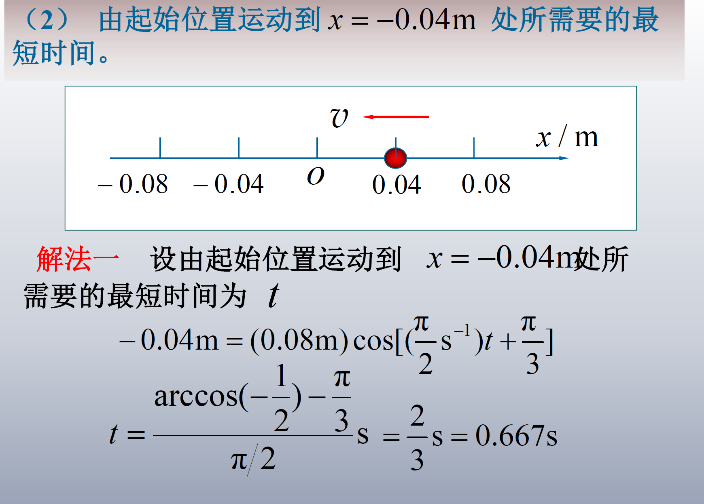

### 5.2.1. 定律的数学形式
热力学第一定律是能量守恒与转换定律在热现象中的具体体现。
- **积分形式**: 系统从状态1到状态2，吸收的热量 $Q$ 等于系统内能的增量 $\Delta E$ 与系统对外做的功 $W$ 之和。
    - $Q = \Delta E + W = (E_2 - E_1) + \int_{V_1}^{V_2} p dV$
- **微分形式**: 对于微小过程，$dQ = dE + dW = dE + p dV$。
- **符号约定**:
    - Q: 系统吸热为正，放热为负。
    - W: 系统对外做功为正，外界对系统做功为负。
    - ΔE: 系统内能增加为正，减少为负。
- **推论**: 不消耗能量而能连续不断地对外做功的机器（第一类永动机）是不可能实现的。

### 5.2.2. 在理想气体等值过程中的应用

#### 5.2.2.1. 等容过程 (Isochoric Process)
- **过程特征**: 体积不变，$V = \text{const.}$, $dV = 0$。
- **功、热、内能变化**:
    - **功**: $W = \int pdV = 0$。
    - **内能变化**: $\Delta E = \nu C_V (T_2 - T_1)$。
    - **热量**: 由热力学第一定律，$Q_V = \Delta E + W = \Delta E = \nu C_V (T_2 - T_1)$。
- **结论**: 等容过程中，系统吸收的热量全部用于增加其内能。
- **定容摩尔热容量**: $C_V = \left(\frac{dQ}{dT}\right)_V = \frac{dE}{\nu dT} = \frac{d(\nu \frac{i}{2}RT)}{\nu dT} = \frac{i}{2}R$。

#### 5.2.2.2. 等压过程 (Isobaric Process)
- **过程特征**: 压强不变，$p = \text{const.}$, $dp = 0$。过程方程为 $\frac{V}{T} = \text{const.}$。
- **功、热、内能变化**:
    - **功**: $W = \int_{V_1}^{V_2} p dV = p_0(V_2 - V_1) = \nu R(T_2 - T_1)$。
    - **内能变化**: $\Delta E = \nu C_V (T_2 - T_1)$。
    - **热量**: $Q_p = \Delta E + W = \nu C_V (T_2 - T_1) + \nu R(T_2 - T_1) = \nu (C_V+R)(T_2 - T_1)$。
- **定压摩尔热容量**:
    - $C_p = C_V + R = \frac{i+2}{2}R$ (迈耶公式)。
    - 因此 $Q_p = \nu C_p (T_2 - T_1)$。
- **比热容比**: $\gamma = \frac{C_p}{C_V} = \frac{i+2}{i}$。

#### 5.2.2.3. 等温过程 (Isothermal Process)
- **过程特征**: 温度不变，$T = \text{const.}$, $dT = 0$。过程方程为 $pV = \text{const.}$。
- **功、热、内能变化**:
    - **内能变化**: $\Delta E = \nu C_V \Delta T = 0$。
    - **功与热量**: 由热力学第一定律，$Q_T = \Delta E + W = W$。
    - $W = \int_{V_1}^{V_2} p dV = \int_{V_1}^{V_2} \frac{\nu RT}{V} dV = \nu RT \ln\frac{V_2}{V_1} = \nu RT \ln\frac{p_1}{p_2}$。
- **结论**: 等温过程中，系统吸收的热量全部用于对外做功。
- **等温摩尔热容量**: $C_T = \left(\frac{dQ}{dT}\right)_T \to \infty$。

### 5.2.3. 应用实例
- **例1**: 将 500 J 的热量传给标准状态下 2 mol 的氢气($H_2$, $i=5$)。(1) V 不变, 热量变为内能, 求末温。(2) T不变, 热量变为功, 求末压和末体积。(3) p不变, 热量变为内能和功, 求末温和末体积。
    - **解**:
        - (1) **等容**: $Q_V = \Delta E = \nu C_V (T-T_0) = 2 \cdot (\frac{5}{2}R) \cdot (T-273)$。$500 = 5 \times 8.31 \times (T-273) \Rightarrow T \approx 285$ K。
        - (2) **等温**: $Q_T = W = \nu RT_0 \ln\frac{p_0}{p}$。$500 = 2 \times 8.31 \times 273 \times \ln\frac{1.013 \times 10^5}{p} \Rightarrow p \approx 9.07 \times 10^4$ Pa。$V = \frac{p_0V_0}{p}$，其中 $V_0 = 2 \times 22.4 \times 10^{-3} \text{ m}^3$, $V \approx 5.0 \times 10^{-2} \text{ m}^3$。
        - (3) **等压**: $Q_p = \nu C_p (T-T_0) = 2 \cdot (\frac{7}{2}R) \cdot (T-273)$。$500 = 7 \times 8.31 \times (T-273) \Rightarrow T \approx 281.6$ K。$V = V_0 \frac{T}{T_0} = (2 \times 22.4 \times 10^{-3}) \frac{281.6}{273} \approx 0.046 \text{ m}^3$。

- **例2**: 理想气体由状态a经b到达c (a-b-c为直线)。求此过程的(1)功, (2)内能变化, (3)热量。
  
    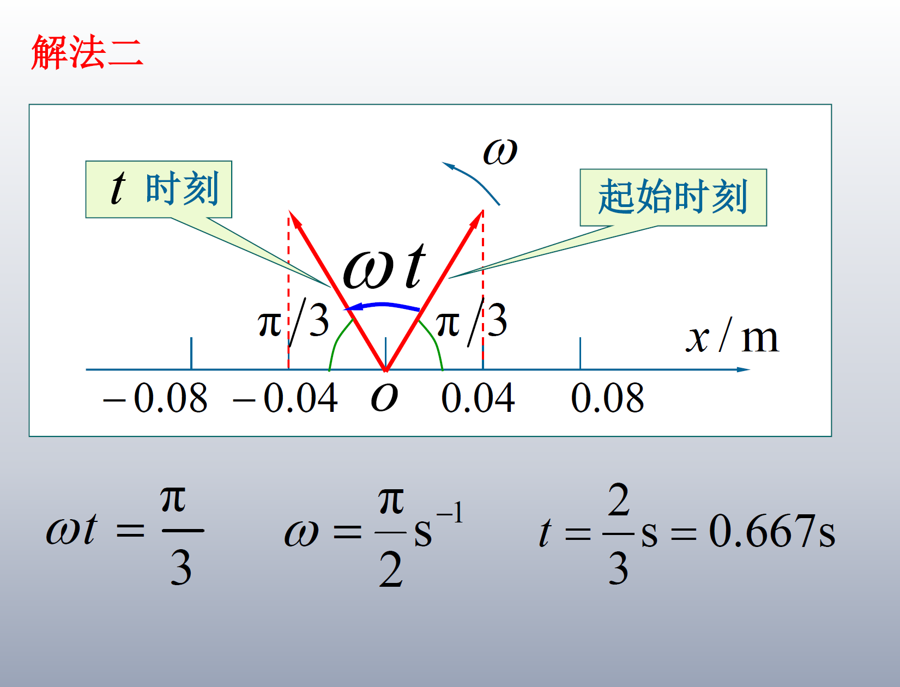
    
    - **解**:
        - (1) **功**: $W$ 等于过程曲线下的面积（梯形面积）。$W = \frac{(p_a+p_c)}{2}(V_c-V_a) = \frac{(3+1)\times 1.013\times 10^5}{2} \times (3-1)\times 10^{-3} = 405.2 \text{ J}$。
        - (2) **内能变化**: 从图中可以看出 $p_aV_a = (3 \text{ atm}) \times (1 \text{ L}) = 3$，而 $p_cV_c = (1 \text{ atm}) \times (3 \text{ L}) = 3$。根据理想气体状态方程 $pV = \nu RT$，可知 $T_a = T_c$。因此，整个过程的内能变化 $\Delta E = 0$。
        - (3) **热量**: 根据热力学第一定律，$Q = \Delta E + W = 0 + 405.2 = 405.2 \text{ J}$。
    
- **例5-1**: 5MPa、100cm³的氧气膨胀降压到0.1MPa，分别经历 (a) 等温过程，(b) 先等体后等压，(c) 先等压后等体。求各过程的功、内能改变和热量。
  
    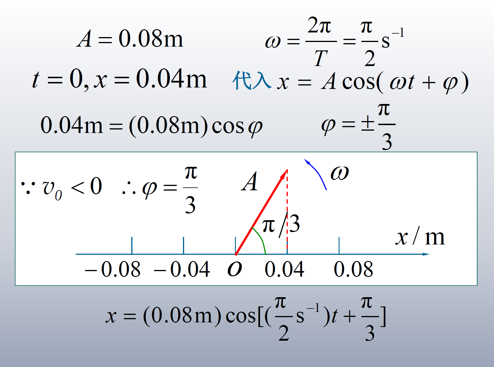
    
    - **解**: 初态(1): $p_1=5$MPa, $V_1=100$cm³。末态(2): $p_2=0.1$MPa。
    - 由于初末态温度相同（由等温过程可知 $p_1V_1=p_2V_2 \Rightarrow T_1=T_2$），所有三个过程的内能总变化均为 $\Delta E = 0$。
    - (a) **等温**: $W_a = p_1V_1 \ln\frac{V_2}{V_1} = p_1V_1 \ln\frac{p_1}{p_2} = (5\times 10^6)(100\times 10^{-6}) \ln\frac{5}{0.1} \approx 1956 \text{ J}$。$Q_a = W_a \approx 1956 \text{ J}$。
    - (b) **先等体后等压**: $W_b = W_{1\to i} + W_{i\to 2} = 0 + p_2(V_2-V_1) = (0.1\times 10^6)(5000-100)\times 10^{-6} = 490 \text{ J}$。$Q_b = W_b = 490 \text{ J}$。
    - (c) **先等压后等体**: $W_c = W_{1\to j} + W_{j\to 2} = p_1(V_2-V_1) + 0 = (5\times 10^6)(5000-100)\times 10^{-6} = 24500 \text{ J}$。$Q_c = W_c = 24500 \text{ J}$。
    
- **例3**: 2.8g氮气($N_2$)从 $p_1=1$atm, $T_1=300$K开始，经历1)等容升压至3atm，2)等温膨胀至1atm，3)等压压缩至原体积一半。求全过程的W, Q, ΔE。
  
    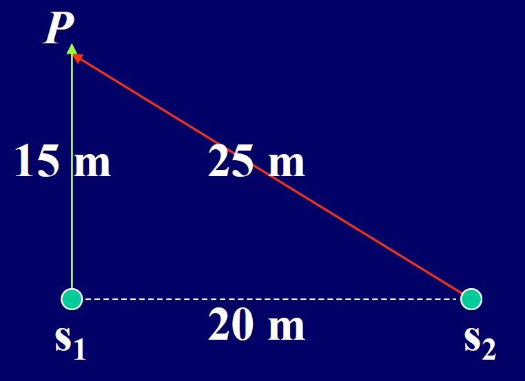
    
    - **解**: $\nu = 2.8/28 = 0.1$ mol。
    - **状态计算**:
        - 1: $p_1=1$atm, $T_1=300$K, $V_1=\frac{\nu RT_1}{p_1} \approx 2.46 \times 10^{-3} \text{ m}^3$。
        - 2: $p_2=3$atm, $V_2=V_1$, $T_2=T_1\frac{p_2}{p_1}=900$K。
        - 3: $p_3=1$atm, $T_3=T_2=900$K, $V_3=V_2\frac{p_2}{p_3}=3V_1 \approx 7.38 \times 10^{-3} \text{ m}^3$。
        - 4: $p_4=p_3=1$atm, $V_4=V_3/2=1.5V_1 \approx 3.69 \times 10^{-3} \text{ m}^3$, $T_4=T_3\frac{V_4}{V_3}=T_3/2=450$K。
    - **过程计算**:
        - **1→2 (等容)**: $W_1=0$, $Q_1=\Delta E_1 = \nu C_V(T_2-T_1) = 0.1(\frac{5}{2}R)(900-300) \approx 1247 \text{ J}$。
        - **2→3 (等温)**: $\Delta E_2=0$, $Q_2=W_2 = \nu RT_2 \ln\frac{V_3}{V_2} = 0.1 R(900)\ln 3 \approx 822 \text{ J}$。
        - **3→4 (等压)**: $W_3=p_3(V_4-V_3) = 1.013\times 10^5 (3.69-7.38)\times 10^{-3} \approx -374 \text{ J}$。$\Delta E_3 = \nu C_V(T_4-T_3) = 0.1(\frac{5}{2}R)(450-900) \approx -935 \text{ J}$。$Q_3=\Delta E_3+W_3 \approx -1309 \text{ J}$。
    - **全过程**:
        - $W = W_1+W_2+W_3 = 0+822-374 = 448 \text{ J}$。
        - $Q = Q_1+Q_2+Q_3 = 1247+822-1309 = 760 \text{ J}$。
        - $\Delta E = Q-W = 760-448 = 312 \text{ J}$。 (验算: $\Delta E_{1\to 4} = \nu C_V(T_4-T_1)=0.1(\frac{5}{2}R)(450-300) \approx 312 \text{ J}$)

## 5.3. 绝热过程与多方过程

### 5.3.1. 绝热过程 (Adiabatic Process)
- **定义**: 系统与外界没有热量交换的过程 ($Q=0, dQ=0$)。
- **特征**:
    - 由热力学第一定律，$dE+pdV=0 \Rightarrow dW = pdV = -dE$。
    - 绝热膨胀，系统对外做功，消耗自身内能，导致温度下降。
    - 绝热压缩，外界对系统做功，系统内能增加，导致温度上升。
- **功与内能变化**:
    - $\Delta E = \nu C_V (T_2-T_1)$
    - $W = -\Delta E = \nu C_V (T_1-T_2)$
- **过程方程**:
    - $pV^\gamma = \text{const.}$
    - $TV^{\gamma-1} = \text{const.}$
    - $p^{1-\gamma}T^\gamma = \text{const.}$ (或 $p^{\frac{1-\gamma}{\gamma}}T = \text{const.}$)
    - 其中 $\gamma = C_p/C_V > 1$。
- **绝热线**: 在p-V图上，绝热线 ($pV^\gamma=c$)比等温线 ($pV=c'$) 更陡峭。这是因为绝热膨胀时，体积增大和温度下降共同导致压强降低得更快。

### 5.3.2. 气体向真空绝热自由膨胀
这是一个典型的**非准静态**过程。
- **过程**: 容器绝热，气体向真空部分自由膨胀。
- **能量分析**:
    - 过程绝热，$Q=0$。
    - 气体向真空膨胀，没有克服任何外力，对外做功 $W=0$。
    - 根据热力学第一定律 $Q=\Delta E+W$，有 $\Delta E = 0$。
- **结论**: 对于理想气体，内能不变意味着温度不变 ($T_2=T_1$)。

### 5.3.3. 多方过程 (Polytropic Process)
- **定义**: 满足过程方程 $pV^n = \text{const}$ 的准静态过程，n为多方指数。
- **特殊过程**:
    - 等压过程: $n=0$
    - 等温过程: $n=1$
    - 绝热过程: $n=\gamma$
    - 等容过程: $n \to \infty$
- **摩尔热容量**: $C_n = C_V - \frac{R}{n-1}$
- **功的计算**: $W = \frac{p_1V_1 - p_2V_2}{n-1}$

### 5.3.4. 理想气体准静态过程总结
| 过程类型 | 过程方程 | 对外做功 (W) | 吸收热量 (Q) | 内能变化 ($\Delta E$) | 摩尔热容量 (C) |
| :---: | :---: | :--- | :--- | :--- | :--- |
| **等容** | $p/T=\text{const}$ | 0 | $\nu C_V \Delta T$ | $\nu C_V \Delta T$ | $C_V = \frac{i}{2}R$ |
| **等压** | $V/T=\text{const}$ | $p\Delta V = \nu R \Delta T$ | $\nu C_p \Delta T$ | $\nu C_V \Delta T$ | $C_p = \frac{i+2}{2}R$ |
| **等温** | $pV=\text{const}$ | $\nu RT \ln(V_2/V_1)$ | $W$ | 0 | $\infty$ |
| **绝热** | $pV^\gamma=\text{const}$ | $-\Delta E = \nu C_V(T_1-T_2)$ | 0 | $\nu C_V \Delta T$ | 0 |

### 5.3.5. 应用实例
- **例题**: $8\times 10^{-3}$kg氧气从 $T_1=27$℃, $V_1=0.41\times 10^{-3} \text{m}^3$ 膨胀到 $V_2=4.1\times 10^{-3} \text{m}^3$。分别求绝热膨胀和等温膨胀做的功。
    - **解**: 氧气是双原子分子, $\gamma=1.4$。$\nu = 8/32 = 0.25$ mol。
    - **绝热过程**:
        - $T_2 = T_1(V_1/V_2)^{\gamma-1} = 300 \text{K} \times (0.1)^{0.4} \approx 119.5 \text{K}$。
        - $W_Q = -\Delta E = \nu C_V(T_1-T_2) = 0.25 \times (\frac{5}{2}R) \times (300-119.5) \approx 938 \text{ J}$。
    - **等温过程**:
        - $W_T = \nu RT_1 \ln(V_2/V_1) = 0.25 \times 8.31 \times 300 \times \ln(10) \approx 1435 \text{ J}$。

- **选择题**: 对于理想气体，下列哪个过程可能发生?
    - (1) 等容加热($\Delta T>0$), 内能减少($\Delta E<0$), 压强升高($\Delta p>0$) -- **矛盾**，$\Delta E$应增加。
    - (2) 等温压缩($W<0$), 压强升高, 同时吸热($Q>0$) -- **矛盾**，由$Q=W$可知应放热。
    - (3) 等压压缩($W<0$), 内能增加($\Delta E>0$), 同时吸热($Q>0$) -- **矛盾**，$\Delta E>0$和$W<0$无法使$Q>0$。
    - (4) 绝热压缩($W<0$), 压强升高, 内能增加($\Delta E>0$) -- **可能**，$W=-\Delta E$，外界做功使内能增加。
    - **正确答案：(4)**

## 5.4. 循环过程与卡诺循环

### 5.4.1. 循环过程
- **定义**: 系统经历一系列状态变化后又回到初始状态的整个过程。
- **特征**: 在一个完整的循环中，系统的状态函数改变量为零，即内能增量 $\Delta E = 0$。
- **两种循环**:
    - **正循环 (热机)**: 在p-V图上沿顺时针方向进行，将一部分热量转化为对外做的净功。
    - **逆循环 (致冷机)**: 在p-V图上沿逆时针方向进行，消耗外界的功，将热量从低温物体转移到高温物体。

### 5.4.2. 正循环 (热机)
- **净功**: 一次循环对外做的净功 $W$ 等于p-V图上循环曲线所包围的面积。$W = W_{膨胀} - |W_{压缩}|$。
- **净热**: $Q = Q_1 - Q_2$，其中 $Q_1$ 是从高温热源吸收的热量，$Q_2$ 是向低温热源放出的热量的绝对值。
- **热力学第一定律的应用**: $\Delta E = 0 \Rightarrow Q = W \Rightarrow Q_1 - Q_2 = W$。
- **热机效率 ($\eta$)**: $\eta = \frac{W_{净功}}{Q_{吸热}} = \frac{Q_1 - Q_2}{Q_1} = 1 - \frac{Q_2}{Q_1}$。

### 5.4.3. 卡诺循环
- **定义**: 由两个等温过程和两个绝热过程组成的可逆循环。
- **过程**: 1. 等温膨胀 (吸热$Q_1$) -> 2. 绝热膨胀 -> 3. 等温压缩 (放热$Q_2$) -> 4. 绝热压缩。
- **效率**: 对于工作在温度为 $T_1$ 和 $T_2$ 的两个热源之间的理想气体卡诺热机，其效率为：
    - $\eta_C = 1 - \frac{T_2}{T_1}$
- **特点**: 卡诺循环的效率只取决于高低温热源的温度，与工作物质无关。

### 5.4.4. 逆循环 (致冷机)
- **原理**: 消耗外界的功 $W$，从低温热源吸热 $Q_2$，向高温热源放热 $Q_1$。
- **能量关系**: $Q_1 = Q_2 + W$。
- **致冷系数 ($\omega$)**: $\omega = \frac{Q_{吸热}}{W_{净功}} = \frac{Q_2}{W} = \frac{Q_2}{Q_1 - Q_2}$。
- **卡诺致冷机系数**: $\omega_C = \frac{T_2}{T_1 - T_2}$。

### 5.4.5. 循环过程实例
- **例5-7**: 室内温度27℃(300K)，冰箱保持270K。求(1)卡诺制冷系数；(2)若一天耗电1度，向房间放热多少？
    - **解**: (1) $\omega = \frac{T_2}{T_1-T_2} = \frac{270}{300-270} = 9$。
    - (2) $W = 1 \text{ kWh} = 3.6 \times 10^6 \text{ J}$。$Q_1 = Q_2+W = \omega W + W = (\omega+1)W = (9+1)(3.6\times 10^6) = 3.6 \times 10^7 \text{ J}$。

- **例题**: 氧气作ABCDA循环，A->B和C->D为等温过程($T_1=300$K, $T_2=200$K)，B->C和D->A为等容过程。$V_2=2V_1$。求效率。
    - **解**: 吸热过程是A->B和D->A。放热过程是B->C和C->D。
    - $Q_1 = Q_{AB} + Q_{DA} = \nu RT_1\ln\frac{V_2}{V_1} + \nu C_V(T_1-T_2)$。
    - $Q_2 = |Q_{BC}| + |Q_{CD}| = \nu C_V(T_1-T_2) + \nu RT_2\ln\frac{V_2}{V_1}$。
    - $\eta = \frac{W}{Q_1} = \frac{Q_1-Q_2}{Q_1} = \frac{\nu R(T_1-T_2)\ln(V_2/V_1)}{\nu RT_1\ln(V_2/V_1) + \nu C_V(T_1-T_2)} = \frac{(300-200)\ln 2}{300\ln 2 + (\frac{5}{2})(300-200)} \approx 15.1\%$。

- **例题**: 理想气体经历由两等压和两绝热过程组成的循环。求效率。
    - **解**: 吸热过程为等压升温A->B，吸热 $Q_1=\nu C_p(T_B-T_A)$。放热过程为等压降温C->D，放热 $Q_2=\nu C_p(T_C-T_D)$。
    - $\eta = 1 - \frac{Q_2}{Q_1} = 1 - \frac{T_C-T_D}{T_B-T_A}$。
    - 由绝热过程方程 $pT^{\gamma/(1-\gamma)}=\text{const.}$，可得 $\frac{T_A}{T_B} = \frac{T_D}{T_C}$。
    - 整理得 $\eta = 1 - \frac{T_C}{T_B}$。

- **例题**: 计算奥托循环的效率。
    - **解**: 吸热过程为等容升温 c->d，$Q_1=\nu C_V(T_d-T_c)$。放热过程为等容降温 e->b，$Q_2=\nu C_V(T_e-T_b)$。
    - $\eta = 1 - \frac{Q_2}{Q_1} = 1 - \frac{T_e-T_b}{T_d-T_c}$。
    - 由绝热过程方程 $TV^{\gamma-1}=\text{const.}$，可得 $\frac{T_e-T_b}{T_d-T_c} = (\frac{V_0}{V})^{\gamma-1}$。
    - $\eta = 1 - (\frac{V_0}{V})^{\gamma-1} = 1 - \frac{1}{r^{\gamma-1}}$，其中 $r=V/V_0$ 为压缩比。

## 5.5. 热力学第二定律

### 5.5.1. 自然过程的方向性
宏观自然过程都具有单向性，是不可逆的。例如：
- **功热转换**: 摩擦生热的过程不可逆。
- **热传导**: 热量总是自动地从高温物体传向低温物体。
- **气体自由膨胀**: 气体自动充满整个容器，不会自动收缩回一半。

### 5.5.2. 第二定律的表述
- **开尔文表述**: 不可能从单一热源吸取热量，使之完全变为有用功，而不产生其他任何影响。这意味着第二类永动机（效率100%的热机）不可能实现。
- **克劳修斯表述**: 热量不能自动地从低温物体传到高温物体。这意味着要实现致冷，必须借助外界做功。
- **两种表述的等效性**: 两种表述是等价的，可以互相推导。

### 5.5.3. 可逆过程与不可逆过程
- **可逆过程**: 系统在经历一个过程后，如果能使系统和外界都完全恢复到初始状态，则该过程为可逆过程。
- **不可逆过程**: 如果系统或外界在逆过程后不能恢复原状，则该过程为不可逆过程。
- **可逆过程的条件**: (1) 过程是准静态的；(2) 过程中没有摩擦、粘滞等能量耗散效应。
- **结论**: 现实中一切与热现象有关的宏观过程都是不可逆的。

### 5.5.4. 卡诺定理
- **定理一**: 在相同的高温热源和低温热源之间工作的一切可逆热机，其效率都相等，且等于卡诺效率 $\eta_C = 1 - T_2/T_1$。
- **定理二**: 在相同的高温热源和低温热源之间工作的任何不可逆热机，其效率都不能高于可逆热机的效率。$\eta_{不可逆} \le \eta_{可逆}$。
- **意义**: 指出了提高热机效率的理论上限和途径（提高高低温热源温差）。

## 5.6. 热力学第二定律的统计意义

### 5.6.1. 微观状态与宏观状态
- **微观状态**: 描述系统中每一个分子具体运动状态（位置、速度）的集合。
- **宏观状态**: 由系统的宏观参量（p, V, T）所描述的状态。
- **关系**: 一个宏观状态可以对应多个微观状态。对应微观状态数越多的宏观状态，其出现的概率就越大。

### 5.6.2. 统计意义
- 热力学过程的不可逆性源于系统总是自发地从包含微观态数目少（概率小）的宏观态向包含微观态数目多（概率大）的宏观态演化。
- 对于气体自由膨胀，分子均匀分布的宏观态所对应的微观态数目远大于全部分子集中在一边的宏观态，因此气体不会自动收缩。
- **结论**: 一个孤立系统内，一切自发过程都向着**热力学概率增大**的方向（或**熵增加**的方向）进行。

### 5.6.3. 实例
- **选择题**: 一定量的理想气体向真空作绝热自由膨胀, 体积由V增至为2V, 在此过程中气体的:
    - **解**: 自由膨胀，$\Delta E = 0$。过程不可逆，熵是增加的。
    - **正确答案：(A) 内能不变, 熵增加**

# 6. 振动学基础

## 6.1. 简谐振动 (SHM) 的描述

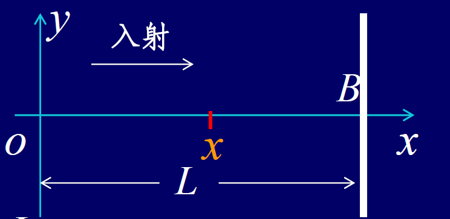

### 6.1.1. 简谐振动的定义与运动学方程
- **振动**: 一个物理量随时间做周期性或准周期性变化。
- **简谐振动(SHM)**: 物体的位移随时间按余弦（或正弦）规律变化的运动，是最简单、最基本的振动。
- **动力学特征**: 物体所受的回复力与偏离平衡位置的位移成正比，方向相反。$F = -kx$。
- **动力学方程**: $m\frac{d^2x}{dt^2} = -kx \Rightarrow \frac{d^2x}{dt^2} + \omega^2 x = 0$，其中 $\omega^2 = k/m$。
- **运动学方程 (解)**:
    - **位移**: $x = A\cos(\omega t + \varphi)$
    - **速度**: $v = \frac{dx}{dt} = -\omega A\sin(\omega t + \varphi)$
    - **加速度**: $a = \frac{dv}{dt} = -\omega^2 A\cos(\omega t + \varphi) = -\omega^2 x$

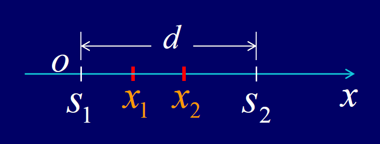

### 6.1.2. 简谐振动的特征量

1.  **振幅 (Amplitude, A)**: 振动物体离开平衡位置的最大位移的绝对值。
2.  **角频率 (Angular Frequency, ω)**: 描述振动快慢的物理量。
    - **周期 (Period, T)**: $T = \frac{2\pi}{\omega}$。
    - **频率 (Frequency, ν)**: $\nu = \frac{1}{T} = \frac{\omega}{2\pi}$。
    - 对于弹簧振子，固有角频率 $\omega = \sqrt{k/m}$。
3.  **相位 (Phase)**:
    - **相位**: $(\omega t + \varphi)$，决定了振动物体在t时刻的运动状态(x, v, a)。
    - **初相 (Initial Phase, φ)**: t=0时刻的相位。

### 6.1.3. 振幅A和初相φ的确定
A和φ是由振动的初始条件（$t=0$时的位置$x_0$和速度$v_0$）决定的。
- $x_0 = A\cos\varphi$
- $v_0 = -\omega A\sin\varphi$
- 联立解得: $A = \sqrt{x_0^2 + (v_0/\omega)^2}$，$\tan\varphi = -v_0/(\omega x_0)$。

### 6.1.4. 旋转矢量表示法
- **方法**: 用一个以角速度ω逆时针匀速旋转的矢量 $\vec{A}$ 来表示简谐振动。
    - 矢量的**模**等于振动的**振幅A**。
    - 矢量旋转的**角速度**等于振动的**角频率ω**。
    - t=0时矢量与x轴的**夹角**等于振动的**初相φ**。
- **投影**: 旋转矢量在x轴上的投影点的运动规律就是 $x = A\cos(\omega t + \varphi)$。
- **优点**: 直观，便于求解初相和进行振动合成。

###  6.1.5. 应用实例
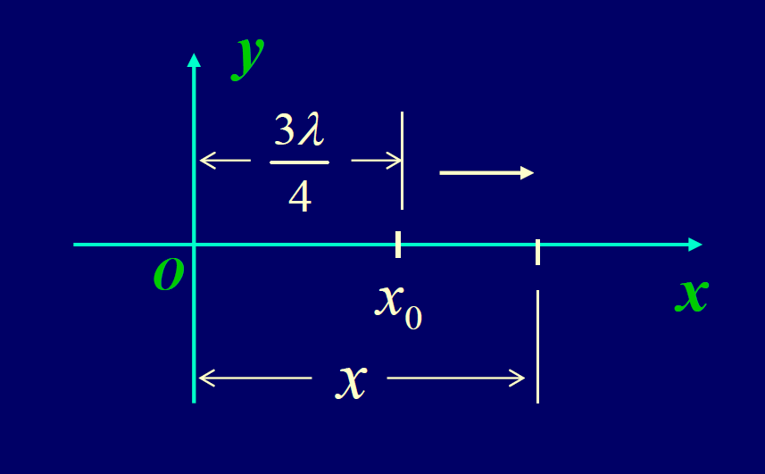
  
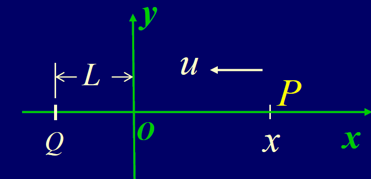
  
- **例1**: A=12cm, T=2s。t=0时, x=6cm, v>0。求 (1)振动表达式；(2)t=0.5s时的x,v,a；(3)从x=-6cm,v<0第一次回到平衡位置所需时间。
  
    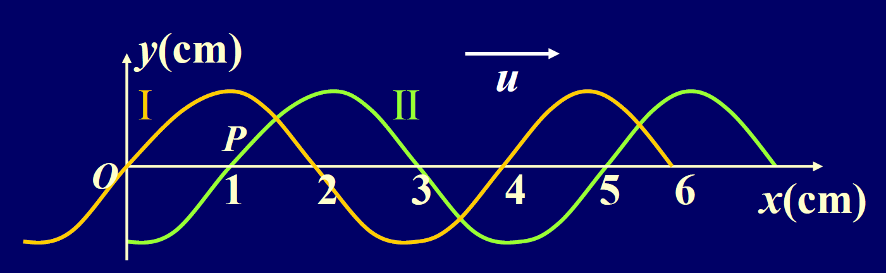
    
    - **解**: (1) $\omega=\pi$ rad/s。由 $x_0=A\cos\varphi$ 和 $v_0>0$ 得 $\varphi=-\pi/3$。表达式为 $x = 0.12\cos(\pi t - \pi/3)$ m。
    - (2) t=0.5s时，$x=0.104$m, $v=-0.189$m/s, $a=-1.03$m/s² (原文a计算有误)。
    - (3) x=-6cm, v<0 对应相位 $2\pi/3$。第一次回到平衡位置(v<0)对应相位 $\pi/2$。这是不可能的，应是回到v>0的平衡位置，对应相位 $3\pi/2$。旋转矢量需转过 $\Delta\theta = 3\pi/2 - 2\pi/3 = 5\pi/6$。所需时间 $\Delta t = \Delta\theta/\omega = (5\pi/6)/\pi = 5/6 \approx 0.83$ s。
    
- **例2**: 两同频同幅振动，当振子1在 $x_1=A/2$, v<0处时，振子2在 $x_2=0$, v>0处。求相位差。
  
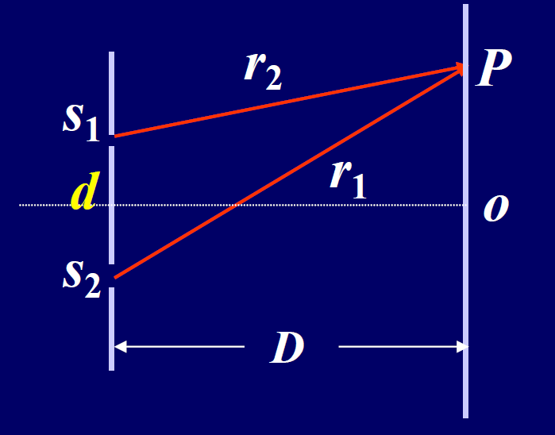
  
    - **解**: 用旋转矢量法，振子1的相位 $\varphi_1=\pi/3$。振子2的相位 $\varphi_2=-\pi/2$。相位差 $\Delta\varphi = \varphi_1 - \varphi_2 = \pi/3 - (-\pi/2) = 5\pi/6$。
    
- **例6-4**: m=0.01kg, A=0.08m, T=4s。t=0时, x=0.04m, v<0。求 (1)t=1.0s时的位置和受力。
  
    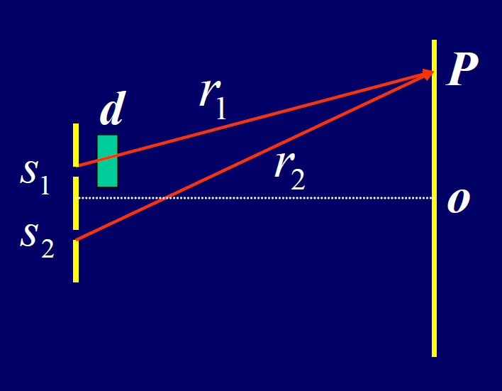
    
    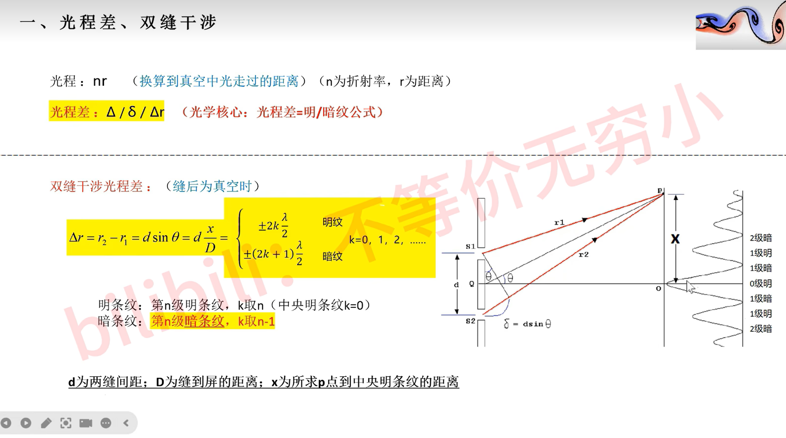
    
    - **解**: $\omega=\pi/2$ rad/s。由初始条件得 $\varphi=\pi/3$。振动方程 $x=0.08\cos(\pi t/2 + \pi/3)$。
    - t=1.0s时，$x=0.08\cos(\pi/2+\pi/3) = 0.08\cos(5\pi/6) \approx -0.069$ m。
    - 力 $F=-m\omega^2x = -(0.01)(\pi/2)^2(-0.069) \approx 1.70\times 10^{-3}$ N。
    
    

## 6.2. 简谐振动的判据与实例

### 6.2.1. 简谐振动的判据
1.  **运动学判据**: 运动方程为 $x=A\cos(\omega t+\varphi)$。
2.  **动力学判据**: 回复力满足 $F=-kx$。
3.  **微分方程判据**: 运动的微分方程为 $\frac{d^2x}{dt^2}+\omega^2x=0$。

### 6.2.2. 实例分析
- **单摆**: 在小角度摆动时($\sin\theta \approx \theta$)，回复力矩 $-mg\sin\theta \cdot l \approx -(mgl)\theta$。动力学方程为 $J\alpha = -(mgl)\theta \Rightarrow ml^2\frac{d^2\theta}{dt^2} = -(mgl)\theta \Rightarrow \frac{d^2\theta}{dt^2} + \frac{g}{l}\theta = 0$。此为SHM，周期 $T=2\pi\sqrt{l/g}$。
- **比重计**: 设比重计在平衡位置浸入体积为V，在位移x处，所受合力为 $F_{合} = F_{浮}-G = \rho g(V+\pi(d/2)^2x) - mg$。因平衡时 $mg=\rho gV$，故 $F_{合} = -(\rho g \pi d^2/4)x$。此为SHM，周期 $T=2\pi\sqrt{m/k} = \frac{4}{d}\sqrt{\frac{\pi m}{\rho g}}$。

## 6.3. 简谐振动的能量

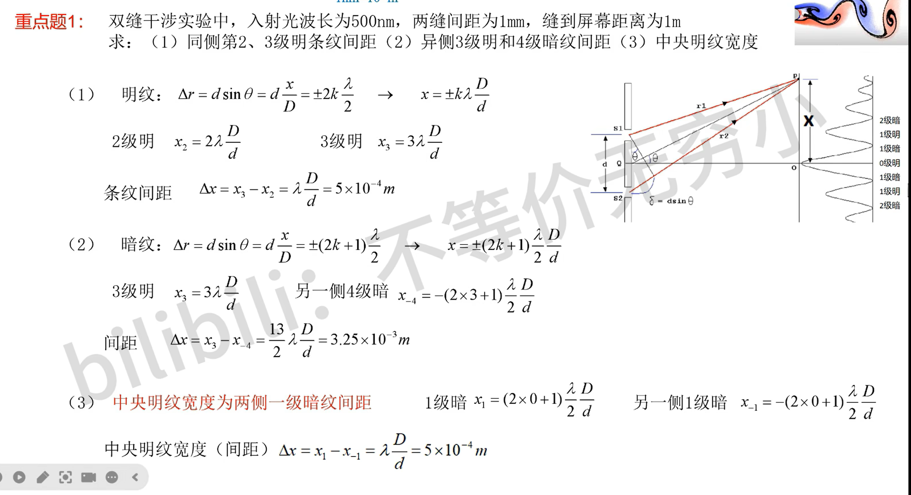

### 6.3.1. 动能、势能与总能量
- **动能**: $E_k = \frac{1}{2}mv^2 = \frac{1}{2}m\omega^2A^2\sin^2(\omega t+\varphi)$
- **势能**: $E_p = \frac{1}{2}kx^2 = \frac{1}{2}kA^2\cos^2(\omega t+\varphi)$
- **总机械能**: $E = E_k + E_p = \frac{1}{2}kA^2\sin^2(\omega t+\varphi) + \frac{1}{2}kA^2\cos^2(\omega t+\varphi) = \frac{1}{2}kA^2 = \frac{1}{2}m\omega^2A^2$。
- **结论**: 在没有阻尼的情况下，简谐振动的总机械能守恒。动能和势能相互转化，但其变化频率是振动频率的2倍。 

### 6.3.2. 应用实例
- **例6-5**: m=0.1kg, A=0.01m, $a_{max}=4.0$ m/s²。求(1)周期T; (2)最大动能; (3)总能量; (4)动能=势能时的位置。
    - **解**: (1) $a_{max}=A\omega^2 \Rightarrow \omega=\sqrt{4.0/0.01}=20$ rad/s。$T=2\pi/\omega \approx 0.314$s。
    - (2) 最大动能 $E_{k,max} = \frac{1}{2}mv_{max}^2 = \frac{1}{2}m(A\omega)^2 = \frac{1}{2}(0.1)(0.01\times 20)^2 = 0.002$ J。
    - (3) 总能量 $E = E_{k,max} = 0.002$ J。
    - (4) 当 $E_k=E_p$ 时，$E_p=E/2=0.001$ J。由 $E_p=\frac{1}{2}kx^2=\frac{1}{2}m\omega^2x^2$，得 $x = \sqrt{2E_p/(m\omega^2)} = \sqrt{2(0.001)/(0.1\cdot 20^2)} \approx \pm 0.00707$ m。

## 6.4. 振动的合成

### 6.4.1. 同方向同频率简谐振动的合成
- **原理**: 两个同方向、同频率的简谐振动 $x_1 = A_1\cos(\omega t + \varphi_1)$ 和 $x_2 = A_2\cos(\omega t + \varphi_2)$ 合成后，仍为同频率的简谐振动 $x = A\cos(\omega t + \varphi)$。

    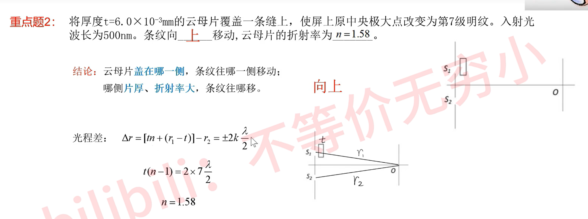

- **合成振幅与初相**:
    - $A = \sqrt{A_1^2 + A_2^2 + 2A_1A_2\cos(\varphi_2 - \varphi_1)}$
    - $\tan\varphi = \frac{A_1\sin\varphi_1 + A_2\sin\varphi_2}{A_1\cos\varphi_1 + A_2\cos\varphi_2}$
    
- **特殊情况**:
    - **同相** ($\Delta\varphi=2k\pi$): $A = A_1+A_2$ (振动加强)。
    - **反相** ($\Delta\varphi=(2k+1)\pi$): $A = |A_1-A_2|$ (振动减弱)。

### 6.4.2. 相互垂直简谐振动的合成
- **一般情况**: 合成轨迹为椭圆，方程为 $\frac{x^2}{A_1^2} + \frac{y^2}{A_2^2} - \frac{2xy}{A_1A_2}\cos(\Delta\varphi) = \sin^2(\Delta\varphi)$。

- **特殊情况 (频率相同)**:
  
    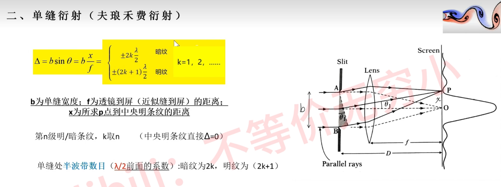
    
    - $\Delta\varphi=0$ 或 $\pi$: 合成轨迹为直线。
    - $\Delta\varphi=\pi/2$ 或 $3\pi/2$: 合成轨迹为标准椭圆。
    
- **频率成简单整数比**: 合成轨迹为稳定的、封闭的复杂曲线，称为李萨如图形。

### 6.4.3. 应用实例
- **例题1**: 两个同方向的简谐振动曲线如图所示(反相)，求合振动表达式。
    - **解**: 由图可知，两振动反相，频率相同。合振幅 $A=|A_2-A_1|$。合振动的初相与振幅较大的分振动相同。若$A_2>A_1$，则合振动初相为$\varphi_2 = -\pi/2$。合振动表达式为 $x = |A_2-A_1|\cos(\frac{2\pi}{T}t - \frac{\pi}{2})$。
- **例题2**: 合振动A=20cm，与分振动1的相位差为$\pi/6$。分振动1的振幅$A_1=10\sqrt{3}$cm。求$A_2$和两分振动的相位差。
    - **解**: 利用矢量三角形中的余弦定理：$A_2^2 = A^2+A_1^2 - 2AA_1\cos(\pi/6) = 20^2 + (10\sqrt{3})^2 - 2(20)(10\sqrt{3})(\sqrt{3}/2) = 100$。所以 $A_2=10$ cm。
    - 再用正弦定理：$\frac{A_2}{\sin(\pi/6)} = \frac{A}{\sin(\pi-\Delta\varphi)}$。可求出两分振动的相位差 $\Delta\varphi$。

# 7. 波动学基础

## 7.1 机械波的基本概念

### 7.1.1 波的定义与分类
- **波 (Wave)**：振动状态在空间中的传播过程。
- **波的分类**：
    - **机械波 (Mechanical Wave)**：机械振动在介质中的传播。
    - **电磁波 (Electromagnetic Wave)**：电磁振动在空间中的传播。
- **共同特征**：尽管本质不同，两类波都具有传播速度、能量传播、反射、折射、衍射等共同特征。

### 7.1.2 机械波的产生、类型与传播特征
- **产生条件**：
    1.  **波源 (Source)**：持续振动的物体。
    2.  **弹性介质 (Medium)**：能够传递振动的媒介。
- **机械波类型**：
    - **横波 (Transverse Wave)**：质点的振动方向与波的传播方向 **垂直**。
    - **纵波 (Longitudinal Wave)**：质点的振动方向与波的传播方向 **平行**。
- **传播特征**：
    1.  **传播状态，不迁移质点**：介质中的质点仅在各自的平衡位置附近振动，并不随波前进。
    2.  **相位依次落后**：沿波的传播方向，各质点的振动依次重复波源的振动，其振幅和频率相同，但振动相位依次落后。
    3.  **传播能量**：波的传播过程伴随着能量的传播。

### 7.1.3 描述波动的物理量
- **波长 (Wavelength) $\lambda$**：沿波的传播方向，两个相邻且振动相位差为 $2\pi$ 的质点之间的距离。它反映了波在 **空间** 上的周期性。
- **周期 (Period) T 与 频率 (Frequency) $\nu$**：
    - **周期 T**：波前进一个波长的距离所需的时间。
    - **频率 $\nu$**：周期的倒数，$\nu = 1/T$。
    - 周期和频率由波源决定，与介质性质无关，反映了波在 **时间** 上的周期性。
- **波速 (Wave Speed) u**：单位时间内振动状态传播的距离，也称相速 (Phase Velocity)。波速由介质的性质决定。
- **三者关系**：$u = \frac{\lambda}{T} = \lambda\nu$ (对所有波均适用)。

### 7.1.4 波速与介质弹性
- **弹性形变基础**
    - **线变 (Strain)**：与杨氏模量 E 相关。$F/S = E(\Delta l/l)$。
    - **切变 (Shear)**：与切变模量 G 相关。$F/S = G\phi$。
    - **体变 (Bulk Deformation)**：与体变模量 K 相关。$\Delta p = -K(\Delta V/V)$。
- **不同介质中的波速公式**
    - **纵波在固体中的波速**：$u = \sqrt{E/\rho}$
    - **横波在固体中的波速**：$u = \sqrt{G/\rho}$
    - **纵波在流体（液体、气体）中的波速**：$u = \sqrt{K/\rho}$
    - **注**：液体和气体不能承受切应力，因此 **不能传播横波**。

## 7.2 平面简谐波的数学描述

### 7.2.1 波函数及其建立
- **平面简谐波**：波源作简谐振动且波阵面为平面的波。
- **波函数 $y(x,t)$**：描述波线上任意位置 $x$ 的质点在任意时刻 $t$ 的位移的方程。
- **推导** (设波沿 x 轴正向传播，原点振动方程为 $y(0,t) = A\cos(\omega t + \phi)$)：
    - **时间延迟法**：x 处质点的振动比原点延迟了 $\Delta t = x/u$。
      $y(x,t) = y(0, t - x/u) = A\cos[\omega(t - x/u) + \phi]$
    - **相位落后法**：x 处质点的相位比原点落后了 $\Delta\phi = 2\pi x/\lambda$。
      $y(x,t) = A\cos(\omega t - 2\pi x/\lambda + \phi)$

### 7.2.2 波函数的物理意义与形式
- **物理意义**：
    - **固定位置 ($x=x_0$)**：$y(x_0,t)$ 描述 $x_0$ 处质点的 **振动方程**。
    - **固定时刻 ($t=t_0$)**：$y(x,t_0)$ 描述 $t_0$ 时刻的 **波形曲线**。
- **不同形式与传播方向**：
    - **通用形式**：$y(x,t) = A\cos[\omega(t \mp \frac{x}{u}) + \phi] = A\cos[2\pi(\frac{t}{T} \mp \frac{x}{\lambda}) + \phi]$
    - **“$-”$ 号**：波沿 x 轴 **正方向** 传播。
    - **“$+$” 号**：波沿 x 轴 **负方向** 传播。

### 7.2.3 相位差与波程差
- **关系式**：沿同一方向传播的波，线上 $x_1$ 和 $x_2$ 两点的相位差 $\Delta\phi$ 与其波程差 $(x_2 - x_1)$ 的关系为：
  $\Delta\phi = \phi_1 - \phi_2 = \frac{2\pi}{\lambda}(x_2 - x_1)$

### 7.2.4 判断质点振动方向
- **方法**：“上坡下，下坡上”原则
    - **右行波**：波形图上，位于波峰左侧（上坡）的点向下振动，位于波峰右侧（下坡）的点向上振动。
    - **左行波**：相反，位于波峰右侧（上坡）的点向上振动，位于波峰左侧（下坡）的点向下振动。

### 7.2.5 波函数应用实例
- 
  
- **例题 7.2.1**：一平面简谐波沿 x 轴正向传播。已知 $x_0 = \frac{3}{4}\lambda$ 处质点的振动表达式为 $y=A\cos\omega t$，求 (1) 原点 O 处质点的振动方程；(2) 该波的波动方程。
  
    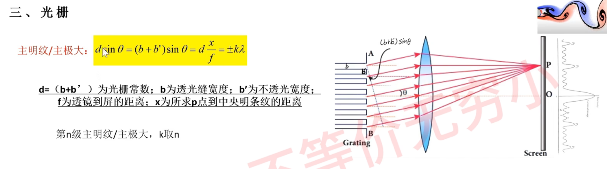
    
    - **解**：
        1.  **原点振动方程**：波沿正向传播，原点 O 的振动超前于 $x_0$ 处。相位超前量为 $\Delta\phi = \frac{2\pi x_0}{\lambda} = \frac{2\pi (3\lambda/4)}{\lambda} = \frac{3\pi}{2}$。因此，原点振动方程为 $y_0(t) = A\cos(\omega t + \frac{3\pi}{2})$。
        2.  **波动方程**：以原点振动为基础，可写出波动方程为 $y(x,t) = A\cos[\omega(t - \frac{x}{u}) + \frac{3\pi}{2}]$ 或 $y(x,t) = A\cos(\omega t - \frac{2\pi x}{\lambda} + \frac{3\pi}{2})$。
    
- **例题 7.2.2**：一沿x轴正向传播的平面简谐波，波长 $\lambda=0.1\text{m}$，原点振动表达式为 $y=0.03\cos\pi t$ (m)。求 (1) 波动表达式；(2) $x_1=0.5\text{m}$ 及 $x_2=1.0\text{m}$ 两点振动的相位差。
  
    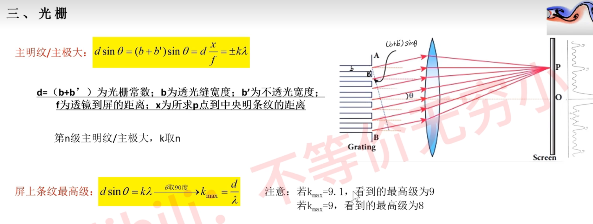
    
    - **解**：
        1.  **波动表达式**：由原点振动方程可知 $A=0.03\text{m}$，$\omega=\pi \text{ s}^{-1}$，所以 $T=2\pi/\omega=2\text{s}$。波动方程为 $y(x,t) = A\cos[2\pi(\frac{t}{T} - \frac{x}{\lambda})] = 0.03\cos[2\pi(\frac{t}{2} - \frac{x}{0.1})] = 0.03\cos(\pi t - 20\pi x)$。
        2.  **相位差**：两点相位差为 $\Delta\phi = \phi_1 - \phi_2 = \frac{2\pi}{\lambda}(x_2 - x_1) = \frac{2\pi}{0.1}(1.0 - 0.5) = 10\pi$。相位差是 $2\pi$ 的整数倍，说明两点振动状态完全相同。
    
- **例题 7.2.3**：一平面余弦波沿绳自左向右传播，波速 $u=1\text{m/s}$，频率 $\nu=0.5\text{Hz}$，振幅 $A=0.1\text{m}$。绳左端为原点，t=0时，原点经平衡位置向下运动。求 (1) 角频率；(2) 波动表达式；(3) 距原点1.5m处质点的振动方程。
    - **解**：
        1.  **角频率**：$\omega = 2\pi\nu = 2\pi \times 0.5 = \pi \text{ rad/s}$。
        2.  **波动表达式**：先求原点振动方程 $y_0(t) = A\cos(\omega t + \phi)$。t=0时，$y_0=0$，所以 $\cos\phi=0$，$\phi=\pm\pi/2$。又因初速度 $v_0<0$ (向下)，而 $v_0 = -\omega A \sin\phi < 0$，所以 $\sin\phi > 0$，取 $\phi = \pi/2$。原点振动方程为 $y_0(t) = 0.1\cos(\pi t + \pi/2)$。波向右（正向）传播，波动表达式为 $y(x,t) = 0.1\cos[\pi(t - x/u) + \pi/2] = 0.1\cos[\pi(t-x) + \pi/2]$。
        3.  **质点振动方程**：将 $x=1.5\text{m}$ 代入波动表达式，得 $y(1.5,t) = 0.1\cos[\pi(t - 1.5) + \pi/2] = 0.1\cos(\pi t - 1.5\pi + 0.5\pi) = 0.1\cos(\pi t - \pi)$。

- **例题 7.2.4**：已知波沿x正向传播，$t=0$时波形为图I，$t=0.5\text{s}$时波形为图II（图中显示波峰从$x=0.01$m移动到$x=0.02$m，波长为0.04m）。求波函数和P点($x=0.01$m)的振动表达式。
  
    
    
    - **解**：
        1.  **求波的参数**：由图可知 $A=0.01\text{m}$，$\lambda=0.04\text{m}$。波在 $0.5\text{s}$ 内前进了 $\Delta x = 0.01\text{m}$，故波速 $u = \Delta x / \Delta t = 0.01/0.5 = 0.02\text{m/s}$。周期 $T = \lambda/u = 0.04/0.02 = 2\text{s}$。角频率 $\omega=2\pi/T=\pi \text{ rad/s}$。
        2.  **求原点初相**：$t=0$时 (图I)，原点($x=0$)处在平衡位置，且其后一时刻位移为负，即初速度向下 ($v_0<0$)。因此初相 $\phi=\pi/2$。原点振动方程为 $y_0(t) = 0.01\cos(\pi t + \pi/2)$。
        3.  **波函数**：$y(x,t) = 0.01\cos[\pi(t-x/u) + \pi/2] = 0.01\cos[\pi(t - x/0.02) + \pi/2]$。
        4.  **P点振动表达式**：将 $x_P=0.01\text{m}$ 代入波函数，得 $y_P(t) = 0.01\cos[\pi(t - 0.01/0.02) + \pi/2] = 0.01\cos(\pi t - \pi/2 + \pi/2) = 0.01\cos(\pi t)$。

## 7.3 波的几何、能量与衍射

### 7.3.1 波的几何描述与惠更斯原理
- **波面 (Wave Surface)**：介质中某一时刻振动相位相同的所有点构成的面。
- **波前 (Wave Front)**：最前方的波面。
- **波线 (Wave Ray)**：表示波的传播路径和方向的线，与波面垂直。
- **惠更斯原理 (Huygens' Principle)**：波阵面上的每一点都可视为发射子波的新波源，这些子波的包络面就是下一时刻的新波阵面。
- **波的衍射 (Diffraction)**：波在传播中遇到障碍物时，能绕过其边缘进入阴影区的现象。惠更斯原理可定性解释衍射。

### 7.3.2 波的能量
- **质元能量**：在波动中，任一体积元 $\Delta V$ 的动能和势能相等且相位相同。
    - $\Delta E_k = \Delta E_p = \frac{1}{2}\rho\Delta V \omega^2 A^2 \sin^2\omega(t-\frac{x}{u})$
    - **总能量**：$\Delta E = \Delta E_k + \Delta E_p = \rho\Delta V \omega^2 A^2 \sin^2\omega(t-\frac{x}{u})$
- **能量密度 (Energy Density) w**：单位体积内波的能量。
    - **平均能量密度**：$\bar{w} = \frac{1}{2}\rho A^2\omega^2$
- **能流密度 / 波强 (Intensity) I**：单位时间内垂直通过单位面积的平均能量。
    - **公式**：$I = \bar{w}u = \frac{1}{2}\rho u A^2\omega^2$

### 7.3.3 声波 (Sound Wave)
- **性质**：声波是一种纵波，可闻频率范围为 20Hz ~ 20kHz。
- **声强级 (Sound Level) L**：为方便描述，使用分贝(dB)为单位的声强级。
    - **基准声强**：$I_0 = 10^{-12} \text{ W/m}^2$ (听阈)。
    - **计算公式**：$L = 10\lg\frac{I}{I_0} \quad (\text{dB})$

## 7.4 波的叠加与干涉

### 7.4.1 叠加原理与干涉现象
- **波的叠加原理 (Superposition Principle)**：几列波相遇时，在叠加区域内，任一质点的总位移是各列波单独存在时在该点产生的位移的矢量和。
- **波的干涉 (Interference)**：两列相干波叠加时，空间中形成某些区域振动始终加强，另一些区域振动始终减弱的稳定现象。
- **相干条件 (Coherence)**：两波源必须满足频率相同、振动方向相同、相位差恒定。

### 7.4.2 干涉的加强与减弱条件
设两波源初始相位差为 $\phi_2 - \phi_1$，到某点P的波程差为 $r_2 - r_1$，则P点的总相位差为 $\Delta\phi = (\phi_2 - \phi_1) - 2\pi\frac{r_2 - r_1}{\lambda}$。
- **加强条件 (Constructive)**：$\Delta\phi = \pm 2k\pi \quad (k=0,1,2,\dots)$
    - 合振幅：$A = A_1 + A_2$
- **减弱条件 (Destructive)**：$\Delta\phi = \pm (2k+1)\pi \quad (k=0,1,2,\dots)$
    - 合振幅：$A = |A_1 - A_2|$
- **特例** (波源同相 $\phi_1=\phi_2$)：
    - **加强**：波程差 $\delta = |r_2 - r_1| = k\lambda$
    - **减弱**：波程差 $\delta = |r_2 - r_1| = (2k+1)\frac{\lambda}{2}$

### 7.4.3 干涉强度
- **合成强度**：$I = I_1 + I_2 + 2\sqrt{I_1 I_2} \cos \Delta\phi$
- **能量分布**：干涉是能量的重新分布，总能量守恒，但在空间形成稳定的强弱相间图样。

### 7.4.4 干涉应用实例
- **例题 7.4.1**：$S_1$和$S_2$为两相干波源，振幅均为5μm，频率100Hz，波速500m/s。两波源相位差为$\pi$。求两列波在P点($r_1=15\text{m}, r_2=25\text{m}$)的干涉结果。
  
    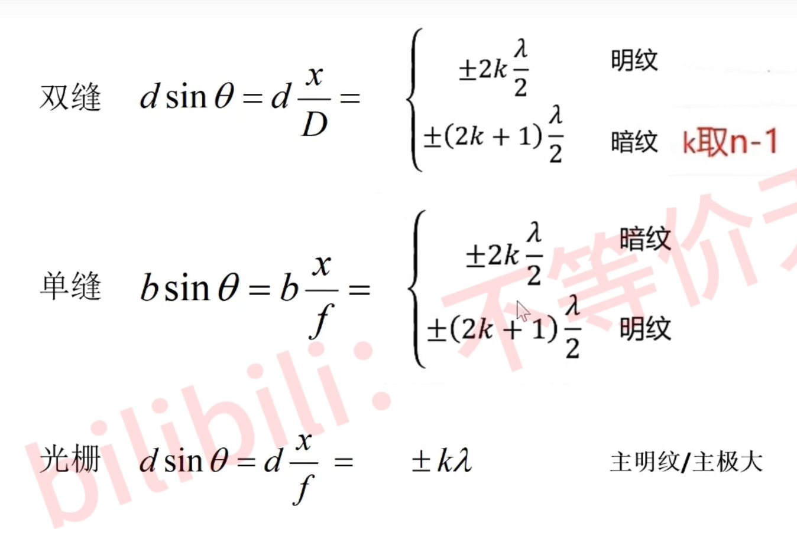
    
    - **解**：
        1.  **求波长**：$\lambda = u/\nu = 500/100 = 5\text{m}$。
        2.  **求总相位差**：P点的总相位差 $\Delta\phi$ = (波源相位差) - (波程差导致的相位差)。
            $\Delta\phi = (\phi_2 - \phi_1) - 2\pi\frac{r_2 - r_1}{\lambda} = \pi - 2\pi\frac{25-15}{5} = \pi - 4\pi = -3\pi$。
        3.  **判断干涉结果**：因为 $\Delta\phi = -3\pi = (2k+1)\pi$ (k=-2)，满足干涉相消（减弱）条件。由于两波振幅相等，合振幅为$A_{合} = |A-A| = 0$。因此P点始终静止。
    
- **例题 7.4.2**：两相干波源 $S_1, S_2$ 相距 $d=30\text{m}$，发出的波沿x轴相向传播。已知 $x_1=9\text{m}$ 和 $x_2=12\text{m}$ 是两相邻的因干涉而静止的点。求波长和两波源的最小相位差。
  
    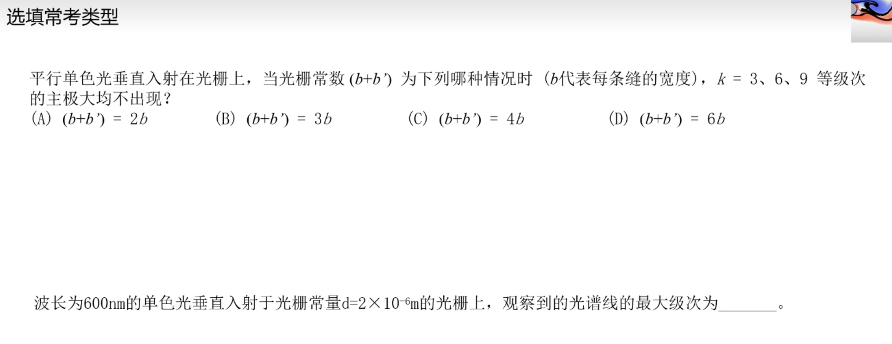
    
    - **解**：
        1.  **求波长**：相邻静止点（波节）之间的距离为 $\lambda/2$。因此 $\lambda/2 = x_2 - x_1 = 12 - 9 = 3\text{m} \implies \lambda = 6\text{m}$。
        2.  **求相位差**：设$S_1$在原点，静止点（相消）满足 $\Delta\phi = (\phi_2 - \phi_1) - 2\pi\frac{\delta}{\lambda} = (2k+1)\pi$。对 $x_1=9\text{m}$，波程差 $\delta = r_2-r_1 = (30-9)-9 = 12\text{m}$。代入得：$\phi_2 - \phi_1 - 2\pi\frac{12}{6} = \phi_2 - \phi_1 - 4\pi = (2k+1)\pi$。所以 $\phi_2 - \phi_1 = (2k+5)\pi$。为使相位差绝对值最小，取 $k=-2$ 或 $k=-3$，得 $\phi_2 - \phi_1 = \pi$ 或 $-\pi$。最小相位差为 $\pi$。

## 7.5 驻波 (干涉的特例)

### 7.5.1 驻波的形成与方程
- **定义**：两列振幅、频率、振动方向均相同，但在同一直线上沿相反方向传播的相干波叠加形成的波。
- **驻波方程**：$y = (2A\cos\frac{2\pi x}{\lambda}) \cdot \cos\frac{2\pi t}{T}$
- **特征**：驻波不传播相位和能量，故名“驻波”。

### 7.5.2 驻波的特征
- **波腹 (Antinode)**：振幅最大的点 (振幅为 $2A$)。
    - 位置：$x = \pm k\frac{\lambda}{2} \quad (k=0,1,2,\dots)$
- **波节 (Node)**：始终静止的点 (振幅为 $0$)。
    - 位置：$x = \pm (2k+1)\frac{\lambda}{4} \quad (k=0,1,2,\dots)$
- **相位**：相邻两波节之间的所有质点振动相位相同；跨过一个波节，相位相反。
- **能量**：能量在波腹（动能集中处）和波节（势能集中处）之间周期性转换，不向外传播。

### 7.5.3 波的反射与半波损失
- **半波损失 (Half-wave Loss)**：波在反射时，若反射波的相位与入射波相比有 $\pi$ 的突变，相当于波程损失了 $\lambda/2$。
- **反射规律**：
    - **固定端反射** (如波从波疏介质射向波密介质)： **有** 半波损失，反射点为 **波节**。
    - **自由端反射** (如波从波密介质射向波疏介质)： **无** 半波损失，反射点为 **波腹**。

### 7.5.4 反射波应用实例
- **例题 7.5.1**：一入射波方程为 $y_1 = A\cos[2\pi(\nu t - x/\lambda) + \phi]$，波在 $x=L$ 处发生反射，反射点为固定端。求反射波方程。
  
    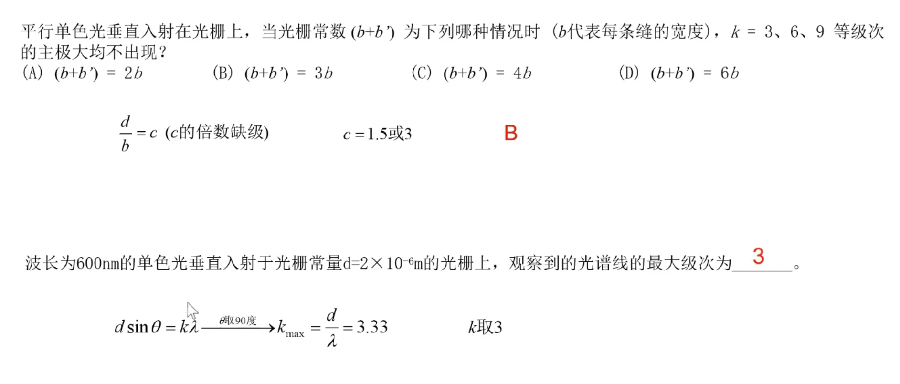
    
    - **解**：
        1.  **反射性质**：固定端反射，有 $\pi$ 的相位突变。
        2.  **反射波形式**：反射波沿 x 轴负方向传播，其形式为 $y_2 = A\cos[2\pi(\nu t + x/\lambda) + \phi']$。
        3.  **相位关系**：在反射点 $x=L$ 处，任意时刻 $t$，反射波的相位必须比入射波的相位多 $\pi$。即：$[2\pi(\nu t + L/\lambda) + \phi'] = [2\pi(\nu t - L/\lambda) + \phi] + \pi$。
        4.  **求解新相位**：化简上式可得 $\phi' = \phi - 4\pi L/\lambda + \pi$。
        5.  **反射波方程**：代入 $\phi'$，得 $y_2 = A\cos[2\pi(\nu t + x/\lambda) + \phi - 4\pi L/\lambda + \pi]$。

### 7.5.5 弦振动的简正模式
- **驻波条件**：长度为 L、两端固定的弦，形成驻波的条件是 $L = n\frac{\lambda_n}{2} \quad (n=1,2,3,\dots)$。
- **本征频率**：弦上可能存在的驻波频率（固有频率）。
  $\nu_n = \frac{u}{\lambda_n} = n\frac{u}{2L} \quad (n=1,2,3,\dots)$
- **简正模式**：与各本征频率相对应的特定振动模式。$n=1$ 为基频，$n>1$ 为谐频。

## 7.6 复习与思考

### 7.6.1 概念判断
1.  **各类波动的产生都需要介质和波源。** (×) 电磁波传播不需要介质。
2.  **波速就是介质元的振动速度。** (×) 波速是相速，由介质决定；质元振速随时间变化。
3.  **波在不同介质中传播时波长是相同的。** (×) 频率由波源决定不变，波速改变，故波长 $\lambda=u/\nu$ 改变。
4.  **波函数只能描述横波, 而不能描述纵波。** (×) 位移y可代表横向或纵向位移。
5.  **已知坐标原点的振动表达式才能建立波函数。** (×) 已知任一点的振动表达式均可建立。
6.  **波函数与坐标原点的选择无关。** (×) 波函数的形式依赖于坐标原点的选择。
7.  **波函数与计时零点的选择无关。** (×) 波函数的形式依赖于计时零点的选择（影响初相）。
8.  **在液体和气体中不可能传播横波。** (√) 因为流体无切变弹性。

# 8. 光的干涉

光学题：**光程差=明暗纹公式**

## 8.1. 光的相干性与光源

### 8.1.1. 光的电磁理论要点
- **8.1.1.1. 光速**
    - 真空中：$c = 1/\sqrt{\varepsilon_0\mu_0}$
    - 介质中：$v = c/\sqrt{\varepsilon_r\mu_r}$
    - 折射率：$n = c/v = \sqrt{\varepsilon_r\mu_r}$
- **8.1.1.2. 可见光波长范围**
    - 400 nm — 760 nm ($1 \text{ nm} = 10^{-9} \text{ m}$)
- **8.1.1.3. 光强与光矢量**
    - 光强 $I$：电磁波的能流密度。
    - 光矢量：电场强度 $\vec{E}$ 矢量，对感光物质起主要作用。
    - 相对光强：$\bar{I} \propto E_0^2$ (振幅平方)

### 8.1.2. 光源
- **8.1.2.1. 光源分类**
    - 普通光源
    - 激光光源 (Laser)
- **8.1.2.2. 普通光源的激发方式**
    - 热光源：热能激发。
    - 电致发光：电能直接转换。
    - 光致发光：光激发。
    - 化学发光：化学反应。
- **8.1.2.3. 普通光源的发光特性（以热光源为例）**
    - **间歇性**：单个原子发光持续时间短 (约 $10^{-8}$s)，形成有限波列 ($L=c\Delta t$)。
    - **随机性**：各波列的振动方向、频率、初相位随机，不满足相干条件。
    - **结果**：两独立光源或同一光源不同部分的光通常不相干，不能产生稳定干涉。

### 8.1.3. 获得相干光的方法
- **基本思路**：将来自同一点光源、同一波列的光分成两部分，再使其叠加。
- **8.1.3.1. 分波阵面法 (Wavefront Division)**
    - 原理：从同一波阵面上取两部分作为新的相干光源。
    - 示例：杨氏双缝。
- **8.1.3.2. 分振幅法 (Amplitude Division)**
    - 原理：利用反射和折射将一束光的振幅分为两部分。
    - 示例：薄膜干涉。

## 8.2. 分波阵面干涉

### 8.2.1. 杨氏双缝干涉 (Young's Double-Slit Experiment)
- **8.2.1.1. 实验意义与装置**
    - 意义：1801年托马斯·杨实验证明了光的波动性，并测定了波长。
    - 装置：单色点光源 (或线光源经单缝) 照射双缝 $S_1, S_2$，$S_1, S_2$ 成为相干光源，在屏上形成干涉条纹。
- **8.2.1.2. 干涉理论与条件**
    - 假设：双缝间距 $d \ll$ 缝屏距 $D$，$S_1, S_2$ 为同相波源。
    - 波程差：$\delta = r_2 - r_1$
    - 干涉条件：
        - 明纹 (加强)：$\delta = \pm k\lambda \quad (k = 0, 1, 2, \dots)$
        - 暗纹 (相消)：$\delta = \pm (2k-1)\frac{\lambda}{2} \quad (k=1, 2, 3, \dots)$
        - $k$ 为条纹级次。
- **8.2.1.3. 干涉条纹的位置与间距**
    - 近似波程差：$\delta \approx d \sin\theta \approx d \frac{x}{D}$
    - 明纹位置：$x_k = \pm k\frac{D\lambda}{d}$
    - 暗纹位置：$x_k = \pm (2k-1)\frac{D\lambda}{2d}$
    - 条纹间距：$\Delta x = x_{k+1} - x_k = \frac{D\lambda}{d}$ (等间距)
- **8.2.1.4. 条纹特征**
    - 平行等距、明暗相间，中央为0级明纹。
    - $\Delta x$ 与 $D, \lambda$ 成正比，与 $d$ 成反比。
    - 白光干涉：中央明纹为白色，两侧为彩色光谱条纹（红在外，紫在内），高级次重叠模糊。
- **8.2.1.5. 光强分布**
    - 若两缝光强 $I_1 = I_2$，则合光强 $I = 4I_1 \cos^2(\frac{\Delta\phi}{2})$，其中 $\Delta\phi = \frac{2\pi}{\lambda}\delta$。
    - 明纹中心 $I = 4I_1$，暗纹中心 $I = 0$。

### 8.2.2. 洛埃镜实验 (Lloyd's Mirror Experiment)
- **8.2.2.1. 实验装置与现象**
    - 光源 $S_1$ 发出的光与经平面镜 M 反射的光（等效于虚光源 $S_2$ 发出的光）形成干涉。
    - 在几何光程差为零处（屏与镜面交界处）出现暗纹。
- **8.2.2.2. 半波损失**
    - 结论：光从光疏介质射向光密介质界面反射时，反射光有 $\pi$ 的相位突变，相当于 $\lambda/2$ 的波程损失。

## 8.3. 光程与光程差

### 8.3.1. 光程 (Optical Path)
- **8.3.1.1. 定义**
    - 光在折射率为 $n$ 的介质中传播几何路程 $r$ 时，其光程 $L = nr$。
    - 相位变化：$\Delta\phi = 2\pi \frac{r}{\lambda'} = 2\pi \frac{nr}{\lambda} = 2\pi \frac{L}{\lambda}$ (其中 $\lambda'$ 为介质中波长，$\lambda$ 为真空中波长)。
- **8.3.1.2. 物理意义**
    - 光程是将光在介质中传播的几何路程，按照相位变化或传播时间等效折算到真空中的路程。
- **8.3.1.3. 等光程讨论**
    - 若 $n_1r_1 = n_2r_2$ (光程相等)：
        - 几何路程 $r_1, r_2$ 通常不等。
        - 传播时间相等。
        - 相位变化相等。

### 8.3.2. 光程差 (Optical Path Difference)
- **8.3.2.1. 定义**
    - 两相干光束到达某点P的光程之差，用 $\delta$ 表示。
    - 例：光路1为 $r_1$，光路2中含厚度为 $d$、折射率为 $n$ 的介质片，其余为 $r_2-d$，则光程差 $\delta = [(r_2-d) + nd] - r_1$。
- **8.3.2.2. 与相位差的关系**
    - $\Delta\phi = 2\pi \frac{\delta}{\lambda}$

### 8.3.3. 用光程差表示的干涉条件
- $\delta = n_2r_2 - n_1r_1$
    - 明纹：$\delta = \pm k\lambda \quad (k=0,1,2,\dots)$
    - 暗纹：$\delta = \pm (2k-1)\frac{\lambda}{2} \quad (k=1,2,3,\dots)$

- （上图中的 2k+1 配合暗条纹 k=n-1，但如果是 2k-1 直接带第 k 级暗条纹、图中是为了各干涉公式统一）

### 8.3.4. 光程差应用实例

  
- **8.3.4.1. 例1：杨氏双缝干涉波长计算**
  
    
    
    - **问题**：杨氏双缝间距 $d = 0.2 \text{ mm}$，缝屏距 $D = 1 \text{ m}$。第1级明纹到第4级明纹距离为 $7.5 \text{ mm}$，求波长。
    - **解**：3个条纹间距为 $7.5 \text{ mm}$，故 $\Delta x = 7.5/3 = 2.5 \text{ mm}$。$\lambda = \frac{d\Delta x}{D} = \frac{0.2 \times 10^{-3} \times 2.5 \times 10^{-3}}{1} = 500 \text{ nm}$。
    

  
- **8.3.4.2. 例2：杨氏双缝干涉中插入介质片**
  
    
    
    - **问题**：用厚度为 $d_{mica}$、折射率 $n=1.58$ 的云母片覆盖一缝，零级明纹移到原第7级明纹处。光波长 $\lambda = 550 \text{ nm}$，求 $d_{mica}$。
    - **解**：附加光程差 $(n-1)d_{mica}$。原第7级明纹处 $r_2-r_1=7\lambda$。插入后此处为零级明纹，总光程差为 $0$。
    $r_2 - (r_1 - d_{mica} + nd_{mica}) = 0 \implies (r_2-r_1) - (n-1)d_{mica} = 0$
    $7\lambda = (n-1)d_{mica} \implies d_{mica} = \frac{7\lambda}{n-1} = \frac{7 \times 550 \times 10^{-9}}{1.58-1} \approx 6.6 \text{ µm}$。

## 8.4. 分振幅干涉：薄膜干涉

- $ \lambda $ 一定是真空中的 $\lambda$

### 8.4.1. 薄膜干涉概述
- **8.4.1.1. 透镜与附加光程**
    - 薄透镜不引入附加光程差（物点与像点间各光线光程相等）。
- **8.4.1.2. 常见光程差引入**
    - 介质片：厚 $d$，折射率 $n$，引入光程 $nd$，相对于空气中的 $d$ 增加 $(n-1)d$。
    - 半波损失：光从光疏介质到光密介质界面反射时，有 $\lambda/2$ 的附加光程差。

### 8.4.2. 等倾干涉 (Interference of Equal Inclination)
- **8.4.2.1. 原理与光程差**
    - 条件：均匀薄膜，平行光入射（或点光源发出的光经透镜变为平行光），观察反射光或透射光经透镜会聚形成的干涉。
    - 光程差（反射光，考虑一次半波损失情况，如 $n_1 < n_2 > n_3$ 或 $n_1 > n_2 < n_3$）：
        $\delta = 2n_2 e \cos r + \frac{\lambda}{2} = 2e\sqrt{n_2^2 - n_1^2 \sin^2 i} + \frac{\lambda}{2}$
        ($e$: 膜厚, $n_2$: 膜折射率, $r$: 折射角, $i$: 入射角, $n_1$: 入射介质折射率)
- **8.4.2.2. 干涉条件**
    - 明纹 (加强)：$\delta = k\lambda \quad (k=1,2,\dots)$
    - 暗纹 (减弱)：$\delta = (2k+1)\frac{\lambda}{2} \quad (k=0,1,2,\dots)$
    - 注意：若两次反射均有或均无半波损失 (如 $n_1<n_2<n_3$ 或 $n_1>n_2>n_3$)，则 $\delta = 2n_2 e \cos r$，干涉条件相反。透射光干涉条件与反射光互补。
- **8.4.2.3. 等倾干涉条纹**
    - 特点：同一条纹对应相同的入射角 $i$。
    - 形状：通常为一组同心圆环，中心对应 $i=0$ (垂直入射)。

### 8.4.3. 等倾干涉的应用
- **8.4.3.1. 均匀薄膜的垂直入射干涉 ($i=0, \cos r = 1$)**
    - 光程差 (例如，空气-膜-空气，膜折射率n)：$\delta = 2ne + \lambda/2$ (一次半波损失)
    - 现象：若膜厚 $e$ 均匀，整个膜呈现均匀的亮或暗色。
- **8.4.3.2. 增透膜 (Anti-Reflection Coating)**
    - 原理：使特定波长光在薄膜上下表面反射光相消干涉，减少反射，增加透射。
    - 条件 (垂直入射，膜折射率 $n_2$，基底 $n_3$，空气 $n_1=1$；通常 $n_1 < n_2 < n_3$，无净半波损失)：
        - 相消：$2n_2 e = (2k+1)\frac{\lambda}{2}$
        - 最小厚度 ($k=0$)：$e_{min} = \frac{\lambda}{4n_2}$ (光学厚度 $n_2e = \lambda/4$)
    - **例：增透膜厚度计算 (例 8-4)**
        - **问题**：镜头($n_3=1.52$)上镀 MgF$_2$膜($n_2=1.38$)，对 $\lambda=555\text{nm}$ 黄绿光反射最小，求膜最小厚度。

        - **解**：$n_1<n_2<n_3$ (空气-MgF$_2$-玻璃)，两次反射均从光疏到光密，或视作无净相位差。相消条件 $2n_2e=(2k+1)\lambda/2$。最小厚度 ($k=0$) $e = \frac{\lambda}{4n_2} = \frac{555 \times 10^{-9}}{4 \times 1.38} \approx 1.005 \times 10^{-7} \text{ m}$。
- **8.4.3.3. 增反膜 (High-Reflection Coating)**
    - 原理：使特定波长光在薄膜上下表面反射光相长干涉，增加反射。
    - 实现：通常镀光学厚度为 $\lambda/4$ 的高折射率膜 (如 ZnS on 玻璃)，或多层高低折射率交替膜。

### 8.4.4. 等厚干涉 (Interference of Equal Thickness)
- **8.4.4.1. 劈尖干涉 (Wedge Film Interference)**

    

    - 装置：两平面玻璃间形成微小角度 $\theta$ 的空气（或介质）劈尖。单色光垂直入射。
    - 光程差 (空气劈尖，厚度 $e$)：$\delta = 2e + \lambda/2$ (下表面反射有半波损失)
    - 条纹：平行于劈棱的等厚直条纹。棱边 ($e=0$) 处为0级暗纹。
    - 相邻条纹厚度差：$\Delta e = \lambda/(2n)$ (若劈尖介质折射率为n)
    - 条纹间距：$l \approx \lambda/(2n\theta)$
    - 应用：测微小厚度/直径、检验表面平整度 (条纹弯曲指示表面不平，$\Delta e = \frac{\lambda}{2}\Delta k$)
    - **例：劈尖折射率计算 (例5)**
        - **问题**：玻璃劈尖角 $\theta = 8 \times 10^{-5} \text{ rad}$，$\lambda = 589 \text{ nm}$ 垂直照射，条纹间距 $l = 2.4 \text{ mm}$，求玻璃折射率 $n$。
        - **解**：$n = \frac{\lambda}{2\theta l} = \frac{589 \times 10^{-9}}{2 \times 8 \times 10^{-5} \times 2.4 \times 10^{-3}} \approx 1.53$。

- **8.4.4.2. 牛顿环 (Newton's Rings)**
  
    
    
    - 装置：平凸透镜置于平板玻璃上，形成空气薄层。单色光垂直入射。
    - 光程差 (空气层厚度 $e$)：$\delta = 2e + \lambda/2$
    - 条纹：中心为0级暗斑的同心圆环。
    - 环半径 ($e = r^2/(2R)$)：
        - 明环：$r_k = \sqrt{(k-1/2)R\lambda} \quad (k=1,2,3,\dots)$
        - 暗环：$r_k = \sqrt{kR\lambda} \quad (k=0,1,2,\dots)$
        - 条纹向外逐渐变密。
    - 应用：测 $\lambda$ 或 $R$ ($\lambda = \frac{r_2^2 - r_1^2}{(k_2-k_1)R}$)
    - **例：有气隙的牛顿环 (例6)**
        - **问题**：透镜与平板间有气隙 $e_0$，求暗环半径。
        - **解**：总厚度为 $e' = e_{geom} + e_0 = r^2/(2R) + e_0$。光程差 $\delta = 2e' + \lambda/2 = (2k+1)\lambda/2 \implies 2(r^2/(2R) + e_0) = k\lambda \implies r_k^2/R + 2e_0 = k\lambda \implies r_k = \sqrt{(k\lambda - 2e_0)R}$ (要求 $k\lambda > 2e_0$)
    - **例：牛顿环测曲率半径 (例7)**
        - **问题**：$\lambda = 589.3 \text{ nm}$，第 $k$ 级暗环半径 $4 \text{ mm}$，第 $k+5$ 级暗环半径 $6 \text{ mm}$，求 $R$。
        - **解**：$R = \frac{r_{k+5}^2 - r_k^2}{5\lambda} = \frac{(6^2 - 4^2) \times 10^{-6}}{5 \times 589.3 \times 10^{-9}} \approx 6.79 \text{ m}$。

### 8.4.5. 薄膜干涉综合实例

- **8.4.5.1. 例：肥皂膜颜色 (例3)**
    - **问题**：空气中 $0.32 \text{ µm}$ 厚肥皂膜 ($n=1.33$)，白光垂直入射，呈现何色？

    - **解**：反射光加强条件 (空气-皂膜-空气，一次半波损失)：$2ne + \lambda/2 = k\lambda \implies 2ne = (k-1/2)\lambda$。
        $k=1: \lambda = 4ne = 1702.4 \text{ nm}$ (红外)
        $k=2: \lambda = 4ne/3 = 567.5 \text{ nm}$ (绿色)
        $k=3: \lambda = 4ne/5 = 340.5 \text{ nm}$ (紫外)
        故呈现绿色。
- **8.4.5.2. 例：油膜厚度测定 (例4)**
    - **问题**：油膜($n_{油}=1.30$)在玻璃板($n_G=1.50$)上，垂直入射。500 nm与700 nm光反射消失，求油膜厚度 $e$。

    - **解**：空气-油-玻璃 ($n_{air}<n_{油}<n_G$)，两次反射均有半波损失，净效应为无附加相位差。反射消失条件：$2n_{油}e = (2k+1)\lambda/2$。
        $2n_{油}e = (2k_1+1)\lambda_1/2$ ($\lambda_1=500\text{nm}$)
        $2n_{油}e = (2k_2+1)\lambda_2/2$ ($\lambda_2=700\text{nm}$)
        $k_1 > k_2$，取 $k_1 = k_2+1$ (相邻消失波长)。
        $(2(k_2+1)+1)\lambda_1 = (2k_2+1)\lambda_2 \implies (2k_2+3)500 = (2k_2+1)700 \implies k_2=2, k_1=3$。
        $e = \frac{(2k_2+1)\lambda_2}{4n_{油}} = \frac{5 \times 700 \times 10^{-9}}{4 \times 1.30} \approx 673 \text{ nm}$。

## 8.5. 迈克尔逊干涉仪

### 8.5.1. 装置结构与光路原理
- **8.5.1.1. 主要部件**
    - 光源S，分光板G1 (半透半反)，补偿板G2，固定反射镜M1，可移动反射镜M2，观察屏T。
- **8.5.1.2. 光路原理**
    - G1将光分为两束，分别经M1和M2反射后在G1再次相遇叠加。
    - G2补偿光束2因通过G1玻璃基底而产生的附加光程。
    - 从观察方向看，M2的像M2'与M1形成等效空气膜。
- **8.5.1.3. 光程差**
    - 主要由M1与M2'之间的距离 $d$ 决定：$\delta = 2d$ (若无额外相移)。

### 8.5.2. 主要特性与干涉类型
- **8.5.2.1. 光程差调节**
    - 移动M2可以精确改变光程差。M2移动距离 $\Delta d_{M2}$，光程差改变 $2\Delta d_{M2}$。
- **8.5.2.2. 等倾干涉**
    - 当M1与M2'严格平行时，形成等效平行空气膜，观察到等倾干涉圆环。
    - M2移动时，圆环会“冒出”或“缩进”中心。每移动 $\lambda/2$，一个条纹移过。
- **8.5.2.3. 等厚干涉**
    - 当M1与M2'有微小夹角时，形成等效空气劈尖，观察到等厚干涉直条纹。
    - M2移动时，条纹平移。

### 8.5.3. 应用
- **8.5.3.1. 精密长度测量**：$\Delta d = N \frac{\lambda}{2}$ ($N$为条纹移动数)。
- **8.5.3.2. 光波波长测量**：已知 $\Delta d$ 和 $N$，可求 $\lambda$。
- **8.5.3.3. 透明介质折射率测量**：在一臂中放入介质，观察条纹移动。
- **8.5.3.4. 迈克尔逊-莫雷实验**：验证“以太”存在的著名实验，其否定结果是相对论的实验基础之一。

### 8.5.4. 迈克尔逊干涉仪应用实例
- **8.5.4.1. 例：测量薄膜厚度**
    - **问题**：将折射率 $n=1.40$ 的厚度为 $d$ 的薄膜放入一臂，产生7条条纹移动，$\lambda = 589.3 \text{ nm}$，求 $d$。
    - **解**：放入薄膜后光程变化（双程）：$\Delta\delta = 2(nd - d) = 2(n-1)d$。条纹移动数 $N=7$。
    $2(n-1)d = N\lambda \implies d = \frac{N\lambda}{2(n-1)} = \frac{7 \times 589.3 \times 10^{-9}}{2(1.40-1)} \approx 5.15 \text{ µm}$。
- **8.5.4.2. 例：测量空气折射率 (例 8-6)**
    - **问题**：两臂各插入 $l=10.0 \text{ cm}$ 玻璃管，一真空，一充空气至标准大气压。观察到107.2条条纹移动，$\lambda = 546 \text{ nm}$，求空气折射率 $n$。
    - **解**：光程差变化 $\Delta\delta = 2(nl - l) = 2(n-1)l$。条纹移动数 $N=107.2$。
    $2(n-1)l = N\lambda \implies n-1 = \frac{N\lambda}{2l} \implies n = 1 + \frac{107.2 \times 546 \times 10^{-9}}{2 \times 0.10} \approx 1.000293$。

# 9. 光的衍射

## 9.1. 衍射现象与惠更斯-菲涅耳原理

### 9.1.1. 波的衍射现象
- **9.1.1.1. 定义**
    - 波在其传播路径上遇到障碍物时，能绕过障碍物边缘进入几何阴影区传播，并且波的强度在该空间重新分布的现象。
- **9.1.1.2. 光的衍射**
    - 条件：当光的波长与障碍物的尺寸相当时，光的衍射现象较为明显。
    - 特征：光能绕过障碍物边缘传播，并形成明暗相间的衍射图样。
    - 示例图样：
        - 圆孔衍射：形成一系列明暗相间的同心圆环。
        - 单缝衍射：中央为宽而亮的明条纹，两侧为宽度较窄、亮度递减的明暗条纹。

### 9.1.2. 惠更斯-菲涅耳原理
- **9.1.2.1. 惠更斯原理回顾**
    - 内容：波阵面上的每一点都可看作发射球面子波的新波源，这些子波的包络面就是下一时刻的波阵面。
    - 局限：只能解释波的传播方向，不能解释衍射强度分布。
- **9.1.2.2. 惠更斯-菲涅耳原理**
    - 补充：菲涅耳认为，波阵面上的每一点发出的子波在空间某点P相遇时会互相叠加（干涉）。P点的光强是所有子波在该点相干叠加的结果。
    - 实质：衍射问题是波阵面上无限多子波的相干叠加问题，数学上对应积分运算。

### 9.1.3. 衍射的分类
- **9.1.3.1. 菲涅耳衍射 (Fresnel Diffraction)**
    - 条件：光源和观察屏离衍射物（孔或障碍物）的距离为有限远。入射光和衍射光通常为球面波或柱面波。
- **9.1.3.2. 夫琅禾费衍射 (Fraunhofer Diffraction)**
    - 条件：光源和观察屏离衍射物均为无限远（或通过透镜实现平行光入射和平行光接收）。入射光和衍射光均为平行光。

## 9.2. 单缝夫琅禾费衍射

### 9.2.1. 实验装置与基本概念

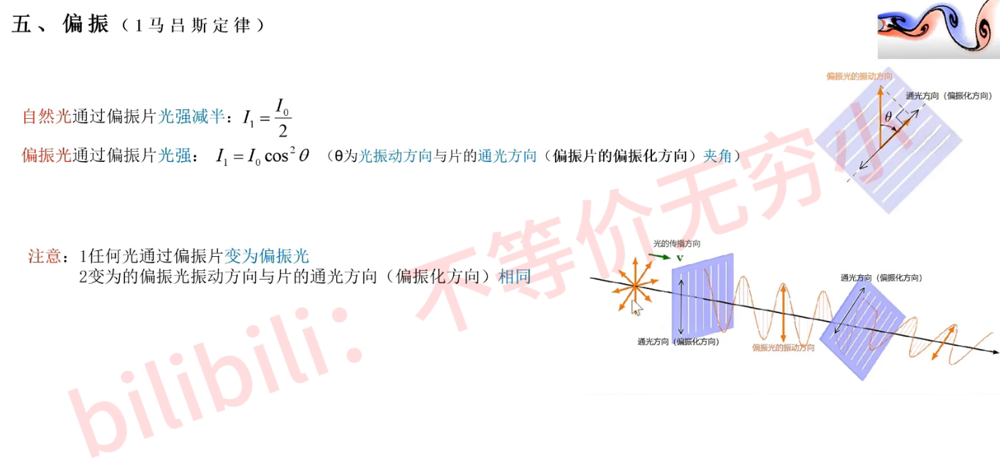

- **9.2.1.1. 装置**
    - 平行单色光垂直入射到宽度为 $a$ 的单缝上。
    - 衍射后的平行光经焦距为 $f$ 的凸透镜会聚到其焦平面（观察屏）P上。
- **9.2.1.2. 衍射角 $\phi$**
    - 衍射光线与单缝法线（原入射光方向）的夹角。

### 9.2.2. 菲涅耳半波带法分析（推导原理可忽略）
- **9.2.2.1. 原理引入**
    - 为分析屏上P点明暗，将单缝处的波阵面分割成若干个特殊的子区域——半波带。
- **9.2.2.2. 最大光程差与半波带划分**
    - 对于衍射角为 $\phi$ 的方向，单缝两边缘（A点和B点）到达P点的光线存在最大光程差 $\delta_{max} = AC = a\sin\phi$。
    - 若 $a\sin\phi = N \cdot \frac{\lambda}{2}$，则单缝波阵面可被划分为 $N$ 个半波带。
    - **半波带定义**：相邻两带对应点发出的子波到达P点的光程差为 $\lambda/2$（相位差为 $\pi$）。

### 9.2.3. 单缝衍射的明暗条纹条件 (垂直入射)
- **9.2.3.1. 暗条纹条件 (相消干涉)**
    - 当缝宽 $a$ 包含偶数个半波带时，即 $a\sin\phi = 2k \cdot \frac{\lambda}{2} = \pm k\lambda$，P点为暗纹。
    - $k = 1, 2, 3, \dots$ ($k \neq 0$)
- **9.2.3.2. 明条纹条件 (加强干涉，近似)**
    - 当缝宽 $a$ 包含奇数个半波带时，即 $a\sin\phi = (2k+1) \frac{\lambda}{2}$，P点为明纹。
    - $k = 1, 2, 3, \dots$
    - 中央明纹：$\phi=0$ ($k=0$对应的情况)，所有子波同相到达，光程差为0，形成最亮的中央明纹。

### 9.2.4. 单缝衍射条纹特征与讨论
- **9.2.4.1. 条纹位置 (小角近似 $\sin\phi \approx \tan\phi = x/f$)**
    - 暗纹位置：$x_k = \pm k \frac{f\lambda}{a} \quad (k=1,2,3,\dots)$
    - 明纹位置 (近似)：$x_k' = \pm (2k+1) \frac{f\lambda}{2a} \quad (k=1,2,3,\dots)$
- **9.2.4.2. 中央明纹宽度**
    - 角宽度：$\Delta\phi_0 = 2\phi_1 = \frac{2\lambda}{a}$ (其中 $\phi_1$ 为第一级暗纹的衍射角)
    - 线宽度：$\Delta x_0 = 2x_1 = \frac{2f\lambda}{a}$
- **9.2.4.3. 其他级明纹宽度**
    - 角宽度：$\Delta\phi_k \approx \frac{\lambda}{a}$
    - 线宽度：$\Delta x_k \approx \frac{f\lambda}{a}$
    - 结论：中央明纹宽度是其他各级明纹宽度的两倍。
- **9.2.4.4. 亮度分布**
    - 中央明纹最亮。
    - 随着条纹级次 $k$ 的增加，明纹亮度迅速减弱。
    - 明暗纹边界不十分清晰。
- **9.2.4.5. 波长与缝宽的影响**
    - 波长 $\lambda$ 一定，缝宽 $a$ 减小，衍射条纹变宽，中央明纹展宽。
    - 缝宽 $a$ 一定，波长 $\lambda$ 增大，衍射条纹变宽。
    - 白光入射：中央明纹为白色，两侧为彩色衍射光谱（紫光在内，红光在外）。
- **9.2.4.6. 干涉与衍射的区别与联系**
    - 区别：干涉通常指有限几束（或两束）相干光的叠加；衍射指同一波阵面上无限多子波的相干叠加。
    - 联系：衍射的本质也是干涉。实际光学现象中，如双缝干涉，其条纹是双缝干涉效应和单缝衍射效应的共同结果。

### 9.2.5. 单缝衍射应用实例
- **9.2.5.1. 例1：计算中央明纹宽度**
  
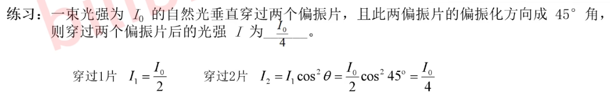
  
    - **问题**：$\lambda = 546 \text{ nm}$ 平行光垂直照射缝宽 $a = 0.437 \text{ mm}$ 的单缝，透镜焦距 $f = 40 \text{ cm}$。求中央明纹宽度。
    - **解**：$\Delta x_0 = \frac{2f\lambda}{a} = \frac{2 \times 0.40 \text{ m} \times 546 \times 10^{-9} \text{ m}}{0.437 \times 10^{-3} \text{ m}} \approx 1.0 \times 10^{-3} \text{ m} = 1.0 \text{ mm}$。
    
- **9.2.5.2. 例 9-1：分析特定点衍射情况**
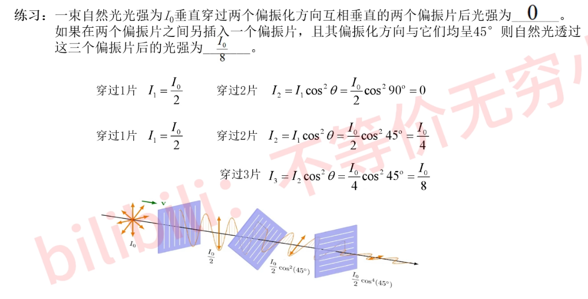
    - **问题**：单缝 $a=0.1 \text{ mm}$，$f=100 \text{ mm}$，$\lambda = 500 \text{ nm}$。P点 $x=1.75 \text{ mm}$ 处是明纹。
        1.  求P点条纹级数 $k$。
        2.  对应P点缝可分成多少个半波带？
        3.  若缝宽增至2倍，P点变为社么条纹？
    - **解**：
        1.  明纹条件：$a\frac{x}{f} = (2k+1)\frac{\lambda}{2}$
            $k = \frac{ax}{f\lambda} - \frac{1}{2} = \frac{0.1 \times 10^{-3} \times 1.75 \times 10^{-3}}{0.1 \times 500 \times 10^{-9}} - 0.5 = 3.5 - 0.5 = 3$。第3级明纹。
        2.  第3级明纹对应 $(2 \times 3 + 1) = 7$ 个半波带。即 $a\sin\phi = 7 \frac{\lambda}{2}$。
        3.  新缝宽 $a' = 2a$。此时P点的光程差变为 $\delta' = a'\sin\phi = (2a)\sin\phi = 2 \times (7\frac{\lambda}{2}) = 7\lambda = 14\frac{\lambda}{2}$。对应14个半波带（偶数），故为第7级暗纹。
    
- **9.2.5.3. 例 9-3：不同缝宽下的条纹计算**
    - **问题**：$\lambda = 632.8 \text{ nm}$ 平行光垂直照射单缝，透镜焦距 $f=40 \text{ cm}$。求缝宽分别为 (1) $a=0.1 \text{ mm}$，(2) $a=4.0 \text{ mm}$ 时，中央明纹的线宽度及第一级明纹的位置。
    - **解**：
        - 中央明纹线宽度 $\Delta x_0 = \frac{2f\lambda}{a}$。
        - 第一级明纹位置 (k=1, 近似) $x_1' = (2\times1+1)\frac{f\lambda}{2a} = \frac{3f\lambda}{2a} = \frac{3}{4}\Delta x_0$。
        1.  当 $a=0.1 \text{ mm}$：
            $\Delta x_0 = \frac{2 \times 0.4 \times 632.8 \times 10^{-9}}{0.1 \times 10^{-3}} \approx 5.06 \text{ mm}$。
            $x_1' = \frac{3}{4} \times 5.06 \text{ mm} \approx 3.80 \text{ mm}$。
        2.  当 $a=4.0 \text{ mm}$：
            $\Delta x_0 = \frac{2 \times 0.4 \times 632.8 \times 10^{-9}}{4.0 \times 10^{-3}} \approx 0.127 \text{ mm}$。
            $x_1' = \frac{3}{4} \times 0.127 \text{ mm} \approx 0.095 \text{ mm}$。

## 9.3. 光栅衍射

### 9.3.1. 单缝衍射的缺陷与光栅的引入
- **单缝衍射的缺陷**：
    - 根据条纹间距公式 $\Delta x \approx \frac{\lambda f}{a}$，存在一对矛盾：
        1.  若缝宽 $a$ 较大，通过的光能量多，条纹较亮，但 $\Delta x$ 很小，条纹密集不易分辨。
        2.  若缝宽 $a$ 较小，$\Delta x$ 较大，条纹分得开，但通过的光能量少，条纹很暗。
- **光栅的引入**：
    - 为了获得**亮度大、分得开、条纹本身细锐**的明条纹，可采用由大量等宽等间距的平行狭缝构成的光学元件——**衍射光栅**。

### 9.3.2. 光栅及其基本概念

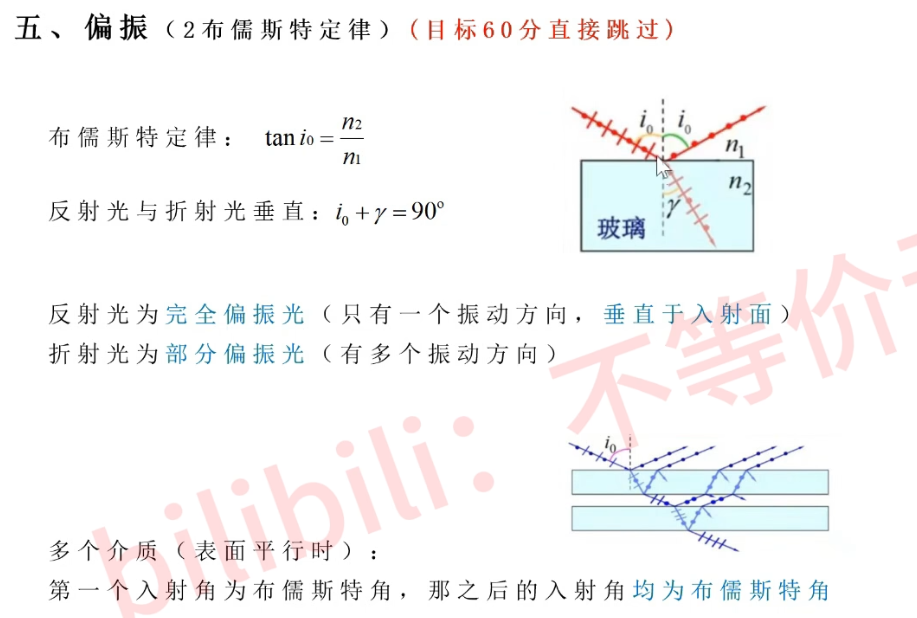

- **衍射光栅 (Diffraction Grating)**：由大量等宽、等间距的平行狭缝（或刻线）组成的光学元件。
    - **透射光栅**：在透明屏上刻划大量不透光的刻线。
    - **反射光栅**：在反射面上刻划大量不反射的刻线（如CD、DVD盘面）。
- **光栅常数 (Grating Constant)**
    - $a$：每个透光狭缝的宽度。
    - $b$：每个不透光部分的宽度。
    - **光栅常数 $d = a+b$**，代表相邻两缝对应点之间的距离。
    - 示例：若光栅每厘米有1000条刻线，则其光栅常数为 $d = \frac{1 \text{ cm}}{1000} = \frac{10^{-2} \text{ m}}{1000} = 10^{-5} \text{ m}$。
    - 常见光栅的光栅常数约为 $10^{-5} \sim 10^{-6} \text{ m}$。

### 9.3.3. 光栅衍射的条纹特征
- **光栅衍射的本质**：光栅衍射是**多缝干涉**和**单缝衍射**两种效应的总效果。
    - **多缝干涉**：决定明暗条纹的位置。
    - **单缝衍射**：决定各级明条纹的强度分布（调制作用）。
- **条纹特征**：
    1.  **主极大 (Principal Maxima)**：明条纹细而亮，谱线非常尖锐。
    2.  **暗区宽**：主极大之间是大片黑暗区域。
    3.  **分得开**：由于暗区很宽，各级主极大分得很开。
    4.  **亮度不均**：各级主极大的亮度受到单缝衍射的调制，亮度不均匀，并可能出现“缺级”现象。
    5.  **次极大 (Secondary Maxima)**：在两个主极大之间，有 $N-2$ 个很弱的次极大和 $N-1$ 个极小（暗点），其中 $N$ 是光栅的狭缝总数。由于 $N$ 很大，这些次极大亮度极低，几乎不可见。

### 9.3.4. 光栅方程 (垂直入射)
- **主极大条件**：当从各相邻狭缝发出的、衍射角为 $\phi$ 的平行光到达屏上某点的光程差为波长的整数倍时，光波在此处同相叠加，形成明亮的主极大条纹。
- **光栅方程**：
    $$
    d \sin\phi = \pm k \lambda
    $$
- 其中：
    - $d = a+b$ 是光栅常数。
    - $\phi$ 是衍射角。
    - $\lambda$ 是入射光的波长。
    - $k$ 是光谱级数（整数），$k=0, 1, 2, 3, \dots$。
    - $k=0$ 对应中央主极大（中央明纹）。
    - $k=1, 2, \dots$ 对应第1级、第2级...主极大。

### 9.3.5. 缺级现象 (Missing Orders)

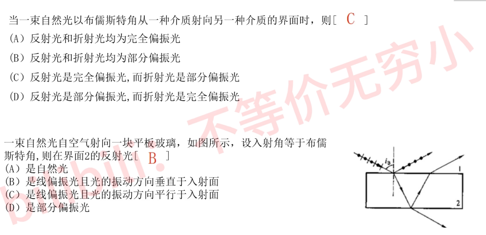

- **定义**：当某个方向 $\phi$ 同时满足光栅衍射的主极大条件和单缝衍射的极小（暗纹）条件时，该级次的主极大将消失不见，这种现象称为**缺级**。
- **缺级条件**：
    - 主极大条件：$d \sin\phi = (a+b) \sin\phi = \pm k \lambda$
    - 单缝暗纹条件：$a \sin\phi = \pm k' \lambda \quad (k' = 1, 2, 3, \dots)$
- 将两式相比消去 $\sin\phi$ 和 $\lambda$，可得缺级级数 $k$ 满足的关系：
    $$
    k = \pm \frac{a+b}{a} k' = \pm \frac{d}{a} k'
    $$
- **示例**：
    - 若 $d/a = 2$ (即缝宽等于不透光部分宽度 $a=b$)，则当 $k'=1, 2, 3, \dots$ 时，缺少的级次为 $k = \pm 2, \pm 4, \pm 6, \dots$。所有偶数级主极大都将消失。
    - 若 $d/a = 3$，则缺少的级次为 $k = \pm 3, \pm 6, \pm 9, \dots$。

### 9.3.6. 光栅光谱与光谱重叠
- **光栅光谱**：
    - 由光栅方程 $d \sin\phi = k\lambda$ 可知，对于给定的级次 $k$，衍射角 $\phi$ 随波长 $\lambda$ 的增大而增大。
    - 当用白光照射光栅时：
        - $k=0$ 时，所有波长的光都在 $\phi=0$ 处形成一个明亮的**中央白斑**。
        - $k \neq 0$ 时，不同波长的光被分离开，形成按波长顺序排列的彩色光谱带，称为**光栅光谱**。在每一级光谱中，紫光在内侧（$\phi$ 较小），红光在外侧（$\phi$ 较大）。
- **光谱重叠**：
    - 当光谱的级次 $k$ 较高时，不同级次的光谱可能会发生重叠。
    - 例如，第 $k$ 级的波长为 $\lambda$ 的谱线与第 $k+1$ 级的波长为 $\lambda'$ 的谱线可能出现在同一位置，即 $k\lambda = (k+1)\lambda'$。
    - **例**：判断第2级光谱(400-760nm)与第3级光谱(400-760nm)是否重叠。
        - 第2级光谱的最大角位置对应红光：$d \sin\theta_{2,max} = 2 \times 760 \text{ nm} = 1520 \text{ nm}$。
        - 第3级光谱的最小角位置对应紫光：$d \sin\theta_{3,min} = 3 \times 400 \text{ nm} = 1200 \text{ nm}$。
        - 因为 $d \sin\theta_{2,max} > d \sin\theta_{3,min}$，所以第2级和第3级光谱会发生重叠。
        - 重叠始于第3级紫光出现的位置。该位置对应的第2级光谱的波长 $\lambda$ 满足 $2\lambda = 3 \times 400 \text{ nm}$，即 $\lambda = 600 \text{ nm}$。因此，第2级光谱中 600 nm 至 760 nm 的部分会与第3级光谱的前半部分重叠。

### 9.3.7. 斜入射情况
- 当光线以入射角 $\theta_i$ 斜入射到光栅上时，光栅方程变为：
    $$
    d(\sin\phi + \sin\theta_i) = \pm k \lambda
    $$
- **特点**：
    1.  **谱线分布不对称**：以中央主极大为中心，两侧的谱线分布不再对称。
    2.  **可观察到更高次谱线**：在衍射角增大的方向上，可以看到比垂直入射时更高次的光谱。
    3.  **总级次不变**：虽然观察到的最高级次可能增加，但另一侧的最高级次会相应减少，使得可观察到的总谱线数目不变。
    4.  **缺级条件不变**：由于缺级条件取决于光栅常数 $d$ 和缝宽 $a$ 的比值 $d/a$，此比值与入射角无关，故缺级级次与垂直入射时相同。

### 9.3.8. 光栅衍射应用实例

  
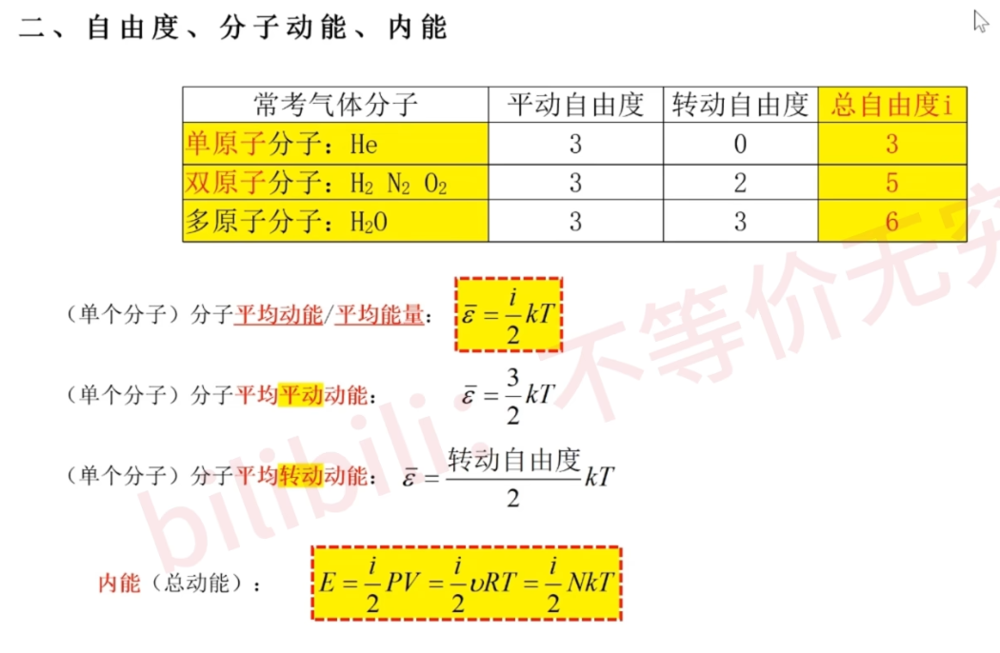
  
- （上图思路正确但是计算有误）
  
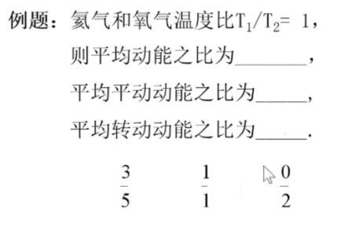
  
- **例3：计算谱线间距**
  
    - **问题**：波长为 500 nm 和 520 nm 的两种单色光同时垂直入射在光栅常数为 0.002 cm 的光栅上，紧靠光栅后用焦距为 2 m 的透镜把光线聚焦在屏上。求这两束光的第3级谱线之间的距离。
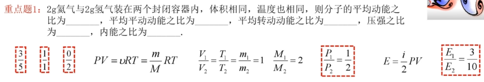
    - **解**：
        - $d = 0.002 \text{ cm} = 2 \times 10^{-5} \text{ m}$, $f = 2 \text{ m}$, $k=3$.
        - $\lambda_1 = 500 \times 10^{-9} \text{ m}$, $\lambda_2 = 520 \times 10^{-9} \text{ m}$.
        - 利用小角近似 $x \approx f\phi \approx f\sin\phi$。由光栅方程 $d\sin\phi = k\lambda$ 得 $\sin\phi = k\lambda/d$。
        - $x_1 = f \frac{k\lambda_1}{d}$, $x_2 = f \frac{k\lambda_2}{d}$。
        - $\Delta x = x_2 - x_1 = \frac{kf}{d}(\lambda_2 - \lambda_1) = \frac{3 \times 2}{2 \times 10^{-5}}(520-500)\times 10^{-9} = 0.006 \text{ m} = 6 \text{ mm}$。
    
- **例5：求解光栅参数**
    - **问题**：用波长 $\lambda = 600 \text{ nm}$ 的单色光垂直照射光栅，观察到第2级主极大出现在 $\sin\phi = 0.20$ 处，而且第4级缺级。试求 (1) 光栅常数； (2) 狭缝的最小宽度； (3) 全部条纹的级数。
    - **解**：
        1.  **光栅常数 $d$**：由光栅方程 $d\sin\phi = k\lambda$
            $d = \frac{k\lambda}{\sin\phi} = \frac{2 \times 600 \times 10^{-9}}{0.20} = 6 \times 10^{-6} \text{ m}$。
        2.  **狭缝最小宽度 $a$**：第4级缺级，即 $k=4$ 满足缺级条件 $k = \frac{d}{a}k'$。
            $4 = \frac{d}{a}k'$。为使缝宽 $a$ 最小，$\frac{d}{a}$ 应取最大值，这对应 $k'$ 取最小值，即 $k'=1$。
            $4 = \frac{d}{a} \times 1 \implies a = \frac{d}{4} = \frac{6 \times 10^{-6}}{4} = 1.5 \times 10^{-6} \text{ m}$。
        3.  **全部条纹级数**：最大衍射角为 $\phi=90^\circ$，$\sin\phi=1$。
            $k_{max} = \lfloor \frac{d\sin90^\circ}{\lambda} \rfloor = \lfloor \frac{6 \times 10^{-6}}{600 \times 10^{-9}} \rfloor = \lfloor 10 \rfloor = 10$。
            但由于第4级缺级，其倍数级次（$k=4k'$, $k'=1,2,...$）也缺级。即 $k=4, 8$ 缺级。
            所以能看到的全部条纹级数为：$k=0, \pm1, \pm2, \pm3, \pm5, \pm6, \pm7, \pm9$。第10级在 $\phi=90^\circ$ 方向，通常认为看不到。

- **例9-6：斜入射时的最高级次**
    - **问题**：一束波长为 480 nm 的单色平行光，照射在每毫米内有600条刻痕的平面透射光栅上。求 (1) 光线垂直入射时，最多能看到第几级光谱？ (2) 光线以 30°角入射时，最多能看到第几级光谱？
    - **解**：
        - $d = \frac{1 \text{ mm}}{600} = \frac{10^{-3}}{600} \text{ m} \approx 1.667 \times 10^{-6} \text{ m}$。 $\lambda = 480 \times 10^{-9} \text{ m}$。
        1.  **垂直入射**：$d\sin\phi = k\lambda$。最大级次在 $\sin\phi \le 1$ 时出现。
            $k \le \frac{d}{\lambda} = \frac{1.667 \times 10^{-6}}{480 \times 10^{-9}} \approx 3.47$。
            所以最多能看到第3级光谱 ($k_{max}=3$)。
        2.  **斜入射($\theta_i=30^\circ$)**：$d(\sin\phi + \sin30^\circ) = k\lambda$。
            - 在 $\phi=90^\circ$ 方向 ($\sin\phi=1$)：
              $k \le \frac{d(1+\sin30^\circ)}{\lambda} = \frac{1.667 \times 10^{-6} \times 1.5}{480 \times 10^{-9}} \approx 5.2$。
              此方向最多能看到第5级光谱 ($k_{+max}=5$)。
            - 在 $\phi=-90^\circ$ 方向 ($\sin\phi=-1$)：
              $k \ge \frac{d(-1+\sin30^\circ)}{\lambda} = \frac{1.667 \times 10^{-6} \times (-0.5)}{480 \times 10^{-9}} \approx -1.73$。
              此方向最多能看到第-1级光谱 ($k_{-max}=-1$)。
              因此，斜入射时，能看到的级次为 $k = -1, 0, 1, 2, 3, 4, 5$。

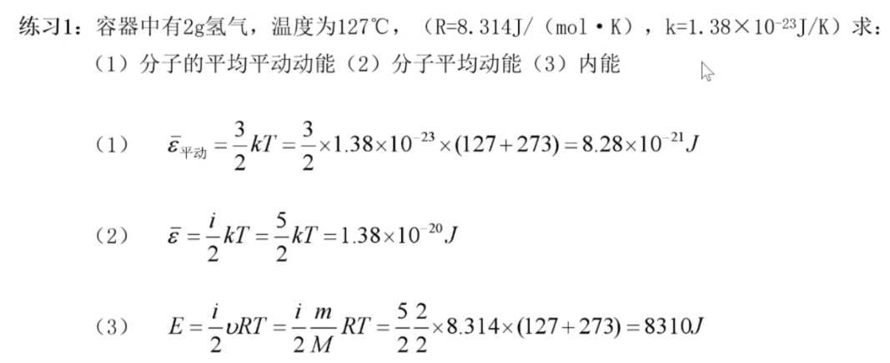

# 10. 光的偏振

## 10.1. 自然光与偏振光的基本概念

### 10.1.1. 光的偏振现象
- **10.1.1.1. 光矢量与偏振**
    - 光是电磁波，其电场强度矢量 $\vec{E}$ 对感光物质起主要作用，称为**光矢量**。
    - 光矢量的振动方向与光的传播方向垂直，这一特性称为**光的偏振**。
    - 偏振是横波特有的现象，纵波没有偏振问题。
- **10.1.1.2. 自然光 (Natural Light)**
    - 定义：普通光源发出的光，其光矢量在垂直于传播方向的平面内沿各个方向振动，且振幅均等，各方向振动无固定相位关系。
    - 表示：可分解为两个振动方向相互垂直、振幅相等、无固定相位差的独立光振动分量。平面表示法中用垂直于传播方向的点和短线组合表示。
- **10.1.1.3. 偏振光 (Polarized Light)**
    - **线偏振光 (Linearly Polarized Light / 完全偏振光)**
        - 定义：光矢量只沿某一固定方向振动。
        - 振动面：偏振光的振动方向与光的传播方向构成的平面。
        - 表示：若振动在纸面内用短线，垂直纸面用点。
    - **部分偏振光 (Partially Polarized Light)**
        - 定义：光矢量在某一方向的振动较其垂直方向的振动占优势。
        - 表示：某一方向的点或短线数量多于另一方向。
    - **椭圆偏振光与圆偏振光**
        - 定义：光矢量末端在垂直于传播方向的平面上描绘出椭圆（椭圆偏振光）或圆（圆偏振光），同时光波向前传播。
        - 旋向：根据光矢量旋转方向分为左旋和右旋。

## 10.2. 起偏、检偏与马吕斯定律

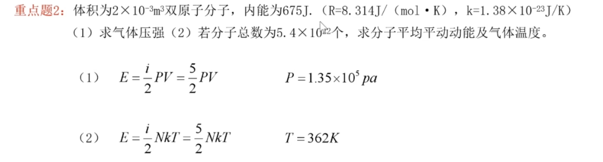

### 10.2.1. 起偏与检偏
- **10.2.1.1. 定义**
    - **起偏 (Polarization)**：将自然光转变为偏振光的过程。所用元件称为**起偏器 (Polarizer)**。
    - **检偏 (Analysis)**：检验光是否为偏振光以及确定其偏振状态的过程。所用元件称为**检偏器 (Analyzer)**。
- **10.2.1.2. 偏振片 (Polaroid)**
    - 原理：利用某些物质（如电气石、硫酸奎宁晶体）对不同方向光振动的选择性吸收（二向色性）。
    - 偏振化方向：偏振片允许通过的光振动方向。
    - 功能：同一偏振片既可作起偏器，也可作检偏器。
- **10.2.1.3. 不同类型光的检验方法**
    - **自然光**：通过起偏器后光强减半 ($I = I_0/2$)，变为线偏振光。旋转起偏器，透射光强不变。
    - **线偏振光**：通过检偏器后，透射光强随检偏器旋转 ($I = I_0 \cos^2\alpha$)，出现两次最强和两次消光。
    - **部分偏振光**：通过检偏器后，透射光强随检偏器旋转，出现两次最大和两次最小，但不消光。

### 10.2.2. 马吕斯定律 (Malus's Law)
- **10.2.2.1. 定律内容**
    - 当一束强度为 $I_0$ 的线偏振光通过一个偏振片（检偏器）时，若入射光的振动方向与偏振片的偏振化方向成 $\alpha$ 角，则透射光的强度 $I$ 为：
      $I = I_0 \cos^2\alpha$
- **10.2.2.2. 应用实例**
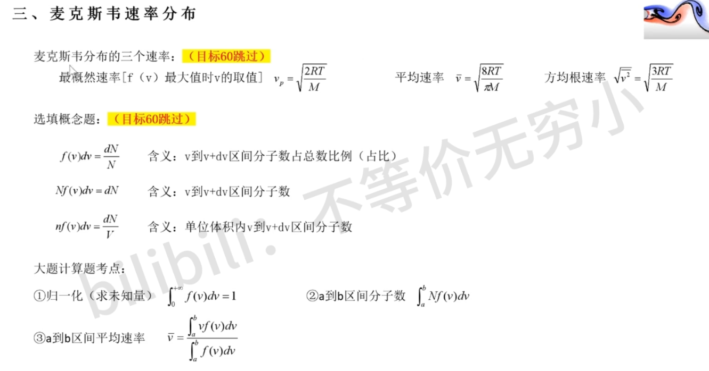
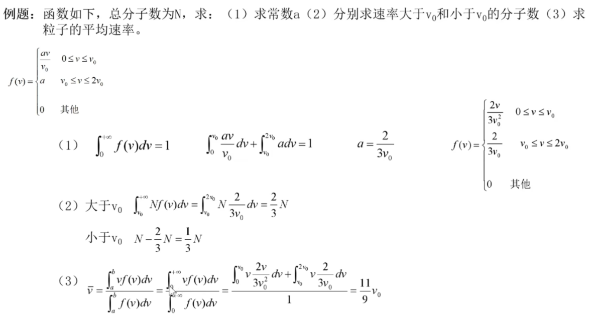
    - **例1：三偏振片系统**

        - **问题**：自然光通过两偏振化方向夹角为 $60^\circ$ 的偏振片P1、P2，透射光强为 $I_1$。在P1、P2间插入偏振片P3，P3与P1、P2的偏振化方向夹角均为 $30^\circ$。求此时透射光强 $I$。
        - **解**：
            - 无P3时：$I_1 = (I_0/2) \cos^2 60^\circ = I_0/8$。
            - 有P3时：光通过P1后强度为 $I_0/2$。通过P3后强度为 $(I_0/2)\cos^2 30^\circ$。再通过P2后强度为 $I = [(I_0/2)\cos^2 30^\circ] \cos^2 30^\circ = (I_0/2)(\frac{\sqrt{3}}{2})^4 = \frac{9}{32}I_0$。
            - $I = \frac{9/32}{1/8} I_1 = \frac{9}{4}I_1$。
    - **例2：混合光的成分分析**
        - **问题**：一束光由自然光和线偏振光混合组成。通过旋转的偏振片时，透射光强最大值是最小值的5倍。求入射光中自然光和线偏振光的光强各占总光强的比例。
        - **解**：设入射自然光强 $I_{n0}$，线偏振光强 $I_{p0}$。透射光强 $I = I_{n0}/2 + I_{p0}\cos^2\alpha$。
            $I_{max} = I_{n0}/2 + I_{p0}$，$I_{min} = I_{n0}/2$。
            $I_{max} = 5 I_{min} \implies I_{n0}/2 + I_{p0} = 5(I_{n0}/2) \implies I_{p0} = 2I_{n0}$。
            总光强 $I_{total} = I_{n0} + I_{p0} = 3I_{n0}$。
            自然光占 $I_{n0}/I_{total} = 1/3$。线偏振光占 $I_{p0}/I_{total} = 2/3$。

### 10.2.3. 偏振片的应用
- 光学仪器中的起偏和检偏元件。
- 照相机滤光镜，消除反射眩光。
- 偏光眼镜，观看立体电影。
- 交通应用，减少会车时灯光眩目。

## 10.3. 反射和折射时的偏振

### 10.3.1. 布儒斯特定律 (Brewster's Law)

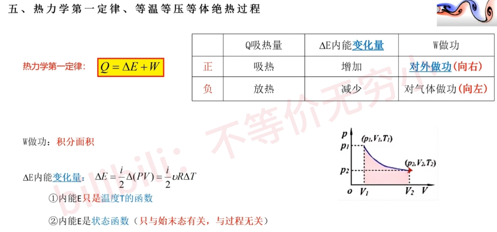

- **10.3.1.1. 现象描述**
    - 自然光在两种各向同性介质界面反射和折射时，反射光和折射光通常都成为部分偏振光。
    - 反射光中，垂直于入射面的振动分量占优势。
    - 折射光中，平行于入射面的振动分量占优势。
- **10.3.1.2. 起偏角 (布儒斯特角 $i_0$)**
    - 当入射角 $i$ 等于特定的起偏角 $i_0$ 时，反射光成为完全线偏振光，其振动方向垂直于入射面。
    - 布儒斯特定律：$\tan i_0 = \frac{n_2}{n_1}$ ($n_1, n_2$ 分别为入射介质和折射介质的折射率)。
    - 此时，反射光线与折射光线相互垂直，即 $i_0 + \gamma = \pi/2$ ($\gamma$ 为折射角)。
    - 折射光仍为部分偏振光。
- **10.3.1.3. 应用实例**
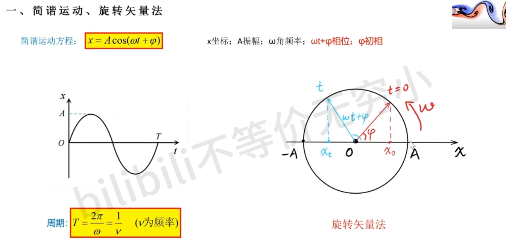
    - **例2：光线在平行平板内的多次反射折射**
        - **问题**：自然光以布儒斯特角 $i_0$ 从空气射向玻璃平板，在玻璃-空气界面（界面2）的反射光是什么偏振态？
        - **解**：界面1（空气-玻璃）：$\tan i_0 = n_{玻璃}/n_{空气}$，折射角 $\gamma = \pi/2 - i_0$。
            光线以角 $\gamma$ 入射到界面2（玻璃-空气）。界面2的布儒斯特角 $i_0'$ 满足 $\tan i_0' = n_{空气}/n_{玻璃}$。
            因为 $\tan\gamma = \tan(\pi/2 - i_0) = \cot i_0 = n_{空气}/n_{玻璃} = \tan i_0'$。
            所以 $\gamma = i_0'$，即光线以布儒斯特角入射到界面2。
            故界面2的反射光是振动方向垂直于入射面的线偏振光。
- **10.3.1.4. 玻璃片堆 (Pile of Plates)**
    - 利用多次反射和折射，可以使透射光也趋近于线偏振光（振动方向平行于入射面）。 
