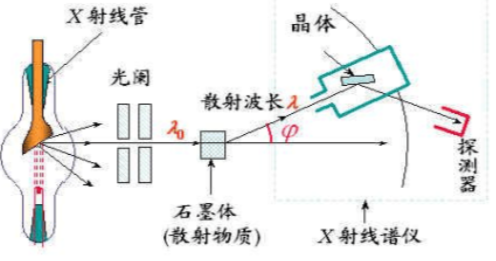
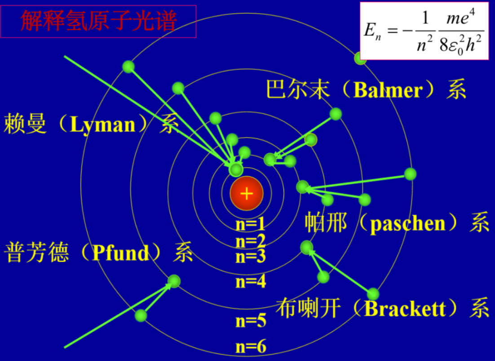

# 16.1 黑体辐射 普朗克量子假设
## 16.1.1 热辐射
热辐射：能量按频率的分布随温度而不同的电磁辐射
1. 单色辐出度：在温度为 T 的平衡热辐射状态下，单位时间从物体表面单位面积发出的波长在 $\lambda$ 到 $\lambda+d\lambda$ 之间的辐射能 $dE_{\lambda}$ 与 $d\lambda$ 之比
$$
e(\lambda,T)=\frac{dE_{\lambda}}{d\lambda}
$$
2. 辐出度：
## 16.1.2 黑体辐射  
黑体：能完全吸收照射到它上面的各种频率的光的物体

# 16.2 光电效应 爱因斯坦光子理论

# 16.3 康普顿散射
## 康普顿散射实验
**康普顿效应**：X 射线被物质散射，**散射光中部分波长变长**的物理现象
1. 实验装置
   X 射线波长在 0.1 nm 量级
   X 光子能量约 $10^4eV$ 量级
   
2. 实验结果
   在散射的 X 射线中除有与入射波长相同的射线外，还有波长比入射波长更长的射线。这种现象叫康普顿散射或康普顿效应
   $$
  \Delta \lambda=\frac{h}{mc}(1-\cos \phi)
$$
同一 X 射线被原子量大的物质散射，康普顿效应较强
## 康普顿散射的量子解释
$\epsilon=hv$ 的 X 光子，与自由电子发生完全弹性碰撞的结果
### 光子与电子碰撞
- 光子动量  
  $$
  P = \frac{h\nu}{c}
  $$
- 入射光子动量  
  $$
  P_0 = \frac{h\nu_0}{c}
  $$
- 初态电子静止，质量为 $m_0$；末态质量为 $m$
- 碰撞过程能量守恒  
  $$
  h\nu_0 + m_0c^2 = h\nu + mc^2
  $$
- 动量守恒  
  $$
  \vec P_0 = \vec P + \vec p
  $$
- 动量分量（设散射角 $\theta$）  
  $$
  \frac{h\nu_0}{c} = \frac{h\nu}{c}\cos\theta + p\cos\phi
  $$  
  $$
  0 = \frac{h\nu}{c}\sin\theta - p\sin\phi
  $$
- 联立得  
  $$
  m^2c^2 = h^2\nu_0^2 + h^2\nu^2 - 2h^2\nu_0\nu\cos\theta
  $$
- 能量守恒：
$$
h\nu_0 + m_0c^2 = h\nu + mc^2
$$
- 动量平方关系：
$$
m^2c^2 = h^2\nu_0^2 + h^2\nu^2 - 2h^2\nu_0\nu\cos\theta
$$
- 质量-速度关系：
$$
m = \frac{m_0}{\sqrt{1 - (v/c)^2}}
$$
- 整理得：
$$
-2h^2\nu_0\nu(1 - \cos\theta) + 2m_0ch(\nu_0 - \nu) = 0
$$
- 两边除以 $c$：
$$
-2h^2\frac{\nu_0\nu}{c}(1 - \cos\theta) + 2m_0h(\nu_0 - \nu) = 0
$$
- 波长定义 $\lambda = c/\nu$ 及 $\Delta\lambda = \lambda - \lambda_0$：
$$
\Delta\lambda = \frac{h}{m_0c}(1 - \cos\theta)
$$
### 注意几点
- 康普顿波长偏移公式：
  $$
  \boxed{\Delta\lambda = \frac{2h}{m_0c}\sin^2\frac{\theta}{2}}
  $$
- $\Delta\lambda$ 的数量级约为 $10^{-12}\,\text{m}$；可见光波长 $\lambda\sim10^{-7}\,\text{m}$，故 $\Delta\lambda\ll\lambda$，因此观察不到康普顿效应。
- 散射光中出现与入射光相同波长的射线，是由于光子与原子碰撞：原子质量很大，光子碰撞后能量不变，散射光频率不变。
- 当 $\theta=0$ 时，光子频率保持不变；当 $\theta=\pi$ 时，光子频率减小最多。
- 光在传播过程中表现波动性；光与物质相互作用时表现粒子性。因此光具有**波粒二象性**。
### 讨论光电效应和康普顿效应的相同之处和不同之处?
- 参与光电效应的电子是金属中的**自由电子**，它**不是完全自由的，而是被束缚在金属表面以内**。在光电效应中，通常是一个电子吸收一个光子的过程，电子与光子的相互作用是**非弹性碰撞**。在碰撞过程中**能量守恒动量不守恒**，金属材料必取走部分动量
- 而参与康普顿效应的散射物中的电子**在光子能量较大时可看做是完全自由的**。散射物中电子与光子的相互作用可近似看成**弹性碰撞**过程，**满足动量和能量守恒定律**。光子把一部分能量传给电子后，光子散射出去，电子则反冲，所以散射光波长比入射光波长大
# 16.4 玻尔的氢原子理论
>  矛盾：经典理论不能解释电子绕核运动的原子的稳定性
## 氢原子光谱规律
$$
\frac{1}{\lambda}=R_{H}\left( \frac{1}{m^2}-\frac{1}{n^2} \right)
$$
原子光谱是分立的线性谱
实验取里德堡常数 $R_{H}=1.0967758 \times   10^7 m^{-1}$ 当 m=2，取 n=3，4，5，6,…，对应巴尔末线系 
1908年红外区发现帕邢线系，对应 m=3，取 n=4，5，6
## 玻尔关于定态和量子跃迁的假设
- 频率条件：
  $$
  h\nu = E_m - E_n
  $$
**结论 1**：不发光时，原子是稳定的——称为**定态**。
- 因 $m,n$ 取整数，原子能量只能取某些确定值——**能量量子化**。
- 原子具有的能量——**能级**。
**推论**：电子绕核作圆周运动，轨道半径是确定的。
**结论 2**：原子发光时，对应着能量状态的变化——**能级跃迁**；也对应着轨道半径的变化——**轨道跃迁**。
既然如此，电子绕核运动的角动量也是量子化的。可假定  
$$
L = n\,\frac{h}{2\pi} = n\hbar,\quad n\in\mathbb Z^+
$$
（注意：$\hbar$ 与角动量 $L$ 具有相同的量纲。）
## 玻尔对氢原子的诠释
- 电子受原子核束缚，取负号势能。
- 将量子化角动量  
  $$
  L = n\hbar = n\frac{h}{2\pi}
  $$  
  代入向心力与库仑力平衡式，得**允许的轨道半径**  
  $$
  r_n = \frac{4\pi\varepsilon_0\hbar^2}{Me^2}\,n^2 = a_0\,n^2,\quad a_0 = \frac{4\pi\varepsilon_0\hbar^2}{Me^2}.
  $$
- 把 $r_n$ 代入能量表达式，得**允许的能级**  
  $$
  E_n = -\frac{Me^4}{2(4\pi\varepsilon_0)^2\hbar^2}\,\frac{1}{n^2} = -\frac{13.6\,\text{eV}}{n^2}.
  $$
- 相应的光子能量  
  $$
  \text{原子能量的增量}\quad
  -h\nu = E_n - E_m = \frac{Me^4}{2(4\pi\varepsilon_0)^2\hbar^2}\!\left(\frac{1}{m^2}-\frac{1}{n^2}\right)
  $$

- 所发射光子的能量  
  $$
  h\nu = \frac{Me^4}{2(4\pi\varepsilon_0)^2\hbar^2}\!\left(\frac{1}{m^2}-\frac{1}{n^2}\right)
  $$

- 线系的最短波长（电离极限）：对应 $n\to\infty$
  $$
  \frac{1}{\lambda_\infty} = R_\mathrm{H}\frac{1}{m^2},\quad R_\mathrm{H}=\frac{Me^4}{2(4\pi\varepsilon_0)^2\hbar^2 c}
  $$

- 最长波长：第一激发态能级 \(\to\) 基态跃迁

- 能级与轨道相对应；相同下能级的各跃迁谱线构成一个线系

- 部分允许的轨道与对应的能级：  
  基态能级 $E_1=-13.6\,\text{eV}$，轨道$r_1=a_0$  
  第一激发态能级 $E_2=-3.4\,\text{eV}$，轨道$r_2=4a_0$
  
  - 里德伯公式  
  $$
  \frac{1}{\lambda} = R_{\mathrm{H}}\left(\frac{1}{m^2} - \frac{1}{n^2}\right),\quad
  h\nu = hcR_{\mathrm{H}}\left(\frac{1}{m^2} - \frac{1}{n^2}\right)
  $$

- 代入数据计算  
  $$
  R_{\mathrm{H}} = 1.097\,373\,1 \times 10^{7}\ \mathrm{m^{-1}}
  $$  
  （计算时假定原子核静止。）

## 玻尔氢原子诠释的价值

- 解释了电子绕核运动的稳定性；
- 解释了氢原子光谱线系的形成原因；
- 理论导出了里德伯常数；
- 计算得到氢原子的大小。

**最大贡献**：提出**定态**与**能级**概念，成为从经典物理通向量子物理的桥梁。

**尼尔斯·玻尔**（N. Bohr, 1885–1962）  
丹麦人，哥本哈根学派领袖；提出对应原理、互补原理；获 1922 年诺贝尔物理学奖。
# 16.5 粒子的波动性 德布罗意波

# 16.6 不确定关系

# 16.7 波函数 态叠加原理

# 16.8 薛定谔方程 一维定态问题

# 16.9 力学量与算符 对易关系

# 16.10 氢原子的能量和角动量量子化

# 16.11 电子自旋 斯特恩-格拉赫实验

# 16.12 原子的壳层结构 泡利不相容原理

# 16.13 全同粒子 费米子 玻色子
