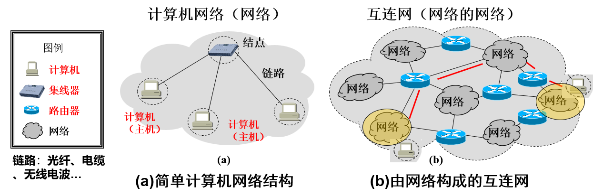
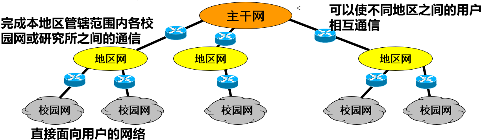
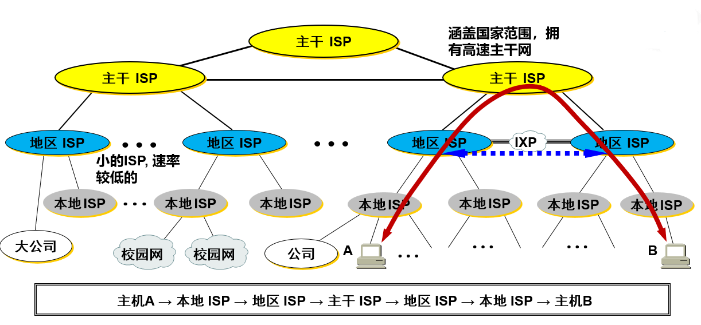
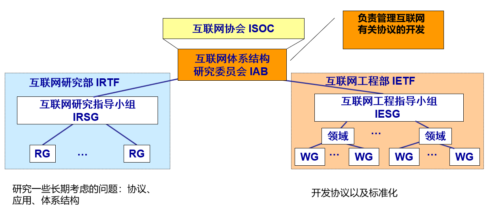
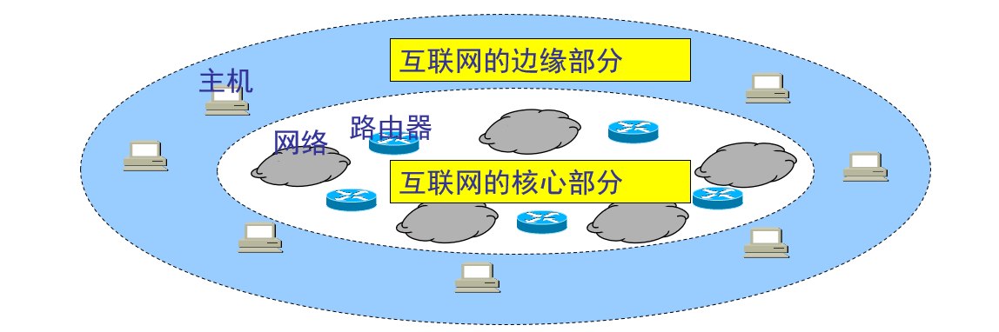
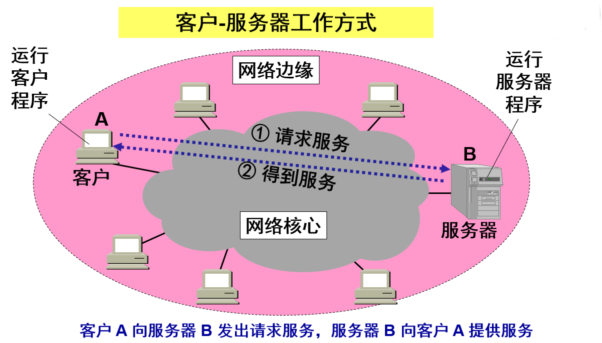
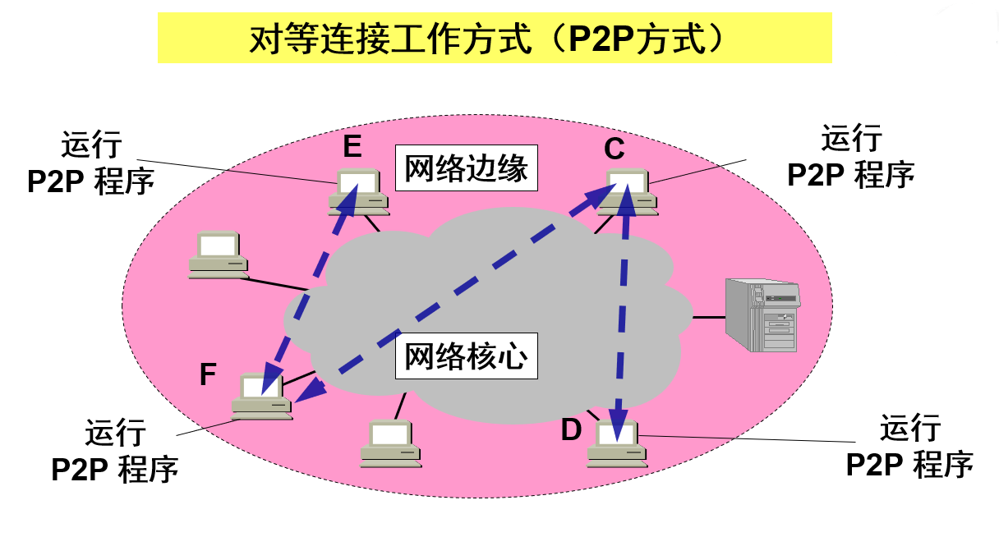
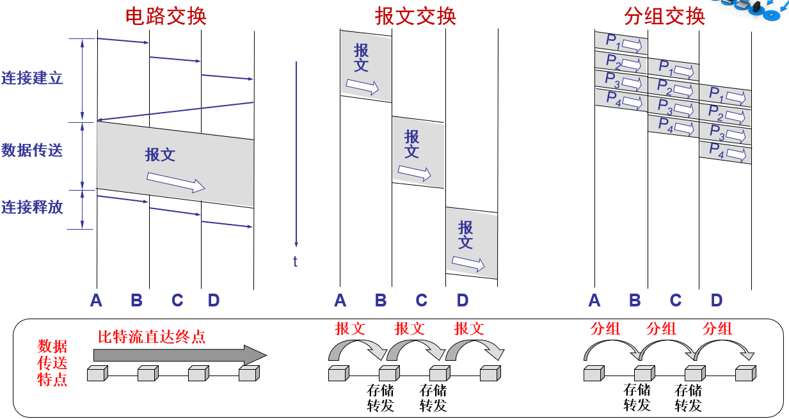

# 1.1 计算机网络在信息时代中的作用

互联网基本特点：

连通性：互联网上用户不管距离多远，都能通信，就像这些用户终端都彼此连通

共享性：指资源共享，包含信息、软件、硬件等共享，就像资源在用户身边

计算机网络 (网络) 的组成：由若干结点和连接这些结点的链路组成；结点可以是计算机、集线器、交换机、路由器等

互连网：网络之间通过路由器连接，构成更大的网络，就是互连网，是网络的网络

主机 (host)：与网络相连的计算机

# 1.2 互联网概述

## 1.2.1 互联网的结构

1. 由若干**结点(node)**和连接这些结点的链路(link)组成
2. 可以通过**路由器**把网络互连起来，这就构成了一个覆盖范围更大的计算机网络，称之为互连网 (网络的网络)
从其工作方式上，分成两大部分：

边缘部分：由互联网上的主机组成，是用户直接使用的部分，用来进行通信和资源共享

核心部分：由大量网络和连接这些网络的路由器组成，是为边缘部分提供服务的，提供连通性和交换

| 对比维度   | 互联网 (Internet)                                                                 | 互连网 (internet)                                               |
|------------|---------------------------------------------------------------------------------|----------------------------------------------------------------|
| 定义       | 特指遵循 TCP/IP 标准、用路由器将各种计算机网络互连起来而形成的、一个覆盖全球的、特定的互连网 | 泛指由多个不同类型计算机网络互连而成的网络                     |
| 协议       | 使用 TCP/IP                                                                     | 除 TCP/IP 外，还可以使用其他协议                               |
| 名词性质   | 是一个专用名词                                                                  | 是一个通用名词                                                 |
| 相似之处   | 网络的网络                                                                      | 网络的网络                                                     |
## 1.1.2 互联网基础结构发展的三个阶段

1. 第一阶段：从单个网络 （ 例如：美国国防部创建的ARPANET，互联网的前生 ） 向互连网发展的过程）
	   - 1983 年， ARPANET使用TCP/IP 标准协议，使得所有使用该协议的计算机都能利用互联网相互通信
	   - 人们把 **1983** 年作为互联网的**诞生时间**
2. 第二阶段：建成了三级结构的互联网 （美国国家基金会建立，覆盖全美主要大学和研究所）
	   - 它是一个三级计算机网络，分为主干网、地区网和校园网（或企业网） ，覆盖了全美国主要的大学和研究所
	    
    
3. 第三阶段：随着商业化，逐渐形成了多层次 ISP (Internet Service Provider) 结构的互联网
	   - 出现了互联网服务提供者 ISP ，如中国电信、中国移动、中国联通
	   - 任何机构和个人只要向某个 ISP 交纳规定的费用，就可从该 ISP 获取所需 IP 地址的使用权，并可通过该 ISP 接入到互联网
	   - 根据提供服务的覆盖面积大小以及所拥有的 IP 地址数目的不同，ISP 也分成为**不同层次的 ISP**：**主干 ISP**、**地区 ISP** 和 **本地 ISP**
		
	- IXP：互联网交换点，允许两个网络直接相连并交换分组,由工作在数据链路层的交换机组成
## 1.2.3 互联网协议

**网络协议（network protocol）**,简称为协议，是为进行网络中的数据交换而建立的规则、标准或约定

协议规定了通信实体之间所交换的消息的格式、意义、顺序以及针对收到的信息或发生的事件所采取的“动作”（actions）

### 协议三要素

1. 语法（Syntax）
	   - 数据与控制信息的结构或格式
	   - 信号电平
2. 语义（Semantics）
	   - 需要发出何种控制信息
	   - 完成何种动作以及做出何种响应
	   - 差错控制
3. 时序（Timing）
	   - 时间顺序（事件实现顺序的详细说明）
	   - 速度匹配

### 互联网的标准化工作
>  互联网的标准化工作对互联网的发展起到了非常重要的作用


成为互联网正式标准要经过三个阶段：
>  所有互联网标准都以 RFC（Request For Comments ） 的形式在互联网上发表

- **互联网草案 (Internet Draft)** ——有效期只有六个月。在这个阶段还不是 RFC 文档
- **建议标准 (Proposed Standard)** ——从这个阶段开始就成为 RFC文档
- **互联网标准 (Internet Standard)** ——达到正式标准后，每个标准就分配到一个编号 STD xx。 一个标准可以和多个 RFC 文档关联

# 1.3 互联网的组成
> 互联网的组成: 边缘+核心


1. 边缘部分： 由所有连接在互联网上的主机组成。这部分是用户直接使用的，用来进行通信（传送数据、音频或视频）和资源共享
2. 核心部分：由大量网络和连接这些网络的路由器组成。这部分是为边缘部分提供服务的（提供连通性和交换）
   
## 1.3.1  互联网的边缘部分

- 处在互联网边缘的部分就是连接在互联网上的所有的主机。这些主机又称为端系统 (end system)

- 端系统在功能上可能有很大的差别
	- 小的端系统可以是一台普通个人电脑，具有上网功能的智能手机，甚至是一个很小的网络摄像头
	- 大的端系统则可以是一台非常昂贵的大型计算机
	- 端系统的拥有者可以是个人，也可以是单位（如学校、企业、政府机关等），当然也可以是某个 ISP
	  
### 端系统之间通信的含义

“主机 A 和主机 B 进行通信实际上是指：“运行在主机 A 上的某个程序和运行在主机 B 上的另一个程序进行通信”
即“主机 A 的某个进程和主机 B 上的另一个进程进行通信”。
简称为“计算机之间通信”。

### 端系统之间的两种通信方式

端系统之间的通信方式通常可划分为两大类：
1.  **客户-服务器方式**（C/S 方式）
	  即Client/Server方式，简称为 C/S 方式
	  - 客户 (client) 和服务器 (server) 都是指通信中所涉及的**两个应用进程**
	  - 客户—服务器方式所描述的是进程之间服务和被服务的关系
	  - 客户是**服务的请求方**，服务器是**服务的提供方**
	    `服务请求方和服务提供方都要使用网络核心部分所提供的服务。例如，上网发送电子邮件或在网站上查找资料`
	  - 
	  - 客户软件的特点：
		  - 被用户调用后运行，在打算通信时主动向远地服务器发起通信（请求服务）。**因此，客户程序必须知道服务器程序的地址**
		  - 不需要特殊的硬件和很复杂的操作系统 （例如**浏览器**就是一个常用的客户端软件）
	  - 服务器软件的特点
		  - 一种专门用来提供某种服务的程序，可同时处理多个远地或本地客户的请求
		  - 系统启动后即自动调用并一直不断地运行着，被动地等待并接受来自各地的客户的通信请求。**因此，服务器程序不需要知道客户程序的地址**
		  - 一般需要强大的硬件和高级的操作系统支持
		客户与服务器的通信关系建立后，通信可以是**双向的**，客户和服务器都可发送和接收数据
	- 服务器软件举例
		- 文件服务器：NetWare
		- 数据库服务器： MySQL等
		- 邮件服务器：Sendmail 等
		- 网页服务器：Apache 等
		- FTP服务器： Pureftpd 等
2.  **对等方式**（P2P 方式）
	  即 Peer-to-Peer方式，简称为 P2P 方式
	- 对等连接 (peer-to-peer，简写为 P2P) 是指两个主机在通信时并不区分哪一个是服务请求方还是服务提供方
	- 只要两个主机都运行了**对等连接软件** (P2P 软件：BT等) ，它们就可以进行**平等的、对等连接通信**
	- 双方都可以下载对方已经存储在硬盘中的共享文档
	  `网络上许多服务可以归入P2P的行列。即时讯息系统譬如微软的MSN Messenger以及国内的腾讯QQ等是最流行的P2P应用。它们允许用户互相沟通和交换信息、交换文件。用户之间的信息交流不是直接的，需要有位于中心的服务器来协调`
	- 常用的P2P软件：
		- Bitcomet 、[比特精灵](https://baike.baidu.com/item/%E6%AF%94%E7%89%B9%E7%B2%BE%E7%81%B5?fromModule=lemma_inlink)、μTorrent  、PPLive 、PPStream 、QQ直播、[迅雷](https://baike.baidu.com/item/%E8%BF%85%E9%9B%B7/33354?fromModule=lemma_inlink) 、[酷狗](https://baike.baidu.com/item/%E9%85%B7%E7%8B%97/98649?fromModule=lemma_inlink)(KuGoo) 、PP点点通、百度[贴吧](https://baike.baidu.com/item/%E8%B4%B4%E5%90%A7/122101?fromModule=lemma_inlink) 等
	- 对等连接方式的特点：
		- 对等连接方式从本质上看仍然是使用客户服务器方式，只是对等连接中的每一个主机**既是客户又是服务器**
		- 例如主机 C 请求 D 的服务时，C 是客户，D 是服务器。但如果 C 又同时向 F 提供服务，那么 C 又同时起着服务器的作用
	  

## 1.3.2 互联网的核心部分

- 网络核心部分是互联网中最复杂的部分
- **网络中的核心部分要向网络边缘中的大量主机提供连通性**，使边缘部分中的任何一个主机都能够向其他主机通信（即传送或接收各种形式的数据，也就是进行**数据交换**）
- 在网络核心部分实现数据交换的关键构件是**路由器 (router)**，其任务是**转发收到的分组数据**

### 数据交换的类型
#### 1. 电路交换

工作方式：在两用户端间建立一条专用的物理通路，保证了双方通信所需的通信资源，而这些资源在双方通信时也不会被其他用户占用

三个步骤：建立连接(占用通信资源)->通话(一直占用通信资源)->释放连接(归还通信资源)

重要特点：在通话的全部时间内，通话的两个用户始终占用端到端的通信资源


#### 2. 报文交换

报文交换是介于电路交换和分组交换之间的一种交换方式，核心特点是 “**不分片，以完整报文为单位进行存储 - 转发**”，无需建立专用通路。

1. 基本原理：
    
    - 源主机将完整的 “报文”（如一个大文件、一封长邮件）直接发送到核心网络，报文首部包含目的地址等控制信息（无分片，报文长度不固定，可能很大）。
        
    - 路由器接收报文后，先将整个报文存储在内存中，检查首部的目的地址，查询路由表后，将完整报文转发到下一跳路由器，重复 “存储 - 转发” 过程，直到报文到达目的主机。
        
2. 优缺点：
    
    - 优点：
        
        - 无需建立连接：与分组交换类似，可直接发送数据，资源利用率高于电路交换。
            
        - 无分片 / 重组开销：目的主机无需对分组进行重组，减少了处理开销（仅适用于报文长度较小的场景）。
            
    - 缺点：
        
        - 传输延迟大且不稳定：报文长度通常较大（可能达几 MB 甚至几十 MB），路由器存储和转发整个报文所需的时间长；若报文过大，路由器需占用大量内存，且链路繁忙时，报文排队等待的时间会显著增加，延迟远大于分组交换。
            
        - 资源利用率低：大报文在路由器中存储和转发时，会长时间占用链路资源，导致其他报文排队等待，容易造成 “链路拥堵”；若报文丢失，需重新传输整个报文（分组交换仅需重传丢失的分组），可靠性低于分组交换。
            
        - 不适合大报文和突发数据：报文长度越大，延迟和资源占用越严重，无法适应互联网中突发、多样的数据传输需求。
            

- 适用场景：
    
    早期的电报系统、某些特定的低速数据传输场景，目前在互联网中应用较少。
    

#### 3. 分组交换

分组交换是**互联网核心部分采用的主流交换方式**，解决了电路交换资源利用率低的问题，核心思路是 “**将数据分片，以‘分组’为单位独立转发**”，无需预先建立专用通路。

1. 基本原理：
    
    分组交换的流程可分为 “分组封装” 和 “存储 - 转发” 两步：
    
    - 步骤 1：分组封装（数据分片）：
        
        源主机将需要传输的 “报文”（如一个文件、一段视频数据）分割成若干个
        
        固定长度的分组（Packet）
        
        （互联网中分组长度通常为几百字节到几千字节）。每个分组由两部分组成：
        
        - **首部（Header）**：包含控制信息，核心是 “源 IP 地址” 和 “目的 IP 地址”（用于路由器转发），还包括分组序号（用于目的主机重组）、校验和（用于差错检测）等。
            
        - 数据部分（Payload）：从原始报文中分割出来的部分数据。
            
            例如，一个 10MB 的文件，若每个分组长度为 1KB，则会被分割成 10240 个分组，每个分组都带有独立的首部。
            
    - 步骤 2：存储 - 转发（独立转发）：
			每个分组通过核心网络时，采用 “存储 - 转发（Store-and-Forward）” 机制：
		关键特点：
	        每个分组独立选择路由
	        —— 由于网络流量动态变化，不同分组可能经过不同的路由到达目的主机（例如，第一个分组走 “路由器 A→路由器 B”，第二个分组走 “路由器 A→路由器 C→路由器 B”），但目的主机可通过序号重组，不影响最终数据完整性。
	        
		1. 分组到达某台路由器后，路由器先将分组 “存储” 在内存中（暂存），并检查分组首部的目的 IP 地址。
	            
		2. 路由器查询自身的 “路由表”，确定该分组下一步应转发到的下一个路由器（下一跳）。
			
		3. 路由器等待当前链路空闲时，将分组 “转发” 到下一跳路由器，重复此过程，直到分组到达目的主机。
	            
		4. 目的主机接收所有分组后，根据分组首部的 “序号” 将分组重组为原始报文，完成数据传输。
            
2. 优缺点：
    
    - 优点：
        
        - 资源利用率高：无需独占通路，路由器的链路资源按 “分组” 动态分配，多个用户的分组可共享同一条链路（“统计复用”），适合互联网的突发数据传输，资源浪费少。
            
        - 灵活性强：分组独立转发，可根据网络流量动态调整路由（如某条链路拥堵时，后续分组可选择其他空闲链路）；若某段链路故障，仅影响经过该链路的分组，其他分组可重新选路，可靠性更高。
            
        - 无需建立连接：源主机可直接发送分组，无需等待连接建立，响应速度快。
            
    - 缺点：
        
        - 传输延迟较大且不固定：每个分组在路由器需经历 “存储 - 检查 - 转发” 的过程，会产生 “排队延迟”（若链路繁忙，分组需排队等待）；不同分组的路由不同，延迟也不同，不适合对延迟敏感的实时业务（如高清语音通话）。
            
        - 可能出现分组丢失或失序：若路由器内存不足（如流量过大），可能丢弃无法存储的分组；不同分组的传输延迟不同，可能导致目的主机接收的分组顺序与发送顺序不一致（需通过序号重组解决）。
            
        - 额外开销：每个分组都需携带首部（控制信息），会占用一定的带宽，造成 “额外开销”（分组越小，首部占比越高，开销越大；分组越大，排队延迟越大，需平衡分组长度）。
            

- 适用场景：
    
    互联网的绝大多数数据传输，如网页浏览（HTTP）、文件传输（FTP）、电子邮件（SMTP）、视频点播（非实时）等，是目前互联网核心交换方式的绝对主流。


## 1.3.4 分组交换成为互联网核心的原因

1. 适应突发数据：互联网中大部分数据（如浏览、下载）是间歇性的，分组交换的 “按需转发” 特性可灵活应对。
    
2. 可靠性高：分组独立选路，某条链路故障时，其他分组可通过备用路由传输，提升了网络的抗故障能力。
    
    尽管分组交换存在延迟不固定、需处理分组重组等问题，但通过后续的 “传输控制协议（TCP）”（解决可靠性、失序问题）和 “服务质量（QoS）” 技术（优化实时业务延迟），这些问题已得到有效缓解，使其成为互联网核心交换方式的不二之选。
    

---

# 1.4 计算机网络的分类（补充分类方式）

## 1.4.1 按网络的拓扑结构分类

1. **总线型网络**：所有计算机连接到一条共享的通信总线上，结构简单、成本低，但总线故障会影响整个网络，适用于小型网络。
    
2. **星型网络**：以中心节点为核心，其他节点都与中心节点相连，中心节点控制全网通信，可靠性高、易于管理，但中心节点故障会导致全网瘫痪，是目前局域网中常用的拓扑结构。
    
3. **环型网络**：各节点首尾相连形成闭合环路，数据沿一个方向传输，传输延迟固定，但某一节点故障会影响全网，适用于对实时性要求较高的场景。
    
4. **树型网络**：是星型网络的扩展，具有层次结构，适用于大型网络的分级管理，但高层节点故障影响范围大。
    
5. **网状网络**：节点之间有多条冗余链路，可靠性高、容错能力强，但结构复杂、成本高，常用于广域网（如互联网骨干网）。
    

---

## 1.4.2 按网络的使用者分类

1. **公用网**：由电信运营商建设和管理，向公众开放服务，如中国移动、中国联通的网络。
    
2. **专用网**：由特定机构或企业自行建设和管理，仅供内部使用，如企业内网、校园网。
    

---

## 1.4.3 按传输技术分类

1. **广播式网络**：所有节点共享一个通信信道，一个节点发送数据，其他节点均可接收，如以太网、无线局域网。
    
2. **点到点网络**：节点之间通过多条链路连接，数据从源节点通过中间节点转发到目的节点，如广域网中的大多数网络。
    

---

# 1.5 计算机网络的类别

## 1.5.1 按照网络的作用范围进行分类

1. 广域网 WAN（Wide Area Network）
    
    - 覆盖范围：几十到几千公里，可跨越国家甚至全球。
        
    - 特点：传输速率相对较低，延迟较高，通常使用光纤、卫星等远程通信技术。
        
    - 应用：互联网的核心部分，连接不同地区的局域网或城域网。
        
2. 城域网 MAN（Metropolitan Area Network）
    
    - 覆盖范围：一个城市或城市的一部分，约 5~50 公里。
        
    - 特点：介于 LAN 与 WAN 之间，常用于连接多个局域网。
        
    - 应用：城市范围内的政府、企业、学校等机构的网络互联。
        
3. 局域网 LAN（Local Area Network）
    
    - 覆盖范围：一般在 1 公里以内，如同一个办公室、学校或家庭。
        
    - 特点：高速、低延迟，建设和维护成本较低。
        
    - 应用：公司内部网络、校园网、家庭网络等。
        
4. 个域网 PAN（Personal Area Network）
    
    - 覆盖范围：10 米以内，围绕个人设备。
        
    - 特点：低功耗、短距离通信。
        
    - 应用：蓝牙、红外、USB 连接等个人设备之间的通信。
        

---

# 1.6 计算机网络的性能指标

## 1.6.1 计算机网络的性能指标

1. 速率：
    
    - 定义：数据的传输速率，即单位时间内传输的数据量。
        
    - 单位：bit/s（bps）、kb/s（kbps）、Mb/s（Mbps）、Gb/s（Gbps）等。
        
    - 注：通常指额定速率或标称速率，是设备所能达到的最大传输速率。
        
2. 带宽：
    
    - 定义：在单位时间内从网络的某一点到另一点所能通过的 “最高数据率”。
        
    - 单位：与速率相同，如 bps、Mbps 等。
        
    - 意义：表示网络的通信线路所能传送数据的能力，是衡量网络传输能力的重要指标。
        
3. 吞吐量 (Throughput)：
    
    - 定义：单位时间内**实际成功交付**到目的端的**有效数据量**。
        
    - 单位：bit/s（bps）、Byte/s、packet/s 等。
        
    - 与带宽的区别：
        
        - 带宽：链路**理论上最大能传多少**。
            
        - 吞吐量：**真实跑起来传了多少**（≤带宽）。
            
    - 影响因素：拥塞、协议开销、重传、路由抖动、CPU / 接口性能、信噪比等。
        
4. 时延：
    
    - 定义：数据从网络的一端传送到另一端所需的时间。
        
    - 组成：发送时延（数据块长度 / 信道带宽）、传播时延（信道长度 / 电磁波在信道上的传播速率）、处理时延（路由器处理分组的时间）、排队时延（分组在路由器队列中等待的时间）。
        
    - 总时延 = 发送时延 + 传播时延 + 处理时延 + 排队时延。
        
5. 时延带宽积：
    
    - 定义：时延带宽积 = 传播时延 × 带宽，表示链路中可以容纳的比特数，又称以比特为单位的链路长度。
        
6. 往返时间 RTT：
    
    - 定义：从发送方发送数据开始，到发送方收到来自接收方的确认（接收方收到数据后立即发送确认）所经历的时间。
        
    - 意义：在许多协议中，RTT 是一个重要的参数，如 TCP 的超时重传时间设置。
        
7. 利用率：
    
    - 定义：包括信道利用率和网络利用率。信道利用率是指某信道被使用的时间占总时间的比例；网络利用率是指全网络的信道利用率的加权平均值。
        
    - 注：信道利用率并非越高越好，当利用率接近 100% 时，网络时延会急剧增大。
        

> 补充（PPT）：  
> 时延与利用率关系公式：  
> D=1−UD0​​  
> 其中，D 为当前时延，D0​ 为空闲时延，U 为利用率。

---

# 1.7 计算机网络体系结构

## 1.7.1 计算机网络体系结构的形成

（各功能均因 “复杂网络需分层治理” 而逐步提炼，成为 OSI/TCPIP 模型分层依据）

1. 差错控制
    
    - 目的：让 “不可靠信道” 变 “可靠”
        
    - 手段：检错码（CRC）、确认重传（ARQ）、超时计时器
        
    - 分层：主要放在**数据链路层**（逐链路）与**传输层**（端到端）
        
2. 流量控制
    
    - 目的：防止发送方 “淹没” 接收方
        
    - 手段：滑动窗口、速率整形、背压（Back-pressure）
        
    - 分层：**链路层**（停等、后退 N 帧）、**传输层**（TCP 窗口、拥塞避免）
        
3. 分段和重装
    
    - 目的：大数据块超过下层 MTU 时需切片；接收端按序拼回
        
    - 手段：标识、序号、片偏移、MF/DF 标志、重装计时器
        
    - 分层：**网络层**（IP 分片）、**传输层**（TCP/UDP 分段）
        
4. 路由
    
    - 目的：决定分组从源到目的的最佳路径
        
    - 手段：静态表、距离向量、链路状态、BGP 策略路由
        
    - 分层：**网络层**核心功能；路由协议（OSPF、BGP）属**应用层**实现
        
5. 复用和分用
    
    - 复用：多路高层会话共用同一条低层链路
        
    - 分用：到达后依据字段（端口、协议号）正确上交
        
    - 分层：
        
        - **传输层**：端口→区分进程（TCP/UDP 复用 / 分用）
            
        - **网络层**：协议字段→区分 ICMP/IGMP/TCP/UDP
            
        - **链路层**：类型字段→区分 IP/ARP
            
6. 连接建立和释放
    
    - 目的：通信前先同步状态，通信后安全回收资源
        
    - 建立：三次握手；释放：四次挥手；附带序号同步、选项协商
        
    - 分层：主要出现在**传输层**（TCP）、**会话层**（OSI）；部分链路协议（PPP、HDLC）也有类似阶段
        

---

## 1.7.2 协议与划分层次

> 核心：网络按 “功能” 切片 → 每层运行一组**协议**（规则 + 格式 + 时序），**协议三要素 + 接口 + 数据封装**

1. **协议（Protocol）三要素**
    

表格

复制

|要素|内容|例子|
|:--|:--|:--|
|语法|数据格式 / 结构|TCP 首部 20 B，端口占 2 B|
|语义|字段含义与操作|SYN=1 表示 “请求同步”|
|同步|事件先后关系|三次握手：SYN → SYN/ACK → ACK|

2. **层次划分原则（面试 4 连）**
    
    1. 每层**功能明确**—— 只干一件事
        
    2. 层间**接口清晰**——SAP + 最少信息
        
    3. **对等通信**—— 同层协议实体 “虚拟对话”
        
    4. **封装 / 解封**—— 数据 + 本层首部 → 交给下一层
        
3. **封装解封流程**
    
    ```plaintext
    App 数据
    ↓ ＋H7
    Segment (H6)  ← 传输层
    ↓ ＋H5
    Packet   (H5)  ← 网络层
    ↓ ＋H4＋T4
    Frame    (H4+T4) ← 链路层
    ↓ 比特
    物理链路
    ```
    
    > 接收端反向逐层拆头 / 尾，上交。
    
4. **关键术语（选择 / 填空）**
    
    - **PDU**（Protocol Data Unit）：本层协议处理的数据单位
        
    - **SAP**（Service Access Point）：相邻层接口，如 “端口”= 传输层 SAP
        
    - **对等实体**（Peer Entity）：不同机器同一层的协议实例
        
    - **虚拟通信**（Virtual Communication）：逻辑上同层直接对话，实际沿实线箭头经过下层